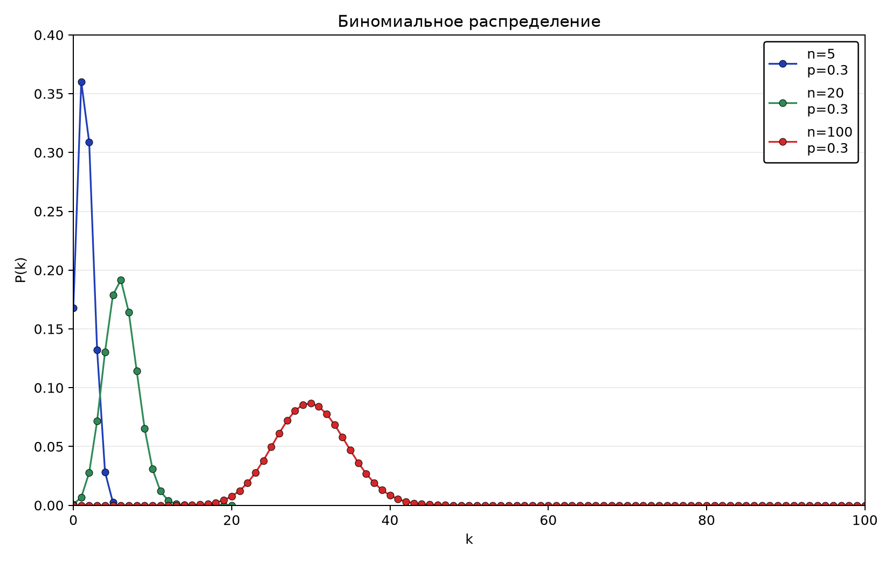
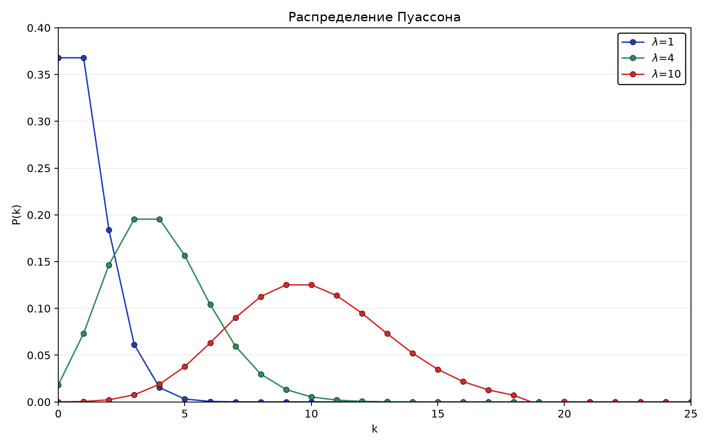
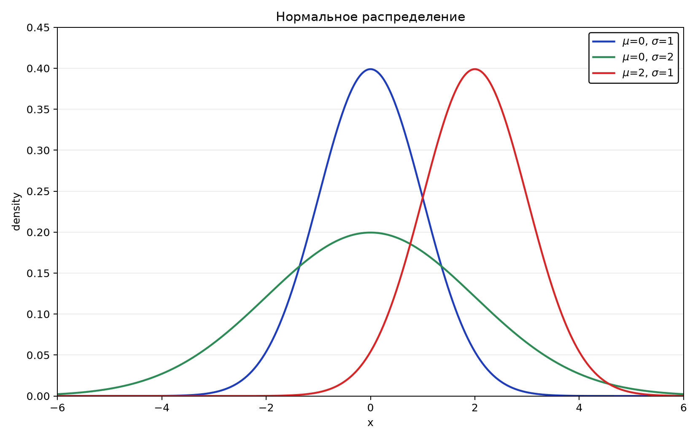

::: chapter-opening
[Аннотация]{.chapter-opening-label}

Глава вводит случайные величины, плотность, функцию распределения и моменты. Биномиальная, пуассоновская и нормальная модели связаны со счётом успехов, редких событий и непрерывных ошибок.
:::

## Случайность и случайные величины

+-----------------------------------------------------+-----------------+------------------------------------+
|                                                     |                 |                                    |
+:===================================================:+:===============:+:==================================:+
|                                                     | **Случайность** |                                    |
+-----------------------------------------------------+-----------------+------------------------------------+
| ***Классическая физика***                           |                 | ***Квантовая физика***             |
+-----------------------------------------------------+-----------------+------------------------------------+
| Случайность возникает из-за неполного знания        |                 | Случайность заложена в саму теорию |
|                                                     |                 |                                    |
| начальных условий и большого числа степеней свободы |                 |                                    |
+-----------------------------------------------------+-----------------+------------------------------------+

Из эксперимента мы получаем конкретную реализацию случайного процесса. Статистические флуктуации поэтому входят в саму формулировку сравнения модели с данными.

**Случайная величина** $X$ — правило, которое каждому возможному исходу эксперимента сопоставляет число. До измерения мы говорим о величине $X$ и её распределении; после измерения получаем конкретное значение $x$. Например, $N$ может обозначать число зарегистрированных нейтрино за сутки, а запись $n=17$ — результат одних определённых суток.

Распределение не является свойством столбца чисел само по себе. Оно следует из модели эксперимента. Число событий может иметь пуассоновское распределение, если события независимы и интенсивность постоянна; та же наблюдаемая величина перестанет точно подчиняться этой модели при мёртвом времени детектора, меняющемся потоке или наложении нескольких режимов работы. Поэтому выбор распределения начинается с физического механизма, а не с поиска красивой кривой, похожей на гистограмму.

**Дискретная** $X$ описывается ***функцией вероятности (PMF – probability mass function):***
$$p_k=P(X=x_k), \quad \sum_k p_k=1.$$

**Непрерывная** $X$ — ***плотностью вероятности*** ***(PDF – probability density function):***
$$P(x\leq X<x+dx)=f(x)dx, \quad \int_{-\infty}^{+\infty}f(x)dx=1.$$
В обеих записях последние выражения являются соответствующими условиями нормировки.

Плотность $f(x)$ — не вероятность отдельного значения. Для непрерывной величины $P(X=x)=0$, хотя попадание в конечный интервал имеет ненулевую вероятность. Из этого следует полезная проверка размерности: если $x$ измеряется в МэВ, то $f(x)$ имеет размерность $\text{МэВ}^{-1}$, чтобы произведение $f(x)dx$ было безразмерным. Поэтому высота плотности может быть больше единицы — запрет $P\leq1$ относится к интегралу по области, а не к значению $f(x)$ в точке.

Множество допустимых значений называют **носителем распределения**. Для числа событий это $\{0,1,2,\ldots\}$, для доли эффективности — отрезок $[0,1]$, для гауссовой модели — вся числовая ось. Носитель — часть модели: гаусс может быть удобным приближением для энергии далеко от нуля, но буквально допускает и отрицательные энергии. Иногда ничтожной вероятностью нефизической области можно пренебречь, иногда именно она разрушает расчёт предела.

### Кумулятивная функция распределения (CDF)

Для непрерывной $X$:
$$F(a)=P(X<a)=\int_{-\infty}^a f(x)dx.$$
С математической точки зрения, CDF отражает вероятность того, что $X<a.$ $F(a)$ монотонно возрастает от 0 до 1 при изменении $a \in (-\infty,\infty)$. Заметим, что для непрерывных распределений справедливо следующее свойство:
$$F'(a)=f(a).$$
При помощи кумулятивной функции распределения легко вычислить ***вероятность попасть в интервал*** $[a,b):$
$$P(a\leq X<b)=F(b)-F(a).$$

CDF удобна ещё и тем, что не зависит от выбора ширины столбцов гистограммы. Квантиль $x_q$ определяется условием $F(x_q)=q$: доля $q$ распределения лежит левее $x_q$. Медиана — квантиль $x_{0.5}$. В отличие от среднего, она остаётся устойчивой к редким далёким выбросам, поэтому эти две характеристики не следует автоматически считать взаимозаменяемыми.

## Средние, дисперсии и моменты

### Моменты распределения

***Момент функции***:
$$\langle x^n\rangle=\mathbb{E}[X^n]=\int_{-\infty}^\infty x^nf(x)dx.$$
Если известны все моменты $\langle x^n\rangle$, то можно восстановить $f(x)$, но это распространяется не на все функции.

Формула для момента имеет смысл только тогда, когда соответствующий интеграл сходится. Нормированная плотность может существовать, а среднее или дисперсия — нет. Распределение Коши даст нам важный пример: у него есть совершенно определённые плотность и квантили, но нет обычного математического ожидания. Поэтому запись $\mathbb E[X]$ не освобождает от проверки существования интеграла.

### Практически важные моменты

+----------------------+-------------------------------------------------------------------------------------------------------------------------------------+
| Момент               | Формула                                                                                                                             |
+:====================:+:===================================================================================================================================:+
| Среднее              | $$\mu=\langle x\rangle=\mathbb{E}[X]=\int_{-\infty}^{+\infty} xf(x)dx$$                                                             |
+----------------------+-------------------------------------------------------------------------------------------------------------------------------------+
| Средний квадрат      | $$\langle x^2\rangle=\mathbb{E}[X^2]=\int_{-\infty}^{+\infty} x^2 f(x)dx$$                                                          |
+----------------------+-------------------------------------------------------------------------------------------------------------------------------------+
| Дисперсия (вариация) | $$\sigma^2=Var(X)=\mathbb{E}\left[(X-\mu)^2\right]=\mathbb{E}\left[X^2-2\mu X+\mu^2\right]=\langle x^2 \rangle-\langle x\rangle^2$$ |
+----------------------+-------------------------------------------------------------------------------------------------------------------------------------+

Среднее отвечает на вопрос о центре масс распределения, а дисперсия — о среднем квадрате расстояния до этого центра. Они описывают разные стороны формы. Два распределения могут иметь одинаковые среднее и дисперсию, но совершенно разные хвосты; следовательно, этих двух чисел недостаточно для расчёта вероятности редкого события. Сводить распределение к записи $\mu\pm\sigma$ безопасно лишь тогда, когда форма известна или нужный вывод действительно зависит только от первых моментов.

### Моменты распределения произвольной функции $g(X)$ случайной величины

+---------------------------------+------------------------------------------------------------------------------------------------------------------------------------------+
| Момент                          | Формула                                                                                                                                  |
+:===============================:+:========================================================================================================================================:+
| Среднее значение функции $g(X)$ | $$\langle g(x)\rangle=\mathbb{E}\left[g(X)\right]=\int_{-\infty}^{+\infty} g(x)f(x)dx$$                                                  |
+---------------------------------+------------------------------------------------------------------------------------------------------------------------------------------+
| Вариация функции $g(X)$         | $$Var(g(X))=\mathbb{E}\left[(g(X)-\langle g(X)\rangle)^2\right]= \int_{-\infty}^\infty \left(g(x)-\langle g(x)\rangle\right)^2 f(x) dx$$ |
+---------------------------------+------------------------------------------------------------------------------------------------------------------------------------------+

## Базовые распределения

Прежде чем выписывать формулу, полезно определить, что считается одним испытанием и какие исходы мы различаем. Биномиальная модель считает успехи в фиксированном числе испытаний. Пуассоновская — события в фиксированном интервале при заданной средней интенсивности. Нормальная — непрерывную величину, складывающуюся из многих малых вкладов. Эти распределения связаны предельными переходами, но отвечают на разные экспериментальные вопросы.

Проверка модели начинается с трёх простых пунктов:

1. совпадает ли носитель распределения с допустимыми значениями наблюдаемой величины;
2. нормирована ли вероятность и имеют ли параметры правильную размерность;
3. соответствуют ли предположения о независимости и постоянстве параметров реальному набору данных.

Только после этого имеет смысл оценивать параметры распределения по выборке.

В рамках данной главы мы рассмотрим три важных примера:

- Биномиальное распределение

- Распределение Пуассона

- Нормальное (гауссово) распределение

## Счёт успехов: биномиальная модель

::: book-note
Если в $n$ независимых испытаниях вероятность успеха равна $p$, то
$$P(K=k)=\binom{n}{k}p^k(1-p)^{n-k}, \quad k=0,\dots,n,$$
где
$$\binom{n}{k}=\frac{n!}{k!(n-k)!}$$
это число способов выбрать $k$ успехов среди $n$ испытаний.
:::

### Пример биномиального распределения

Пронаблюдаем $n$ распадов $W^{\pm}$. Число распадов $W\to\mu\nu$:
$$k\sim\mathrm{Bin}(n,p),$$
где $p$ — вероятность такого распада. Построим на одних осях три случая: $n=5,20,100$ при $p=0.3$.

```{python}
#| echo: true
#| eval: false
from math import comb
import numpy as np

p = 0.3
for n in [5, 20, 100]:
    k = np.arange(n + 1)
    pmf = np.array([comb(n, i) * p**i * (1-p)**(n-i) for i in k])
```

::: figure-panel


Обратите внимание, что с увеличением $n$ биномиальное распределение переходит в распределение Гаусса (красная кривая).
:::

### Моменты биномиального распределения

- **Математическое ожидание:** $\mathbb{E}[K]=np$

- **Дисперсия:** $Var(K)=np(1-p)$

- **Пример:** число распадов нужного канала при фиксированном числе родительских частиц

::: book-derivation
#### **Вывод** $\mathbb{E}[K]$

По определению:
$$\mathbb{E}[K]=\sum_{k=0}^n kP(K=k)=\sum_{k=0}^n k \begin{pmatrix} n\\k\end{pmatrix} p^k(1-p)^{n-k}.$$
Используя тождество:
$$k \begin{pmatrix} n\\k\end{pmatrix}=k\frac{n!}{k!(n-k)!}=n\frac{(n-1)!}{(k-1)!(n-k)!}=n\begin{pmatrix} n-1\\k-1\end{pmatrix},$$
получим
$$\mathbb{E}[K]=np\sum_{k=1}^n \begin{pmatrix} n-1\\k-1\end{pmatrix}p^{k-1}(1-p)^{n-k}.$$
Положим $j=k-1$:
$$\mathbb{E}[K]=np\sum_{j=0}^{n-1} \begin{pmatrix} n-1\\j\end{pmatrix}p^{j}(1-p)^{(n-1)-j},$$
тогда по биному Ньютона:
$$\sum_{j=0}^{n-1} \begin{pmatrix} n-1\\j\end{pmatrix}p^{j}(1-p)^{(n-1)-j}=(p+(1-p))^{n-1}=1.$$
Итог:
$$\mathbb{E}[K]=np. \quad \blacksquare$$
:::

::: book-derivation
#### **Вывод** $Var(K)$

Начнем со второго факториального момента:
$$\mathbb{E}[K(K-1)]=\sum_{k=0}^n k(k-1) \begin{pmatrix} n\\k\end{pmatrix} p^k(1-p)^{n-k}.$$
Используя тождество:
$$k(k-1) \begin{pmatrix} n\\k\end{pmatrix}=k(k-1)\frac{n!}{k!(n-k)!}=n(n-1)\frac{(n-2)!}{(k-2)!(n-k)!}=n(n-1)\begin{pmatrix} n-2\\k-2\end{pmatrix},$$
получим
$$\mathbb{E}[K(K-1)]=n(n-1)p^2\sum_{k=2}^n \begin{pmatrix} n-2\\k-2\end{pmatrix} p^{k-2}(1-p)^{n-k}=n(n-1)p^2.$$
Воспользуемся разложением $K^2$:
$$K^2=K(K-1)+K,$$
тогда
$$\mathbb{E}[K^2]=\mathbb{E}[K(K-1)]+\mathbb{E}[K]=n(n-1)p^2+np.$$
Таким образом, вариацию $Var(K)$ можно записать в виде:
$$Var(K)=\mathbb{E}[K^2]-\mathbb{E}[K]^2=\left(n(n-1)p^2+np\right)-(np)^2.$$
Итог:
$$Var(K)=np(1-p). \quad \blacksquare$$
:::

## Счёт редких событий: пуассоновская модель

::: book-note
**Распределение Пуассона** моделирует число событий в фиксированном интервале времени или пространства при постоянной средней интенсивности $λ$ и независимых событиях.

Вероятность наблюдения $N=k$ событий при среднем числе событий $λ$:
$$P(N=k)=\frac{\lambda^k e^{-\lambda}}{k!}, \quad k=0,1,2,\dots$$
Пример: число распадов радиоактивного источника за 1 минуту.
:::

::: {.biography name="Симеон Дени Пуассон" years="1781–1840" photo="../assets/people/simeon-poisson.jpg" photo-alt="Портрет Симеона Дени Пуассона" source="https://mathshistory.st-andrews.ac.uk/Biographies/Poisson/" source-label="MacTutor" photo-source="https://mathshistory.st-andrews.ac.uk/Biographies/Poisson/pictdisplay/" photo-credit="MacTutor"}
Французский математик и физик. Он работал над теорией вероятностей, механикой и математической физикой. Распределение, носящее его имя, описывает счёт редких независимых событий и потому постоянно встречается в физике частиц.
:::

### Пример распределения Пуассона

Посчитаем число событий $N$ за фиксированное время. Если среднее число событий равно $\lambda$, то
$$N\sim \mathrm{Pois}(\lambda).$$
Построим на одних осях три случая: $\lambda=1,4,10$.

```{python}
#| echo: true
#| eval: false
from math import factorial
import numpy as np

for lam in [1, 4, 10]:
    k = np.arange(26)
    pmf = np.exp(-lam) * lam**k / np.array([factorial(i) for i in k])
```

::: figure-panel


Обратите внимание, что с увеличением $n$ распределение Пуассона также стремиться к нормальному распределению (красная кривая).
:::

### Моменты распределения Пуассона

- **Математическое ожидание:** $\mathbb{E}[K]=\lambda$

- **Дисперсия:** $Var(K)=\lambda$

::: book-derivation
#### **Вывод** $\mathbb{E}[N]$

По определению:
$$\mathbb{E}[N]=\sum_{k=0}^\infty k\frac{\lambda^k e^{-\lambda}}{k!}.$$
Вынесем множитель за сумму:
$$\mathbb{E}[N]=\lambda e^{-\lambda}\sum_{k=1}^\infty \frac{\lambda^{k-1} }{(k-1)!}.$$
Сдвинем индекс $j=k-1$, не забыв разложение экспоненты в ряд Тейлора :
$$\mathbb{E}[N]=\lambda e^{-\lambda}\sum_{j=0}^\infty \frac{\lambda^{j} }{j!}=\lambda e^{-\lambda}e^{\lambda}=\lambda.$$
Итог:
$$\mathbb{E}[N]=\lambda. \quad \blacksquare$$
:::

::: book-derivation
#### **Вывод** $Var(N)$

Воспользуемся уже знакомым вторым факториальным моментом:
$$\mathbb{E}[N(N-1)]=\sum_{k=0}^\infty k(k-1)\frac{\lambda^k e^{-\lambda}}{k!}.$$
Поскольку
$$\frac{k(k-1)}{k!}=\frac{1}{(k-2)!},$$
то можно преобразовать выражение для момента:
$$\mathbb{E}[N(N-1)]=\lambda^2 e^{-\lambda}\sum_{k=2}^\infty \frac{\lambda^{k-2} }{(k-2)!}=\lambda^2 e^{-\lambda}\sum_{j=0}^\infty \frac{\lambda^{j} }{j!}=\lambda^2.$$
Используя связь:
$$N^2=N(N-1)+N,$$
получим
$$\mathbb{E}[N^2]=\mathbb{E}[N(N-1)]+\mathbb{E}[N]=\lambda^2+\lambda.$$
Таким образом, вариацию $Var(N)$ можно записать в виде:
$$Var(N)=\mathbb{E}[N^2]-\mathbb{E}[N]^2=(\lambda^2+\lambda)-\lambda^2=\lambda.$$
Итог:
$$Var(N)=\lambda. \quad \blacksquare$$
:::

## Непрерывные ошибки: нормальная модель

::: book-note
### Нормальное (гауссово) распределение

$$f(x;\mu,\sigma)=\frac{1}{\sigma (2\pi)^{1/2}}\exp\left[-\frac{(x-\mu)^2}{2\sigma^2}\right],$$

где $\mu$ — среднее значение, а $\sigma$ — стандартное отклонение случайной величины. Такая величина часто представима в виде суммы многих малых независимых вкладов.
:::

Так почему же распределение «нормальное»?

> Много лет назад я назвал кривую Лапласа-Гаусса нормальной кривой. Это название, избегая международного спора о приоритете, имеет недостаток: оно заставляет думать, что все прочие распределения частот в том или ином смысле «ненормальны».
>
> К. Пирсон (1920)

### Пример нормального распределения

Параметр $\mu$ задаёт среднее значение, $\sigma$ — ширину разброса величины. Построим на одних осях три случая: $(\mu,\sigma)=(0,1),(0,2),(2,1)$.

```{python}
#| echo: true
#| eval: false
import numpy as np

x = np.linspace(-6, 6, 400)
for mu, sigma in [(0, 1), (0, 2), (2, 1)]:
    pdf = np.exp(-0.5*((x-mu)/sigma)**2)/(sigma*np.sqrt(2*np.pi))
```

::: figure-panel


Из графика видно, что чем меньше $\sigma$, тем уже распределение.
:::

### Моменты распределения Гаусса

- **Математическое ожидание:** $\mathbb{E}[X]=\mu$

- **Дисперсия:** $Var(X)=\sigma^2$

::: book-derivation
#### **Вывод** $\mathbb{E}[X]$

По определению:
$$\mathbb{E}[X]=\int_{-\infty}^\infty x\frac{1}{\sigma (2\pi)^{1/2}}\exp\left[-\frac{(x-\mu)^2}{2\sigma^2}\right]dx.$$
Перейдем к стандартной нормали: $z=(x−μ)/σ,~x=μ+σz,~dx=σdz:$
$$\mathbb{E}[X]=\int_{-\infty}^\infty (\mu+\sigma z)\varphi(z)dz, \quad \varphi(z)=\frac{1}{\sqrt{2\pi}}e^{-z^2/2}.$$
$$\mathbb{E}[X]=\mu\int_{-\infty}^\infty \varphi(z)dz+\sigma\int_{-\infty}^\infty z\varphi(z)dz=\mu\cdot1+\sigma\cdot 0=\mu,$$
так как $z\varphi(z)$ нечётная функция.

Итог:
$$\mathbb{E}[X]=\mu. \quad \blacksquare$$
:::

::: book-derivation
#### **Вывод** $Var(X)$

По определению:
$$Var(X)=\mathbb{E}\left[(X-\mu)^2\right]=\int_{-\infty}^\infty (x-\mu)^2 f(x)dx.$$
Делая замену переменных $z=(x-\mu)/\sigma,$ получим:
$$Var(X)=\sigma^2\int_{-\infty}^\infty z^2 \varphi(z) dz=\sigma^2 \mathbb{E}\left[Z^2\right], \quad Z\sim N(0,1),$$
где
$$\mathbb{E}\left[Z^2\right]=\int_{-\infty}^\infty z^2 \varphi(z)dz=\left[-z\varphi(z)\right]^{\infty}_{-\infty}+\int_{-\infty}^\infty \varphi(z)dz=1.$$
Итог:
$$Var(X)=\sigma^2. \quad \blacksquare$$
:::

## Резюме по распределениям

+-------------------------+-------------+--------------+-----------------------------------------------------------------------------+
| Название                | Среднее     | Дисперсия    | Условия применения                                                          |
+:=======================:+:===========:+:============:+:===========================================================================:+
| Биномиальное            | $$np$$      | $$np(1-p)$$  | Фиксированное $n$; независимые испытания; постоянное $p$.                   |
|                         |             |              |                                                                             |
| $$K\sim Bin(n,p)$$      |             |              |                                                                             |
+-------------------------+-------------+--------------+-----------------------------------------------------------------------------+
| Пуассон                 | $$\lambda$$ | $$\lambda$$  | События в фиксированном интервале; постоянная интенсивность; независимость. |
|                         |             |              |                                                                             |
| $$N\sim Pois(\lambda)$$ |             |              |                                                                             |
+-------------------------+-------------+--------------+-----------------------------------------------------------------------------+
| Нормальное              | $$\mu$$     | $$\sigma^2$$ | Непрерывные ошибки; сумма многих малых независимых вкладов                  |
|                         |             |              |                                                                             |
| $$X\sim N(\mu,\sigma)$$ |             |              |                                                                             |
+-------------------------+-------------+--------------+-----------------------------------------------------------------------------+

::: chapter-summary
## Итоги главы

- Данные в эксперименте флуктуируют, и эти флуктуации нужно описывать вероятностно.
- Выбор распределения определяется физикой задачи.
- Среднее и дисперсия — первые количественные характеристики распределения.
- Биномиальное, пуассоновское и нормальное распределения — базовый рабочий набор экспериментатора.
:::

## Задачи


