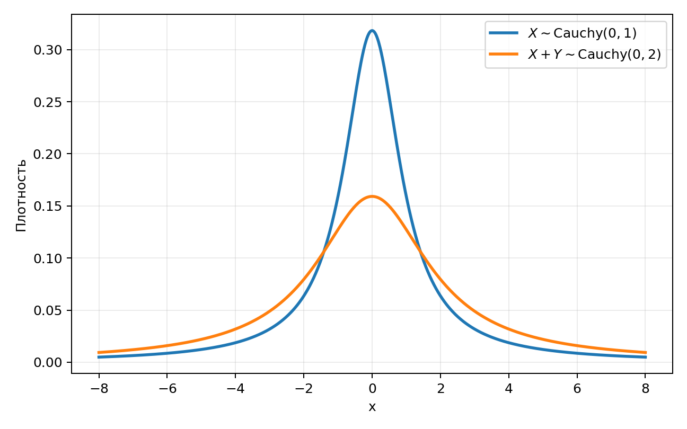
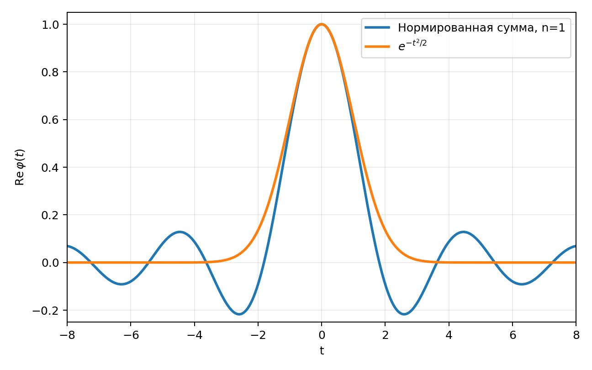
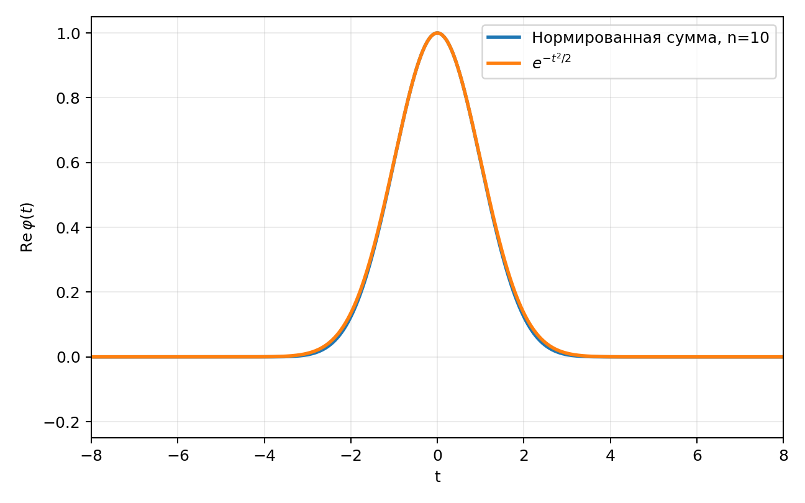

::: chapter-opening
[Главная мысль]{style="color: darkred"}

При сложении независимых случайных величин их плотности приходится свёртывать, и прямое вычисление быстро становится громоздким. Характеристическая функция переводит эту задачу в пространство Фурье, где свёртка превращается в обычное произведение. Благодаря этому суммы случайных величин, их моменты и кумулянты можно исследовать гораздо проще.
:::

## План главы

- Распределение суммы независимых случайных величин и свёртка
- Пример: распределение Коши
- Характеристическая функция как преобразование Фурье
- Основные свойства характеристической функции
- Суммы независимых случайных величин
- Примеры: Бернулли, Пуассон, Гаусс и Коши
- Моменты как производные характеристической функции
- Кумулянты и их свойства
- Мост к центральной предельной теореме
- Резюме

## Распределение суммы независимых случайных величин

Пусть $X$ и $Y$ – две независимые случайные величины с известными плотностями вероятности $f_X(x)$ и $f_Y(y)$. Требуется найти плотность вероятности их суммы

$$S=X+Y.$$

Подобная задача естественно возникает, когда эксперимент не различает отдельные вклады, а регистрирует только их сумму, например, при работе с энерговыделением или зарядом.

Чтобы сумма приняла конкретное значение $S=s$, нужно учесть все возможные пары значений $(x,y)$, для которых

$$x+y=s.$$

Если выбрать значение $x$, то второе значение уже определяется условием суммы:

$$y=s-x.$$

Поскольку $X$ и $Y$ независимы, плотности для такой пары перемножаются. После этого нужно просуммировать вклады от всех допустимых $x$, то есть проинтегрировать по всей области изменения случайной величины:

$$\boxed{
f_S(s)
=
\int_{-\infty}^{+\infty}
f_X(x)f_Y(s-x)\,dx.
}$$

Такой интеграл называется **свёрткой**. Кратко его можно записать как:

$$f_S=f_X*f_Y.$$

Звёздочка здесь обозначает не обычное умножение, а операцию свёртки.

### Сумма нескольких величин

Для трёх независимых случайных величин $X$, $Y$ и $Z$ задача уже приводит к двойному интегралу:

$$f_S(s)
=
\int_{-\infty}^{+\infty}
\int_{-\infty}^{+\infty}
f_X(x)f_Y(y)f_Z(s-x-y)\,dx\,dy,$$

где

$$S=X+Y+Z.$$

Для суммы

$$S_n=X_1+X_2+\dots+X_n$$

получаем последовательную свёртку:

$$\boxed{
f_{S_n}=f_{X_1}*f_{X_2}*\cdots*f_{X_n}.
}$$

В развёрнутом виде:

$$\begin{aligned}
f_{S_n}(s)
={}&
\int_{-\infty}^{+\infty}\cdots
\int_{-\infty}^{+\infty}
f_{X_1}(x_1)f_{X_2}(x_2)\cdots \\
&\qquad\times
f_{X_n}(s-x_1-\cdots-x_{n-1})
\,dx_1\cdots dx_{n-1}.
\end{aligned}$$

С ростом числа слагаемых размерность интеграла возрастает. Именно здесь становится заметна практическая проблема прямого подхода: даже если такие интегралы возможно вычислить, их вычисления быстро усложняются.

## Пример: распределение Коши

В качестве примера рассмотрим распределение Коши с параметрами $x_0$ и $\gamma$:

$$\boxed{
f_X(x;x_0,\gamma)
=
\frac{1}
{\pi\gamma\left[1+\left(\frac{x-x_0}{\gamma}\right)^2\right]}.
}$$

В физике это распределение также известно как распределение Лоренца или Брейта–Вигнера. Оно встречается при описании резонансов в физике частиц, а также спектров излучения в атомной и молекулярной физике.

Стандартное распределение Коши получается при

$$x_0=0,
\qquad
\gamma=1,$$

и имеет вид:

$$\boxed{
f_X(x)=\frac{1}{\pi(1+x^2)}.
}$$

::: book-note
Запись

$$X\sim \mathrm{Cauchy}(0,1)$$

означает, что случайная величина $X$ **распределена согласно стандартному распределению Коши**. Знак $\sim$ в такой записи не означает «примерно равно».
:::

### Прямая свёртка двух распределений Коши

Пусть две независимые случайные величины распределены одинаково:

$$X,Y\sim\mathrm{Cauchy}(0,1),$$

то есть

$$f_X(x)=f_Y(x)=\frac{1}{\pi(1+x^2)}.$$

Для суммы

$$S=X+Y$$

прямая свёртка равна

$$\boxed{
f_S(s)
=
\frac{1}{\pi^2}
\int_{-\infty}^{+\infty}
\frac{dx}
{(1+x^2)\left[1+(s-x)^2\right]}.
}$$

Уже здесь знаменатель содержит многочлен четвёртой степени по $x$. Такой интеграл можно вычислять, например, раскладывая выражение на простые дроби или применяя теорему о вычетах, но после интегрирования результат ещё нужно существенно упростить.

Таким образом, даже сумма всего двух достаточно простых распределений приводит к заметно более громоздкому вычислению. Это и есть основная мотивация для перехода к характеристическим функциям.

## Характеристическая функция

::: book-note
В статистическом анализе **характеристической функцией** называют преобразование Фурье распределения. Для случайной величины $X$ она определяется как

$$\boxed{
\varphi_X(t)
=
\mathbb{E}\!\left[e^{itX}\right].
}$$

Для непрерывной случайной величины с плотностью $f_X(x)$ математическое ожидание записывается интегралом:

$$\boxed{
\varphi_X(t)
=
\int_{-\infty}^{+\infty}
e^{itx}f_X(x)\,dx.
}$$

Здесь $x$ – переменная интегрирования, а $t$ – аргумент характеристической функции.
:::

Если плотность существует, её можно восстановить обратным преобразованием Фурье:

$$\boxed{
f_X(x)
=
\frac{1}{2\pi}
\int_{-\infty}^{+\infty}
e^{-itx}\varphi_X(t)\,dt.
}$$

Поэтому характеристическая функция содержит ту же информацию о случайной величине, что и исходная плотность распределения. Если известна $\varphi_X(t)$, можно восстановить $f_X(x)$ и тем самым получить исходное распределение.

Главное преимущество для задачи о сумме независимых величин состоит в том, что **свёртка плотностей в обычном пространстве превращается в произведение характеристических функций в пространстве Фурье**.

## Сумма двух величин Коши через характеристические функции

Для стандартного распределения Коши характеристическая функция имеет особенно простой вид:

$$\boxed{
\varphi_X(t)=e^{-|t|}.
}$$

Данный Фурье-образ можно самостоятельно получить при помощи теоремы о вычетах.

Рассмотрим снова две независимые величины:

$$X,Y\sim\mathrm{Cauchy}(0,1)$$

и их сумму:

$$S=X+Y.$$

По определению:

$$\varphi_S(t)
=
\mathbb{E}\!\left[e^{it(X+Y)}\right].$$

Экспонента от суммы раскладывается в произведение:

$$e^{it(X+Y)}=e^{itX}e^{itY}.$$

А поскольку $X$ и $Y$ независимы, математическое ожидание произведения раскладывается в произведение математических ожиданий:

$$\begin{aligned}
\varphi_S(t)
&=
\mathbb{E}\!\left[e^{itX}e^{itY}\right] \\
&=
\mathbb{E}\!\left[e^{itX}\right]
\mathbb{E}\!\left[e^{itY}\right] \\
&=
\varphi_X(t)\varphi_Y(t).
\end{aligned}$$

Для стандартных распределений Коши получается:

$$\varphi_S(t)
=
e^{-|t|}e^{-|t|}
=
e^{-2|t|}.$$

Но $e^{-2|t|}$ – характеристическая функция распределения Коши с параметрами $0$ и $2$. Поэтому

$$\boxed{
S=X+Y\sim\mathrm{Cauchy}(0,2).
}$$

Тогда плотность суммы можно записать как:

$$\boxed{
f_S(s)=\frac{2}{\pi(s^2+4)}.
}$$

В итоге, то, что при прямой свёртке требовало вычисления нетривиального интеграла, в пространстве Фурье свелось к умножению двух простых функций.

::: figure-panel
:::: {.content-visible when-format="html:js"}
```{ojs}
//| echo: false

cauchyData = Array.from({length: 501}, (_, i) => {
  const x = -8 + 16 * i / 500;
  return {
    x,
    original: 1 / (Math.PI * (1 + x * x)),
    sum: 2 / (Math.PI * (4 + x * x))
  };
})

cauchySumPlot = (() => {
  const plot = Plot.plot({
    x: { label: "x", domain: [-8, 8], grid: true },
    y: { label: "плотность", domain: [0, 0.35], grid: true },
    marks: [
      Plot.ruleY([0], {stroke: "#888"}),
      Plot.line(cauchyData, {x: "x", y: "original", stroke: "#ffb347", strokeWidth: 3}),
      Plot.line(cauchyData, {x: "x", y: "sum", stroke: "#4ea1ff", strokeWidth: 3}),
      Plot.text(
        [
          {x: 2.5, y: 0.12, label: "X"},
          {x: 4.5, y: 0.07, label: "X + Y"}
        ],
        {x: "x", y: "y", text: "label", fill: d => d.label === "X" ? "#ffb347" : "#4ea1ff"}
      )
    ]
  });
  
  plot.style.display = 'block';
  plot.style.margin = '0 auto';
  
  return plot; 
})();
```
Стандартное распределение Коши и распределение суммы двух независимых стандартных величин Коши.
::::

:::: {.content-visible when-format="pdf"}



::::
У суммы максимум ниже, а распределение шире: параметр $\gamma$ увеличился с $1$ до $2$.
:::

### Алгоритм вычисления распределения суммы через Фурье

Пусть независимые величины $X$ и $Y$ имеют плотности $f_X(x)$ и $f_Y(y)$, а

$$S=X+Y.$$

Тогда вычисление можно организовать в три шага:

1.  Перейти от плотностей к характеристическим функциям:

$$\varphi_X(t)
=
\int_{-\infty}^{+\infty}e^{itx}f_X(x)\,dx,
\qquad
\varphi_Y(t)
=
\int_{-\infty}^{+\infty}e^{ity}f_Y(y)\,dy.$$

2.  Для независимой суммы перемножить характеристические функции:

$$\boxed{
\varphi_S(t)=\varphi_X(t)\varphi_Y(t).
}$$

3.  Вернуться к плотности обратным преобразованием Фурье:

$$\boxed{
f_S(s)
=
\frac{1}{2\pi}
\int_{-\infty}^{+\infty}
e^{-its}\varphi_S(t)\,dt.
}$$

## Свойства характеристической функции

### Дискретный случай

Если случайная величина $X$ принимает дискретные значения $x_k$ с вероятностями $p_k$,

$$P(X=x_k)=p_k,
\qquad
\sum_k p_k=1,$$

то интеграл в определении характеристической функции заменяется суммой:

$$\boxed{
\varphi_X(t)
=
\sum_k p_k e^{itx_k}.
}$$

То есть характеристическая функция не вводит новую вероятностную конструкцию: она лишь записывает уже известное распределение в форме, удобной для работы с суммами.

### Почему характеристическая функция всегда существует

Модуль комплексной экспоненты равен единице:

$$\left|e^{itX}\right|=1.$$

Следовательно,

$$\left|\varphi_X(t)\right|=\left|\mathbb{E}\!\left[e^{itX}\right]\right|\leq
\mathbb{E}\!\left[\left|e^{itX}\right|\right]=1.$$

Отсюда следует важное свойство:

$$\boxed{
|\varphi_X(t)|\leq 1.
}$$

::: book-note
Характеристическая функция существует для любого распределения, в том числе для распределений, у которых могут не существовать среднее значение или дисперсия.
:::

### Базовые свойства

Для любой случайной величины $X$ выполняются соотношения:

$$\boxed{
\varphi_X(0)=1,
\qquad
|\varphi_X(t)|\leq1,
\qquad
\varphi_X(-t)=\varphi_X^*(t).
}$$

Первое равенство непосредственно следует из нормировки:

$$\varphi_X(0)
=
\mathbb{E}[e^0]
=
\mathbb{E}[1]
=1.$$

Комплексное сопряжение экспоненты меняет знак перед $t$, поэтому

$$\varphi_X(-t)=\varphi_X^*(t).$$

Если распределение симметрично относительно нуля, характеристическая функция вещественна и чётна.

Кроме того, характеристическая функция однозначно задаёт распределение.

### Сдвиг и масштаб

Пусть новая случайная величина связана с $X$ линейным преобразованием:

$$Y=aX+b.$$

Тогда

$$\varphi_Y(t)
=
\mathbb{E}\!\left[e^{it(aX+b)}\right] =
e^{itb}\,
\mathbb{E}\!\left[e^{i(at)X}\right].$$

Следовательно,

$$\boxed{
\varphi_{aX+b}(t)
=
e^{itb}\varphi_X(at).
}$$

Если характеристическая функция исходной величины известна, то для сдвинутой и масштабированной величины её можно получить сразу, без нового интегрирования.

## Суммы многих независимых величин

В примере с распределением Коши мы доказали, что для двух независимых случайных величин справедливо:

$$\varphi_{X+Y}(t)
=
\varphi_X(t)\varphi_Y(t).$$

Последовательно применяя это равенство к сумме:

$$S_n=X_1+X_2+\cdots+X_n,$$

получаем:

$$\boxed{
\varphi_{S_n}(t)
=
\prod_{k=1}^{n}\varphi_{X_k}(t).
}$$

Если все $X_k$ имеют одно и то же распределение, то их характеристические функции совпадают и формула упрощается:

$$\boxed{
\varphi_{S_n}(t)
=
\left[\varphi_X(t)\right]^n.
}$$

Это свойство позволяет практически без интегрирования исследовать целые семейства сумм.

## Примеры характеристических функций

### Распределение Бернулли

Для распределения Бернулли случайная величина принимает только два значения:

$$X=0
\quad\text{или}\quad
X=1.$$

Вероятности можно записать как:

$$P(X=x)=p^x(1-p)^{1-x},
\qquad
x=0,1.$$

В частности,

$$P(X=0)=1-p,
\qquad
P(X=1)=p.$$

По формуле для дискретного случая характеристическая функция равна:

$$\boxed{
\varphi_X(t)=(1-p)e^{it\cdot0}
+pe^{it\cdot1}=(1-p)+pe^{it}.}$$

Теперь возьмём сумму $n$ независимых одинаково распределённых величин Бернулли:

$$S_n=X_1+\cdots+X_n.$$

Её характеристическая функция:

$$\varphi_{S_n}(t)
=
\left[(1-p)+pe^{it}\right]^n.$$

Раскроем скобки по биному Ньютона:

$$\left[(1-p)+pe^{it}\right]^n
=
\sum_{k=0}^{n}
\binom{n}{k}
(1-p)^{n-k}p^k e^{itk}.$$

С другой стороны, для дискретной случайной величины характеристическая функция имеет вид:

$$\varphi_{S_n}(t)
=
\sum_{k=0}^{n}P(S_n=k)e^{itk}.$$

Сравнивая коэффициенты при $e^{itk}$, получаем

$$\boxed{
P(S_n=k)
=
\binom{n}{k}p^k(1-p)^{n-k}.
}$$

Это биномиальное распределение:

$$\boxed{
S_n\sim\mathrm{Bin}(n,p).
}$$

Таким образом, сумма независимых величин Бернулли естественным образом приводит к биномиальному распределению.

### Распределение Пуассона

Пусть

$$N\sim\mathrm{Pois}(\lambda),$$

то есть

$$P(N=k)
=
e^{-\lambda}\frac{\lambda^k}{k!},
\qquad
k=0,1,2,\ldots$$

Характеристическая функция равна:

$$\varphi_N(t)=\sum_{k=0}^{\infty}e^{itk}e^{-\lambda}\frac{\lambda^k}{k!}=e^{-\lambda}\sum_{k=0}^{\infty}
\frac{(\lambda e^{it})^k}{k!}.$$

Сумма является разложением экспоненты в ряд Тейлора:

$$\sum_{k=0}^{\infty}
\frac{(\lambda e^{it})^k}{k!}
=
e^{\lambda e^{it}}.$$

Поэтому

$$\boxed{\varphi_N(t)=
e^{-\lambda}e^{\lambda e^{it}} =
e^{\lambda\left(e^{it}-1\right)}}.$$

#### Сумма пуассоновских величин

Пусть независимые случайные величины имеют распределения

$$N_k\sim\mathrm{Pois}(\lambda_k),$$

рассмотрим их сумму:

$$S_n=\sum_{k=1}^{n}N_k.$$

Характеристическая функция суммы равна произведению:

$$\varphi_{S_n}(t)=
\prod_{k=1}^{n}\varphi_{N_k}(t)=\prod_{k=1}^{n}\exp\!\left[\lambda_k(e^{it}-1)\right]=
\exp\!\left[\left(\sum_{k=1}^{n}\lambda_k\right)(e^{it}-1)\right].$$

Обозначим

$$\lambda=\sum_{k=1}^{n}\lambda_k.$$

Тогда

$$\varphi_{S_n}(t)
=
\exp\!\left[\lambda(e^{it}-1)\right],$$

то есть снова получена характеристическая функция распределения Пуассона.

::: book-note
Сумма независимых пуассоновских случайных величин снова распределена по Пуассону, причём параметры складываются:

$$\boxed{
\sum_{k=1}^{n}N_k
\sim
\mathrm{Pois}\!\left(\sum_{k=1}^{n}\lambda_k\right).
}$$
:::

### Распределение Гаусса

Пусть

$$X\sim\mathrm{N}(\mu,\sigma^2).$$

Плотность распределения имеет вид:

$$f_X(x)
=
\frac{1}{\sqrt{2\pi\sigma^2}}
\exp\!\left[-\frac{(x-\mu)^2}{2\sigma^2}\right].$$

Тогда нетрудно показать, что её характеристическая функция равна:

$$\boxed{
\varphi_X(t)
=
\exp\!\left(
i\mu t-\frac{\sigma^2t^2}{2}
\right).
}$$

::: book-derivation
#### Вывод характеристической функции Гаусса

Согласно определению:

$$\varphi_X(t)
=
\int_{-\infty}^{+\infty}
e^{itx}
\frac{1}{\sqrt{2\pi\sigma^2}}
\exp\!\left[-\frac{(x-\mu)^2}{2\sigma^2}\right]dx.$$

Представим $x$ как $(x-\mu)+\mu$ и вынесем множитель, не зависящий от переменной интегрирования:

$$\begin{aligned}
\varphi_X(t)
&=
e^{i\mu t}
\int_{-\infty}^{+\infty}
\frac{1}{\sqrt{2\pi\sigma^2}}
\exp\!\left[
-\frac{(x-\mu)^2}{2\sigma^2}
+it(x-\mu)
\right]dx.
\end{aligned}$$

В показателе экспоненты дополним выражение до полного квадрата:

$$-\frac{(x-\mu)^2}{2\sigma^2}
+it(x-\mu)
=
-\frac{(x-\mu-i\sigma^2t)^2}{2\sigma^2}
-\frac{\sigma^2t^2}{2}.$$

Тогда

$$\begin{aligned}
\varphi_X(t)
&=
e^{i\mu t-\sigma^2t^2/2}
\int_{-\infty}^{+\infty}
\frac{1}{\sqrt{2\pi\sigma^2}}
\exp\!\left[
-\frac{(x-\mu-i\sigma^2t)^2}{2\sigma^2}
\right]dx.
\end{aligned}$$

Оставшийся интеграл после соответствующего сдвига имеет нормировку гауссова интеграла и даёт единицу:

$$\boxed{
\varphi_X(t)
=
e^{i\mu t-\sigma^2t^2/2}.
} \quad \blacksquare$$
:::

#### Сумма гауссовых величин

Пусть независимые величины распределены как

$$X_k\sim\mathrm{N}(\mu_k,\sigma_k^2).$$

Тогда для их суммы

$$S_n=\sum_{k=1}^{n}X_k$$

получаем характеристическую функцию:

$$\begin{aligned}
\varphi_{S_n}(t)
&=
\prod_{k=1}^{n}
\exp\!\left(
i\mu_k t-\frac{\sigma_k^2t^2}{2}
\right) \\
&=
\exp\!\left[
i t\sum_{k=1}^{n}\mu_k
-
\frac{t^2}{2}\sum_{k=1}^{n}\sigma_k^2
\right].
\end{aligned}$$

Таким образом, сумма независимых гауссовых величин распределена по гауссу:

$$\boxed{
S_n
\sim
\mathrm{N}\!\left(
\sum_{k=1}^{n}\mu_k,
\sum_{k=1}^{n}\sigma_k^2
\right).
}$$

Видно, что **средние значения, как и дисперсии, просто складываются**.

### Распределение Коши

Пусть независимые величины распределены как

$$X_k\sim\mathrm{Cauchy}(0,1).$$

Для каждой из них

$$\varphi_{X_k}(t)=e^{-|t|}.$$

Поэтому характеристическая функция суммы

$$S_n=X_1+\cdots+X_n$$

равна

$$\varphi_{S_n}(t)
=
\left(e^{-|t|}\right)^n
=
e^{-n|t|}.$$

Следовательно,

$$S_n\sim\mathrm{Cauchy}(0,n).$$

Теперь разделим сумму на $n$. Используя правило масштабирования характеристической функции, получаем

$$\boxed{
\frac{S_n}{n}
\sim
\mathrm{Cauchy}(0,1).
}$$

То есть среднее арифметическое таких величин имеет то же распределение Коши, что и каждое отдельное слагаемое. Обратите внимание, данное выражением понадобится для последующего обсуждения условий применимости центральной предельной теоремы.

## Моменты из характеристической функции

Характеристическая функция полезна не только для сумм случайных величин. В ней непосредственно содержится информация о моментах распределения.

Начнём с определения:

$$\varphi_X(t)
=
\mathbb{E}\!\left[e^{itX}\right].$$

Разложим экспоненту в ряд Тейлора:

$$e^{itX}
=
\sum_{n=0}^{\infty}
\frac{(itX)^n}{n!}.$$

Тогда формально

$$\varphi_X(t)=
\mathbb{E}\!\left[\sum_{n=0}^{\infty}\frac{(itX)^n}{n!}\right]=\sum_{n=0}^{\infty}\frac{(it)^n}{n!}\mathbb{E}[X^n].$$

Таким образом, коэффициенты разложения характеристической функции связаны с моментами $\mathbb{E}[X^n]$.

Если взять $n$-ю производную по $t$ и затем положить $t=0$, все члены, кроме соответствующего $n$-му моменту, исчезнут. Получим

$$\boxed{
\varphi_X^{(n)}(0)
=
i^n\mathbb{E}[X^n].
}$$

Или

$$\boxed{
\mathbb{E}[X^n]
=
\frac{1}{i^n}\varphi_X^{(n)}(0).
}$$

В частности,

$$\mathbb{E}[X]
=
\frac{\varphi_X'(0)}{i},
\qquad
\mathbb{E}[X^2]
=
-\varphi_X''(0).$$

### Почему у распределения Коши возникают проблемы с моментами

Характеристическая функция существует всегда, но её производные требуемого порядка могут не существовать.

Для стандартного распределения Коши:

$$\varphi_X(t)=e^{-|t|}.$$

Из-за модуля эта функция не дифференцируема в точке $t=0$. Обратите внимание, распределение Коши имеет вполне определённую плотность вероятности и по ней можно генерировать случайные величины, однако обычные моменты – в том числе среднее – у него не существуют.

## Кумулянты

::: book-note
Следующий полезный объект строится из логарифма характеристической функции. Определим

$$\boxed{
K_X(t)=\ln\varphi_X(t).
}$$

Это **производящая функция кумулянтов**. Разложим её около нуля:

$$\boxed{
K_X(t)
=
\sum_{n=1}^{\infty}
\kappa_n\frac{(it)^n}{n!}.
}$$

Коэффициенты $\kappa_n$ называются **кумулянтами**.

Как и моменты, их можно извлечь при помощи производных:

$$\boxed{
\kappa_n
=
\frac{1}{i^n}
\left.
\frac{d^n}{dt^n}
\ln\varphi_X(t)
\right|_{t=0}.
}$$
:::

::: book-derivation
### Вывод первых двух кумулянтов

Поскольку

$$K_X(t)=\ln\varphi_X(t),$$

первая производная равна:

$$K_X'(t)
=
\frac{\varphi_X'(t)}{\varphi_X(t)}.$$

При $t=0$ имеем $\varphi_X(0)=1$ и

$$\varphi_X'(0)=i\mathbb{E}[X].$$

Поэтому

$$K_X'(0)
=
i\mathbb{E}[X].$$

С учётом определения кумулянта

$$\boxed{
\kappa_1
=
\mathbb{E}[X]
=
\mu.
}$$

Для второй производной:

$$K_X''(t)
=
\frac{\varphi_X''(t)}{\varphi_X(t)}
-
\left(
\frac{\varphi_X'(t)}{\varphi_X(t)}
\right)^2.$$

В нуле:

$$\varphi_X''(0)=-\mathbb{E}[X^2],
\qquad
\varphi_X'(0)=i\mathbb{E}[X],$$

поэтому

$$\begin{aligned}
K_X''(0)
&=
-\mathbb{E}[X^2]
+\mathbb{E}[X]^2=
-\operatorname{Var}(X).
\end{aligned}$$

Так как $i^2=-1$,

$$\boxed{
\kappa_2
=
\operatorname{Var}(X)
=
\sigma^2.
} \quad \blacksquare$$
:::

Первые два кумулянта, таким образом, имеют непосредственный статистический смысл: это среднее значение и дисперсия.

::: book-derivation
### Вывод следующих кумулянтов

Для дальнейшего разложения удобно перейти к центрированной случайной величине

$$Y=X-\mu$$

и обозначить её центральные моменты как:

$$m_r=\mathbb{E}[Y^r].$$

В частности,

$$m_2=\sigma^2.$$

Из свойства сдвига следует:

$$K_Y(t)=K_X(t)-i\mu t,$$

то есть центрирование изменяет только первый кумулянт.

Характеристическая функция центрированной величины около нуля имеет разложение:

$$\varphi_Y(t)
=
1-
\frac{m_2t^2}{2}
-i\frac{m_3t^3}{6}
+
\frac{m_4t^4}{24}
+O(t^5).$$

Используя разложение

$$\ln(1+u)
=
u-\frac{u^2}{2}+\cdots,$$

получаем:

$$K_Y(t)
=
-\frac{m_2t^2}{2}
-i\frac{m_3t^3}{6}
+
\frac{(m_4-3m_2^2)t^4}{24}
+O(t^5).$$

Сравнивая коэффициенты при степенях $it$, находим первые четыре кумулянта:

$$\boxed{
\begin{aligned}
\kappa_1&=\mu,\\
\kappa_2&=\sigma^2,\\
\kappa_3&=\mathbb{E}[(X-\mu)^3],\\
\kappa_4&=\mathbb{E}[(X-\mu)^4]-3\sigma^4.
\end{aligned}
} \quad \blacksquare$$
:::

### Почему кумулянты удобны для сумм

Пусть $X$ и $Y$ независимы. Тогда

$$\varphi_{X+Y}(t)
=
\varphi_X(t)\varphi_Y(t).$$

Возьмём логарифм:

$$\begin{aligned}
K_{X+Y}(t)
&=
\ln\varphi_{X+Y}(t) \\
&=
\ln\varphi_X(t)
+
\ln\varphi_Y(t) \\
&=
K_X(t)+K_Y(t).
\end{aligned}$$

Следовательно, коэффициенты разложения также складываются:

$$\boxed{
\kappa_n(X+Y)
=
\kappa_n(X)+\kappa_n(Y).
}$$

Это существенное отличие от обычных моментов: при раскрытии моментов суммы появляются смешанные члены, а кумулянты независимых величин просто складываются.

Для масштабирования случайной величины выполняется:

$$\boxed{
\kappa_n(aX)
=
a^n\kappa_n(X).
}$$

Оба свойства особенно удобны при исследовании нормированных сумм.

## Мост к центральной предельной теореме

В этой главе мы не будем формулировать центральную предельную теорему в полном виде. Вместо этого характеристические функции используются, чтобы показать, почему гауссовское распределение естественно возникает для нормированных сумм большого числа независимых одинаково распределённых величин.

Пусть $X_1,\ldots,X_n$ – независимые и одинаково распределённые случайные величины, для которых:

$$\mathbb{E}[X_k]=\mu,
\qquad
\operatorname{Var}(X_k)=\sigma^2<\infty.$$

Условие конечности дисперсии здесь принципиально важно.

Рассмотрим нормированную сумму:

$$\boxed{
Z_n
=
\frac{1}{\sigma\sqrt n}
\sum_{k=1}^{n}(X_k-\mu).
}$$

### Центрирование и нормировка

Введём:

$$Y_k
=
\frac{X_k-\mu}{\sigma}.$$

Тогда

$$\mathbb{E}[Y_k]=0,
\qquad
\operatorname{Var}(Y_k)=1,$$

и

$$Z_n
=
\frac{Y_1+Y_2+\cdots+Y_n}{\sqrt n}.$$

Используя правило масштабирования и произведение характеристических функций независимых величин, получаем:

$$\boxed{
\varphi_{Z_n}(t)
=
\left[
\varphi_Y\!\left(\frac{t}{\sqrt n}\right)
\right]^n.
}$$

### Разложение характеристической функции около нуля

Не будем предполагать конкретного вида распределения $Y_k$, а воспользуемся только тем, что

$$\mathbb{E}[Y_k]=0,
\qquad
\operatorname{Var}(Y_k)=1.$$

При малом аргументе $u$ разложение характеристической функции начинается как:

$$\varphi_Y(u)
=
1-\frac{u^2}{2}+o(u^2).$$

Подставим

$$u=\frac{t}{\sqrt n}.$$

Тогда

$$\varphi_Y\!\left(\frac{t}{\sqrt n}\right)
=
1-
\frac{t^2}{2n}
+o\!\left(\frac{1}{n}\right).$$

Следовательно,

$$\boxed{
\varphi_{Z_n}(t)
=
\left[
1-
\frac{t^2}{2n}
+o\!\left(\frac{1}{n}\right)
\right]^n.
}$$

### Предел при большом числе слагаемых

Используем известный предел:

$$\lim_{n\to\infty}
\left(1+\frac{x}{n}\right)^n
=e^x.$$

В нашем случае:

$$x=-\frac{t^2}{2}.$$

В итоге,

$$\boxed{
\lim_{n\to\infty}
\varphi_{Z_n}(t)
=
e^{-t^2/2}.
}$$

Это характеристическая функция стандартного распределения Гаусса $\mathrm{N}(0,1)$. Таким **образом, сумма бесконечно большого числа независимых и одинаково распределенных величин с конечной дисперсией стремится к гауссову распределению.**

Обратите внимание, приведённое рассуждение рассматривает важный случай независимых **одинаково распределённых** величин и служит мостом к более подробному обсуждению центральной предельной теоремы в следующей главе.

Главный результат этого рассуждения состоит в том, что исходный вид распределения отдельных $X_k$ не фиксировался. Использовались лишь их среднее значение, дисперсия, независимость и одинаковость распределения.

### Почему в пределе появляется именно Гаусс

После центрирования и нормировки более высокие детали исходного распределения подавляются при увеличении $n$. В пределе остаётся квадратичный член:

$$\ln\varphi(t)
\simeq
-\frac{t^2}{2},$$

который соответствует характеристической функции Гаусса.

Тот же результат особенно наглядно виден через кумулянты.

Для

$$Z_n
=
\frac{1}{\sqrt n}
\sum_{k=1}^{n}Y_k$$

кумулянт порядка $r$ масштабируется как:

$$\kappa_r(Z_n)=
\frac{1}{n^{r/2}}
\sum_{k=1}^{n}\kappa_r(Y_k) =
n^{1-r/2}\kappa_r(Y).$$

Таким образом,

$$\boxed{
\kappa_r(Z_n)
\propto
n^{1-r/2}.
}$$

При $r=2$ дисперсия остаётся равной единице. Для всех порядков $r>2$ соответствующий множитель стремится к нулю при $n\to\infty$:

$$\kappa_3(Z_n)\propto\frac{1}{\sqrt n},
\qquad
\kappa_4(Z_n)\propto\frac{1}{n}, \quad \text{и т.д.}$$

## Интерактив: приближение к распределению Гаусса в пространстве Фурье

Возьмем независимые случайные величины:

$$X_k\sim U(-\sqrt3,\sqrt3),$$

для которых выполняется:

$$\mathbb{E}[X_k]=0,
\qquad
\operatorname{Var}(X_k)=1.$$

На графике по горизонтальной оси откладывается аргумент $t$, а по вертикальной – вещественная часть характеристической функции. Сравниваются характеристическая функция нормированной суммы и предельная функция

$$e^{-t^2/2}.$$

::: {.content-visible when-format="html:js"}
::: clt-widget
```{ojs}
//| echo: false

viewof nFourier = Inputs.range([1, 100], {
  value: 1,
  step: 1,
  label: "n"
})

sincFourier = (x) => Math.abs(x) < 1e-12 ? 1 : Math.sin(x) / x

fourierData = Array.from({length: 601}, (_, i) => {
  const t = -8 + 16 * i / 600;
  const u = Math.sqrt(3) * t / Math.sqrt(nFourier);
  return {
    t,
    sum: Math.pow(sincFourier(u), nFourier),
    gauss: Math.exp(-0.5 * t * t)
  };
})

fourierPlot = Plot.plot({
  width: 920,
  height: 490,
  marginLeft: 55,
  x: {label: "t", domain: [-8, 8]},
  y: {label: "Re φ(t)", domain: [-0.25, 1.05]},
  grid: true,
  marks: [
    Plot.ruleY([0], {stroke: "#888"}),
    Plot.line(fourierData, {x: "t", y: "sum", stroke: "#4ea1ff", strokeWidth: 3}),
    Plot.line(fourierData, {x: "t", y: "gauss", stroke: "#ffb347", strokeWidth: 2.6})
  ]
})

html`
<div class="clt-panel">
  ${fourierPlot}
  <div class="clt-summary">
    <span> Синим цветом обозначена нормированная сумма равномерных величин, </span>
    <span> оранжевым - exp(-t²/2).</span>
    <span> Сейчас n = ${nFourier}.</span>
  </div>
</div>
`
```
:::
:::

::: {.content-visible when-format="pdf"}
При $n=1$ между ними ещё хорошо видны отличия и колебания.

::: figure-panel

:::

По мере увеличения числа слагаемых колебания становятся всё меньше. В лекции отмечается, что примерно при $n=10-11$ две кривые уже трудно различить на глаз.

::: figure-panel

:::
:::

::: chapter-summary
## Итоги главы

- Характеристическая функция – это преобразование Фурье распределения: $$\varphi_X(t)=\mathbb{E}[e^{itX}].$$
- Для суммы независимых случайных величин характеристические функции перемножаются, поэтому свёртки удобно вычислять в пространстве Фурье.
- Характеристическая функция существует для любого распределения, хотя её производные нужного порядка могут не существовать.
- Моменты связаны с производными характеристической функции в точке $t=0$.
- Кумулянты задаются коэффициентами разложения $\ln\varphi_X(t)$ и для независимых сумм просто складываются.
- ЦПТ естественно возникает из квадратичного члена разложения $\ln\varphi(t)$.
- Для распределения Коши сумма остаётся распределением Коши; нормированная сумма $S_n/n$ имеет то же распределение $\mathrm{Cauchy}(0,1)$. Особую роль в этом играет условие конечной дисперсии.
:::

## Материалы курса

- [Слайды лекции](https://neutrinohit.github.io/statistical-analysis-course/ru/slides/02_characteristic_functions.html)
- [Задачи](https://neutrinohit.github.io/statistical-analysis-course/ru/slides/exercises/02_characteristic_functions_exercises.html)