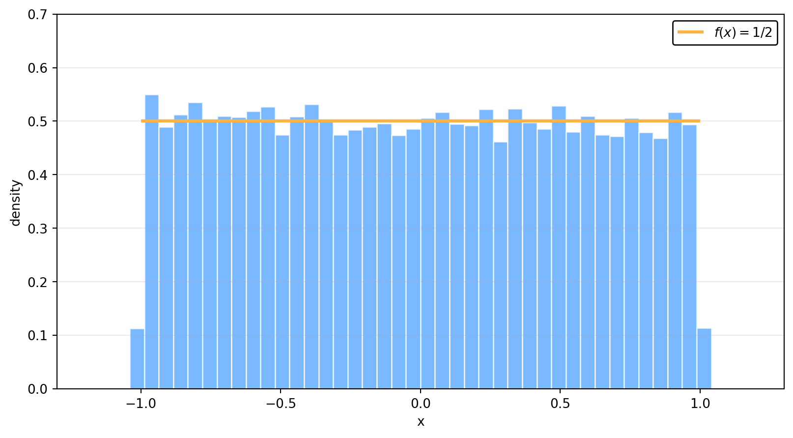
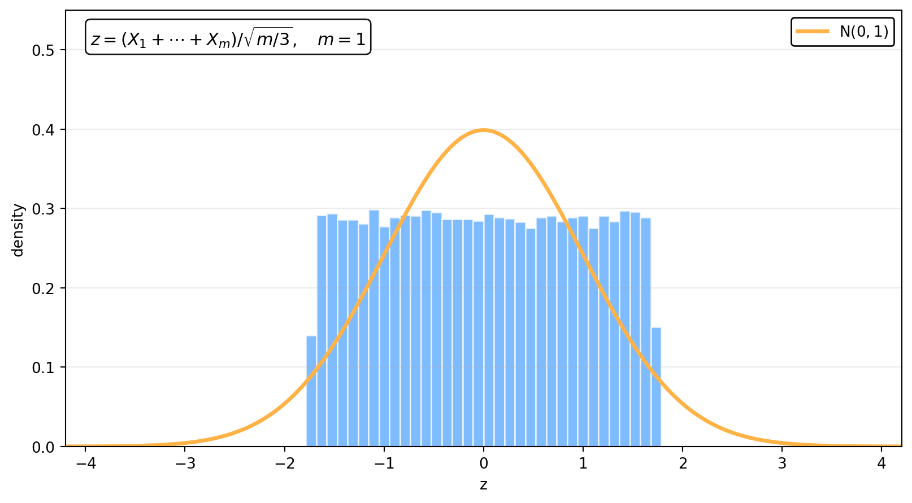
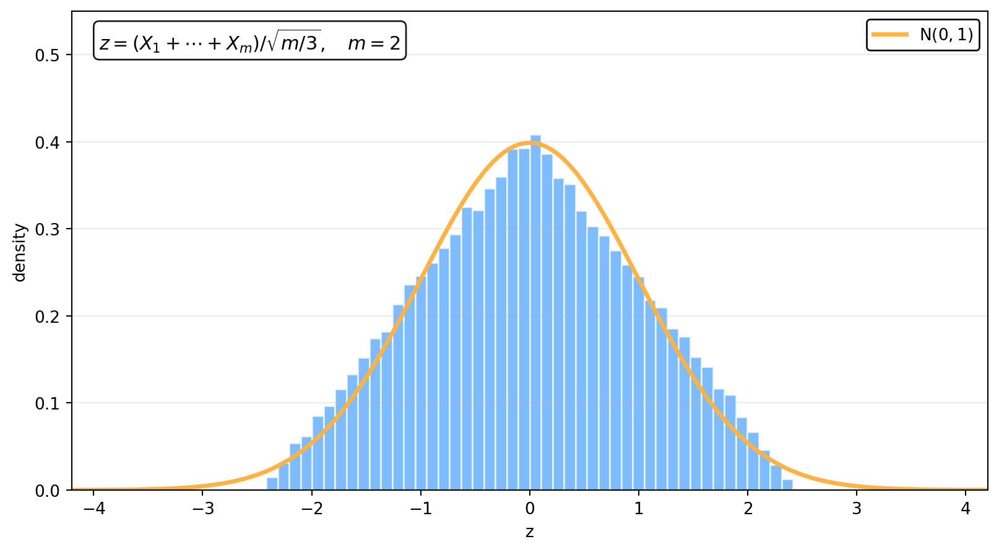
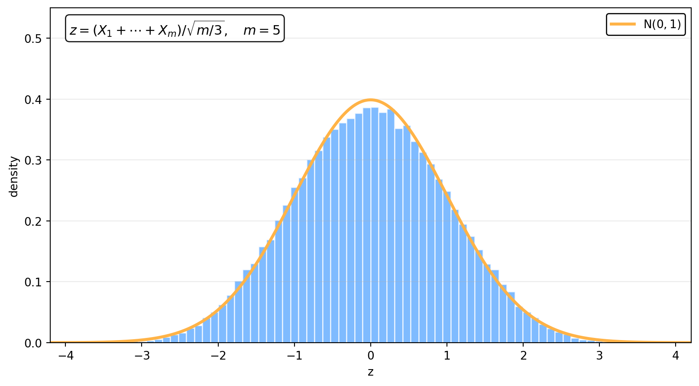
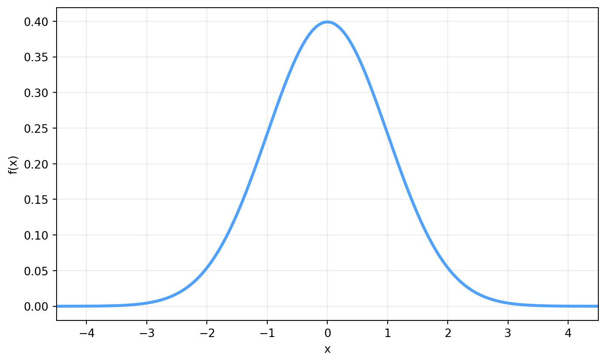
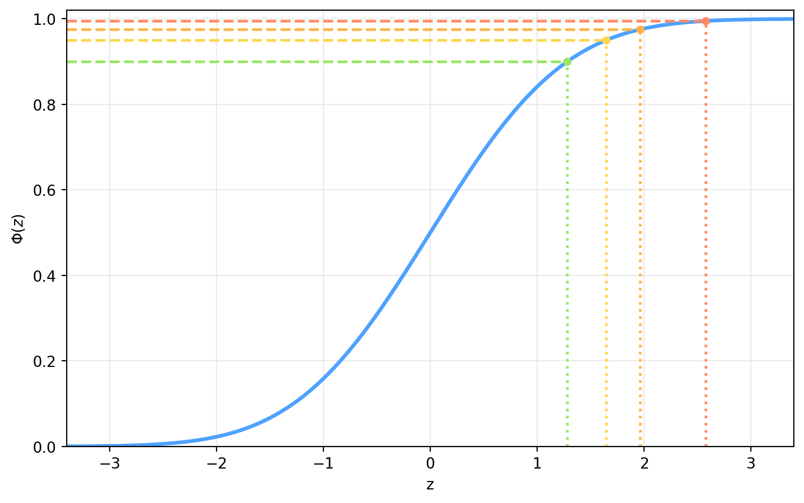
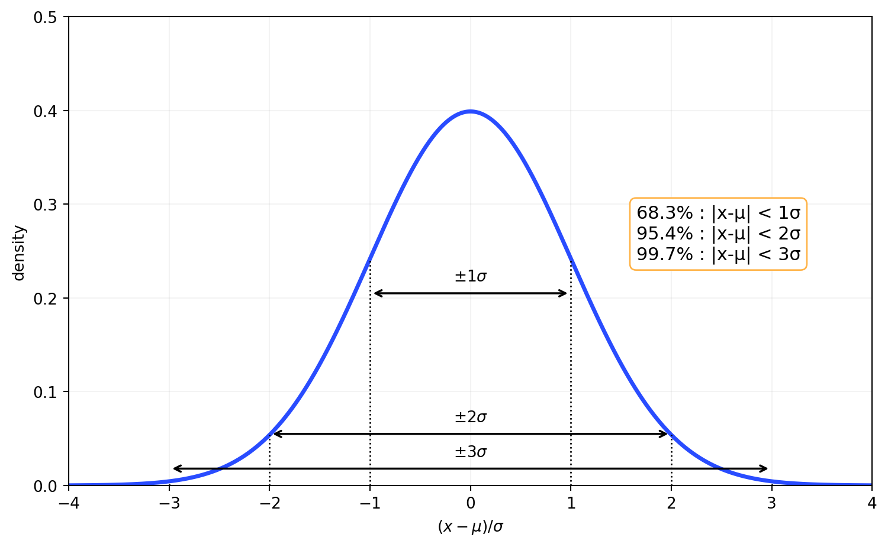
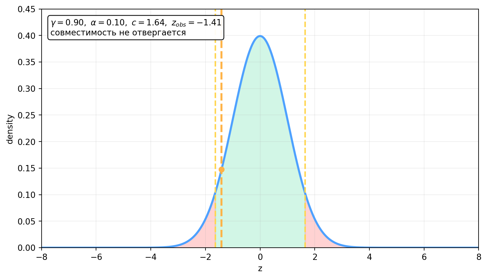
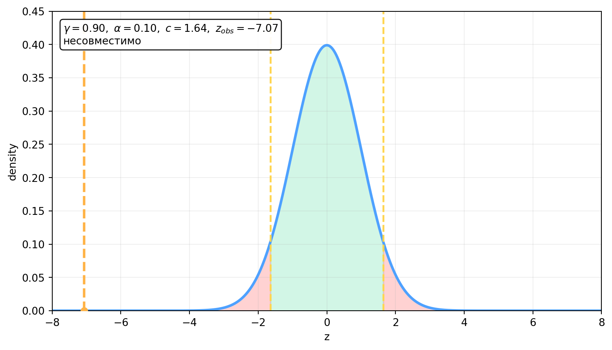

::: chapter-opening
[Главная мысль]{style="color: darkred"}

Центральная предельная теорема объясняет, почему при сложении большого числа независимых случайных вкладов с конечными дисперсиями возникает нормальное распределение. После центрирования и нормировки сумма стремится к стандартному гауссу, а квантили этого распределения позволяют количественно задавать вероятностные интервалы и проверять совместимость измерений с учётом их неопределённостей.
:::

## План главы

- Псевдослучайные числа и равномерный генератор
- Суммы случайных величин
- Среднее, дисперсия и ковариация суммы
- Центральная предельная теорема
- Гауссово распределение, стандартизация и квантили
- Центральные интервалы в единицах $\sigma$
- Проверка совместимости двух независимых измерений

## Псевдослучайные числа

При работе с модельными данными часто требуется генерировать случайные числа на компьютере. Такие числа называют **псевдослучайными**: последовательность строится алгоритмом и в теории когда-нибудь начнёт повторяться. Современные генераторы имеют настолько длинный период, что в практических вычислениях эту последовательность можно рассматривать как случайную.

::: book-note
Для дальнейшей работы достаточно уметь получать равномерно распределённую случайную величину:

$$X\sim U(-1,1).$$

Имея генератор равномерного распределения, можно строить генераторы для других распределений. Детали самих алгоритмов генерации здесь не нужны: важно уметь корректно пользоваться готовым генератором.
:::
Одна из простых реализаций на Python выглядит так:

::::: {.content-visible when-format="html:js"}

:::: {.panel-tabset}

### Код

::: {.smaller}
```{python}
#| echo: true
#| eval: false
import numpy as np
import pandas as pd
import matplotlib.pyplot as plt

rng = np.random.default_rng(7)
x = rng.uniform(-1, 1, size=20_000)
preview = pd.DataFrame({"i": np.arange(1, 101), "x": x[:100]})
```

- `default_rng(7)` создаёт воспроизводимый генератор.
- `uniform(-1,1,size=20_000)` даёт выборку из равномерного распределения.
- `preview` сохраняет первые 100 значений для просмотра.
:::

### Данные

Первые 100 значений выборки:

```{python}
#| echo: false
#| eval: true
from IPython.display import HTML
import numpy as np
import pandas as pd
rng = np.random.default_rng(7)
x = rng.uniform(-1, 1, size=20_000)
preview = pd.DataFrame({"i": np.arange(1, 101), "x": x[:100]})
HTML(
    '<div class="table-scroll">'
    + preview.style.hide(axis="index").format({"i": "{:.0f}", "x": "{:.3f}"}).to_html()
    + "</div>"
)
```


### График

::: {.smaller}
```{python}
#| echo: false
#| eval: true
#| fig-width: 5.2
#| fig-height: 2.55
#| fig-align: center
#| out-width: 72%
import matplotlib.pyplot as plt
fig, ax = plt.subplots()
ax.hist(x, bins=50, range=(-1.3, 1.3), density=True, color="#4ea1ff", alpha=0.75, edgecolor="white")
ax.hlines(0.5, -1, 1, color="#ffb347", linewidth=2.4, label=r"$f(x)=1/2$")
ax.set_xlim(-1.3, 1.3)
ax.set_ylim(0, 0.7)
ax.set_xlabel("x")
ax.set_ylabel("density")
ax.grid(axis="y", alpha=0.25)
ax.legend(framealpha=1.0, edgecolor="black")
plt.show()
```

:::
::::
:::::

::::: {.content-visible when-format="pdf"}
```{python}
#| echo: true
#| eval: false
import numpy as np

rng = np.random.default_rng(7)
x = rng.uniform(-1, 1, size=20_000)
```
Команда `default_rng(7)` создаёт воспроизводимый генератор, а `uniform(-1, 1, size=20_000)` формирует массив из двадцати тысяч значений в интервале от $-1$ до $1$.

::: figure-panel


Для равномерного распределения на интервале $[-1,1]$ плотность постоянна и равна $1/2$, так как площадь под плотностью должна быть единичной.
:::
:::::
Глядя только на несколько отдельных чисел, невозможно увидеть форму распределения. Гистограмма большой выборки показывает, что значения действительно заполняют весь интервал примерно равномерно и флуктуируют вокруг постоянной плотности.

## Сумма случайных величин

Пусть имеется набор независимых случайных величин:

$$X_1,X_2,\ldots,X_m,$$
и построена их сумма:
$$\boxed{S_m=X_1+X_2+\cdots+X_m.}$$
Вопрос: как меняется распределение $S_m$ при увеличении числа слагаемых ($m\rightarrow \infty$)?

В качестве конкретного примера рассмотрим одинаково распределённые независимые величины:

$$X_i\sim U(-1,1).$$
Каждая из них принимает значения только между $-1$ и $1$. Сама сумма при увеличении $m$ уже может занимать всё более широкий интервал, и заранее форма её распределения не очевидна.

### Среднее и дисперсия одного равномерного вклада

Из симметрии распределения сразу видно, что
$$\mathbb{E}[X_i]=0.$$
Дисперсию вычислим явно.

::: book-derivation
#### Вывод $\mathrm{Var}(X_i)$ для $X_i\sim U(-1,1)$

Плотность равномерного распределения на $[-1,1]$ равна

$$f(x)=\frac12.$$

Второй момент:

$$\mathbb{E}[X_i^2]
=\int_{-1}^{1}x^2\frac12\,dx=\frac12\left[\frac{x^3}{3}\right]_{-1}^{1}=\frac12\cdot\frac{2}{3}
=\frac13.$$

Согласно определению дисперсии:

$$\mathrm{Var}(X_i)
=\mathbb{E}[X_i^2]-\mathbb{E}[X_i]^2.$$

Так как $\mathbb{E}[X_i]=0$, то в итоге получаем:

$$\boxed{\mathrm{Var}(X_i)=\frac13.}\quad\blacksquare$$
:::

### Среднее суммы

Воспользуемся линейностью математического ожидания:

$$\mathbb{E}[S_m]=\mathbb{E}\!\left[\sum_{i=1}^{m}X_i\right]=\sum_{i=1}^{m}\mathbb{E}[X_i].$$
Для рассматриваемого примера каждое среднее равно нулю, следовательно,
$$\boxed{\mathbb{E}[S_m]=0.}$$

### Ковариация и дисперсия суммы

При вычислении дисперсии суммы появляются не только квадраты отдельных вкладов, но и произведения величин с разными индексами. Эти смешанные члены естественно приводят к понятию ковариации.

::: book-note
**Ковариация** двух случайных величин $X$ и $Y$ определяется как:

$$\boxed{
\mathrm{cov}(X,Y)
=\mathbb{E}\!\left[(X-\mathbb{E}[X])(Y-\mathbb{E}[Y])\right]
=\mathbb{E}[XY]-\mathbb{E}[X]\mathbb{E}[Y].
}$$

Если $X=Y$, получаем дисперсию:

$$\mathrm{cov}(X,X)=\mathrm{Var}(X).$$
:::

::: book-derivation
#### Вывод дисперсии суммы

Соглсно определению:

$$\mathrm{Var}(S_m)
=\mathbb{E}\!\left[(S_m-\mathbb{E}[S_m])^2\right].$$

Подставим сумму:

$$\mathrm{Var}(S_m)
=
\mathbb{E}\!\left[
\left(
\sum_{i=1}^{m}(X_i-\mathbb{E}[X_i])
\right)^2
\right].$$

После раскрытия квадрата возникают два типа членов: с одинаковыми и с различными индексами:

$$\begin{aligned}
\mathrm{Var}(S_m)
={}&
\sum_{i=1}^{m}
\mathbb{E}\!\left[(X_i-\mathbb{E}[X_i])^2\right]\\
&+2\sum_{i<j}
\mathbb{E}\!\left[(X_i-\mathbb{E}[X_i])(X_j-\mathbb{E}[X_j])\right].
\end{aligned}$$

Используя определения дисперсии и ковариации, получаем:

$$\boxed{
\mathrm{Var}(S_m)
=
\sum_{i=1}^{m}\mathrm{Var}(X_i)
+2\sum_{i<j}\mathrm{cov}(X_i,X_j).
}$$

Если величины независимы, их ковариации равны нулю:

$$\mathrm{Var}(S_m)
=
\sum_{i=1}^{m}\mathrm{Var}(X_i).$$

Для $X_i\sim U(-1,1)$ каждая дисперсия равна $1/3$, следовательно:

$$\boxed{\mathrm{Var}(S_m)=\frac{m}{3}.}\quad\blacksquare$$
:::
Обратите внимание: независимость здесь является существенным условием. Если между слагаемыми есть корреляции, смешанные члены не исчезают и дисперсия суммы ведёт себя иначе.

## Центральная предельная теорема
Теперь можно сформулировать основное утверждение.

::: book-note
### Центральная предельная теорема

Если $X_1,\ldots,X_m$ независимы и имеют конечные дисперсии, то нормированная сумма

$$\boxed{
Z_m=
\frac{S_m-\mathbb{E}[S_m]}
{\sqrt{\mathrm{Var}(S_m)}}
}$$

при большом $m$ стремится к стандартному нормальному распределению:

$$\boxed{Z_m\Rightarrow \mathrm{N}(0,1),\qquad \text{при  }~~ m\to\infty.}$$
:::

Для суммы равномерных величин, которую мы рассматриваем,
$$\mathbb{E}[S_m]=0,
\qquad
\mathrm{Var}(S_m)=\frac{m}{3},$$
так что
$$\boxed{
Z_m=
\frac{X_1+X_2+\cdots+X_m}{\sqrt{m/3}}.
}$$
Результат выглядит неожиданно: каждое отдельное $X_i$ имеет плоское равномерное распределение, но после сложения большого числа независимых вкладов и правильной нормировки распределение суммы становится гауссовым.

### Как меняется форма при увеличении числа слагаемых

При $m=1$ распределение остаётся равномерным. Для $m=2$ сумма двух равномерных величин даёт треугольную форму. Уже при $m=5$ распределение становится очень похожим на нормальное, а при $m=10$ различие на глаз становится небольшим.

:::: {.content-visible when-format="html:js"}
::: clt-widget
```{ojs}
//| echo: false

viewof m = Inputs.range([1, 50], {
  value: 5,
  step: 1,
  label: "m"
})

viewof sampleSize = Inputs.range([100, 30000], {
  value: 12000,
  step: 1000,
  label: "N"
})

viewof regenerate = Inputs.button("Новая статистика")

zValues = {
  regenerate;
  const scale = Math.sqrt(m / 3);
  const values = new Array(sampleSize);

  for (let i = 0; i < sampleSize; ++i) {
    let sum = 0;
    for (let j = 0; j < m; ++j) {
      sum += 2 * Math.random() - 1;
    }
    values[i] = sum / scale;
  }

  return values;
}

histogram = (values, bins, min, max) => {
  const width = (max - min) / bins;
  const counts = Array(bins).fill(0);

  for (const value of values) {
    if (value < min || value >= max) continue;
    counts[Math.floor((value - min) / width)] += 1;
  }

  return counts.map((count, i) => ({
    x0: min + i * width,
    x1: min + (i + 1) * width,
    density: count / (values.length * width)
  }));
}

hist = histogram(zValues, 64, -4, 4)

normalCurve = Array.from({length: 401}, (_, i) => {
  const z = -4 + 8 * i / 400;
  return {
    z,
    density: Math.exp(-0.5 * z * z) / Math.sqrt(2 * Math.PI)
  };
})

zMean = zValues.reduce((sum, value) => sum + value, 0) / zValues.length

zVariance = zValues.reduce(
  (sum, value) => sum + (value - zMean) ** 2,
  0
) / zValues.length

cltPlot = Plot.plot({
  width: 960,
  height: 580,
  marginLeft: 55,
  x: {label: "z", domain: [-4, 4]},
  y: {label: "density", domain: [0, 0.55]},
  grid: true,
  marks: [
    Plot.rectY(hist, {
      x1: "x0",
      x2: "x1",
      y: "density",
      fill: "#4ea1ff",
      fillOpacity: 0.70,
      stroke: "white"
    }),
    Plot.line(normalCurve, {
      x: "z",
      y: "density",
      stroke: "#ffb347",
      strokeWidth: 2.8
    })
  ]
})

html`
<div class="clt-panel">
  ${cltPlot}
  <div class="clt-summary">
    <span> Текущие параметры: z = (X1 + ... + Xm)/sqrt(m/3); </span>
    <span> m = ${m}; </span>
    <span> mean = ${zMean.toFixed(3)}; </span>
    <span> variance = ${zVariance.toFixed(3)}. </span>
  </div>
</div>
`
```
:::
::::

::::::: {.content-visible when-format="pdf"}
::: figure-panel

:::

::: figure-panel

:::

::: figure-panel

:::

::: figure-panel

:::
:::::::
Полное математическое доказательство центральной предельной теоремы здесь не требуется. Для дальнейшего статистического анализа важен сам результат и понимание того, какие свойства суммы приводят к появлению нормального распределения.

## Гауссово распределение

Центральная предельная теорема объясняет особую роль нормального распределения: наблюдаемая величина часто складывается из большого числа малых случайных вкладов. Именно с этим связана широкая роль распределения Гаусса при описании ошибок измерений, интервалов и объединения результатов.

### Одномерное нормальное распределение

Плотность одномерного распределения Гаусса имеет вид:
$$\boxed{
f(x;\mu,\sigma)
=
\frac{1}{\sigma\sqrt{2\pi}}
\exp\!\left[-\frac{(x-\mu)^2}{2\sigma^2}\right].
}$$
Здесь $\mu$ задаёт наиболее вероятное значение распределения $x$, а $\sigma$ характеризует ширину распределения. Дисперсия равна $\sigma^2$, а нормировка удовлетворяет условию:
$$\int_{-\infty}^{+\infty}f(x;\mu,\sigma)\,dx=1.$$

::: figure-panel

:::

### Стандартизация

Если
$$X\sim\mathrm{N}(\mu,\sigma),$$
то после замены на величину:
$$Z=\frac{X-\mu}{\sigma}.$$
получаем стандартное нормальное распределение:

::: book-note
$$\boxed{
Z\sim\mathrm{N}(0,1),
\qquad
f_Z(z)=\frac{1}{\sqrt{2\pi}}e^{-z^2/2}.
}$$
:::

Такое преобразование переводит отклонение от среднего в единицы стандартного отклонения $\sigma$.

## Квантили стандартного нормального распределения

В лекции о случайных величинах и распределениях для $Z\sim\mathrm{N}(0,1)$ мы ввели кумулятивную функцию распределения:
$$\Phi(z)
=P(Z\le z)=\frac{1}{\sqrt{2\pi}}\int_{-\infty}^{z}e^{-t^2/2}\,dt=\frac12\left[1+\operatorname{erf}\!\left(\frac{z}{\sqrt2}\right)
\right].$$
При $z\to-\infty$ функция стремится к нулю, а при $z\to+\infty$ – к единице.

::: book-note
**Квантиль уровня** $\beta$ стандартного нормального распределения $Z\sim\mathrm{N}(0,1)$ – это число $z_\beta$, для которого выполняется следующее равенство:
$$\boxed{\Phi(z_\beta)=\beta.}$$
Иными словами,
$$P(-\infty<Z\le z_\beta)=\beta.$$
:::

Например, для $\beta=0.90$ получаем $z_\beta\approx1.282$, а для $\beta=0.95$ – $z_\beta\approx1.645$.

| Уровень $\beta$ | $z_\beta$ |
|:---------------:|:---------:|
|     $0.90$      |  $1.282$  |
|     $0.95$      |  $1.645$  |
|     $0.975$     |  $1.960$  |
|     $0.995$     |  $2.576$  |

::: figure-panel

:::

## Центральные интервалы
Односторонний квантиль задаёт область от $-\infty$ до выбранной границы. Для симметричного нормального распределения часто удобнее использовать центральный интервал, одинаково отрезающий левый и правый хвосты.
Пусть вероятность попасть внутрь центральной области равна $\gamma$:
$$P\!\left(
|Z|\le z_{(1+\gamma)/2}
\right)=\gamma.$$
Если обозначить суммарную вероятность двух хвостов через
$$\alpha=1-\gamma,$$
то критическая граница записывается как:
$$\boxed{z_{1-\alpha/2}}.$$
При таком определении каждый хвост имеет вероятность $\alpha/2$.

### Интервалы $1\sigma$, $2\sigma$ и $3\sigma$

Для гауссовского распределения особенно часто используются центральные интервалы в единицах $\sigma$:

- $|X-\mu|<1\sigma$ содержит примерно $68.3\%$ вероятности;
- $|X-\mu|<2\sigma$ содержит примерно $95.4\%$;
- $|X-\mu|<3\sigma$ содержит примерно $99.7\%$.

::: {.content-visible when-format="html:js"}
```{python}
#| echo: false
#| eval: true
#| include: false
import numpy as np
from statistics import NormalDist
dist_q = NormalDist()
z_q = np.linspace(-4.0, 4.0, 800)
y_q = np.exp(-0.5 * z_q**2) / np.sqrt(2 * np.pi)
peak_q = 1 / np.sqrt(2 * np.pi)
y1_q = peak_q * np.exp(-0.5)
y2_q = peak_q * np.exp(-2.0)
p1_q = dist_q.cdf(1.0) - dist_q.cdf(-1.0)
p2_q = dist_q.cdf(2.0) - dist_q.cdf(-2.0)
p3_q = dist_q.cdf(3.0) - dist_q.cdf(-3.0)
```

:::: panel-tabset
### Код

::: smaller
```{python}
#| echo: true
#| eval: false
from statistics import NormalDist
import numpy as np

dist = NormalDist()
z = np.linspace(-4, 4, 800)
f = np.exp(-z**2 / 2) / np.sqrt(2 * np.pi)
p1 = dist.cdf(1) - dist.cdf(-1)
p2 = dist.cdf(2) - dist.cdf(-2)
p3 = dist.cdf(3) - dist.cdf(-3)
```

- `p1`, `p2`, `p3` дают вероятности попадания в интервалы `[-1,1]`, `[-2,2]`, `[-3,3]`.
- Для стандартной нормали это и есть центральные интервалы `1σ`, `2σ`, `3σ`.
- На графике они сопоставлены с шириной гауссовой кривой для `1σ`, `2σ`, `3σ`.
:::

### График

```{python}
#| echo: false
#| eval: true
#| fig-width: 12.1
#| fig-height: 4.0
#| fig-align: center
#| out-width: 85%

import matplotlib.pyplot as plt
fig, ax = plt.subplots(facecolor="white")
ax.set_facecolor("white")
ax.plot(z_q, y_q, color="#294cff", linewidth=2.6)

for z_mark in [-3, -2, -1, 1, 2, 3]:
    y_mark = peak_q * np.exp(-0.5 * z_mark**2)
    ax.vlines(z_mark, 0, y_mark, color="black", linestyle=":", linewidth=1.1)

ax.hlines(peak_q, 0.18, 0.95, color="black", linestyle=":", linewidth=1.1)
ax.hlines(y1_q, 1.10, 2.00, color="black", linestyle=":", linewidth=1.1)
ax.hlines(y2_q, 2.05, 2.95, color="black", linestyle=":", linewidth=1.1)

ax.text(1.10, peak_q + 0.006, r"$P_0$", fontsize=14)
ax.text(2.08, y1_q + 0.004, r"$P_0 e^{-1/2}$", fontsize=13)
ax.text(2.98, y2_q + 0.002, r"$P_0 e^{-2}$", fontsize=13, ha="right")

ax.annotate(
    "",
    xy=(1.0, 0.205),
    xytext=(-1.0, 0.205),
    arrowprops=dict(arrowstyle="<->", color="black", linewidth=1.4),
)
ax.text(0.0, 0.217, r"$\pm1\sigma$", ha="center", fontsize=14)

ax.annotate(
    "",
    xy=(2.0, 0.055),
    xytext=(-2.0, 0.055),
    arrowprops=dict(arrowstyle="<->", color="black", linewidth=1.4),
)
ax.text(0.0, 0.068, r"$\pm2\sigma$", ha="center", fontsize=14)

ax.annotate(
    "",
    xy=(3.0, 0.018),
    xytext=(-3.0, 0.018),
    arrowprops=dict(arrowstyle="<->", color="black", linewidth=1.4),
)
ax.text(0.0, 0.031, r"$\pm3\sigma$", ha="center", fontsize=14)

interval_text = (
    rf"{100 * p1_q:.1f}% : $|x-\mu| < 1\sigma$" "\n"
    rf"{100 * p2_q:.1f}% : $|x-\mu| < 2\sigma$" "\n"
    rf"{100 * p3_q:.1f}% : $|x-\mu| < 3\sigma$"
)
ax.text(
    1.75,
    0.265,
    interval_text,
    fontsize=12.5,
    va="top",
    bbox=dict(facecolor="white", edgecolor="#ffb347", linewidth=1.4, boxstyle="round,pad=0.35"),
)

ax.set_xlim(-4, 4)
ax.set_ylim(0, 0.5)
ax.set_xlabel(r"$(x-\mu)/\sigma$", fontsize=15)
ax.set_ylabel(r"$\mathrm{Prob}(x;\mu,\sigma)$", fontsize=15)
ax.set_xticks(np.arange(-4, 5, 1))
ax.tick_params(axis="both", which="major", direction="in", top=True, right=True, length=7, width=1.0, labelsize=12)
ax.minorticks_on()
ax.tick_params(axis="both", which="minor", direction="in", top=True, right=True, length=4, width=0.9)
for spine in ax.spines.values():
    spine.set_linewidth(1.2)
plt.show()
```
::::
:::

::: {.content-visible when-format="pdf"}
::: figure-panel

:::
:::

::: book-note
Одна «сигма» в таком центральном интервале означает одну $\sigma$ вправо и одну $\sigma$ влево от среднего. Полная ширина интервала $\pm1\sigma$ равна $2\sigma$.
:::
Вероятности $68\%$, $95\%$ и даже $99.7\%$ в физике соответствуют лишь примерно одной, двум и трём стандартным сигмам. Для заявления об открытии обычно требуется статистическая значимость не меньше пяти стандартных отклонений: такой критерий возник как практический результат многолетней экспериментальной работы, когда менее значимые отклонения неоднократно оказывались флуктуациями.

## Совместимость двух измерений

Пусть два независимых измерения одной и той же величины имеют вид:
$$x_1\pm\sigma_1,
\qquad
x_2\pm\sigma_2.$$
Сравнивать только центральные значения недостаточно. Разность может выглядеть большой, но быть обычной флуктуацией при больших неопределённостях, или наоборот — небольшая разность может оказаться очень значимой, если ошибки малы.

Рассмотрим две пары значений:
$$1.0\pm0.5,
\qquad
2.0\pm0.5,$$
и
$$1.010\pm0.001,
\qquad
1.020\pm0.001.$$

### Распределение разности

Введём случайную величину:
$$D=X_1-X_2.$$
Если оба измерения оценивают одну и ту же величину $\mu$, то при гипотезе совместимости:
$$\mathbb{E}[D]=\mathbb{E}[X_1-X_2]=\mu-\mu=0.$$

::: book-derivation
#### Дисперсия разности и наблюдаемая значимость

Для разности

$$D=X_1-X_2$$

дисперсия равна

$$\mathrm{Var}(D)
=\mathrm{Var}(X_1-X_2)=
\sigma_1^2+
\sigma_2^2-
2\,\mathrm{cov}(X_1,X_2).$$

Если измерения независимы, то

$$\mathrm{cov}(X_1,X_2)=0,$$

и тогда

$$\boxed{
\sigma_D^2=\sigma_1^2+\sigma_2^2,
\qquad
\sigma_D=\sqrt{\sigma_1^2+\sigma_2^2}.
}$$

Если ошибки гауссовы, то:

$$D\sim\mathrm{N}(0,\sigma_D),$$

а нормированная величина

$$Z=\frac{D}{\sigma_D}$$

имеет стандартное нормальное распределение. Для наблюдённых значений получаем:

$$\boxed{
z_{\mathrm{obs}}
=
\frac{x_1-x_2}{\sqrt{\sigma_1^2+\sigma_2^2}}.
}\quad\blacksquare$$
:::

### Правило проверки совместимости двух измерений

Выбирается центральная область совместимости с вероятностью $\gamma$. Ей соответствует
$$\alpha=1-\gamma$$
и критическая граница
$$\boxed{
c=z_{(1+\gamma)/2}=z_{1-\alpha/2}.
}$$
Например, при
$$\gamma=0.90,
\qquad
\alpha=0.10,$$
получаем
$$c=z_{0.95}\approx1.64.$$
Правило проверки имеет вид:
$$|z_{\mathrm{obs}}|\le c$$
— совместимость не отвергается. Если
$$|z_{\mathrm{obs}}|>c,$$
наблюдаемая разность попадает в хвост стандартного нормального распределения и измерения считаются несовместимыми на выбранном уровне значимости $\alpha$.

Обратите внимание: утверждение о совместимости всегда должно сопровождаться выбранным уровнем $\gamma$ или, эквивалентно, $\alpha$.

:::: {.content-visible when-format="html:js"}
```{=html}
<style>
.compat-widget { width:100%; padding:0.7rem; border:1px solid rgba(42,94,168,.30); border-radius:8px; background:#101923; color:#f5f7fd; font-size:.92rem; }
.compat-controls { display:grid; grid-template-columns:1fr 1fr; gap:.7rem; margin-bottom:.5rem; }
.compat-control { display:grid; grid-template-columns:auto 1fr auto; align-items:center; gap:.45rem; color:#dbe7f7; font-weight:700; }
.compat-control input[type="range"] { width:100%; accent-color:#ffb347; }
.compat-control output { min-width:3.4em; color:#ffcc80; text-align:right; font-variant-numeric:tabular-nums; }
.compat-plot { display:block; width:100%; height:auto; }
.compat-summary { display:grid; grid-template-columns:repeat(2,minmax(0,1fr)); gap:.35rem; margin-top:.45rem; }
.compat-summary span { padding:.3rem .4rem; border-radius:6px; background:rgba(255,255,255,.08); color:#dbe7f7; }
.compat-summary .compat-decision-ok { color:#83f2c1; }
.compat-summary .compat-decision-bad { color:#ffb4a8; }
</style>
```

::: {.compat-widget data-alpha="0.10" data-zobs="1.10"}
:::

```{=html}
<script>
(() => {
  if (window.initCompatibilityWidgets) {
    window.initCompatibilityWidgets();
    return;
  }

  const pdf = (z) => Math.exp(-0.5 * z * z) / Math.sqrt(2 * Math.PI);

  const erf = (x) => {
    const sign = x < 0 ? -1 : 1;
    const a1 = 0.254829592;
    const a2 = -0.284496736;
    const a3 = 1.421413741;
    const a4 = -1.453152027;
    const a5 = 1.061405429;
    const p = 0.3275911;
    const ax = Math.abs(x);
    const t = 1 / (1 + p * ax);
    const y = 1 - (((((a5 * t + a4) * t) + a3) * t + a2) * t + a1) * t * Math.exp(-ax * ax);
    return sign * y;
  };

  const cdf = (z) => 0.5 * (1 + erf(z / Math.SQRT2));

  const quantile = (probability) => {
    let lo = -8;
    let hi = 8;
    for (let i = 0; i < 80; i += 1) {
      const mid = 0.5 * (lo + hi);
      if (cdf(mid) < probability) lo = mid;
      else hi = mid;
    }
    return 0.5 * (lo + hi);
  };

  const fmt = (value, digits = 3) => Number(value).toFixed(digits);
  const prob = (value) => value < 0.001 ? value.toExponential(2) : fmt(value, 3);

  const buildSvg = ({alpha, gamma, c, zObs, pTwo, id}) => {
    const width = 740;
    const height = 430;
    const xMin = -8;
    const xMax = 8;
    const left = 44;
    const right = 24;
    const top = 40;
    const base = 318;
    const plotWidth = width - left - right;
    const peak = pdf(0);

    const x = (z) => left + (z - xMin) / (xMax - xMin) * plotWidth;
    const y = (density) => base - density / peak * (base - top);

    const curvePoints = Array.from({length: 361}, (_, i) => {
      const z = xMin + (xMax - xMin) * i / 360;
      return `${x(z).toFixed(1)},${y(pdf(z)).toFixed(1)}`;
    }).join(" ");

    const areaPoints = (a, b) => {
      const n = 72;
      const points = [`${x(a).toFixed(1)},${base}`];
      for (let i = 0; i <= n; i += 1) {
        const z = a + (b - a) * i / n;
        points.push(`${x(z).toFixed(1)},${y(pdf(z)).toFixed(1)}`);
      }
      points.push(`${x(b).toFixed(1)},${base}`);
      return points.join(" ");
    };

    const leftTail = areaPoints(xMin, -c);
    const center = areaPoints(-c, c);
    const rightTail = areaPoints(c, xMax);
    const zX = x(Math.max(xMin, Math.min(xMax, zObs)));
    const zY = y(pdf(zObs));
    const tailLabel = prob(alpha / 2);
    const beta = 1 - alpha / 2;
    const decision = Math.abs(zObs) <= c ? "внутри области" : "в хвосте";

    return `
      <svg class="compat-plot" viewBox="0 0 ${width} ${height}" role="img" aria-label="Двусторонняя проверка совместимости">
        <defs>
          <filter id="${id}-glow" x="-40%" y="-40%" width="180%" height="180%">
            <feGaussianBlur stdDeviation="3.2" result="blur"></feGaussianBlur>
            <feMerge><feMergeNode in="blur"></feMergeNode><feMergeNode in="SourceGraphic"></feMergeNode></feMerge>
          </filter>
          <linearGradient id="${id}-center" x1="0" x2="1" y1="0" y2="0">
            <stop offset="0%" stop-color="#4ea1ff" stop-opacity="0.18"></stop>
            <stop offset="50%" stop-color="#7ee6b8" stop-opacity="0.33"></stop>
            <stop offset="100%" stop-color="#4ea1ff" stop-opacity="0.18"></stop>
          </linearGradient>
          <linearGradient id="${id}-tail" x1="0" x2="1" y1="0" y2="0">
            <stop offset="0%" stop-color="#ff6b6b" stop-opacity="0.38"></stop>
            <stop offset="100%" stop-color="#ff9a5c" stop-opacity="0.23"></stop>
          </linearGradient>
        </defs>
        <rect width="${width}" height="${height}" fill="transparent"></rect>
        <line x1="${left}" y1="${base}" x2="${width - right}" y2="${base}" stroke="#8492a6" stroke-width="2"></line>
        <text x="${width - right}" y="${base + 27}" text-anchor="end" fill="#c9d4e5" font-size="16">z</text>
        <text x="${x(0)}" y="${base + 27}" text-anchor="middle" fill="#c9d4e5" font-size="16">0</text>

        <polygon points="${leftTail}" fill="url(#${id}-tail)"></polygon>
        <polygon points="${center}" fill="url(#${id}-center)"></polygon>
        <polygon points="${rightTail}" fill="url(#${id}-tail)"></polygon>
        <polyline points="${curvePoints}" fill="none" stroke="#f5f7fd" stroke-width="3.5" stroke-linecap="round" stroke-linejoin="round" filter="url(#${id}-glow)"></polyline>

        <line x1="${x(-c)}" y1="${base}" x2="${x(-c)}" y2="58" stroke="#ffd54f" stroke-width="2.5" stroke-dasharray="8 7"></line>
        <line x1="${x(c)}" y1="${base}" x2="${x(c)}" y2="58" stroke="#ffd54f" stroke-width="2.5" stroke-dasharray="8 7"></line>
        <line x1="${zX}" y1="${base}" x2="${zX}" y2="${Math.max(54, zY - 16)}" stroke="#ffb347" stroke-width="3.5" stroke-dasharray="9 6"></line>
        <circle cx="${zX}" cy="${zY}" r="6" fill="#ffb347" stroke="#ffe7b3" stroke-width="2"></circle>

        <text x="${x(-c)}" y="${base + 25}" text-anchor="middle" fill="#ffd54f" font-size="15">-c</text>
        <text x="${x(c)}" y="${base + 25}" text-anchor="middle" fill="#ffd54f" font-size="15">+c</text>
        <text x="${zX}" y="${Math.max(36, zY - 24)}" text-anchor="middle" fill="#ffcc80" font-size="16" font-weight="700">z_obs</text>

        <text x="${x(-3.05)}" y="244" text-anchor="middle" fill="#ffb4a8" font-size="18" font-weight="700">α/2 = ${tailLabel}</text>
        <text x="${x(3.05)}" y="244" text-anchor="middle" fill="#ffb4a8" font-size="18" font-weight="700">α/2 = ${tailLabel}</text>
        <text x="${x(0)}" y="222" text-anchor="middle" fill="#9ff0cf" font-size="21" font-weight="800">γ = ${fmt(gamma, 3)}</text>

        <path d="M ${x(-c) + 7} 365 H ${x(c) - 7}" stroke="#ffd54f" stroke-width="2.2"></path>
        <text x="${x(0)}" y="392" text-anchor="middle" fill="#ffd54f" font-size="16">c = z_${fmt(beta, 3)} = ${fmt(c, 3)}</text>
        <text x="${x(0)}" y="35" text-anchor="middle" fill="#c9d4e5" font-size="16">p(|Z| >= |z_obs|) = ${prob(pTwo)} · ${decision}</text>
      </svg>
    `;
  };

  const render = (root) => {
    const alphaInput = root.querySelector("[data-compat-alpha]");
    const zInput = root.querySelector("[data-compat-zobs]");
    const alphaOut = root.querySelector("[data-compat-alpha-out]");
    const zOut = root.querySelector("[data-compat-zobs-out]");
    const plot = root.querySelector("[data-compat-plot]");
    const summary = root.querySelector("[data-compat-summary]");
    const alpha = Number(alphaInput.value);
    const gamma = 1 - alpha;
    const beta = 1 - alpha / 2;
    const c = quantile(beta);
    const zObs = Number(zInput.value);
    const absZ = Math.abs(zObs);
    const pTwo = Math.min(1, 2 * (1 - cdf(absZ)));
    const compatible = absZ <= c;

    alphaOut.value = fmt(alpha, 3);
    zOut.value = fmt(zObs, 2);
    plot.innerHTML = buildSvg({alpha, gamma, c, zObs, pTwo, id: root.dataset.compatId});
    summary.innerHTML = `
      <span>γ = ${fmt(gamma, 3)}</span>
      <span>α/2 = ${fmt(alpha / 2, 3)}</span>
      <span>c = ${fmt(c, 3)}</span>
      <span>p_two = ${prob(pTwo)}</span>
      <span class="${compatible ? "compat-decision-ok" : "compat-decision-bad"}" style="grid-column: 1 / -1;">
        ${compatible ? "Совместимость не отвергается" : "Несовместимо на выбранном уровне α"}
      </span>
    `;
  };

  let compatCounter = 0;

  const initOne = (root) => {
    if (root.dataset.compatReady) return;
    root.dataset.compatReady = "1";
    root.dataset.compatId = root.dataset.compatId || `compat-${compatCounter += 1}`;
    const initialAlpha = root.dataset.alpha || "0.10";
    const initialZObs = root.dataset.zobs || "1.10";
    root.innerHTML = `
      <div class="compat-controls">
        <label class="compat-control">α <input data-compat-alpha type="range" min="0.001" max="0.200" step="0.001" value="${initialAlpha}"><output data-compat-alpha-out></output></label>
        <label class="compat-control">z_obs <input data-compat-zobs type="range" min="-8.00" max="8.00" step="0.01" value="${initialZObs}"><output data-compat-zobs-out></output></label>
      </div>
      <div data-compat-plot></div>
      <div class="compat-summary" data-compat-summary></div>
    `;
    root.querySelectorAll("input").forEach((input) => {
      input.addEventListener("input", () => render(root));
    });
    render(root);
  };

  window.initCompatibilityWidgets = () => {
    document.querySelectorAll(".compat-widget").forEach(initOne);
  };

  document.addEventListener("DOMContentLoaded", window.initCompatibilityWidgets);
  if (window.Reveal) {
    window.Reveal.on("ready", window.initCompatibilityWidgets);
    window.Reveal.on("slidechanged", window.initCompatibilityWidgets);
  }
  window.initCompatibilityWidgets();
})();
</script>
```
::::

::::: {.content-visible when-format="pdf"}
::: figure-panel

:::

::: figure-panel

:::
:::::

### Два численных примера

Для первой пары
$$1.0\pm0.5,
\qquad
2.0\pm0.5$$
получаем
$$z_{\mathrm{obs}}=\frac{1.0-2.0}{\sqrt{0.5^2+0.5^2}}\approx -1.41.$$
При $\gamma=0.90$ критическая граница составляет примерно $1.64$, так что $|z_{\mathrm{obs}}|<1.64$: совместимость не отвергается.

Для второй пары
$$1.010\pm0.001,
\qquad
1.020\pm0.001$$
имеем:
$$
z_{\mathrm{obs}}=\frac{1.010-1.020}{\sqrt{0.001^2+0.001^2}}\approx -7.07.$$
Хотя центральные значения здесь расположены гораздо ближе друг к другу, неопределённости настолько малы, что нормированная разность очень велика. Эти измерения сильно несовместимы.

::: book-note
При сравнении измерений важна не абсолютная разность центральных значений, а **разность в единицах совместной неопределённости**. Маленькое численное отличие может быть статистически значимым, если ошибки ещё меньше.
:::

::: chapter-summary
## Итоги главы

- Псевдослучайные генераторы позволяют получать на компьютере выборки, статистически ведущие себя как случайные.
- Для независимой суммы дисперсии складываются, а ковариационные члены исчезают.
- Центральная предельная теорема утверждает, что центрированная и нормированная сумма большого числа независимых вкладов с конечными дисперсиями стремится к стандартному нормальному распределению.
- Стандартизация $Z=(X-\mu)/\sigma$ переводит нормальную величину к распределению $\mathrm{N}(0,1)$.
- Квантили и центральные интервалы связывают вероятности с числом стандартных отклонений.
- Совместимость независимых измерений проверяется по нормированной разности $z_{\mathrm{obs}}$.
:::

## Материалы курса

- [Слайды лекции](https://neutrinohit.github.io/statistical-analysis-course/ru/slides/03_central_limit_theorem.html)
- [Задачи](https://neutrinohit.github.io/statistical-analysis-course/ru/slides/exercises/03_central_limit_theorem_exercises.html)