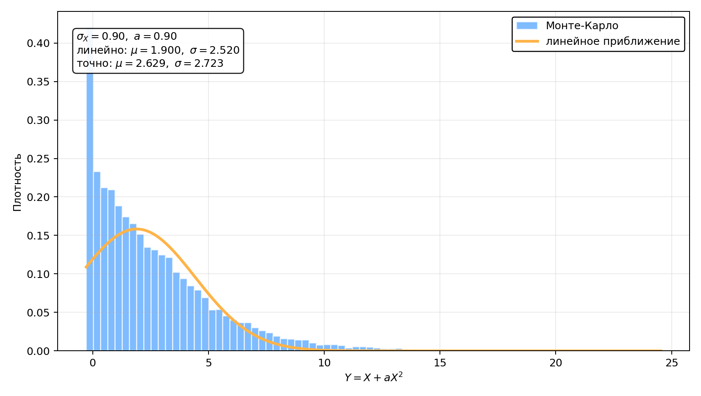
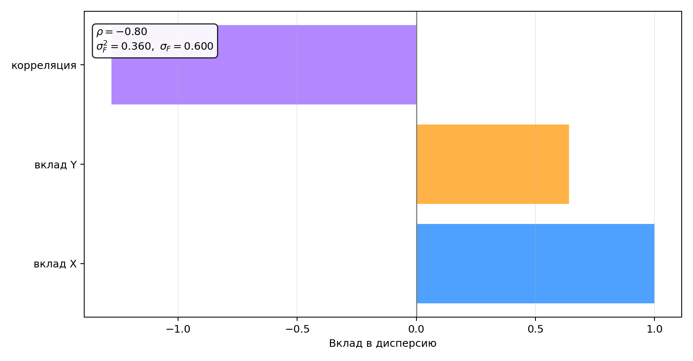

::: chapter-opening
[Аннотация]{.chapter-opening-label}

Физический результат обычно вычисляется по нескольким величинам, которые
измеряет детектор. Вместе с результатом требуется найти его неопределённость.
В этой главе мы получим линейный закон распространения ошибок, проверим его на
нелинейной функции и запишем в матричном виде с учётом корреляций. Отдельный
раздел посвящён разбросу оценок дисперсии и стандартного отклонения.
:::

## Физическая задача: измерение сечения

Эксперимент зарегистрировал $N=1000$ сигнальных событий. Эффективность отбора
равна

$$
\varepsilon=0.80\pm0.02,
$$ {#eq-ch6-cross-section-efficiency-example}

а интегральная светимость составляет

$$
L=(100\pm2)\ \text{фб}^{-1}.
$$ {#eq-ch6-cross-section-luminosity-example}

В упрощённой модели фон отсутствует, число событий имеет распределение
Пуассона, а эффективность и светимость измерены независимо от $N$ и друг от
друга. Оценка сечения процесса равна

$$
\widehat\sigma_{\mathrm{proc}}
=\frac{N}{\varepsilon L}
=12.5\ \text{фб}.
$$ {#eq-ch6-cross-section-estimate-example}

Для пуассоновского счёта стандартное отклонение числа событий можно оценить
как $\sigma_N=\sqrt N$. Относительная неопределённость сечения в линейном
приближении тогда равна

$$
\begin{aligned}
\left(
\frac{\sigma_{\widehat\sigma_{\mathrm{proc}}}}
     {\widehat\sigma_{\mathrm{proc}}}
\right)^2
&\simeq
\left(\frac{\sigma_N}{N}\right)^2
+\left(\frac{\sigma_\varepsilon}{\varepsilon}\right)^2
+\left(\frac{\sigma_L}{L}\right)^2\\
&=
\left(\frac{\sqrt{1000}}{1000}\right)^2
+\left(\frac{0.02}{0.80}\right)^2
+\left(\frac{2}{100}\right)^2
=0.045^2.
\end{aligned}
$$ {#eq-ch6-cross-section-relative-uncertainty-example}

Результат можно записать как

$$
\widehat\sigma_{\mathrm{proc}}
=(12.5\pm0.6)\ \text{фб}.
$$ {#eq-ch6-cross-section-result-example}

В одной строке под корнем встретились статистика событий, эффективность
детектора и светимость ускорителя. Формулу мы пока использовали как готовую.
Ниже выведем её и увидим, где в ней должны стоять ковариации. В реальном
анализе $N$ получают после вычитания фона, а эффективность и нормировки могут
зависеть от общих калибровок. Тогда три квадрата уже не исчерпывают задачу.

## Что называется ошибкой

В названии главы используется привычное физикам выражение «распространение
ошибок». В строгой метрологической терминологии ошибка — это разность между
измеренным и опорным значениями, а неопределённость описывает разброс возможных
результатов. В формулах этой главы речь идёт о стандартной неопределённости,
которую мы обозначаем через $\sigma_X$.

Стандартное отклонение описывает масштаб случайного разброса. Смещение метода,
неопределённость калибровки и физические границы параметра требуют отдельного
учёта. Общие правила представления неопределённостей измерения собраны в
руководстве JCGM [@jcgm2008gum].

## Одна измеряемая величина

Пусть детектор измеряет случайную величину $X$, а результат вычисляется по
формуле

$$
Y=f(X).
$$ {#eq-ch6-one-variable-transformation}

Обозначим

$$
\mathbb E[X]=\mu_X,
\qquad
\operatorname{Var}(X)=\sigma_X^2.
$$ {#eq-ch6-input-mean-variance}

### Линейное распространение ошибки

На масштабе $\sigma_X$ функцию $f$ можно заменить её касательной в точке
$\mu_X$, если кривизна функции на этом интервале мала.

::: book-derivation
#### Формула для одной переменной

Первый порядок разложения Тейлора даёт

$$
f(X)\simeq
f(\mu_X)+f'(\mu_X)(X-\mu_X).
$$ {#eq-ch6-one-variable-taylor}

В этом приближении

$$
\mathbb E[Y]\simeq f(\mu_X),
\qquad
Y-\mathbb E[Y]
\simeq f'(\mu_X)(X-\mu_X).
$$ {#eq-ch6-one-variable-centered-output}

Квадрат производной можно вынести из математического ожидания:

$$
\begin{aligned}
\operatorname{Var}(Y)
&\simeq
\mathbb E\!\left[
f'(\mu_X)^2(X-\mu_X)^2
\right]\\
&=f'(\mu_X)^2\sigma_X^2.
\end{aligned}
$$ {#eq-ch6-one-variable-variance-derivation}

Поэтому

$$
\boxed{
\sigma_Y\simeq |f'(\mu_X)|\sigma_X.
}
$$ {#eq-error-propagation-one-variable}
:::

Производная в уравнении [-@eq-error-propagation-one-variable] показывает,
во сколько раз небольшое отклонение входной величины растягивается или
сжимается при переходе к $Y$. Для линейной функции формула точна. Для
нелинейной её точность определяется размером области, занятой распределением
$X$.

### Поперечный импульс в магнитном поле

Радиус $R$ траектории заряженной частицы в однородном магнитном поле связан с
поперечным импульсом соотношением

$$
p_T=|q|BR.
$$ {#eq-ch6-transverse-momentum-radius}

В единицах, обычных для физики частиц,

$$
p_T[\text{ГэВ}/c]
\simeq
0.2998\,|q/e|\,B[\text{Тл}]\,R[\text{м}].
$$ {#eq-ch6-transverse-momentum-practical-units}

Если $q$ и $B$ считаются известными, неопределённость создаёт измерение
радиуса. Поскольку зависимость линейна,

$$
\sigma_{p_T}=|q|B\sigma_R,
\qquad
\frac{\sigma_{p_T}}{p_T}=\frac{\sigma_R}{R}.
$$ {#eq-ch6-transverse-momentum-uncertainty}

Ошибка радиуса переходит в такую же относительную ошибку импульса. Если
неопределённость магнитного поля существенна, $B$ становится второй входной
величиной. Такой случай разберём в разделе о ковариациях.

### Степенная зависимость

Для функции

$$
Y=X^a
$$ {#eq-ch6-power-transformation}

производная равна

$$
f'(x)=ax^{a-1}.
$$ {#eq-ch6-power-derivative}

В точке $x=\mu_X$ уравнение
[-@eq-error-propagation-one-variable] принимает вид

$$
\frac{\sigma_Y}{|f(\mu_X)|}
\simeq
|a|\frac{\sigma_X}{|\mu_X|}.
$$ {#eq-ch6-power-relative-uncertainty}

Несколько часто встречающихся функций собраны в таблице
[-@tbl-error-propagation-functions]. Здесь $x_0=\mu_X$ и $y_0=f(x_0)$.

| Функция $f(x)$ | Линейная неопределённость | Условие на точку разложения |
|:---|:---|:---|
| $ax+b$ | $\sigma_Y=|a|\sigma_X$ | формула точна |
| $x^a$ | $\sigma_Y/|y_0|\simeq |a|\sigma_X/|x_0|$ | функция определена около $x_0$ |
| $1/x$ | $\sigma_Y/|y_0|\simeq\sigma_X/|x_0|$ | $x_0$ далёк от нуля |
| $\ln x$ | $\sigma_Y\simeq\sigma_X/x_0$ | $x_0>0$, вероятность $X\le0$ мала |
| $e^x$ | $\sigma_Y/y_0\simeq\sigma_X$ | $X$ безразмерна |

: Линейное распространение ошибки для часто встречающихся функций {#tbl-error-propagation-functions}

Таблица даёт локальные формулы. У отношения, логарифма и других функций с
границей одной малости $\sigma_X$ недостаточно. Распределение $X$ должно с
большой вероятностью оставаться в области, где функция гладкая.

## Где линейное приближение перестаёт работать

Касательная описывает функцию в малой окрестности точки разложения. Размер
этой окрестности задаёт $\sigma_X$. Линейная формула требует проверки в
четырёх типичных ситуациях:

- производная заметно меняется на интервале порядка $\sigma_X$;
- $f'(\mu_X)$ близка к нулю и первым ненулевым оказывается квадратичный член;
- рядом находится полюс, порог или физическая граница;
- преобразованное распределение заметно асимметрично.

Возьмём $Y=X^2$ и $\mu_X=0$. Касательная к параболе в нуле горизонтальна, и
линейная формула даёт $\sigma_Y\simeq0$. Сама величина $X^2$ при этом
флуктуирует. Нулевой ответ сообщает о непригодности первого порядка
разложения.

### Нелинейное преобразование $Y=X+aX^2$ {#interactive-error-propagation-nonlinear}

Рассмотрим модель из лекции:

$$
X\sim\mathcal N(1,\sigma_X^2),
\qquad
Y=X+aX^2.
$$ {#eq-ch6-quadratic-transformation-model}

Касательная в точке $\mu_X=1$ даёт

$$
\mathbb E[Y]\simeq1+a,
\qquad
\sigma_Y\simeq|1+2a|\sigma_X.
$$ {#eq-ch6-quadratic-linear-prediction}

Для гауссовой величины моменты можно вычислить без приближения:

$$
\mathbb E[Y]=1+a+a\sigma_X^2,
$$ {#eq-ch6-quadratic-exact-mean}

$$
\operatorname{Var}(Y)
=(1+2a)^2\sigma_X^2+2a^2\sigma_X^4.
$$ {#eq-ch6-quadratic-exact-variance}

Член $a\sigma_X^2$ сдвигает среднее, а $2a^2\sigma_X^4$ добавляет дисперсию.
Оба исчезают в линейном приближении.

```{ojs}
//| echo: false
//| classes: book-applet

```

::: {.animation .applet-fallback title="Нелинейное преобразование $Y=X+aX^2$" poster="../assets/figures/error_propagation_nonlinear_default.png" url="https://neutrinohit.github.io/statistical-analysis-course/ru/book/chapters/06_error_propagation.html#interactive-error-propagation-nonlinear" qr="../assets/qr/error-propagation-nonlinear.png"}
Меняйте ширину исходного гаусса и коэффициент $a$. Гистограмма показывает
распределение $Y$, а гладкая кривая — линейный прогноз.
:::

На рисунке [-@fig-error-propagation-nonlinear-strong] показан режим, в котором
кривизна уже существенна на масштабе входного распределения.

::: figure-panel
{#fig-error-propagation-nonlinear-strong}
:::

Здесь расхождение видно по положению максимума, ширине и длинному правому
хвосту. Запись $y\pm\sigma_Y$ сохраняет два числа, но уже не описывает форму
распределения. В такой ситуации используют преобразование полного
распределения или численное моделирование.

## Разброс оценки стандартного отклонения

До сих пор $\mu$ и $\sigma$ были известными параметрами распределения. В
эксперименте их оценивают по выборке

$$
X_1,\ldots,X_N\sim\mathcal N(\mu,\sigma^2),
$$ {#eq-ch6-gaussian-sample-model}

где измерения независимы. Определим оценки среднего, дисперсии и стандартного
отклонения:

$$
\widehat\mu=\overline X
=\frac1N\sum_{k=1}^{N}X_k,
$$ {#eq-ch6-sample-mean-estimator}

$$
\widehat{\sigma^2}
=\frac1{N-1}\sum_{k=1}^{N}(X_k-\overline X)^2,
\qquad
\widehat\sigma=\sqrt{\widehat{\sigma^2}}.
$$ {#eq-ch6-sample-variance-estimators}

Если повторить весь эксперимент, выборка изменится вместе со всеми тремя
оценками. Поэтому у $\widehat\sigma$ есть собственное распределение и
собственная дисперсия.

Для выборочного среднего

$$
\operatorname{Var}(\widehat\mu)=\frac{\sigma^2}{N}.
$$ {#eq-ch6-sample-mean-variance}

Параметр $\sigma^2$ неизвестен, и в оценке дисперсии среднего его заменяют
выборочной дисперсией:

$$
\widehat{\operatorname{Var}}(\widehat\mu)
=\frac{\widehat{\sigma^2}}{N},
\qquad
\widehat\sigma_{\widehat\mu}
=\frac{\widehat\sigma}{\sqrt N}.
$$ {#eq-ch6-estimated-mean-uncertainty}

Возникает следующий вопрос: насколько устойчиво значение
$\widehat\sigma$, найденное по конечной выборке?

### Почему в выборочной дисперсии стоит $N-1$

Введём отклонения от истинного среднего

$$
Y_k=X_k-\mu.
$$ {#eq-ch6-centered-observations}

Для независимой выборки с конечной дисперсией

$$
\mathbb E[Y_k]=0,
\qquad
\mathbb E[Y_k^2]=\sigma^2.
$$ {#eq-ch6-centered-first-two-moments}

Гауссовость для доказательства несмещённости выборочной дисперсии не нужна.

::: book-derivation
#### Несмещённость выборочной дисперсии

Обозначим две суммы

$$
A=\sum_{k=1}^{N}Y_k^2,
\qquad
B=\sum_{k=1}^{N}Y_k.
$$ {#eq-ch6-centered-sums-ab}

Разность выборочного и истинного среднего равна

$$
\overline X-\mu=\frac{B}{N}.
$$ {#eq-ch6-sample-mean-centered-sum}

Сумма квадратов отклонений от выборочного среднего принимает вид

$$
\begin{aligned}
T
&=\sum_{k=1}^{N}(X_k-\overline X)^2\\
&=\sum_{k=1}^{N}\left(Y_k-\frac BN\right)^2\\
&=A-\frac{B^2}{N}.
\end{aligned}
$$ {#eq-ch6-residual-sum-of-squares}

Независимость и центрирование дают

$$
\mathbb E[A]=N\sigma^2,
\qquad
\mathbb E[B^2]=N\sigma^2.
$$ {#eq-ch6-ab-expectations}

Отсюда

$$
\mathbb E[T]
=N\sigma^2-\frac1N N\sigma^2
=(N-1)\sigma^2.
$$ {#eq-ch6-residual-sum-expectation}

После деления на $N-1$

$$
\boxed{
\mathbb E[\widehat{\sigma^2}]=\sigma^2.
}
$$ {#eq-ch6-sample-variance-unbiased}
:::

Выборочные отклонения связаны условием

$$
\sum_{k=1}^{N}(X_k-\overline X)=0.
$$ {#eq-ch6-residuals-constraint}

Одно из $N$ отклонений определяется через остальные. Поэтому сумма их
квадратов содержит $N-1$ степеней свободы, и такой же делитель появляется в
несмещённой оценке дисперсии.

### Дисперсия оценки дисперсии

Теперь понадобится гауссовость. Для центрированной гауссовой величины

$$
\mathbb E[Y_k^4]=3\sigma^4.
$$ {#eq-ch6-gaussian-fourth-moment}

Поскольку $\widehat{\sigma^2}=T/(N-1)$, достаточно найти дисперсию $T$.

::: book-derivation
#### Вычисление $\operatorname{Var}(\widehat{\sigma^2})$

Из уравнения [-@eq-ch6-residual-sum-of-squares]

$$
T^2=A^2-\frac2N AB^2+\frac1{N^2}B^4.
$$ {#eq-ch6-residual-sum-square-expanded}

Первый момент вычисляется раскрытием квадрата суммы:

$$
\begin{aligned}
\mathbb E[A^2]
&=\sum_{k=1}^{N}\mathbb E[Y_k^4]
+2\sum_{i<j}\mathbb E[Y_i^2Y_j^2]\\
&=3N\sigma^4+N(N-1)\sigma^4\\
&=N(N+2)\sigma^4.
\end{aligned}
$$ {#eq-ch6-a-second-moment}

Для смешанного момента выделим одно слагаемое,
$B=Y_i+C_i$, где $C_i=\sum_{j\ne i}Y_j$. Величины $Y_i$ и $C_i$
независимы, $\mathbb E[C_i]=0$ и
$\mathbb E[C_i^2]=(N-1)\sigma^2$. Поэтому

$$
\begin{aligned}
\mathbb E[Y_i^2B^2]
&=\mathbb E[Y_i^2(Y_i+C_i)^2]\\
&=3\sigma^4+(N-1)\sigma^4\\
&=(N+2)\sigma^4,
\end{aligned}
$$ {#eq-ch6-one-term-ab2-moment}

и после суммирования по $i$

$$
\mathbb E[AB^2]=N(N+2)\sigma^4.
$$ {#eq-ch6-ab2-moment}

Сумма $B$ также гауссова, причём
$\operatorname{Var}(B)=N\sigma^2$. Её четвёртый момент равен

$$
\mathbb E[B^4]=3N^2\sigma^4.
$$ {#eq-ch6-b-fourth-moment}

Подстановка трёх средних в уравнение
[-@eq-ch6-residual-sum-square-expanded] даёт

$$
\mathbb E[T^2]=(N^2-1)\sigma^4.
$$ {#eq-ch6-residual-sum-second-moment}

Вместе с уравнением [-@eq-ch6-residual-sum-expectation] это приводит к

$$
\operatorname{Var}(T)
=2(N-1)\sigma^4.
$$ {#eq-ch6-residual-sum-variance}

Искомая дисперсия оценки равна

$$
\boxed{
\operatorname{Var}(\widehat{\sigma^2})
=\frac{2\sigma^4}{N-1}.
}
$$ {#eq-ch6-sample-variance-variance}
:::

Уравнение [-@eq-ch6-sample-variance-variance] является точным для независимой
гауссовой выборки. Для другого исходного распределения в ответ входит его
четвёртый центральный момент.

### Разброс оценки стандартного отклонения

Оценка $\widehat\sigma$ связана с $\widehat{\sigma^2}$ функцией квадратного
корня. Применим к ней формулу
[-@eq-error-propagation-one-variable] в точке $\sigma^2$:

$$
f(y)=\sqrt y,
\qquad
f'(\sigma^2)=\frac1{2\sigma}.
$$ {#eq-ch6-square-root-derivative}

Получаем

$$
\operatorname{Var}(\widehat\sigma)
\simeq
\frac1{4\sigma^2}
\operatorname{Var}(\widehat{\sigma^2})
=\frac{\sigma^2}{2(N-1)}.
$$ {#eq-ch6-standard-deviation-estimator-variance}

Относительный разброс оценки стандартного отклонения равен

$$
\boxed{
\frac{\sqrt{\operatorname{Var}(\widehat\sigma)}}{\sigma}
\simeq
\frac1{\sqrt{2(N-1)}}.
}
$$ {#eq-ch6-standard-deviation-relative-spread}

Здесь снова использовано линейное приближение, теперь уже для квадратного
корня. При конечном $N$ оценка $\widehat\sigma$ немного смещена вниз; с ростом
выборки смещение исчезает, и формула становится точнее.

Для относительного разброса около $10\%$

$$
\frac1{\sqrt{2(N-1)}}\simeq0.1,
\qquad
N\simeq51.
$$ {#eq-ch6-sample-size-for-ten-percent-sigma}

Пятьдесят измерений нужны лишь для того, чтобы сама оценка ширины
флуктуировала примерно на десять процентов. Ширину распределения обычно
измерить труднее, чем его среднее.

### Десять гауссовских измерений {#interactive-error-propagation-sample-variance}

```{ojs}
//| echo: false
//| classes: book-applet

```

::: {.animation .applet-fallback title="Десять гауссовских измерений" poster="../assets/figures/error_propagation_sample10.png" url="https://neutrinohit.github.io/statistical-analysis-course/ru/book/chapters/06_error_propagation.html#interactive-error-propagation-sample-variance" qr="../assets/qr/error-propagation-sample-variance.png"}
Меняйте параметры распределения и начальное состояние генератора. Таблица
показывает выборку, оценки $\widehat\mu$, $\widehat{\sigma^2}$,
$\widehat\sigma$ и их расчётные неопределённости.
:::

Десять чисел выглядят вполне убедительно, пока рядом не написаны истинные
параметры. Новая выборка даёт другие $\widehat\mu$ и $\widehat\sigma$.
Формулы выше описывают разброс этих результатов в серии повторений.

## Несколько измеряемых величин

В задаче о сечении использовались три входные величины. Теперь выведем формулу,
которая учитывает их совместные флуктуации.

### Ковариация и ошибка суммы

Ковариация $X$ и $Y$ равна

$$
\operatorname{cov}(X,Y)
=\mathbb E[(X-\mu_X)(Y-\mu_Y)].
$$ {#eq-ch6-covariance-definition}

Для суммы $S=X+Y$

$$
\operatorname{Var}(S)
=\sigma_X^2+\sigma_Y^2
+2\operatorname{cov}(X,Y).
$$ {#eq-ch6-sum-variance-with-covariance}

Коэффициент корреляции убирает размерность ковариации:

$$
\rho_{XY}
=\frac{\operatorname{cov}(X,Y)}{\sigma_X\sigma_Y},
\qquad
-1\le\rho_{XY}\le1.
$$ {#eq-ch6-correlation-coefficient}

Для суммы и разности

$$
\sigma_{X\pm Y}^2
=\sigma_X^2+\sigma_Y^2
\pm2\rho_{XY}\sigma_X\sigma_Y.
$$ {#eq-ch6-sum-difference-uncertainty}

Положительная корреляция увеличивает ошибку суммы и уменьшает ошибку
разности. При отрицательной корреляции знаки меняются. Складывать ошибки в
квадратуре можно при нулевой ковариации.

Независимость влечёт $\rho_{XY}=0$. Обратное утверждение для произвольного
распределения неверно: при нулевой корреляции нелинейная зависимость может
сохраняться.

### Оценка корреляции по выборке

Пусть получены $N$ независимых пар $(x_k,y_k)$ из одного совместного
распределения. Выборочная ковариация равна

$$
\widehat{\operatorname{cov}}(X,Y)
=\frac1{N-1}\sum_{k=1}^{N}
(x_k-\overline x)(y_k-\overline y),
$$ {#eq-ch6-sample-covariance}

а выборочный коэффициент корреляции —

$$
\widehat\rho
=\frac{\widehat{\operatorname{cov}}(X,Y)}{s_Xs_Y}.
$$ {#eq-ch6-sample-correlation}

При небольшом $N$ значение $\widehat\rho$ заметно меняется от выборки к
выборке. В детекторных задачах ковариации получают также из моделирования,
калибровочных данных и вариаций систематических параметров.

### Общая формула распространения

Пусть

$$
F=f(X_1,\ldots,X_n),
$$ {#eq-ch6-multivariable-transformation}

а средние входных величин образуют вектор
$\boldsymbol\mu=(\mu_1,\ldots,\mu_n)^{\mathsf T}$.
Первый порядок разложения имеет вид

$$
F-\mathbb E[F]
\simeq
\sum_{i=1}^{n}
\left.
\frac{\partial f}{\partial x_i}
\right|_{\boldsymbol\mu}
(X_i-\mu_i).
$$ {#eq-ch6-multivariable-linearization}

::: book-derivation
#### Дисперсия функции нескольких переменных

Обозначим производные в точке $\boldsymbol\mu$ через

$$
g_i=
\left.
\frac{\partial f}{\partial x_i}
\right|_{\boldsymbol\mu}.
$$ {#eq-ch6-gradient-components}

После возведения линейного разложения в квадрат

$$
\begin{aligned}
\operatorname{Var}(F)
&\simeq
\mathbb E\!\left[
\left(\sum_i g_i(X_i-\mu_i)\right)
\left(\sum_j g_j(X_j-\mu_j)\right)
\right]\\
&=\sum_{i,j}g_i
\operatorname{cov}(X_i,X_j)g_j.
\end{aligned}
$$ {#eq-ch6-multivariable-variance-derivation}

Итак,

$$
\boxed{
\operatorname{Var}(F)
\simeq
\sum_{i,j}
\frac{\partial f}{\partial x_i}
\operatorname{cov}(X_i,X_j)
\frac{\partial f}{\partial x_j}.
}
$$ {#eq-error-propagation-covariance}
:::

Все производные в уравнении [-@eq-error-propagation-covariance] вычисляются в
одной точке $\boldsymbol\mu$. На практике неизвестные средние заменяют
полученными центральными значениями.

Для двух переменных формула разворачивается в три слагаемых:

$$
\begin{aligned}
\sigma_F^2\simeq{}
&\left(\frac{\partial f}{\partial x}\right)^2\sigma_X^2
+\left(\frac{\partial f}{\partial y}\right)^2\sigma_Y^2\\
&+2\rho_{XY}
\frac{\partial f}{\partial x}
\frac{\partial f}{\partial y}
\sigma_X\sigma_Y.
\end{aligned}
$$ {#eq-ch6-two-variable-error-propagation}

Знак корреляционного вклада определяется одновременно знаком $\rho_{XY}$ и
знаками двух производных.

### Корреляционный вклад в дисперсию {#interactive-error-propagation-correlation}

```{ojs}
//| echo: false
//| classes: book-applet

```

::: {.animation .applet-fallback title="Корреляционный вклад в дисперсию" poster="../assets/figures/error_propagation_corr_positive.png" url="https://neutrinohit.github.io/statistical-analysis-course/ru/book/chapters/06_error_propagation.html#interactive-error-propagation-correlation" qr="../assets/qr/error-propagation-correlation.png"}
Меняйте производные, стандартные отклонения и $\rho$. Три полосы показывают
два диагональных и один корреляционный вклад в $\sigma_F^2$.
:::

На рисунке [-@fig-error-propagation-negative-correlation] производные имеют
одинаковый знак, а корреляция отрицательна. Корреляционный член вычитается из
двух положительных вкладов.

::: figure-panel
{#fig-error-propagation-negative-correlation}
:::

### Отношение двух величин

Для

$$
R=\frac XY
$$ {#eq-ch6-ratio-definition}

две производные равны

$$
\frac{\partial R}{\partial X}=\frac1Y,
\qquad
\frac{\partial R}{\partial Y}=-\frac{X}{Y^2}.
$$ {#eq-ch6-ratio-derivatives}

Линейная относительная неопределённость составляет

$$
\boxed{
\left(\frac{\sigma_R}{R}\right)^2
\simeq
\left(\frac{\sigma_X}{X}\right)^2
+\left(\frac{\sigma_Y}{Y}\right)^2
-2\rho_{XY}
\frac{\sigma_X}{X}
\frac{\sigma_Y}{Y}.
}
$$ {#eq-ch6-ratio-relative-uncertainty}

Производные по числителю и знаменателю имеют разные знаки. Поэтому
положительная корреляция уменьшает ошибку отношения. Формула требует, чтобы
знаменатель с большой вероятностью оставался вдали от нуля. В главе 5 мы
видели крайний случай: отношение двух независимых стандартных гауссовых
величин имеет распределение Коши.

### Возвращение к сечению

Для функции

$$
\widehat\sigma_{\mathrm{proc}}(N,\varepsilon,L)
=\frac{N}{\varepsilon L}
$$ {#eq-ch6-cross-section-function}

производные удобно записать через само сечение:

$$
\frac{\partial\widehat\sigma_{\mathrm{proc}}}{\partial N}
=\frac{\widehat\sigma_{\mathrm{proc}}}{N},
\qquad
\frac{\partial\widehat\sigma_{\mathrm{proc}}}{\partial\varepsilon}
=-\frac{\widehat\sigma_{\mathrm{proc}}}{\varepsilon},
\qquad
\frac{\partial\widehat\sigma_{\mathrm{proc}}}{\partial L}
=-\frac{\widehat\sigma_{\mathrm{proc}}}{L}.
$$ {#eq-ch6-cross-section-derivatives}

Общая относительная дисперсия равна

$$
\begin{aligned}
\left(
\frac{\sigma_{\widehat\sigma_{\mathrm{proc}}}}
     {\widehat\sigma_{\mathrm{proc}}}
\right)^2
\simeq{}
&\frac{\sigma_N^2}{N^2}
+\frac{\sigma_\varepsilon^2}{\varepsilon^2}
+\frac{\sigma_L^2}{L^2}\\
&-2\frac{\operatorname{cov}(N,\varepsilon)}{N\varepsilon}
-2\frac{\operatorname{cov}(N,L)}{NL}
+2\frac{\operatorname{cov}(\varepsilon,L)}{\varepsilon L}.
\end{aligned}
$$ {#eq-ch6-cross-section-full-uncertainty}

При нулевых ковариациях остаётся формула, использованная в начале главы.
Знаки трёх ковариационных членов следуют из знаков производных, поэтому
механическое сложение всех вкладов в квадратуре может дать неверный ответ.

## Ковариационная матрица

Для случайного вектора

$$
\mathbf X=(X_1,\ldots,X_n)^{\mathsf T}
$$ {#eq-ch6-random-vector-definition}

определим матрицу

$$
(\mathbf V_X)_{ij}
=\operatorname{cov}(X_i,X_j).
$$ {#eq-ch6-covariance-matrix-definition}

В двумерном случае

$$
\mathbf V_X=
\begin{pmatrix}
\sigma_X^2 & \rho\sigma_X\sigma_Y\\
\rho\sigma_X\sigma_Y & \sigma_Y^2
\end{pmatrix}.
$$ {#eq-ch6-two-dimensional-covariance-matrix}

Ковариационная матрица симметрична. На диагонали стоят дисперсии, а для любого
вектора $\mathbf a$

$$
\mathbf a^{\mathsf T}\mathbf V_X\mathbf a
=\operatorname{Var}(\mathbf a^{\mathsf T}\mathbf X)
\ge0.
$$ {#eq-ch6-covariance-positive-semidefinite}

Последнее равенство объясняет требование положительной полуопределённости:
никакая линейная комбинация измерений не может иметь отрицательную дисперсию.
Матрица с нарушенным условием не описывает совместное распределение случайных
величин.

### Матричная запись распространения ошибки

Соберём производные скалярной функции в градиент

$$
\mathbf g=
\left.
\nabla f
\right|_{\boldsymbol\mu}
=
\begin{pmatrix}
\partial f/\partial x_1\\
\vdots\\
\partial f/\partial x_n
\end{pmatrix}_{\boldsymbol\mu}.
$$ {#eq-ch6-gradient-vector}

Уравнение [-@eq-error-propagation-covariance] записывается одной строкой:

$$
\boxed{
\sigma_F^2\simeq
\mathbf g^{\mathsf T}\mathbf V_X\mathbf g.
}
$$ {#eq-ch6-gradient-covariance-form}

Пусть выходных величин несколько,

$$
\mathbf Y=\mathbf f(\mathbf X),
$$ {#eq-ch6-vector-transformation}

а матрица Якоби имеет элементы

$$
J_{ai}=
\left.
\frac{\partial f_a}{\partial x_i}
\right|_{\boldsymbol\mu}.
$$ {#eq-ch6-jacobian-definition}

Тогда

$$
\boxed{
\mathbf V_Y
\simeq
\mathbf J\mathbf V_X\mathbf J^{\mathsf T}.
}
$$ {#eq-ch6-covariance-matrix-propagation}

Для линейного преобразования матрица $\mathbf J$ постоянна и уравнение
[-@eq-ch6-covariance-matrix-propagation] является точным. Для нелинейной
функции это первый порядок разложения около $\boldsymbol\mu$.

### Сумма и разность

Возьмём

$$
\mathbf X=
\begin{pmatrix}X\\Y\end{pmatrix},
\qquad
\mathbf U=
\begin{pmatrix}S\\D\end{pmatrix}
=
\begin{pmatrix}X+Y\\X-Y\end{pmatrix}.
$$ {#eq-ch6-sum-difference-vector-transformation}

Матрица Якоби равна

$$
\mathbf J=
\begin{pmatrix}
1&1\\
1&-1
\end{pmatrix}.
$$ {#eq-ch6-sum-difference-jacobian}

Для входной матрицы

$$
\mathbf V_X=
\begin{pmatrix}
\sigma_X^2&\sigma_{XY}\\
\sigma_{XY}&\sigma_Y^2
\end{pmatrix}
$$ {#eq-ch6-sum-difference-input-covariance}

получаем

$$
\mathbf V_U
=\mathbf J\mathbf V_X\mathbf J^{\mathsf T}
=
\begin{pmatrix}
\sigma_X^2+\sigma_Y^2+2\sigma_{XY}
&\sigma_X^2-\sigma_Y^2\\
\sigma_X^2-\sigma_Y^2
&\sigma_X^2+\sigma_Y^2-2\sigma_{XY}
\end{pmatrix}.
$$ {#eq-ch6-sum-difference-output-covariance}

Диагональные элементы воспроизводят ошибки суммы и разности. Внедиагональный
элемент даёт

$$
\operatorname{cov}(S,D)=\sigma_X^2-\sigma_Y^2.
$$ {#eq-ch6-sum-difference-covariance}

При $\sigma_X=\sigma_Y$ сумма и разность некоррелированы даже при
$\sigma_{XY}\ne0$. В следующей главе мы увидим геометрический смысл этого
результата на двумерном гауссовом распределении.

::: chapter-summary
## Итоги главы

- При малой входной неопределённости функция заменяется касательной, и для
  одной переменной $\sigma_Y\simeq|f'(\mu_X)|\sigma_X$.
- Выборочная дисперсия с делителем $N-1$ является несмещённой. Для гауссовой
  выборки её дисперсия равна $2\sigma^4/(N-1)$.
- Корреляции входят в ошибку результата со знаками, заданными производными.
  Квадратурная сумма применима при нулевых ковариациях.
- Ковариационная матрица преобразуется по закону
  $\mathbf V_Y\simeq\mathbf J\mathbf V_X\mathbf J^{\mathsf T}$; для линейной
  функции это равенство точное.
:::

## Задачи



## Литература {.unnumbered}

::: {#refs}
:::
