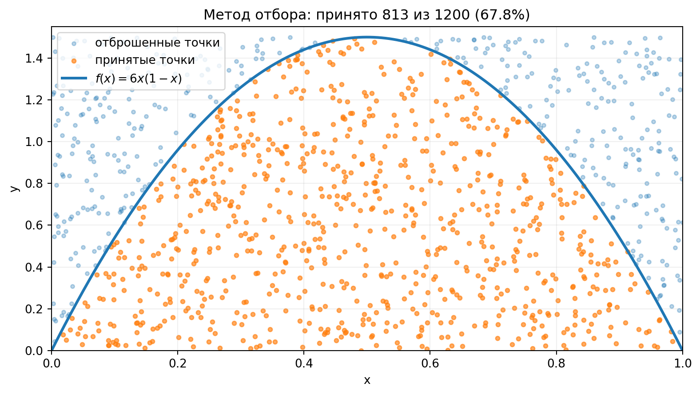
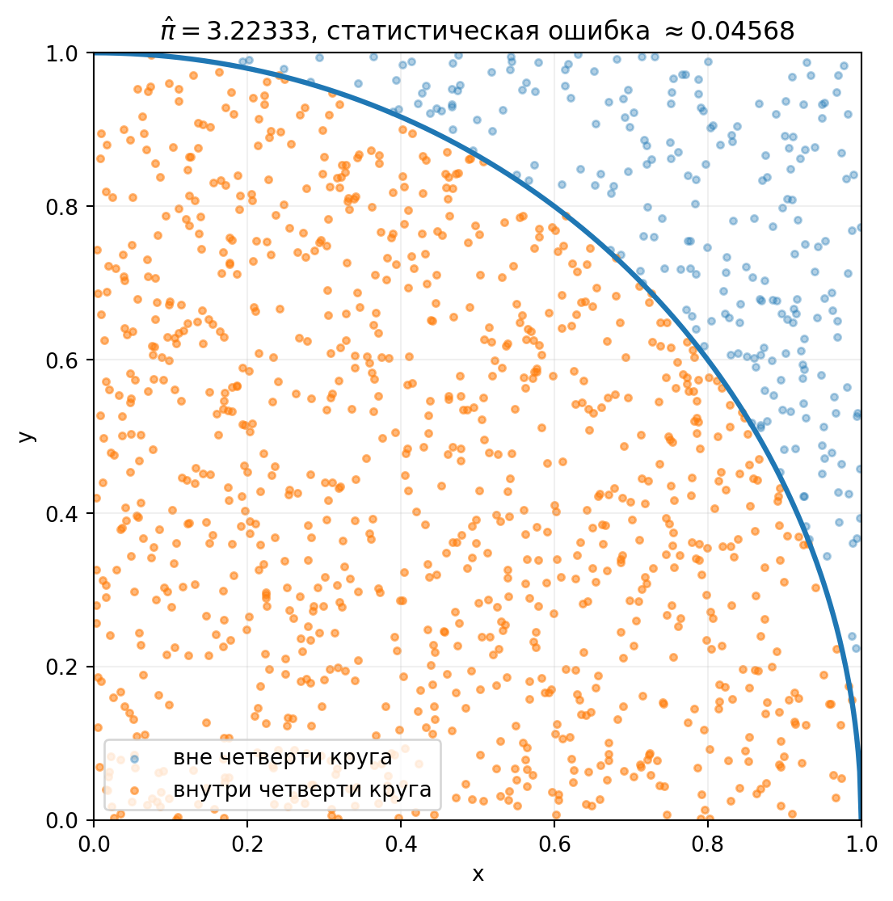
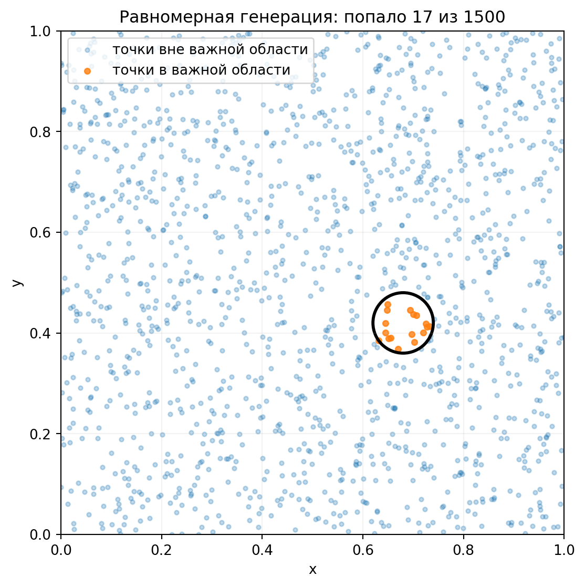
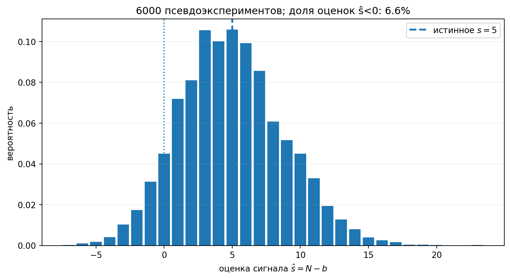
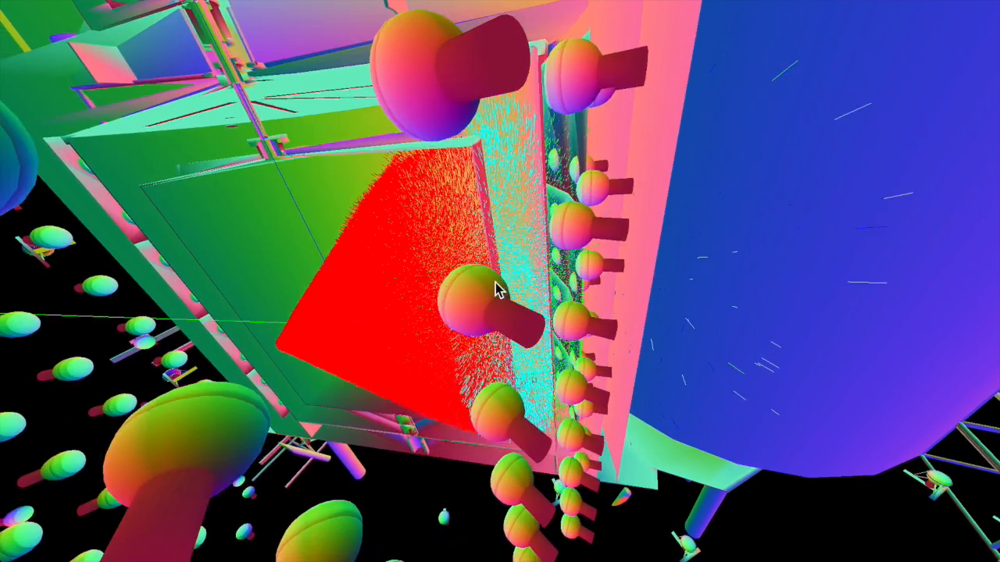
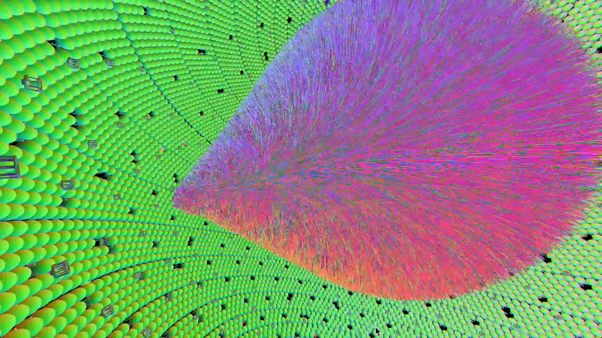

::: chapter-opening
Аннотация

Глава вводит случайное моделирование как численный инструмент. Метод Монте-Карло используется для интегрирования, распространения неопределённостей, моделирования отклика установки и построения псевдоэкспериментов.
:::

## Зачем нужен Монте-Карло

Для простых моделей аналитические выражения работают очень хорошо. В реальном эксперименте ситуация часто заметно сложнее: распределение результата может не иметь удобной замкнутой формы, измеряемые величины проходят через нелинейные преобразования, появляются пороги и отборы, а отклик установки становится многомерным. Численные интегралы также могут иметь высокую размерность, где прямое аналитическое или сеточное вычисление быстро становится непрактичным.

::: book-note
**Основная идея метода Монте-Карло:** сложное аналитическое вычисление заменяется статистикой большого числа искусственно сгенерированных реализаций модели.
:::

Пусть случайная величина $X$ распределена согласно плотности $f_X(x)$, а интересующая величина определяется как: $$Y=g(X).$$ Алгоритм состоит из трёх шагов:

- сгенерировать независимые значения: $$X_1,\ldots,X_N\sim f_X,$$

- для каждого вычислить: $$Y_k=g(X_k),$$

- а затем использовать выборку $Y_1,\ldots,Y_N$ для оценки распределения, среднего, дисперсии или вероятности события.

### Один принцип – несколько задач

Тот же подход возникает в разных задачах. Интеграл можно представить как математическое ожидание: $$\int h(x)f(x)\,dx=\mathbb E[h(X)].$$ Распространение неопределённостей можно выполнить, генерируя случайный вектор $\mathbf X$ и вычисляя: $$Y=g(\mathbf X).$$ Псевдоэксперимент, в свою очередь, повторяет полный эксперимент на компьютере и позволяет изучить распределение итогового результата.

### Что Монте-Карло не делает

::: book-note
Монте-Карло точно решает ту задачу, которую мы запрограммировали, но это не гарантирует, что мы запрограммировали именно ту задачу, которую хотели решить.

- неверная физическая или статистическая модель не становится правильной после симуляции;
- систематические неопределённости не исчезают автоматически;
- большая статистика моделирования не превращает малую реальную выборку в большую;
- конечная выборка Монте-Карло всегда имеет собственную статистическую неопределённость;
- численный расчёт не заменяет проверку аналитических предельных случаев.
:::

Если число симуляций стремится к бесконечности и модель задана корректно, оценки Монте-Карло стремятся к математическим ожиданиям. При конечном $N$ сохраняется статистическая ошибка самой симуляции. В сложных экспериментах детальное моделирование может быть настолько дорогим, что для него используются крупные вычислительные фермы и длительные запуски.

## Псевдослучайные числа

Компьютерные генераторы создают **псевдослучайные** последовательности. Они детерминированы алгоритмом и при достаточно длинной последовательности начинают повторяться, но хороший генератор имеет настолько большой период, что в практической работе это повторение недостижимо. Большинство генераторов непосредственно умеет выдавать равномерные числа: $$U\sim U(0,1).$$ Из такой последовательности можно строить выборки практически по любому требуемому закону.

::: book-note
Начальное состояние генератора – часть воспроизводимого анализа. Одинаковое начальное число приводит к той же псевдослучайной последовательности. Разные параллельные вычислительные процессы должны получать независимые последовательности, иначе формально большая выборка может состоять из многократно повторённых копий одного и того же набора событий.
:::

Если тысяча процессов запускается с одним и тем же начальным состоянием и каждый генерирует тысячу событий, итоговый файл может содержать миллион записей, но статистически вести себя примерно как одна тысяча уникальных событий. Для поиска ошибок начальные состояния также полезно сохранять: конкретную проблемную реализацию можно воспроизвести после исправления программы.

## Генерация через обратную функцию распределения

Пусть требуется получить случайную величину $X$ с плотностью $f_X(x)$. Её кумулятивная функция распределения равна: $$F_X(x)=\int_{-\infty}^{x}f_X(t)\,dt.$$ Она монотонно возрастает от $0$ до $1$. Если обратная функция $F_X^{-1}$ существует и её можно вычислить, достаточно взять равномерную величину $U\sim U(0,1)$ и определить: $$\boxed{X=F_X^{-1}(U).}$$

::: book-derivation
#### Почему работает обратная функция распределения

Рассмотрим вероятность $P(X\le x)$ и подставим $X=F_X^{-1}(U)$: $$P(X\le x)=P\!\left(F_X^{-1}(U)\le x\right).$$ Так как $F_X$ монотонно возрастает, к обеим частям неравенства можно применить $F_X$, не меняя его направление: $$P\!\left(F_X^{-1}(U)\le x\right)=P\!\left(U\le F_X(x)\right).$$ Для равномерной величины на $[0,1]$ вероятность $P(U\le u)$ равна самому $u$. Следовательно, $$P(X\le x)=F_X(x).$$ Мы получили именно требуемую функцию распределения: $$\boxed{X=F_X^{-1}(U),\qquad U\sim U(0,1).}\quad\blacksquare$$
:::

### Пример: экспоненциальное распределение

Для плотности $$f_X(x)=\lambda e^{-\lambda x},\qquad x\ge0,$$ кумулятивная функция равна: $$F_X(x)=\int_0^x\lambda e^{-\lambda t}\,dt=1-e^{-\lambda x}.$$ Чтобы найти обратную функцию, положим $u=1-e^{-\lambda x}$ и выразим $x$: $$e^{-\lambda x}=1-u,\qquad -\lambda x=\ln(1-u),$$ откуда $$\boxed{X=-\frac{1}{\lambda}\ln(1-U).}$$ Поскольку $1-U$ также равномерно распределена на $[0,1]$, можно пользоваться более короткой формой: $$\boxed{X=-\frac{1}{\lambda}\ln U.}$$

## Метод отбора

Обратная CDF удобна не всегда. Для сложной функции может быть трудно вычислить $F_X$, а ещё труднее – получить $F_X^{-1}$. В этом случае можно использовать **метод отбора**. Пусть требуемая плотность $f(x)$ ограничена сверху другой плотностью $g(x)$: $$f(x)\le M g(x),$$ и из $g(x)$ генерировать легко. Тогда:

1.  генерируем кандидата $X\sim g(x)$;
2.  генерируем $U\sim U(0,1)$;
3.  принимаем $X$, если $$U\le\frac{f(X)}{M g(X)};$$
4.  если условие не выполнено, повторяем попытку.

Если $f$ и $g$ нормированы, средняя доля принятых событий равна $1/M$. Метод универсален, но неудачный выбор ограничивающего распределения приводит к низкой эффективности: большая часть вычислений просто отбрасывается.

### Пример: распределение $6x(1-x)$

Рассмотрим $$f(x)=6x(1-x),\qquad 0\le x\le1.$$ Максимум этой функции достигается при $x=1/2$ и равен $1.5$. Можно равномерно генерировать точки в прямоугольнике $0\le x\le1$, $0\le y\le1.5$ и оставлять только точки, лежащие ниже кривой $y=f(x)$.

:::: {.content-visible when-format="html:js"}
::: clt-widget
```{ojs}
//| echo: false
viewof rejectN = Inputs.range([100, 6000], {value: 1200, step: 100, label: "N точек"})
viewof regenerateReject = Inputs.button("Новое МК")

rejectPoints = {
  regenerateReject;
  const values = [];
  for (let i = 0; i < rejectN; ++i) {
    const x = Math.random();
    const y = 1.5 * Math.random();
    values.push({x, y, accepted: y <= 6 * x * (1 - x)});
  }
  return values;
}

rejectCurve = Array.from({length: 301}, (_, i) => {
  const x = i / 300;
  return {x, y: 6 * x * (1 - x)};
})

acceptedReject = rejectPoints.filter(d => d.accepted)
rejectRate = acceptedReject.length / rejectPoints.length

rejectPlot = Plot.plot({
  width: 820,
  height: 430,
  marginLeft: 65,
  x: {label: "x", domain: [0, 1], grid: true},
  y: {label: "y", domain: [0, 1.55], grid: true},
  marks: [
    Plot.dot(rejectPoints.filter(d => !d.accepted), {x: "x", y: "y", r: 2.2, fill: "#777", fillOpacity: 0.35}),
    Plot.dot(acceptedReject, {x: "x", y: "y", r: 2.5, fill: "#4ea1ff", fillOpacity: 0.65}),
    Plot.line(rejectCurve, {x: "x", y: "y", stroke: "#ffb347", strokeWidth: 4})
  ]
})

html`
<div class="clt-panel">
  ${rejectPlot}
  <div class="clt-summary">
    <span> Принято: ${acceptedReject.length} из ${rejectPoints.length}; </span>
    <span> эффективность = ${(100 * rejectRate).toFixed(1)}; %</span>
    <span> теоретическая эффективность = 66.7%</span>
  </div>
</div>`
```
:::
::::

:::: {.content-visible when-format="pdf"}
::: figure-panel

:::
::::

Теоретическая эффективность здесь равна $1/1.5\approx66.7\%$. С ростом числа брошенных точек наблюдаемая доля принятых событий приближается к этому значению.

### Как выбирать способ генерации

| Метод | Преимущество | Ограничение |
|------------------------|------------------------|------------------------|
| Обратная функция распределения | каждое сгенерированное число используется | нужна вычислимая $F^{-1}$ |
| Метод отбора | простой и универсальный | может тратить много попыток впустую |
| Специальный алгоритм | может быть очень быстрым | требуется отдельная реализация |
| Марковские цепи | позволяют работать со сложными многомерными плотностями | выборки коррелированы, сходимость нужно диагностировать |

## Интегрирование методом Монте-Карло

Одно из важных применений – численное вычисление интегралов, особенно многомерных. Начнём с одномерного случая: $$I=\int_a^b h(x)\,dx.$$ Пусть $U\sim U(a,b)$. Тогда $$\mathbb E[h(U)]=\frac{1}{b-a}\int_a^b h(x)\,dx,$$ а значит, $$I=(b-a)\mathbb E[h(U)].$$ Заменяя математическое ожидание выборочным средним по независимым точкам $U_k$, получаем оценку: $$\boxed{\widehat I_N=\frac{b-a}{N}\sum_{k=1}^{N}h(U_k).}$$

### Статистическая ошибка интеграла

::: book-derivation
#### Вывод дисперсии оценки $\widehat I_N$

Пусть $$\operatorname{Var}[h(U)]=\sigma_h^2.$$ Оценка интеграла равна: $$\widehat I_N=\frac{b-a}{N}\sum_{k=1}^{N}h(U_k).$$ Для независимых точек дисперсии слагаемых складываются: $$\operatorname{Var}\!\left(\sum_{k=1}^{N}h(U_k)\right)=N\sigma_h^2.$$ Следовательно, $$\operatorname{Var}(\widehat I_N)=\frac{(b-a)^2}{N^2}N\sigma_h^2=\frac{(b-a)^2\sigma_h^2}{N}.$$ После извлечения квадратного корня: $$\boxed{\sigma_{\widehat I_N}=\frac{(b-a)\sigma_h}{\sqrt N}\propto\frac{1}{\sqrt N}.}\quad\blacksquare$$
:::

Сходимость $1/\sqrt N$ сравнительно медленная. Чтобы уменьшить статистическую ошибку в $10$ раз, требуется примерно в $100$ раз больше точек. При этом важное преимущество метода состоит в том, что этот закон почти не ухудшается при росте размерности интеграла.

## Пример: оценка числа $\pi$

Равномерно генерируем пары: $$(X,Y)\sim U([0,1]^2).$$ Точка лежит внутри четверти единичного круга, если $$X^2+Y^2\le1.$$ Площадь четверти круга равна $\pi/4$, значит вероятность попасть внутрь также равна $\pi/4$. Если $N_{\mathrm{in}}$ из $N$ точек оказались внутри, то $$\boxed{\widehat\pi=4\frac{N_{\mathrm{in}}}{N}.}$$

:::: {.content-visible when-format="html:js"}
::: clt-widget
```{ojs}
//| echo: false
viewof piN = Inputs.range([100, 12000], {value: 1200, step: 100, label: "число точек N"})
viewof regeneratePi = Inputs.button("Новая выборка")

piPoints = {
  regeneratePi;
  const values = [];
  for (let i = 0; i < piN; ++i) {
    const x = Math.random();
    const y = Math.random();
    values.push({x, y, inside: x * x + y * y <= 1});
  }
  return values;
}

piInside = piPoints.filter(d => d.inside)
piEstimate = 4 * piInside.length / piPoints.length
piSe = 4 * Math.sqrt((piInside.length / piPoints.length) * (1 - piInside.length / piPoints.length) / piPoints.length)
quarterCircle = Array.from({length: 301}, (_, i) => {
  const x = i / 300;
  return {x, y: Math.sqrt(1 - x * x)};
})

piPlot = Plot.plot({
  width: 620,
  height: 560,
  marginLeft: 55,
  x: {label: "x", domain: [0, 1], grid: true},
  y: {label: "y", domain: [0, 1], grid: true},
  marks: [
    Plot.dot(piPoints.filter(d => !d.inside), {x: "x", y: "y", r: 2, fill: "#ff6b6b", fillOpacity: 0.45}),
    Plot.dot(piInside, {x: "x", y: "y", r: 2, fill: "#4ea1ff", fillOpacity: 0.50}),
    Plot.line(quarterCircle, {x: "x", y: "y", stroke: "#ffb347", strokeWidth: 4})
  ]
})

html`
<div class="clt-panel">
  ${piPlot}
  <div class="clt-summary">
    <span>pi по Монте-Карло = ${piEstimate.toFixed(5)}; </span>
    <span> статистическая ошибка ≈ ${piSe.toFixed(5)}; </span>
    <span> отклонение от pi = ${(piEstimate - Math.PI).toFixed(5)}</span>
  </div>
</div>`
```
:::
::::

:::: {.content-visible when-format="pdf"}
::: figure-panel

:::
::::

При $N=1200$ типичная ошибка имеет порядок нескольких сотых. Если увеличить статистику примерно в десять раз, ошибка уменьшается приблизительно в $\sqrt{10}$ раз, что согласуется с законом $1/\sqrt N$.

## Почему высокая размерность меняет выбор метода

Для регулярной сетки с $m$ узлами по каждой координате в $d$ измерениях требуется $$\boxed{N_{\mathrm{grid}}=m^d}$$ вычислений функции. Даже очень грубая сетка быстро становится огромной. Например, $100$ точек по каждой из шести координат дают $100^6=10^{12}$ узлов.

::: {.content-visible when-format="html:js"}
```{ojs}
//| echo: false
function mcRange(label, domain, options) {
  const [min, max] = domain;
  const value = options.value;
  const step = options.step ?? 1;
  const control = html`<label class="mc-range-control">
    <span class="mc-range-label">${label}</span>
    <input class="mc-range-number" type="number" min=${min} max=${max} step=${step} value=${value}>
    <input class="mc-range-slider" type="range" min=${min} max=${max} step=${step} value=${value}>
  </label>`;
  const number = control.querySelector(".mc-range-number");
  const slider = control.querySelector(".mc-range-slider");
  control.value = Number(value);
  const sync = event => {
    const next = Number(event.target.value);
    control.value = next;
    number.value = next;
    slider.value = next;
    control.dispatchEvent(new CustomEvent("input", {bubbles: true}));
  };
  number.addEventListener("input", sync);
  slider.addEventListener("input", sync);
  return control;
}

viewof grid_m = mcRange("точек по каждой координате", [2, 12], {value: 5, step: 1})
viewof grid_d = mcRange("размерность", [1, 12], {value: 8, step: 1})

grid_points_text = {
  const N = Math.pow(grid_m, grid_d);
  return html`<div style="font-size:1.25em; line-height:1.5; text-align:center; padding:1rem">
    <b>Регулярная сетка:</b><br>
    ${grid_m} точек по каждой координате в ${grid_d}-мерном пространстве<br>
    <span style="font-size:1.7em">N = ${N.toLocaleString("ru-RU")}</span>
  </div>`
}
```
:::

::::: {.content-visible when-format="pdf"}
::: figure-panel

:::

::: figure-panel

:::
:::::

Для простого одномерного интеграла квадратура обычно эффективнее Монте-Карло. С ростом размерности число сеточных узлов растёт как $m^d$, тогда как статистическая ошибка Монте-Карло остаётся порядка $1/\sqrt N$ и почти не зависит от $d$. Именно в многомерных задачах преимущество случайной выборки становится особенно заметным.

## Выборка по важности

Равномерная генерация не знает, где находится основной вклад в интеграл. Если функция сосредоточена в небольшой области, большинство точек попадает туда, где вклад почти нулевой. Вместо равномерной выборки можно генерировать точки из другого распределения $q(x)$, которое чаще посещает важную область.

Пусть требуется вычислить: $$I=\int h(x)f(x)\,dx.$$ Если $X\sim q(x)$, то тот же интеграл можно переписать как: $$\boxed{I=\mathbb E_q\!\left[h(X)\frac{f(X)}{q(X)}\right].}$$ Каждое событие получает вес: $$\boxed{w_k=\frac{f(X_k)}{q(X_k)},}$$ а оценка принимает вид: $$\widehat I=\frac1N\sum_{k=1}^{N}w_kh(X_k).$$

::: book-note
Выборка по важности меняет место, где генерируются точки, а вес компенсирует это изменение. Хорошее распределение $q(x)$ даёт много точек в важных областях и сравнительно умеренные веса. Редкие очень большие веса увеличивают дисперсию оценки. Вес одного события не превращает его в большое число независимых событий.
:::

### Редкая область: равномерная генерация и выборка по важности

::::: {.content-visible when-format="html:js"}
::: mc-range-controls
```{ojs}
//| echo: false
viewof rare_N = mcRange("число точек", [200, 6000], {value: 1500, step: 100})
viewof rare_sigma = mcRange("ширина важной области", [0.02, 0.18], {value: 0.06, step: 0.005})
```
:::

```{ojs}
//| echo: false
function rng32(seed) {
  return function() {
    seed |= 0; seed = seed + 0x6D2B79F5 | 0;
    let t = Math.imul(seed ^ seed >>> 15, 1 | seed);
    t = t + Math.imul(t ^ t >>> 7, 61 | t) ^ t;
    return ((t ^ t >>> 14) >>> 0) / 4294967296;
  }
}

rare_canvas = {
  const width = 720, height = 410;
  const canvas = DOM.canvas(width, height);
  const ctx = canvas.getContext("2d");
  const rnd = rng32(20260618);
  const L = 320, x0 = 50, y0 = 48;
  const cx = x0 + 0.68 * L, cy = y0 + 0.42 * L, r = rare_sigma * L;
  ctx.clearRect(0, 0, width, height);
  ctx.strokeStyle = "#666"; ctx.lineWidth = 2; ctx.strokeRect(x0, y0, L, L);
  ctx.beginPath(); ctx.arc(cx, cy, r, 0, 2 * Math.PI); ctx.strokeStyle = "#2163ff"; ctx.stroke();
  let hit = 0;
  for (let i = 0; i < rare_N; ++i) {
    const x = rnd(), y = rnd();
    const px = x0 + x * L, py = y0 + y * L;
    const inside = (px-cx)**2 + (py-cy)**2 < r**2;
    if (inside) hit += 1;
    ctx.beginPath(); ctx.arc(px, py, inside ? 2.5 : 1.4, 0, 2*Math.PI);
    ctx.fillStyle = inside ? "#2163ff" : "rgba(100,100,100,0.28)"; ctx.fill();
  }
  ctx.fillStyle = "#222"; ctx.font = "20px system-ui";
  ctx.fillText(`равномерно: попало ${hit} из ${rare_N}`, 395, 180);
  return canvas;
}
```

::: mc-range-controls
```{ojs}
//| echo: false
viewof imp_N = mcRange("число точек", [200, 6000], {value: 1500, step: 100})
viewof imp_sigma = mcRange("ширина важной области", [0.02, 0.18], {value: 0.06, step: 0.005})
```
:::

```{ojs}
//| echo: false
importance_canvas = {
  const width = 720, height = 410;
  const canvas = DOM.canvas(width, height);
  const ctx = canvas.getContext("2d");
  const rnd = rng32(424242);
  function normal() {
    const u1 = Math.max(rnd(), 1e-12), u2 = rnd();
    return Math.sqrt(-2 * Math.log(u1)) * Math.cos(2 * Math.PI * u2);
  }
  const L = 320, x0 = 50, y0 = 48;
  const cx = x0 + 0.68 * L, cy = y0 + 0.42 * L, r = imp_sigma * L;
  ctx.clearRect(0, 0, width, height);
  ctx.strokeStyle = "#666"; ctx.lineWidth = 2; ctx.strokeRect(x0, y0, L, L);
  ctx.beginPath(); ctx.arc(cx, cy, r, 0, 2 * Math.PI); ctx.strokeStyle = "#2163ff"; ctx.stroke();
  let hit = 0;
  for (let i = 0; i < imp_N; ++i) {
    const x = 0.68 + imp_sigma * normal();
    const y = 0.42 + imp_sigma * normal();
    if (x < 0 || x > 1 || y < 0 || y > 1) continue;
    const px = x0 + x * L, py = y0 + y * L;
    const inside = (px-cx)**2 + (py-cy)**2 < r**2;
    if (inside) hit += 1;
    ctx.beginPath(); ctx.arc(px, py, inside ? 2.5 : 1.5, 0, 2*Math.PI);
    ctx.fillStyle = inside ? "#2163ff" : "rgba(100,100,100,0.28)"; ctx.fill();
  }
  ctx.fillStyle = "#222"; ctx.font = "20px system-ui";
  ctx.fillText(`по важности: в области ${hit} точек`, 395, 180);
  return canvas;
}
```
:::::

::::: {.content-visible when-format="pdf"}
::: figure-panel

:::

::: figure-panel

:::
:::::

::: figure-panel

:::

## VEGAS: адаптивная выборка по важности

Выборка по важности требует знать, где находится важная область. Алгоритм **VEGAS** решает эту задачу адаптивно. На первых итерациях он ещё не знает форму интегранда и делает пробную выборку. По полученным значениям он оценивает, где вклад велик, перестраивает разбиение координат и на следующих итерациях чаще генерирует точки в этих областях. Через несколько итераций выборка становится близкой к важностной.

::: figure-panel

:::

::: book-note
VEGAS не отменяет закон $1/\sqrt N$. Его преимущество заключается в уменьшении коэффициента перед этой зависимостью: после адаптации дисперсия интегранда становится меньше, и требуемая точность достигается меньшим числом вычислений.
:::

### Узкий пик в многомерном кубе

В качестве контролируемого примера рассмотрим произведение нормированных гауссовых плотностей в $d$ измерениях: $$f(\mathbf x)=\prod_{i=1}^{d}\frac{1}{\sqrt{2\pi}\sigma}\exp\!\left[-\frac{(x_i-\mu_i)^2}{2\sigma^2}\right],\qquad 0\le x_i\le1.$$ Если центры лежат внутри единичного гиперкуба, а $\sigma$ мала, почти весь интеграл сосредоточен в узкой области и его значение близко к единице. В демонстрационном примере точное значение равно: $$I_{\mathrm{exact}}=0.9978196359.$$

При простом равномерном Монте-Карло типичный запуск даёт:

|    $N$ | оценка простого Монте-Карло |
|-------:|----------------------------:|
| $10^4$ |              $0.946\pm0.48$ |
| $10^5$ |              $0.864\pm0.13$ |
| $10^6$ |             $1.001\pm0.061$ |

Даже миллион равномерно брошенных точек даёт здесь ошибку порядка нескольких процентов, потому что большая часть выборки проходит мимо узкого пика. Тензорная квадратура в малой размерности очень точна, но число узлов растёт как $m^d$. Для того же восьмимерного примера:

| узлов на координату $m$ | всего узлов $m^8$ | результат |
|------------------------:|------------------:|----------:|
|                       3 |             6 561 |     0.589 |
|                       5 |           390 625 |     0.722 |
|                       7 |         5 764 801 |     0.963 |

После адаптации VEGAS для показанного запуска получено: $$\widehat I_{\mathrm{VEGAS}}=0.99787\pm0.00053,$$ то есть существенно меньшая статистическая ошибка при меньшем числе вычислений, чем у наивного равномерного Монте-Карло.

### Где VEGAS требует проверки

VEGAS может не заметить очень узкий пик на первых итерациях. Несколько разнесённых пиков, диагональные структуры и сильные корреляции также делают адаптацию сложнее. Результат следует проверять независимыми запусками и смотреть, стабилизируется ли он при увеличении статистики и числа итераций.

## Псевдоэксперименты

**Псевдоэксперимент** — одна искусственная реализация полного измерения. Сначала генерируются физические события, затем моделируется отклик детектора, выполняются реконструкция и отбор и запускается тот же анализ, который применяется к реальным данным. Повторение всей процедуры много раз строит распределение возможных результатов эксперимента.

::: book-note
Псевдоэксперименты позволяют отвечать на вопрос: «что произошло бы, если бы один и тот же эксперимент можно было повторить много раз при заданной модели?» Реальный эксперимент даёт только одну точку из этого распределения.
:::

Такой ансамбль можно использовать для оценки смещения и дисперсии оценки параметра, проверки покрытия доверительного интервала, построения распределения статистики теста, оценки ожидаемой чувствительности, проверки устойчивости подгонки и исследования систематических неопределённостей. Все эти выводы условны относительно модели, по которой строится ансамбль.

### Счётный эксперимент

Пусть число событий распределено по Пуассону: $$N\sim\operatorname{Pois}(s+b),$$ где $s$ — ожидаемый сигнал, а $b$ — известный фон. Простейшая оценка сигнала равна: $$\boxed{\widehat s=N-b.}$$ Она несмещённая: $$\mathbb E[\widehat s]=\mathbb E[N]-b=(s+b)-b=s.$$ Но в отдельной реализации $N$ флуктуирует, и при достаточно малом наблюдаемом числе событий можно получить $\widehat s<0$. Это не означает отрицательное физическое число сигнальных событий; это означает, что статистическая процедура должна уметь корректно интерпретировать такие флуктуации.

::::: {.content-visible when-format="html:js"}
:::: {.clt-widget .toy-counting-widget}
::: {.mc-range-controls .toy-counting-controls}
```{ojs}
//| echo: false
viewof toySignal = mcRange("ожидаемый сигнал s", [0, 20], {value: 5, step: 0.5})
viewof toyBackground = mcRange("ожидаемый фон b", [0.5, 30], {value: 10, step: 0.5})
viewof toyN = mcRange("псевдоэксперименты", [500, 20000], {value: 6000, step: 500})
viewof regenerateToys = Inputs.button("Новый ансамбль")
```
:::

```{ojs}
//| echo: false
poissonToy = lambda => {
  const limit = Math.exp(-lambda);
  let p = 1;
  let k = 0;
  do {
    k += 1;
    p *= Math.random();
  } while (p > limit);
  return k - 1;
}

toyEstimates = {
  regenerateToys;
  return Array.from({length: toyN}, () => poissonToy(toySignal + toyBackground) - toyBackground);
}

toyBins = {
  const counts = new Map();
  for (const value of toyEstimates) counts.set(value, (counts.get(value) || 0) + 1);
  return Array.from(counts, ([value, count]) => ({
    value,
    x1: value - 0.45,
    x2: value + 0.45,
    probability: count / toyEstimates.length
  })).sort((a, b) => a.value - b.value);
}

toyMin = Math.floor(Math.min(...toyEstimates)) - 0.5
toyMax = Math.ceil(Math.max(...toyEstimates)) + 0.5
toyYMax = Math.max(0.12, 1.18 * Math.max(...toyBins.map(d => d.probability)))

toyPlot = Plot.plot({
  width: 900,
  height: 360,
  marginLeft: 72,
  x: {label: "оценка сигнала ŝ = N - b", domain: [toyMin, toyMax], grid: true},
  y: {label: "вероятность", domain: [0, toyYMax], grid: true},
  marks: [
    Plot.rectY(toyBins, {x1: "x1", x2: "x2", y: "probability", fill: "#4ea1ff", fillOpacity: 0.9}),
    Plot.ruleX([toySignal], {stroke: "#ffb347", strokeWidth: 4}),
    Plot.ruleX([0], {stroke: "#777", strokeDasharray: "4,4"})
  ]
})

html`
<div class="clt-panel toy-counting-panel">
  ${toyPlot}
  <div class="clt-summary">
    <span>Модель: s = ${toySignal.toFixed(1)}, b = ${toyBackground.toFixed(1)};</span>
    <span> реальный эксперимент даст одну точку из этого распределения</span>
  </div>
</div>`
```
::::
:::::

:::: {.content-visible when-format="pdf"}
::: figure-panel

:::
::::

Нельзя выбирать модель псевдоэкспериментов после просмотра результата так, чтобы получить желаемый вывод. Сначала фиксируется модель и её параметры, затем по ним строится распределение возможных результатов.

## Моделирование полного эксперимента

В физическом анализе Монте-Карло проходит через несколько уровней: генерацию физического процесса и кинематики, взаимодействие частиц с веществом, вторичные частицы и потери энергии, отклик сенсоров и электроники, реконструкцию объектов, триггеры и критерии отбора. Каждый уровень добавляет собственные приближения и систематические неопределённости.

:::: {.content-visible when-format="html"}
::: {.figure-panel .book-video-panel}


Моделирование оптических фотонов в детекторах Daya Bay и JUNO. Такая симуляция позволяет проследить распространение света и отклик большого числа фотоумножителей.
:::
::::

::::: {.content-visible when-format="pdf"}
::: figure-panel

:::

::: figure-panel

:::
:::::

Такие модели строятся не ради визуализации самой по себе. Их цель — численно определить эффективность реконструкции, отклик детектора и связанные с ними неопределённости, необходимые для статистического анализа.

## Эффективность отбора

Пусть сгенерировано $N_{\mathrm{gen}}$ событий и после отбора осталось $N_{\mathrm{sel}}$. Оценка эффективности равна: $$\boxed{\widehat\varepsilon=\frac{N_{\mathrm{sel}}}{N_{\mathrm{gen}}}.}$$ Если события независимы, число прошедших отбор описывается биномиальным распределением: $$N_{\mathrm{sel}}\sim\operatorname{Bin}(N_{\mathrm{gen}},\varepsilon).$$ Отсюда для обычной области параметров получается оценка стандартной ошибки: $$\boxed{\sigma_{\widehat\varepsilon}\approx\sqrt{\frac{\widehat\varepsilon(1-\widehat\varepsilon)}{N_{\mathrm{gen}}}}.}$$

### Что происходит на границах

Если все события прошли отбор, то $N_{\mathrm{sel}}=N_{\mathrm{gen}}$ и $\widehat\varepsilon=1$. Подстановка в формулу даёт: $$\sigma_{\widehat\varepsilon}=0.$$ Аналогично при $\widehat\varepsilon=0$ получается нулевая ошибка. Такой вывод нельзя интерпретировать как точное знание эффективности: следующий независимый запуск может дать один или несколько отказов.

::: book-note
Проблема возникает на физических границах $0\le\varepsilon\le1$. Вблизи границ симметричная запись «оценка $\pm$ стандартная ошибка» перестаёт адекватно описывать неопределённость. Для корректного вывода нужны интервальные методы, которые рассматриваются дальше в курсе.
:::

Точечная оценка $\widehat\varepsilon=N_{\mathrm{sel}}/N_{\mathrm{gen}}$ остаётся естественной, но неопределённость на границах нельзя понимать через наивную симметричную дисперсию.

## Как проверять расчёт Монте-Карло

Монте-Карло нельзя использовать как непрозрачный чёрный ящик. Чем сложнее программа, тем больше мест, где может появиться ошибка реализации. Полезно разделять всю цепочку на отдельные этапы и проверять каждый из них.

### Проверка генератора и реализации

- сравнивать простые случаи с аналитическими результатами;
- проверять средние, дисперсии, корреляции и нормировку;
- проверять предельные случаи параметров;
- сравнивать независимые реализации;
- сохранять начальные состояния генератора, чтобы воспроизводить ошибки;
- валидировать отдельные этапы моделирования.

### Проверка сходимости

Результат необходимо изучать как функцию числа симуляций $N$. Статистическая ошибка должна уменьшаться примерно как $1/\sqrt N$, а независимые запуски должны быть совместимы в пределах ожидаемых флуктуаций. Редкие области требуют значительно большей статистики. Для выборок с весами дополнительно важно следить, чтобы результат не определялся несколькими событиями с аномально большими весами.

### Смещение и дисперсия оценки

Если псевдоэксперименты используются для восстановления параметра $\theta$, полезно изучать оценку $\widehat\theta$ на ансамбле с известной истиной. Смещение определяется как: $$\boxed{\operatorname{bias}(\widehat\theta)=\mathbb E[\widehat\theta]-\theta,}$$ а дисперсия как: $$\boxed{\operatorname{Var}(\widehat\theta)=\mathbb E\!\left[(\widehat\theta-\mathbb E[\widehat\theta])^2\right].}$$ Не каждая оценка обязана быть несмещённой при конечной статистике, но её свойства должны быть известны и проверены.

::: book-note
Нужно различать два разных источника разброса:

- **физическую статистическую неопределённость** — разброс результатов одного реального эксперимента;
- **численную статистическую ошибку Монте-Карло** — неточность, с которой конечное число симуляций оценивает этот разброс.

Увеличение числа псевдоэкспериментов делает точнее численное описание распределения, но не уменьшает собственную статистическую ошибку одного реального измерения.
:::

## Воспроизводимый рабочий процесс

Практическая работа с Монте-Карло требует такой же дисциплины, как аналитический расчёт. Нужно явно записать вероятностную модель, сохранять конфигурацию и версии программ, фиксировать начальное состояние генератора или правило формирования независимых состояний, проверять реализацию на задачах с известным ответом, оценивать численную ошибку и устойчивость к увеличению статистики. Веса, отборы и систематические вариации следует хранить в конфигурации, а не прятать в коде в виде необъяснённых чисел.

## Когда простой Монте-Карло становится неэффективным

Для простого аналитического результата случайное моделирование может только скрыть понимание. Для крайне редких событий равномерная генерация тратит почти всю статистику впустую, и требуется выборка по важности или другой специализированный алгоритм. Для сложных апостериорных распределений существуют методы Монте-Карло по марковским цепям и другие специальные методы. Обратные задачи с численно полученными матрицами могут требовать регуляризации. Если полное детекторное моделирование слишком дорого, используются быстрые или суррогатные модели.

Все эти усложнения не отменяют метод Монте-Карло. Они показывают, что в реальной задаче необходимо выбирать способ моделирования так, чтобы вычислительные ресурсы расходовались на физически важные области.

::: chapter-summary
## Итоги главы

- Монте-Карло строит численный ансамбль возможных реализаций заданной модели.
- Равномерные псевдослучайные числа можно преобразовывать в требуемые распределения через обратную CDF, метод отбора и специальные алгоритмы.
- Интеграл можно представить как математическое ожидание и оценивать статистически.
- Стандартная ошибка обычного Монте-Карло уменьшается как $1/\sqrt N$.
- В высокой размерности Монте-Карло избегает экспоненциального роста числа узлов регулярной сетки.
- Выборка по важности и VEGAS уменьшают дисперсию, направляя точки в области большого вклада.
- Псевдоэксперименты строят распределение возможных результатов полного эксперимента и позволяют проверять свойства статистической процедуры.
- Конечная статистика моделирования и систематические неопределённости самой модели должны учитываться отдельно.
- Результату Монте-Карло можно доверять только после проверок сходимости, воспроизводимости и согласия с контрольными расчётами.
:::

## Задачи

