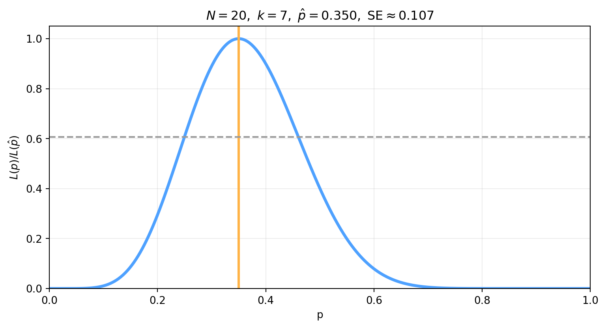
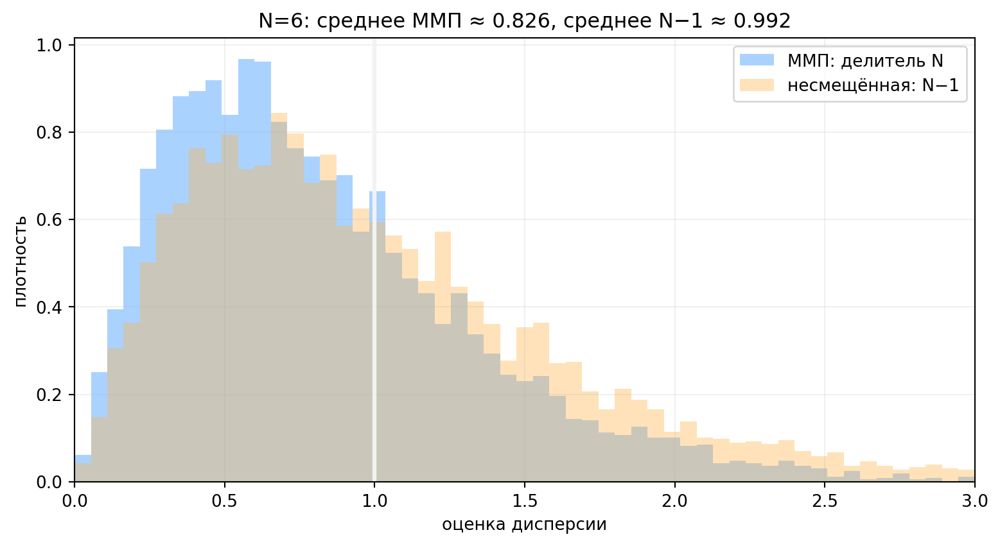
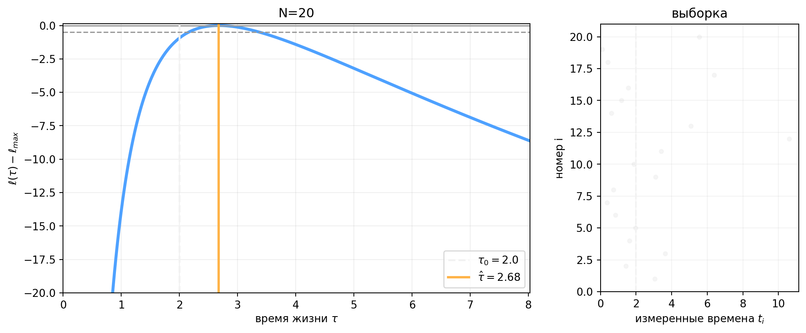
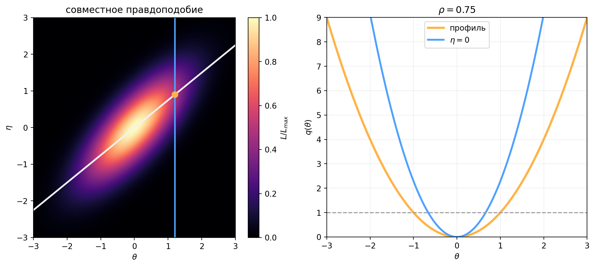
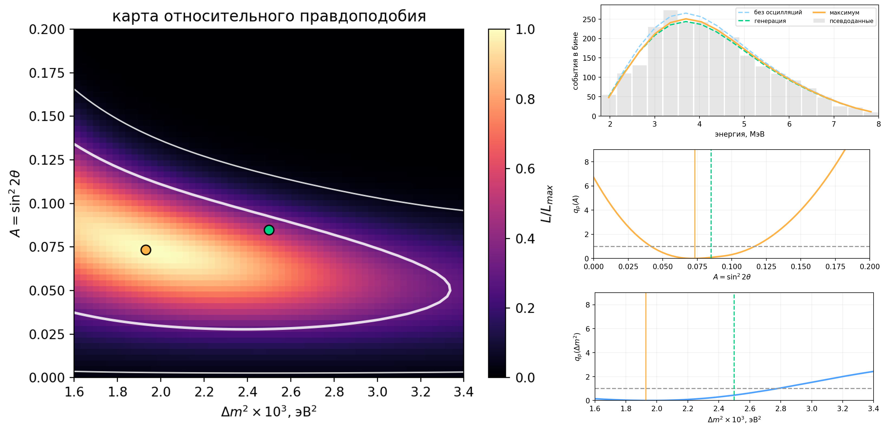

::: chapter-opening
[Аннотация]{.chapter-opening-label}

Глава переводит задачу статистического анализа от распределений наблюдаемых данных к оцениванию неизвестных параметров модели. Вводятся функция правдоподобия и метод максимального правдоподобия, обсуждаются смещение, дисперсия, средний квадрат ошибки, состоятельность и эффективность оценок. Затем форма правдоподобия связывается с локальной точностью оценки, вводятся относительное и профильное правдоподобия, а работа с несколькими параметрами разбирается на примере реакторных нейтрино.
:::

## От данных к параметрам

Вероятностная модель связывает наблюдаемую случайную величину $X$ с некоторым неизвестным параметром или набором параметров: $$X\sim f(x\mid\boldsymbol\theta).$$ В частотном подходе параметр $\boldsymbol\theta$ считается **фиксированным, но неизвестным**. До проведения эксперимента случайны данные $X$. После измерения появляется конкретное наблюдаемое значение $x_{\mathrm{obs}}$, и по нему требуется получить оценку неизвестного параметра. Такими параметрами могут быть среднее или ширина распределения, интенсивность сигнала, сечение процесса, эффективность регистрации и другие характеристики модели.

### Оценка и оценённое значение

::: book-note
**Оценка** — это правило, которое применяется к случайным данным: $$\widehat\theta=T(X_1,\ldots,X_N).$$ **Оценённое значение** — результат применения того же правила к конкретной реализованной выборке: $$\widehat\theta_{\mathrm{obs}}=T(x_1,\ldots,x_N).$$ До эксперимента $\widehat\theta$ является случайной величиной. После эксперимента $\widehat\theta_{\mathrm{obs}}$ — уже конкретное число или вектор чисел.
:::

Это различие принципиально. До того как данные получены, одна и та же процедура оценки при повторении эксперимента будет возвращать разные значения. Именно по распределению этих возможных значений можно обсуждать смещение, дисперсию и другие свойства процедуры.

### Один параметр можно оценивать по-разному

Пусть имеется выборка из гауссова распределения $$X_1,\ldots,X_N\sim\mathrm N(\mu,\sigma^2),$$ и требуется оценить неизвестное среднее $\mu$. Само условие задачи ещё не диктует единственное правило. Например, можно взять выборочное среднее: $$\widehat\mu_1=\frac1N\sum_{i=1}^{N}X_i,$$ можно взять медиану выборки: $$\widehat\mu_2=\operatorname{median}(X_1,\ldots,X_N),$$ а можно использовать только два значения: $$\widehat\mu_3=\frac{X_1+X_N}{2}.$$ Все три выражения формально являются оценками одного и того же параметра. Они используют одни и те же исходные данные, но обладают разными смещениями, дисперсиями и устойчивостью к выбросам. В итоге, правило оценивания нужно не просто придумать, а исследовать его статистические свойства.

### Точечная и интервальная оценка

Точечная оценка сообщает одно предпочтительное значение параметра: $$\widehat\theta_{\mathrm{obs}}.$$ Интервальная оценка сообщает набор значений, совместимых с данными по выбранной статистической процедуре: $$[\theta_{\mathrm{low}},\theta_{\mathrm{high}}].$$ В этой главе основной акцент сделан на точечных оценках и форме функции правдоподобия. Строгое построение интервалов рассматривается дальше в курсе.

## Функция правдоподобия

Плотность или вероятность $$f(x\mid\theta)$$ при известном параметре $\theta$ отвечает на обычный вероятностный вопрос: насколько вероятны различные данные $x$? После проведения эксперимента ситуация меняется. Наблюдаемое значение $x_{\mathrm{obs}}$ уже фиксировано, а неизвестным остаётся параметр. Ту же математическую функцию теперь удобно рассматривать как функцию $\theta$: $$\boxed{L(\theta;x_{\mathrm{obs}})=f(x_{\mathrm{obs}}\mid\theta).}$$ Эта функция называется **функцией правдоподобия**.

::: book-note
Правдоподобие отвечает на вопрос: **какие значения параметра лучше объясняют уже наблюдённые данные?** \newline При этом $L(\theta;x)$ не является плотностью вероятности параметра $\theta$.
:::

### Правдоподобие не является вероятностью параметра

В частотном подходе параметр не объявляется случайной величиной. В итоге интеграл правдоподобия по параметру вовсе не обязан быть равен единице: $$\int L(\theta;x)\,d\theta\ne1.$$ Умножение $L(\theta)$ на произвольную положительную константу, не зависящую от $\theta$, также не меняет статистических выводов о положении максимума.

::: book-note
Вероятность описывает возможные **данные** при заданном параметре. Правдоподобие сравнивает возможные **параметры** при одних и тех же уже наблюдённых данных.
:::

### Независимая выборка

Пусть наблюдения независимы и для каждого выполняется: $$X_i\sim f(x_i\mid\theta).$$ Совместная вероятность независимых наблюдений получается перемножением отдельных вероятностей. Следовательно, функция правдоподобия всей выборки равна: $$\boxed{L(\theta)=\prod_{i=1}^{N}f(x_i\mid\theta).}$$ Работать с произведением большого числа множителей неудобно. Введём логарифм правдоподобия: $$\boxed{\ell(\theta)=\ln L(\theta)=\sum_{i=1}^{N}\ln f(x_i\mid\theta).}$$ Логарифм превращает произведение в сумму. Он также делает численные вычисления устойчивее, потому что произведение множества малых вероятностей быстро становится чрезвычайно малым числом.

::: book-note
Максимумы $L(\theta)$ и $\ell(\theta)$ находятся в одной и той же точке. Независимые наборы данных просто складывают свои логарифмы правдоподобия: $$\ell_{\mathrm{total}}=\ell_1+\ell_2+\cdots.$$
:::

## Метод максимального правдоподобия

Оценка максимального правдоподобия выбирает такое значение параметра, при котором наблюдённые данные имеют наибольшее правдоподобие: $$\boxed{\widehat\theta_{\mathrm{ММП}}=\underset{\theta}{\operatorname{arg\,max}}\,L(\theta)=\underset{\theta}{\operatorname{arg\,max}}\,\ell(\theta).}$$ Если максимум находится внутри допустимой области и функция гладкая, то для одного параметра он удовлетворяет условиям: $$\left.\frac{\partial\ell}{\partial\theta}\right|_{\theta=\widehat\theta}=0,$$ $$\left.\frac{\partial^2\ell}{\partial\theta^2}\right|_{\theta=\widehat\theta}<0.$$ Для многомерной задачи идея остаётся той же: требуется найти набор параметров, максимизирующий совместное правдоподобие.

## Пример: вероятность успеха в биномиальном распределении

Пусть в $N$ независимых испытаниях наблюдается $k$ успехов: $$K\sim\operatorname{Bin}(N,p).$$ Вероятность такого результата равна: $$P(K=k\mid p)=\binom Nk p^k(1-p)^{N-k}.$$ После того как $N$ и $k$ наблюдены, эта же функция становится функцией неизвестного параметра $p$. Комбинаторный множитель $\binom Nk$ от $p$ не зависит, а значит, положение максимума не меняет: $$L(p)\propto p^k(1-p)^{N-k}.$$

::: book-derivation
#### Оценка $p$ методом максимального правдоподобия

Логарифм правдоподобия с точностью до константы равен: $$\ell(p)=k\ln p+(N-k)\ln(1-p)+\mathrm{const}.$$ Дифференцируем по $p$: $$\frac{d\ell}{dp}=\frac{k}{p}-\frac{N-k}{1-p}.$$ Условие максимума даёт: $$\frac{k}{p}-\frac{N-k}{1-p}=0.$$ Переносим второе слагаемое и умножаем на $p(1-p)$: $$k(1-p)=p(N-k).$$ Раскрывая скобки, имеем: $$k-kp=Np-kp,$$ откуда $$k=Np.$$ Следовательно, $$\boxed{\widehat p_{\mathrm{ММП}}=\frac{k}{N}.}\quad\blacksquare$$
:::

Полученный ответ совпадает с естественной частотой успехов. Но одного правдоподобного результата недостаточно: нужно проверить свойства оценки как случайной величины.

::: book-derivation
#### Несмещённость оценки $\widehat p=k/N$

До проведения эксперимента число успехов — случайная величина $K$, поэтому $$\widehat p=\frac{K}{N}.$$ Для биномиального распределения: $$\mathbb E[K]=Np.$$ Следовательно, $$\mathbb E[\widehat p]=\frac{\mathbb E[K]}{N}=\frac{Np}{N}=p.$$ В этом конкретном случае оценка максимального правдоподобия несмещена: $$\boxed{\mathbb E[\widehat p]=p.}\quad\blacksquare$$
:::

При увеличении $N$ максимум правдоподобия становится уже. При $k=0$ или $k=N$ максимум оказывается непосредственно на физической границе $p=0$ или $p=1$.

:::: {.content-visible when-format="html:js"}
::: clt-widget
```{ojs}
//| echo: false

viewof likeN = Inputs.range([1, 200], {value: 20, step: 1, label: "N"})
viewof likeK = Inputs.range([0, likeN], {value: Math.round(0.35 * likeN), step: 1, label: "k"})

likePGrid = Array.from({length: 499}, (_, i) => 0.002 + 0.996 * i / 498)
likePhat = likeK / likeN
likeLog = p => likeK * Math.log(p) + (likeN - likeK) * Math.log(1 - p)
likeLogMax = likeK === 0
  ? 0
  : likeK === likeN
    ? 0
    : likeLog(likePhat)
likeCurve = likePGrid.map(p => ({
  p,
  relative: Math.exp(likeLog(p) - likeLogMax),
  q: -2 * (likeLog(p) - likeLogMax)
}))

likePlot = Plot.plot({
  width: 940,
  height: 430,
  marginLeft: 70,
  x: {label: "p", domain: [0, 1], grid: true},
  y: {label: "L(p) / L(p̂)", domain: [0, 1.05], grid: true},
  marks: [
    Plot.line(likeCurve, {x: "p", y: "relative", stroke: "#4ea1ff", strokeWidth: 4}),
    Plot.ruleX([likePhat], {stroke: "#ffb347", strokeWidth: 4}),
    Plot.ruleY([Math.exp(-0.5)], {stroke: "#999", strokeDasharray: "6,5"})
  ]
})

html`
<div class="clt-panel">
  ${likePlot}
  <div class="clt-summary">
    <span>N — число испытаний, k — число успехов</span>
    <span>p̂ = k/N = ${likePhat.toFixed(3)}</span>
    <span>стандартная ошибка ≈ ${Math.sqrt(likePhat * (1 - likePhat) / likeN).toFixed(3)}</span>
    <span>увеличение N сужает максимум</span>
  </div>
</div>
`
```
:::
::::

::::: {.content-visible when-format="pdf"}
::: figure-panel

:::

::: figure-panel

:::
:::::

## Пример: пуассоновский счёт

Пусть наблюдаемое число событий распределено по закону Пуассона: $$N\sim\operatorname{Pois}(\mu).$$ После наблюдения $n$ событий функция правдоподобия для неизвестного среднего $\mu$ имеет вид: $$L(\mu)=\frac{\mu^n e^{-\mu}}{n!}.$$

::: book-derivation
#### Оценка среднего пуассоновского счёта

Логарифм правдоподобия равен: $$\ell(\mu)=n\ln\mu-\mu-\ln n!.$$ Дифференцируем по $\mu$: $$\frac{d\ell}{d\mu}=\frac{n}{\mu}-1.$$ В точке максимума: $$\frac{n}{\mu}-1=0,$$ следовательно, $$\boxed{\widehat\mu_{\mathrm{ММП}}=n.}$$ До эксперимента $n$ заменяется случайной величиной $N$. Для распределения Пуассона $\mathbb E[N]=\mu$, значит $$\mathbb E[\widehat\mu_{\mathrm{ММП}}]=\mathbb E[N]=\mu.$$ В пуассоновском счёте эта оценка также несмещена: $$\boxed{\mathbb E[\widehat\mu_{\mathrm{ММП}}]=\mu.}\quad\blacksquare$$
:::

## Пример: среднее гауссова распределения

Пусть независимые наблюдения описываются гауссовым распределением: $$X_i\sim\mathrm N(\mu,\sigma^2),$$ причём $\sigma$ известна, а $\mu$ требуется оценить. Для $N$ наблюдений логарифм правдоподобия с точностью до несущественной константы имеет вид: $$\ell(\mu)=-\frac{1}{2\sigma^2}\sum_{i=1}^{N}(x_i-\mu)^2+\mathrm{const}.$$ Максимизация этой функции эквивалентна минимизации суммы квадратов отклонений.

::: book-derivation
#### Оценка гауссова среднего

Дифференцируем логарифм правдоподобия: $$\frac{\partial\ell}{\partial\mu}=\frac{1}{\sigma^2}\sum_{i=1}^{N}(x_i-\mu).$$ Приравниваем производную нулю: $$\sum_{i=1}^{N}(x_i-\mu)=0.$$ Раскрываем сумму: $$\sum_{i=1}^{N}x_i-N\mu=0.$$ Отсюда получаем: $$\boxed{\widehat\mu_{\mathrm{ММП}}=\frac1N\sum_{i=1}^{N}x_i=\langle x\rangle.}\quad\blacksquare$$
:::

Таким образом, для гауссова распределения с известной шириной метод максимального правдоподобия выбирает именно выборочное среднее, а не медиану и не оценку по двум отдельным точкам.

## Неизвестны и среднее, и дисперсия

Теперь неизвестны два параметра: $\mu$ и $\sigma^2$. Для краткости обозначим: $$v=\sigma^2.$$ Логарифм правдоподобия равен: $$\ell(\mu,v)=-\frac{N}{2}\ln v-\frac{1}{2v}\sum_{i=1}^{N}(x_i-\mu)^2+\mathrm{const}.$$ Обратите внимание: нормировочный множитель гауссова распределения больше нельзя отбросить целиком. Член $-\frac{N}{2}\ln v$ зависит от оцениваемого параметра $v$ и влияет на положение максимума.

::: book-derivation
#### Совместная оценка $\mu$ и $\sigma^2$

Условие максимума по $\mu$ даёт тот же результат, что и раньше: $$\frac{\partial\ell}{\partial\mu}=0\quad\Longrightarrow\quad\widehat\mu=\langle x\rangle.$$ Теперь дифференцируем по $v$: $$\frac{\partial\ell}{\partial v}=-\frac{N}{2v}+\frac{1}{2v^2}\sum_{i=1}^{N}(x_i-\mu)^2.$$ В точке совместного максимума подставляем $\mu=\widehat\mu=\langle x\rangle$ и приравниваем производную нулю: $$-\frac{N}{2v}+\frac{1}{2v^2}\sum_{i=1}^{N}(x_i-\langle x\rangle)^2=0.$$ Умножая на $2v^2$, получаем: $$-Nv+\sum_{i=1}^{N}(x_i-\langle x\rangle)^2=0.$$ Следовательно, $$\boxed{\widehat\mu_{\mathrm{ММП}}=\langle x\rangle,\qquad\widehat{\sigma^2}_{\mathrm{ММП}}=\frac1N\sum_{i=1}^{N}(x_i-\langle x\rangle)^2.}\quad\blacksquare$$
:::

Для среднего всё выглядит хорошо: $$\mathbb E[\widehat\mu_{\mathrm{ММП}}]=\mu.$$ Но для дисперсии возникает уже знакомая поправка: $$\mathbb E[\widehat{\sigma^2}_{\mathrm{ММП}}]=\frac{N-1}{N}\sigma^2.$$ В итоге оценка максимального правдоподобия для дисперсии смещена вниз при конечном $N$. Несмещённая оценка имеет делитель $N-1$: $$s^2=\frac1{N-1}\sum_{i=1}^{N}(x_i-\langle x\rangle)^2.$$

::: book-note
Метод максимального правдоподобия **не обязан** давать несмещённую оценку. Несмещённость – отдельное статистическое свойство процедуры, которое нужно проверять, а не предполагать из самого определения ММП.
:::

Смещение $\widehat{\sigma^2}_{\mathrm{ММП}}$ исчезает при $N\to\infty$, потому что $(N-1)/N\to1$. Для больших выборок различие между делителями $N$ и $N-1$ становится малым, но для небольшой статистики оно может быть заметным.

## Свойства оценок

### Смещение, дисперсия и средний квадрат ошибки

Смещение оценки определяется как: $$\operatorname{bias}(\widehat\theta)=\mathbb E[\widehat\theta]-\theta.$$ Если смещение равно нулю, оценка называется несмещённой. Но несмещённость сама по себе не гарантирует малую статистическую ошибку: распределение оценки может быть очень широким.

Средний квадрат ошибки определим как: $$\operatorname{MSE}(\widehat\theta)=\mathbb E[(\widehat\theta-\theta)^2].$$ Он одновременно учитывает разброс оценки и систематическое смещение её среднего.

::: book-derivation
#### Разложение среднего квадрата ошибки

Добавим и вычтем $\mathbb E[\widehat\theta]$: $$\widehat\theta-\theta=(\widehat\theta-\mathbb E[\widehat\theta])+(\mathbb E[\widehat\theta]-\theta).$$ Возводим в квадрат и усредняем: $$\mathbb E[(\widehat\theta-\theta)^2]=\mathbb E[(\widehat\theta-\mathbb E[\widehat\theta])^2]+2(\mathbb E[\widehat\theta]-\theta)\mathbb E[\widehat\theta-\mathbb E[\widehat\theta]]+(\mathbb E[\widehat\theta]-\theta)^2.$$ Среднее второго множителя в смешанном члене равно нулю: $$\mathbb E[\widehat\theta-\mathbb E[\widehat\theta]]=0.$$ Первое слагаемое – дисперсия оценки, последнее –- квадрат смещения. Следовательно, $$\boxed{\operatorname{MSE}(\widehat\theta)=\operatorname{Var}(\widehat\theta)+\operatorname{bias}^2(\widehat\theta).}\quad\blacksquare$$
:::

::: book-note
Оценку нельзя выбирать только по одному свойству. Небольшое смещение иногда сопровождается меньшей дисперсией и меньшим средним квадратом ошибки. И наоборот, формально несмещённая оценка может быть практически неудобной, если её разброс слишком велик.
:::

Пример с оценкой дисперсии показывает эту ситуацию непосредственно. ММП использует делитель $N$ и имеет небольшое отрицательное смещение, а вариант с делителем $N-1$ устраняет это смещение. При росте $N$ обе процедуры быстро сближаются.

:::: {.content-visible when-format="html:js"}
::: clt-widget
```{ojs}
//| echo: false

viewof varianceN = Inputs.range([2, 50], {value: 6, step: 1, label: "N"})
viewof regenerateVariance = Inputs.button("Новый ансамбль")

randnVariance = () => {
  const u1 = Math.max(Math.random(), 1e-12);
  const u2 = Math.random();
  return Math.sqrt(-2 * Math.log(u1)) * Math.cos(2 * Math.PI * u2);
}

varianceToys = {
  regenerateVariance;
  const toys = [];
  for (let t = 0; t < 6000; ++t) {
    const sample = Array.from({length: varianceN}, randnVariance);
    const mean = sample.reduce((a, b) => a + b, 0) / varianceN;
    const sumsq = sample.reduce((s, x) => s + (x - mean) ** 2, 0);
    toys.push({ml: sumsq / varianceN, unbiased: sumsq / (varianceN - 1)});
  }
  return toys;
}

varianceMeanMl = varianceToys.reduce((s, d) => s + d.ml, 0) / varianceToys.length
varianceMeanUnb = varianceToys.reduce((s, d) => s + d.unbiased, 0) / varianceToys.length
varianceMseMl = varianceToys.reduce((s, d) => s + (d.ml - 1) ** 2, 0) / varianceToys.length
varianceMseUnb = varianceToys.reduce((s, d) => s + (d.unbiased - 1) ** 2, 0) / varianceToys.length
varianceLong = varianceToys.flatMap(d => [
  {value: d.ml, estimator: "ММП: делитель N"},
  {value: d.unbiased, estimator: "несмещённая: N - 1"}
])
varianceHistogram = (rows, estimator) => {
  const xMin = 0, xMax = 3, bins = 55;
  const width = (xMax - xMin) / bins;
  const values = rows.filter(d => d.estimator === estimator).map(d => d.value);
  const counts = Array.from({length: bins}, () => 0);
  for (const x of values) {
    if (xMin <= x && x < xMax) {
      counts[Math.min(bins - 1, Math.floor((x - xMin) / width))] += 1;
    }
  }
  return counts.map((count, i) => ({
    x0: xMin + i * width,
    x1: xMin + (i + 1) * width,
    density: count / (values.length * width),
    estimator
  }));
}
varianceHist = [
  ...varianceHistogram(varianceLong, "ММП: делитель N"),
  ...varianceHistogram(varianceLong, "несмещённая: N - 1")
]
varianceHistMl = varianceHist.filter(d => d.estimator === "ММП: делитель N")
varianceHistUnb = varianceHist.filter(d => d.estimator === "несмещённая: N - 1")

variancePlot = Plot.plot({
  width: 940,
  height: 360,
  marginLeft: 90,
  x: {label: "оценка дисперсии", domain: [0, 3], grid: true},
  y: {label: "плотность распределения оценки", grid: true},
  color: {domain: ["ММП: делитель N", "несмещённая: N - 1"], range: ["#4ea1ff", "#ffb347"], legend: true},
  marks: [
    Plot.rectY(varianceHistMl, {x1: "x0", x2: "x1", y1: 0, y2: "density", fill: "#4ea1ff", fillOpacity: 0.48}),
    Plot.rectY(varianceHistUnb, {x1: "x0", x2: "x1", y1: 0, y2: "density", fill: "#ffb347", fillOpacity: 0.38}),
    Plot.ruleX([1], {stroke: "#f2f2f2", strokeWidth: 3})
  ]
})

html`
<div class="clt-panel">
  ${variancePlot}
  <div class="clt-summary" style="margin-top:0.35rem;">
    <span>N — размер выборки; </span>
    <span> ось y — плотность: площадь каждой гистограммы равна 1; </span>
    <span> среднее оценки ММП ≈ ${varianceMeanMl.toFixed(3)}; </span>
    <span> среднее несмещённой оценки ≈ ${varianceMeanUnb.toFixed(3)};</span>
    <span> средний квадрат ошибки: ММП ≈ ${varianceMseMl.toFixed(3)}, N−1 ≈ ${varianceMseUnb.toFixed(3)}.</span>
    <span> При большом N оценки почти совпадают.</span>
  </div>
</div>
`
```
:::
::::

:::: {.content-visible when-format="pdf"}
::: figure-panel

:::
::::

### Состоятельность

Оценка называется **состоятельной**, если при увеличении выборки она сходится по вероятности к истинному параметру: $$\boxed{\widehat\theta_N\xrightarrow[N\to\infty]{P}\theta.}$$ Смещение при этом должно исчезать или становиться пренебрежимо малым, а дисперсия должна стремиться к нулю. Состоятельность — асимптотическое свойство. Конечная выборка всё ещё может давать смещённую и достаточно широкую оценку.

### Сравнение трёх оценок гауссова среднего

Вернёмся к трём правилам, сформулированным в начале главы: $$\widehat\mu_1=\langle X\rangle,\qquad\widehat\mu_2=\operatorname{median}(X_1,\ldots,X_N),\qquad\widehat\mu_3=\frac{X_1+X_N}{2}.$$ Для гауссова распределения их дисперсии имеют вид: $$\operatorname{Var}(\widehat\mu_1)=\frac{\sigma^2}{N},$$ $$\operatorname{Var}(\widehat\mu_2)\approx\frac{\pi}{2}\frac{\sigma^2}{N},$$ $$\operatorname{Var}(\widehat\mu_3)=\frac{\sigma^2}{2}.$$ Выборочное среднее использует все наблюдения наиболее эффективно в чистой гауссовой модели. Медиана имеет примерно в $\pi/2$ раза большую дисперсию, но лучше переносит выбросы. Третья оценка использует только две точки, поэтому её дисперсия вообще не уменьшается с ростом $N$.

::: book-note
«Оптимальная» оценка всегда оптимальна относительно конкретного критерия и конкретной задачи. Можно улучшать устойчивость к выбросам, чистоту отобранной выборки или статистическую точность, но улучшение одного свойства может ухудшать другое.
:::

## Информация Фишера и граница Крамера–Рао

Для исследования предельной точности введём **скор-функцию:** $$U(\theta)=\frac{\partial\ell(\theta)}{\partial\theta}.$$ Логарифм правдоподобия зависит от случайных данных, следовательно, $U(\theta)$ также является случайной величиной. Информация Фишера определяется как: $$\boxed{I(\theta)=\mathbb E[U^2(\theta)]=-\mathbb E\!\left[\frac{\partial^2\ell}{\partial\theta^2}\right].}$$ При выполнении условий регулярности для несмещённой оценки действует граница Крамера–Рао: $$\boxed{\operatorname{Var}(\widehat\theta)\ge\frac{1}{I(\theta)}.}$$ Это теоретическая нижняя граница дисперсии. Она сама по себе не утверждает, что любая оценка ММП несмещена или обязательно достигает этой границы.

::: book-derivation
#### Связь двух форм информации Фишера

Для одного наблюдения обозначим: $$s_\theta(x)=\frac{\partial}{\partial\theta}\ln f(x\mid\theta).$$ Плотность нормирована: $$\int f(x\mid\theta)\,dx=1.$$ Дифференцируем это равенство по $\theta$: $$\int\frac{\partial f(x\mid\theta)}{\partial\theta}\,dx=0.$$ Так как $$\frac{\partial f}{\partial\theta}=f\frac{\partial\ln f}{\partial\theta}=f s_\theta,$$ получаем: $$\mathbb E[s_\theta(X)]=0.$$ Теперь дифференцируем ещё раз: $$\frac{\partial^2 f}{\partial\theta^2}=\frac{\partial}{\partial\theta}(f s_\theta)=\frac{\partial f}{\partial\theta}s_\theta+f\frac{\partial s_\theta}{\partial\theta}.$$ Подставляя $\partial_\theta f=f s_\theta$, получаем $$\frac{\partial^2 f}{\partial\theta^2}=f\left[s_\theta^2+\frac{\partial^2\ln f}{\partial\theta^2}\right].$$ Интеграл второй производной нормированной плотности также равен нулю: $$0=\int\frac{\partial^2 f}{\partial\theta^2}\,dx=\mathbb E\!\left[s_\theta^2(X)+\frac{\partial^2\ln f(X\mid\theta)}{\partial\theta^2}\right].$$ Следовательно, $$\boxed{\mathbb E[s_\theta^2(X)]=-\mathbb E\!\left[\frac{\partial^2\ln f(X\mid\theta)}{\partial\theta^2}\right].}\quad\blacksquare$$
:::

### Пример: информация о гауссовом среднем

Для одного наблюдения с известной $\sigma$: $$\ln f(x\mid\mu)=-\frac{(x-\mu)^2}{2\sigma^2}+\mathrm{const}.$$ Скор-функция равна: $$s_\mu(x)=\frac{x-\mu}{\sigma^2}.$$ Следовательно, $$I_1(\mu)=\mathbb E[s_\mu^2(X)]=\frac{1}{\sigma^4}\mathbb E[(X-\mu)^2]=\frac{1}{\sigma^2}.$$ Для $N$ независимых наблюдений информация складывается: $$I_N(\mu)=\frac{N}{\sigma^2}.$$ Граница Крамера — Рао принимает вид: $$\operatorname{Var}(\widehat\mu)\ge\frac{\sigma^2}{N}.$$ Но дисперсия выборочного среднего как раз равна $\sigma^2/N$. В итоге оценка среднего достигает этой границы.

::: book-note
Информация Фишера измеряет чувствительность распределения к параметру. Чем острее максимум логарифма правдоподобия, тем точнее параметр может быть определён. Для независимых наблюдений информация складывается, а характерная ошибка эффективной оценки снова уменьшается как $1/\sqrt N$.
:::

## Форма функции правдоподобия около максимума

Логарифм правдоподобия можно разложить в ряд Тейлора около точки максимума $\widehat\theta$. Первая производная там равна нулю, поэтому главный нетривиальный член определяется второй производной: $$\ell(\theta)\approx\ell(\widehat\theta)-\frac12(\theta-\widehat\theta)^2\left[-\ell''(\widehat\theta)\right].$$ Отсюда получается локальная оценка дисперсии: $$\boxed{\sigma_{\widehat\theta}^2\approx\left[-\frac{\partial^2\ell}{\partial\theta^2}\bigg|_{\widehat\theta}\right]^{-1}.}$$ Это **гауссово приближение** к форме правдоподобия около максимума. Оно полезно в регулярной ситуации, но может нарушаться для малых выборок, параметров на границах и заметно асимметричных правдоподобий.

### Относительное правдоподобие

Абсолютная нормировка функции $L$ не важна, поэтому удобно делить её на максимальное значение: $$\lambda(\theta)=\frac{L(\theta)}{L(\widehat\theta)}.$$ Ещё чаще используют величину: $$\boxed{q(\theta)=-2\ln\lambda(\theta)=-2\left[\ell(\theta)-\ell(\widehat\theta)\right].}$$ В точке максимума: $$q(\widehat\theta)=0,$$ а по мере ухудшения согласия параметра с данными $q(\theta)$ растёт. Для локально гауссова правдоподобия: $$q(\theta)\approx\frac{(\theta-\widehat\theta)^2}{\sigma_{\widehat\theta}^2}.$$

### Квадратичный профиль гауссова среднего

Для $N$ гауссовых наблюдений с известной $\sigma$: $$\widehat\mu=\langle x\rangle,\qquad\sigma_{\widehat\mu}=\frac{\sigma}{\sqrt N}.$$ В этом случае профиль точно квадратичен: $$\boxed{q(\mu)=\frac{(\mu-\langle x\rangle)^2}{\sigma^2/N}.}$$ Точки $q=1$ находятся на расстоянии одной стандартной ошибки от максимума. Для негауссовой ситуации интерпретацию подобных порогов нельзя переносить автоматически: она требует отдельного статистического обоснования.

## Пример: время жизни частицы

Пусть измеренные времена распада независимы и описываются экспоненциальным распределением: $$T_i\sim\operatorname{Exp}(\tau),\qquad f(t\mid\tau)=\frac1\tau e^{-t/\tau},\qquad t\ge0,$$ где $\tau$ — время жизни частицы. Для наблюдённых значений $t_1,\ldots,t_N$ функция правдоподобия равна: $$L(\tau)=\prod_{i=1}^{N}\frac1\tau e^{-t_i/\tau}=\tau^{-N}\exp\!\left(-\frac1\tau\sum_{i=1}^{N}t_i\right).$$

::: book-derivation
#### Оценка времени жизни

Логарифм правдоподобия равен: $$\ell(\tau)=-N\ln\tau-\frac1\tau\sum_{i=1}^{N}t_i+\mathrm{const}.$$ Дифференцируем: $$\frac{\partial\ell}{\partial\tau}=-\frac{N}{\tau}+\frac{1}{\tau^2}\sum_{i=1}^{N}t_i.$$ В максимуме: $$-\frac{N}{\tau}+\frac{1}{\tau^2}\sum_i t_i=0.$$ Умножая на $\tau^2$, получаем: $$-N\tau+\sum_i t_i=0,$$ следовательно, $$\boxed{\widehat\tau_{\mathrm{ММП}}=\frac1N\sum_{i=1}^{N}t_i=\langle t\rangle.}\quad\blacksquare$$
:::

На каждой отдельной выборке максимум флуктуирует вокруг истинного $\tau_0$. При небольшом числе событий правдоподобие широкое, и максимум конкретной реализации может заметно отличаться от $\tau_0$. При увеличении выборки максимум становится уже и оценка стабилизируется.

:::: {.content-visible when-format="html:js"}
::: clt-widget
```{ojs}
//| echo: false

viewof lifeN = Inputs.range([3, 200], {value: 20, step: 1, label: "N"})
viewof lifeTauTrue = Inputs.range([0.5, 5], {value: 2, step: 0.1, label: "τ0"})
viewof lifeTauTry = Inputs.range([0.1, 20], {value: 2, step: 0.05, label: "τ"})
viewof regenerateLife = Inputs.button("Новая выборка", {value: 0, reduce: () => Date.now()})
viewof revealLifeInterval = Inputs.button("Найти интервал", {value: 0, reduce: () => Date.now()})

lifeSample = {
  regenerateLife;
  const values = [];
  for (let i = 0; i < lifeN; ++i) {
    values.push(-lifeTauTrue * Math.log(Math.max(1e-12, 1 - Math.random())));
  }
  return values;
}

lifeNobs = lifeSample.length
lifeSumT = lifeSample.reduce((s, t) => s + t, 0)
lifeTauHat = lifeSumT / lifeNobs
lifeLogLik = tau => -lifeNobs * Math.log(tau) - lifeSumT / tau
lifeLogLikMax = lifeLogLik(lifeTauHat)
lifeDeltaLog = tau => lifeLogLik(tau) - lifeLogLikMax
lifeQ = tau => -2 * lifeDeltaLog(tau)
lifeBisect = (lo, hi) => {
  let flo = lifeQ(lo) - 1;
  for (let i = 0; i < 70; ++i) {
    const mid = 0.5 * (lo + hi);
    const fmid = lifeQ(mid) - 1;
    if (flo * fmid <= 0) {
      hi = mid;
    } else {
      lo = mid;
      flo = fmid;
    }
  }
  return 0.5 * (lo + hi);
}
lifeRightHi = {
  let hi = Math.max(1.2 * lifeTauHat, lifeTauHat + 0.1);
  for (let i = 0; i < 40 && lifeQ(hi) < 1; ++i) hi *= 1.5;
  return hi;
}
lifeLow = lifeBisect(Math.max(1e-6, lifeTauHat * 1e-6), lifeTauHat)
lifeHigh = lifeBisect(lifeTauHat, lifeRightHi)
lifeShowInterval = revealLifeInterval > regenerateLife
lifeXmax = Math.max(
  4 * lifeTauTrue,
  3 * lifeTauHat,
  1.15 * lifeTauTry,
  lifeShowInterval ? 1.15 * lifeHigh : 0,
  5
)
lifeGrid = Array.from({length: 600}, (_, i) => 1e-4 + (lifeXmax - 1e-4) * i / 599)
lifeCurve = lifeGrid.map(tau => ({tau, dlog: lifeDeltaLog(tau), q: lifeQ(tau)}))
lifeTryPoint = [{tau: lifeTauTry, dlog: lifeDeltaLog(lifeTauTry)}]
lifeYmin = Math.floor(Math.max(
  -20,
  Math.min(-5, lifeDeltaLog(lifeTauTry)) - 0.5
))
lifeDataRows = lifeSample.map((t, i) => ({i: i + 1, t}))
lifeDataXmax = Math.max(lifeXmax, Math.max(...lifeSample) * 1.05)
lifeIntervalMarks = lifeShowInterval
  ? [
      Plot.ruleY([-0.5], {stroke: "#999", strokeDasharray: "7,5", strokeWidth: 3}),
      Plot.ruleX([lifeLow, lifeHigh], {stroke: "#ff5f57", strokeDasharray: "8,6", strokeWidth: 3})
    ]
  : []

lifePlot = Plot.plot({
  width: 760,
  height: 360,
  marginLeft: 80,
  x: {label: "время жизни τ", domain: [0, lifeXmax], grid: true},
  y: {label: "ℓ(τ) − ℓmax", domain: [lifeYmin, 0.12], grid: true},
  marks: [
    Plot.line(lifeCurve, {x: "tau", y: "dlog", stroke: "#4ea1ff", strokeWidth: 4}),
    Plot.ruleY([0], {stroke: "#777", strokeWidth: 2}),
    Plot.ruleX([lifeTauTrue], {stroke: "#f2f2f2", strokeDasharray: "5,5", strokeWidth: 3}),
    Plot.ruleX([lifeTauTry], {stroke: "#ffb347", strokeWidth: 4}),
    Plot.dot(lifeTryPoint, {x: "tau", y: "dlog", fill: "#ffb347", r: 7}),
    ...lifeIntervalMarks
  ]
})
lifeDataPlot = Plot.plot({
  width: 290,
  height: 360,
  marginLeft: 55,
  x: {label: "измеренные времена tᵢ", domain: [0, lifeDataXmax], grid: true},
  y: {label: "номер i", domain: [0, lifeN + 1]},
  marks: [
    Plot.dot(lifeDataRows, {x: "t", y: "i", fill: "#f2f2f2", fillOpacity: 0.72, r: 3}),
    Plot.ruleX([lifeTauTrue], {stroke: "#f2f2f2", strokeDasharray: "5,5", strokeWidth: 2})
  ]
})

html`
<div class="clt-panel">
  <div style="display:flex; gap:0.8rem; justify-content:center; align-items:flex-start;">
    ${lifePlot}
    ${lifeDataPlot}
  </div>
  <div class="clt-summary">
    <span>τ0 задаёт генерацию; точки справа — сгенерированные времена распада;</span>
    <span> выбранное τ = ${lifeTauTry.toFixed(2)}: ℓ−ℓmax = ${lifeDeltaLog(lifeTauTry).toFixed(2)}, q = ${lifeQ(lifeTauTry).toFixed(2)};</span>
    <span>${lifeShowInterval ? `q=1: [${lifeLow.toFixed(2)}, ${lifeHigh.toFixed(2)}]` : "сначала найдите максимум, затем нажмите «Найти интервал»"}. </span>
    <span> Интервал находится опусканием от максимума на 1/2: ℓ−ℓmax = −1/2.</span>
  </div>
</div>
`
```
:::
::::

::::: {.content-visible when-format="pdf"}
::: figure-panel

:::

::: figure-panel

:::
:::::

## Малые выборки и физические границы

Гауссово приближение около максимума не всегда корректно. Особенно важен пуассоновский счёт, где параметр среднего физически ограничен условием $\mu\ge0$. Для наблюдения $n$ удобно использовать статистику: $$q(\mu)=2\left[\mu-n+n\ln\frac n\mu\right],$$ где при $n=0$ последний член принимается равным нулю. Эта функция в общем случае не симметрична относительно максимума $\widehat\mu=n$. При $n=0$ максимум находится на самой границе $\widehat\mu=0$.

::: book-note
Если максимум правдоподобия лежит на физической границе, симметричная запись вида $\widehat\mu\pm\sigma$ может оказаться физически бессмысленной. Например, число событий не может стать отрицательным. В такой ситуации кривизна около максимума уже не обязана правильно описывать неопределённость.
:::

## Несколько параметров

Современная подгонка обычно зависит не от одного числа, а от большого набора параметров. При этом удобно разделять их на два класса.

::: book-note
**Параметры интереса** — величины, ради измерения которых выполняется анализ: например, масса частицы, угол смешивания, разность квадратов масс или интенсивность сигнала. \newline

**Мешающие параметры** (*nuisance parameters*) — калибровки, эффективности, фоны, разрешения и другие параметры, которые сами по себе не являются главным физическим результатом, но влияют на модель и неопределённость параметров интереса.
:::

Пусть функция правдоподобия записана как: $$L(\theta,\boldsymbol\eta),$$ где $\theta$ обозначает параметр интереса, а $\boldsymbol\eta$ — вектор мешающих параметров. Игнорировать $\boldsymbol\eta$ нельзя. Изменение интересующего параметра может частично компенсироваться изменением калибровки, фона или эффективности. Если мешающие параметры искусственно зафиксировать, можно получить слишком узкую, то есть заниженную неопределённость на $\theta$.

### Совместный максимум

Полная подгонка ищет максимум сразу по всем параметрам: $$\boxed{(\widehat\theta,\widehat{\boldsymbol\eta})=\underset{\theta,\boldsymbol\eta}{\operatorname{arg\,max}}\,L(\theta,\boldsymbol\eta).}$$ Корреляции между параметрами приводят к вытянутым областям правдоподобия. В результате неопределённость интересующего параметра определяется не только сечением функции при фиксированных $\boldsymbol\eta$, но и тем, насколько мешающие параметры могут компенсировать изменение $\theta$.

### Профильное правдоподобие

Для каждого фиксированного значения $\theta$ заново максимизируем правдоподобие по мешающим параметрам: $$\widehat{\widehat{\boldsymbol\eta}}(\theta)=\underset{\boldsymbol\eta}{\operatorname{arg\,max}}\,L(\theta,\boldsymbol\eta).$$ Двойная шляпка подчёркивает, что это не глобальная оценка $\widehat{\boldsymbol\eta}$, а оптимальное значение мешающих параметров **при фиксированном** $\theta$. После этого определяется профильное правдоподобие: $$\boxed{L_{\mathrm p}(\theta)=L\!\left(\theta,\widehat{\widehat{\boldsymbol\eta}}(\theta)\right).}$$ Профилирование не выбрасывает мешающие параметры. Напротив, при каждом $\theta$ они выбираются так, чтобы наиболее полно учитывать возможную компенсацию между параметрами.

### Двумерный гауссов пример профилирования

Рассмотрим двумерную форму около максимума $(0,0)$: $$q(\theta,\eta)=\frac{\theta^2-2\rho\theta\eta+\eta^2}{1-\rho^2},$$ $$\frac{L(\theta,\eta)}{L_{\max}}=\exp\!\left[-\frac12q(\theta,\eta)\right].$$ Корреляционная матрица имеет вид: $$\Sigma=\begin{pmatrix}1&\rho\\\rho&1\end{pmatrix}.$$ Пусть $\theta$ — интересующий параметр, а $\eta$ — мешающий.

::: book-derivation
#### Профиль по мешающему параметру

При фиксированном $\theta$ минимизируем $q(\theta,\eta)$ по $\eta$: $$\frac{\partial q}{\partial\eta}=\frac{-2\rho\theta+2\eta}{1-\rho^2}=0.$$ Следовательно, $$\widehat{\widehat\eta}(\theta)=\rho\theta.$$ Подставляем это значение обратно: $$q_{\mathrm{prof}}(\theta)=\frac{\theta^2-2\rho\theta(\rho\theta)+(\rho\theta)^2}{1-\rho^2}.$$ В числителе: $$\theta^2-2\rho^2\theta^2+\rho^2\theta^2=\theta^2(1-\rho^2),$$ поэтому $$\boxed{q_{\mathrm{prof}}(\theta)=\theta^2.}$$ Если вместо профилирования произвольно зафиксировать $\eta=0$, получится: $$\boxed{q_{\eta=0}(\theta)=\frac{\theta^2}{1-\rho^2}.}\quad\blacksquare$$
:::

При $\rho\ne0$ фиксированное сечение заметно уже профильной кривой. Чем сильнее корреляция, тем сильнее искусственная фиксация мешающего параметра может занизить неопределённость.

:::: {.content-visible when-format="html:js"}
::: clt-widget
```{ojs}
//| echo: false

viewof profileRho = Inputs.range([-0.9, 0.9], {value: 0.75, step: 0.05, label: "ρ"})
viewof profileTheta = Inputs.range([-2.5, 2.5], {value: 1.2, step: 0.1, label: "θ"})

profileGrid = {
  const values = [];
  for (let i = 0; i <= 60; ++i) {
    const theta = -3 + 6 * i / 60;
    for (let j = 0; j <= 60; ++j) {
      const eta = -3 + 6 * j / 60;
      const q = (theta * theta - 2 * profileRho * theta * eta + eta * eta) / (1 - profileRho * profileRho);
      values.push({theta, eta, relative: Math.exp(-0.5 * q)});
    }
  }
  return values;
}

profilePath = Array.from({length: 121}, (_, i) => {
  const theta = -3 + 6 * i / 120;
  return {theta, eta: profileRho * theta};
})
profileEta = profileRho * profileTheta

profileJointPlot = Plot.plot({
  width: 590,
  height: 480,
  marginLeft: 65,
  x: {label: "θ", domain: [-3, 3], grid: true},
  y: {label: "η", domain: [-3, 3], grid: true},
  color: {scheme: "magma", domain: [0, 1]},
  marks: [
    Plot.dot(profileGrid, {x: "theta", y: "eta", fill: "relative", r: 3.8}),
    Plot.line(profilePath, {x: "theta", y: "eta", stroke: "#f2f2f2", strokeWidth: 3}),
    Plot.ruleX([profileTheta], {stroke: "#4ea1ff", strokeWidth: 3}),
    Plot.dot([{theta: profileTheta, eta: profileEta}], {x: "theta", y: "eta", r: 8, fill: "#ffb347"})
  ]
})

profileCurve = Array.from({length: 201}, (_, i) => {
  const theta = -3 + 6 * i / 200;
  return {theta, qProfile: theta * theta, qFixed: theta * theta / (1 - profileRho * profileRho)};
})

profileCurvePlot = Plot.plot({
  width: 590,
  height: 480,
  marginLeft: 65,
  x: {label: "θ", domain: [-3, 3], grid: true},
  y: {label: "q(θ)", domain: [0, 9], grid: true},
  color: {domain: ["профиль", "η = 0"], range: ["#ffb347", "#4ea1ff"], legend: true},
  marks: [
    Plot.line(profileCurve, {x: "theta", y: "qProfile", stroke: "#ffb347", strokeWidth: 4}),
    Plot.line(profileCurve, {x: "theta", y: "qFixed", stroke: "#4ea1ff", strokeWidth: 3}),
    Plot.ruleY([1], {stroke: "#999", strokeDasharray: "6,5"})
  ]
})

html`
<div class="clt-panel">
  <div style="display:flex; gap:0.6rem; align-items:center; justify-content:center;">
    ${profileJointPlot}
    ${profileCurvePlot}
  </div>
  <div class="clt-summary">
    <span>ρ — корреляция параметров. </span>
    <span> При θ = ${profileTheta.toFixed(1)} профиль выбирает η = ${profileEta.toFixed(2)}. </span>
    <span> Профилирование учитывает компенсацию между параметрами.</span>
  </div>
</div>
`
```
:::
::::

:::: {.content-visible when-format="pdf"}
::: figure-panel

:::
::::

## Пример: реакторные нейтрино

Рассмотрим простую модель измерения двух осцилляционных параметров реакторных антинейтрино. Вводятся $$A=\sin^22\theta$$ и $$\Delta m^2.$$ Для двухфлейворной вакуумной модели вероятность выживания электронного антинейтрино записывается как: $$P_{ee}(E;A,\Delta m^2)=1-A\sin^2\!\left(1.267\,\Delta m^2\frac{L}{E_{\mathrm{ГэВ}}}\right).$$ При фиксированном расстоянии $L$ эта функция задаёт энергетически зависимое подавление исходного реакторного потока.

### Ожидаемое число событий

В энергетическом бине модель предсказывает: $$\lambda_i(A,\Delta m^2)=C\,\phi(E_i)\sigma(E_i)P_{ee}(E_i;A,\Delta m^2)\Delta E_i.$$ Здесь $\phi(E)$ — поток антинейтрино, $\sigma(E)$ — сечение взаимодействия, $\Delta E_i$ — ширина бина, а $C$ содержит общую нормировку. Реально наблюдаемое число событий является целым случайным числом: $$n_i\sim\operatorname{Pois}(\lambda_i).$$ В итоге логарифм правдоподобия для пары осцилляционных параметров с точностью до константы равен: $$\boxed{\ell(A,\Delta m^2)=\sum_i\left[n_i\ln\lambda_i(A,\Delta m^2)-\lambda_i(A,\Delta m^2)\right].}$$

### Поток и сечение в игрушечной модели

На слайдах лекции используется параметризация реакторного потока: $$\phi(E)=\sum_k f_k\exp\!\left[\sum_{p=0}^{5}a_{kp}E^p\right],$$ где суммируются вклады $^{235}\mathrm U$, $^{238}\mathrm U$, $^{239}\mathrm{Pu}$ и $^{241}\mathrm{Pu}$. Используемые доли и коэффициенты:

|     изотоп | $f_k$ |  $a_0$ |  $a_1$ |   $a_2$ |     $a_3$ |    $a_4$ |
|-----------:|------:|-------:|-------:|--------:|----------:|---------:|
|  $^{235}$U |  0.58 |  4.367 | -4.577 |   2.100 |   -0.5294 |  0.06186 |
|  $^{238}$U |  0.07 | 0.4833 | 0.1927 | -0.1283 | -0.006762 | 0.002233 |
| $^{239}$Pu |  0.30 |  4.757 | -5.392 |   2.563 |   -0.6596 |  0.07820 |
| $^{241}$Pu |  0.05 |  2.990 | -2.882 |   1.278 |   -0.3343 |  0.03905 |

Для простой зависимости сечения обратного бета-распада используется: $$\sigma(E)\propto E_e p_e,$$ где $$E_e=E-1.293\,\text{МэВ}.$$ Энергетический диапазон начинается примерно с $1.8\,\text{МэВ}$, поскольку ниже порога рассматриваемая реакция не идёт. Нормировка $C$ выбирается так, чтобы при $A=0$ ожидаемое полное число событий было равно заданному $N_0$.

### Численная процедура

Для выбранных истинных параметров $(A_0,\Delta m_0^2)$ сначала вычисляются средние $\lambda_i^0$ во всех энергетических бинах. Затем генерируются псевдоданные: $$n_i\sim\operatorname{Pois}(\lambda_i^0).$$ После этого по сетке $(A,\Delta m^2)$ вычисляется $\ell(A,\Delta m^2)$, находится глобальный максимум $\ell_{\max}$ и строится карта: $$q(A,\Delta m^2)=-2\left[\ell(A,\Delta m^2)-\ell_{\max}\right].$$ Одномерные профили получаются минимизацией $q$ по второму параметру: $$q_{\mathrm p}(A)=\min_{\Delta m^2}q(A,\Delta m^2),$$ $$q_{\mathrm p}(\Delta m^2)=\min_A q(A,\Delta m^2).$$ В апплете белая область $q\le2.30$ используется как ориентир совместной области $1\sigma$ для двух параметров, а профильный уровень $q_{\mathrm p}=1$ — как одномерный ориентир одной стандартной ошибки. Строгое обоснование этих порогов рассматривается позже.

:::: {.content-visible when-format="html:js"}
::: {.clt-widget .osc-widget}
```{ojs}
//| echo: false

oscExposureInput = Inputs.range([300, 100000], {value: 2500, step: 100, label: "N₀"})
oscATrueInput = Inputs.range([0.00, 0.20], {value: 0.085, step: 0.005, label: "A₀"})
oscDmTrueInput = Inputs.range([1.6, 3.4], {value: 2.50, step: 0.05, label: "Δm²₀"})
oscNBinsInput = Inputs.range([8, 80], {value: 18, step: 1, label: "Nbins"})
oscRegenerateInput = Inputs.button("Новая стат", {value: 0, reduce: () => Date.now()})

oscExposure = Generators.input(oscExposureInput)
oscATrue = Generators.input(oscATrueInput)
oscDmTrue = Generators.input(oscDmTrueInput)
oscNBins = Generators.input(oscNBinsInput)
oscRegenerate = Generators.input(oscRegenerateInput)

oscBaselineKm = 1.6

oscBins = Array.from({length: oscNBins}, (_, i) => {
  const e1 = 1.8 + i * (6.2 / oscNBins);
  const e2 = 1.8 + (i + 1) * (6.2 / oscNBins);
  return {i, e1, e2, e: 0.5 * (e1 + e2), width: e2 - e1};
})

oscFluxComponents = [
  {fraction: 0.58, coeffs: [4.367, -4.577, 2.100, -0.5294, 0.06186, -0.002777]},     // 235U, Huber
  {fraction: 0.07, coeffs: [0.4833, 0.1927, -0.1283, -0.006762, 0.002233, -0.0001536]}, // 238U, Mueller
  {fraction: 0.30, coeffs: [4.757, -5.392, 2.563, -0.6596, 0.07820, -0.003536]},     // 239Pu, Huber
  {fraction: 0.05, coeffs: [2.990, -2.882, 1.278, -0.3343, 0.03905, -0.001754]}      // 241Pu, Huber
]

oscIsotopeFlux = (E, coeffs) => {
  let poly = 0;
  let power = 1;
  for (const a of coeffs) {
    poly += a * power;
    power *= E;
  }
  return Math.exp(poly);
}

oscFlux = E => oscFluxComponents.reduce(
  (sum, c) => sum + c.fraction * oscIsotopeFlux(E, c.coeffs),
  0
)

oscCrossSection = E => {
  const ee = E - 1.293;
  const pe = Math.sqrt(Math.max(0, ee * ee - 0.511 * 0.511));
  return Math.max(0, ee * pe);
}

oscSurvival = (Emev, A, dmMilli) => {
  const dm2 = dmMilli * 1e-3;
  const phase = 1.267 * dm2 * oscBaselineKm / (Emev / 1000);
  const s = Math.sin(phase);
  return Math.max(1e-4, 1 - A * s * s);
}

oscBaseTotal = oscBins.reduce((sum, b) => sum + oscFlux(b.e) * oscCrossSection(b.e) * b.width, 0)

oscExpected = (A, dmMilli) => {
  const scale = oscExposure / oscBaseTotal;
  return oscBins.map(b => scale * oscFlux(b.e) * oscCrossSection(b.e) * oscSurvival(b.e, A, dmMilli) * b.width);
}

oscRandn = () => {
  const u1 = Math.max(Math.random(), 1e-12);
  const u2 = Math.random();
  return Math.sqrt(-2 * Math.log(u1)) * Math.cos(2 * Math.PI * u2);
}

oscPoisson = lambda => {
  if (lambda <= 0) return 0;
  if (lambda > 80) return Math.max(0, Math.round(lambda + Math.sqrt(lambda) * oscRandn()));
  const limit = Math.exp(-lambda);
  let k = 0;
  let product = 1;
  do {
    ++k;
    product *= Math.random();
  } while (product > limit);
  return k - 1;
}

oscData = {
  oscRegenerate;
  const mu = oscExpected(oscATrue, oscDmTrue);
  return oscBins.map((b, i) => ({...b, n: oscPoisson(mu[i]), muTrue: mu[i]}));
}

oscLogLike = (A, dmMilli) => {
  const mu = oscExpected(A, dmMilli);
  let ll = 0;
  for (let i = 0; i < oscData.length; ++i) {
    const lambda = Math.max(mu[i], 1e-9);
    ll += oscData[i].n * Math.log(lambda) - lambda;
  }
  return ll;
}

oscAGrid = Array.from({length: 61}, (_, i) => i * 0.20 / 60)
oscDmGrid = Array.from({length: 61}, (_, i) => 1.6 + i * (3.4 - 1.6) / 60)

oscFit = {
  const rows = [];
  let best = {A: 0, dm: 0, ll: -Infinity};
  for (const A of oscAGrid) {
    for (const dm of oscDmGrid) {
      const ll = oscLogLike(A, dm);
      rows.push({A, dm, ll});
      if (ll > best.ll) best = {A, dm, ll};
    }
  }
  for (const row of rows) {
    row.q = -2 * (row.ll - best.ll);
    row.relative = Math.exp(-0.5 * Math.min(row.q, 20));
  }
  const profileA = oscAGrid.map(A => ({
    A,
    q: Math.min(...rows.filter(row => Math.abs(row.A - A) < 1e-12).map(row => row.q))
  }));
  const profileDm = oscDmGrid.map(dm => ({
    dm,
    q: Math.min(...rows.filter(row => Math.abs(row.dm - dm) < 1e-12).map(row => row.q))
  }));
  return {rows, best, profileA, profileDm};
}

oscRegion68 = oscFit.rows.filter(row => row.q <= 2.30)
oscRegion95 = oscFit.rows.filter(row => row.q <= 6.18)
oscObservedTotal = oscData.reduce((sum, row) => sum + row.n, 0)
oscMuNoOsc = oscExpected(0, oscDmTrue)
oscMuBest = oscExpected(oscFit.best.A, oscFit.best.dm)
oscSpectrumRows = oscData.map((row, i) => ({...row, muNoOsc: oscMuNoOsc[i], muBest: oscMuBest[i]}))

oscMapPlot = Plot.plot({
  width: 700,
  height: 430,
  marginLeft: 64,
  marginBottom: 50,
  x: {label: "Δm² × 10³, эВ²", domain: [1.6, 3.4], grid: true},
  y: {label: "A = sin² 2θ", domain: [0, 0.20], grid: true},
  color: {scheme: "magma", domain: [0, 1]},
  marks: [
    Plot.dot(oscFit.rows, {x: "dm", y: "A", fill: "relative", r: 3.4}),
    Plot.dot(oscRegion95, {x: "dm", y: "A", fill: "#ffffff", fillOpacity: 0.14, r: 3.6}),
    Plot.dot(oscRegion68, {x: "dm", y: "A", fill: "#ffffff", fillOpacity: 0.55, r: 3.9}),
    Plot.dot([{dm: oscDmTrue, A: oscATrue}], {x: "dm", y: "A", r: 8, fill: "#00d084", stroke: "#111", strokeWidth: 1.5}),
    Plot.dot([{dm: oscFit.best.dm, A: oscFit.best.A}], {x: "dm", y: "A", r: 8, fill: "#ffb347", stroke: "#111", strokeWidth: 1.5})
  ]
})

oscSpectrumPlot = Plot.plot({
  width: 700,
  height: 205,
  marginLeft: 66,
  marginBottom: 30,
  x: {label: "энергия, МэВ", domain: [1.8, 8.0], grid: true},
  y: {label: "события в бине", grid: true},
  marks: [
    Plot.rectY(oscSpectrumRows, {x1: "e1", x2: "e2", y: "n", fill: "#d9d9d9", fillOpacity: 0.75}),
    Plot.line(oscSpectrumRows, {x: "e", y: "muNoOsc", stroke: "#8fd3ff", strokeWidth: 2.4, strokeDasharray: "6,4"}),
    Plot.line(oscSpectrumRows, {x: "e", y: "muTrue", stroke: "#00d084", strokeWidth: 2.5, strokeDasharray: "5,4"}),
    Plot.line(oscSpectrumRows, {x: "e", y: "muBest", stroke: "#ffb347", strokeWidth: 3})
  ]
})

oscProfileAPlot = Plot.plot({
  width: 700,
  height: 205,
  marginLeft: 66,
  marginBottom: 30,
  x: {label: "A = sin² 2θ", domain: [0, 0.20], grid: true},
  y: {label: "q_p(A)", domain: [0, 9], grid: true},
  marks: [
    Plot.line(oscFit.profileA, {x: "A", y: "q", stroke: "#ffb347", strokeWidth: 3}),
    Plot.ruleY([1], {stroke: "#999", strokeDasharray: "5,5"}),
    Plot.ruleX([oscATrue], {stroke: "#00d084", strokeDasharray: "5,4"}),
    Plot.ruleX([oscFit.best.A], {stroke: "#ffb347"})
  ]
})

oscProfileDmPlot = Plot.plot({
  width: 700,
  height: 205,
  marginLeft: 66,
  marginBottom: 30,
  x: {label: "Δm² × 10³, эВ²", domain: [1.6, 3.4], grid: true},
  y: {label: "q_p(Δm²)", domain: [0, 9], grid: true},
  marks: [
    Plot.line(oscFit.profileDm, {x: "dm", y: "q", stroke: "#4ea1ff", strokeWidth: 3}),
    Plot.ruleY([1], {stroke: "#999", strokeDasharray: "5,5"}),
    Plot.ruleX([oscDmTrue], {stroke: "#00d084", strokeDasharray: "5,4"}),
    Plot.ruleX([oscFit.best.dm], {stroke: "#ffb347"})
  ]
})

html`
<style>
.osc-widget input[type="number"] {
  min-width: 6.8rem !important;
  width: 6.8rem !important;
}
.osc-widget input[type="range"] {
  min-width: 17rem;
}
.osc-layout {
  display: grid;
  grid-template-columns: minmax(0, 1fr) minmax(0, 1fr);
  gap: 0.75rem;
  align-items: start;
  justify-items: center;
}
.osc-controls {
  display: grid;
  grid-template-columns: 1fr;
  gap: 0.12rem;
  width: 520px;
  margin-bottom: 0.35rem;
}
.osc-controls form,
.osc-controls label {
  margin: 0 !important;
}
.osc-controls button {
  font-size: 0.82em;
  padding: 0.15rem 0.45rem;
}
.osc-right {
  display: flex;
  flex-direction: column;
  gap: 0.03rem;
}
</style>
<div class="clt-panel" style="margin-top:0.3rem;">
  <div class="osc-layout">
    <div>
      <div class="osc-controls">
        ${oscExposureInput}
        ${oscATrueInput}
        ${oscDmTrueInput}
        ${oscNBinsInput}
        ${oscRegenerateInput}
      </div>
      ${oscMapPlot}
    </div>
    <div class="osc-right">
      ${oscSpectrumPlot}
      ${oscProfileAPlot}
      ${oscProfileDmPlot}
    </div>
  </div>
  <div class="clt-summary" style="font-size:0.66em; line-height:1.08; margin-top:0.02rem;">
    <span>Зелёным цветом обозначена генерация,</span>
    <span> оранжевым — максимум; </span>
    <span>N = ${oscObservedTotal}; </span>
    <span> Nbins = ${oscNBins}; </span>
    <span> Â = ${oscFit.best.A.toFixed(3)}, Δm̂² = ${oscFit.best.dm.toFixed(2)}·10⁻³ эВ²</span>
  </div>
</div>
`
```
:::
::::

:::: {.content-visible when-format="pdf"}
::: figure-panel

:::
::::

### Что показывает осцилляционный пример

Похожие энергетические спектры могут получаться при разных парах $(A,\Delta m^2)$, поэтому параметры коррелируют и совместная допустимая область оказывается вытянутой, а иногда принимает более сложную форму. Одномерная ошибка для $A$ получается после профилирования по $\Delta m^2$, а ошибка для $\Delta m^2$ — после профилирования по $A$. \newline Увеличение статистики сужает как двумерную область, так и одномерные профили. В показанном примере переход от нескольких тысяч к десяткам тысяч событий заметно повышает чувствительность. Увеличение числа энергетических бинов при достаточной статистике также сохраняет больше информации о форме спектра, чем грубое биннирование. Повторяя псевдоэксперимент, можно увидеть разброс оценок и заранее оценить статистическую способность будущего измерения.

## Правдоподобие в реальном анализе

### Ограничивающая информация о мешающих параметрах

Мешающие параметры часто измеряются независимо в калибровочных или вспомогательных данных. Например, $$\eta_{\mathrm{всп}}\sim\mathrm N(\eta,\sigma_\eta^2).$$ Тогда полное правдоподобие содержит одновременно основную и вспомогательную информацию: $$\boxed{L_{\mathrm{полн}}(\theta,\eta)=L_{\mathrm{данные}}(\theta,\eta)L_{\mathrm{всп}}(\eta).}$$ Основные данные одновременно измеряют параметр интереса и ограничивают мешающий параметр, а вспомогательное измерение добавляет независимую информацию о $\eta$.

::: book-note
Такое «ограничение» мешающего параметра не является произвольно добавленным штрафом. Это ещё один вероятностный множитель, описывающий реальные вспомогательные данные.
:::

### Расширенное правдоподобие

Если модель предсказывает не только форму распределения событий $f(x\mid\theta)$, но и их ожидаемое полное число $\nu(\theta)$, используется расширенное правдоподобие: $$\boxed{L_{\mathrm{расш}}(\theta)=\operatorname{Pois}(N\mid\nu(\theta))\prod_{i=1}^{N}f(x_i\mid\theta).}$$ Пуассоновский множитель использует информацию о полном числе событий, а произведение плотностей — информацию о форме распределения. Если в данных есть сигнал и фон, оба компонента должны входить в вероятностную модель $f(x\mid\theta)$.

### Бинированное пуассоновское правдоподобие

В больших выборках вместо произведения плотностей по каждому событию часто используют числа событий в бинах. Пусть в независимом бине $j$ наблюдается $n_j$ событий, а модель предсказывает $\nu_j(\boldsymbol\theta)$. Тогда $$\boxed{L(\boldsymbol\theta)=\prod_j\operatorname{Pois}\!\left(n_j\mid\nu_j(\boldsymbol\theta)\right).}$$ Логарифм равен: $$\ell(\boldsymbol\theta)=\sum_j\left[n_j\ln\nu_j(\boldsymbol\theta)-\nu_j(\boldsymbol\theta)-\ln n_j!\right].$$ Такой переход уменьшает вычислительную нагрузку: вместо сотен тысяч или миллионов множителей анализ работает с ограниченным числом бинов. При слишком грубом биннировании часть информации о форме распределения теряется.

### Инвариантность оценки максимального правдоподобия

Если параметр $\phi$ связан с $\theta$ взаимно однозначным преобразованием: $$\phi=g(\theta),$$ то оценка ММП преобразуется тем же правилом: $$\boxed{\widehat\phi_{\mathrm{ММП}}=g(\widehat\theta_{\mathrm{ММП}}).}$$ В итоге можно выполнять подгонку в математически удобной параметризации, а затем переводить результат в физически интересующую величину. При нелинейном преобразовании неопределённость, однако, обычно становится асимметричной, и простое линейное распространение ошибки может оказаться недостаточным.

## Практическая процедура подгонки

Работа с реальной функцией правдоподобия не заканчивается вызовом численного оптимизатора. Сначала нужно явно записать вероятностную модель наблюдений, определить параметры интереса, мешающие параметры и физические границы. Затем реализуется устойчивый логарифм правдоподобия, находится совместный максимум, проверяются градиенты, сходимость и положение параметров относительно границ. После этого полезно построить одномерные и двумерные сканы правдоподобия и проверить всю процедуру на псевдоэкспериментах. Только после того, как поведение модели и подгонки хорошо изучено, имеет смысл переходить к сравнению с реальными данными.

### Что проверять на псевдоэкспериментах

При известных истинных параметрах $\boldsymbol\theta_0$ псевдоэксперименты позволяют изучить:

- распределение получаемых оценок $\widehat{\boldsymbol\theta}$;
- смещение и дисперсию оценок;
- частоту попадания подгонки на физические границы;
- устойчивость оптимизатора;
- покрытие интервалов;
- распределение статистик отношения правдоподобия;
- влияние ошибочно заданной модели.

::: book-note
Формула правдоподобия задаёт статистическую модель. Псевдоэксперименты проверяют, как ведёт себя **вся процедура анализа**: генерация данных, оптимизация, границы, корреляции и итоговые статистические выводы.
:::

### Типичные проблемы

| Проблема | Характерный симптом |
|------------------------------------|------------------------------------|
| локальный максимум | результат зависит от начальной точки |
| параметр на границе | правдоподобие асимметрично, ошибка по кривизне становится ненадёжной |
| слабая идентифицируемость | длинная и почти плоская долина правдоподобия |
| сильная корреляция | большая профильная неопределённость и чувствительность к другим параметрам |
| неверная модель | смещение оценок и плохое описание данных |
| численная нестабильность | `NaN`, бесконечности или ложная сходимость |

Нахождение локального максимума особенно естественно в многомерной задаче. Полезно запускать оптимизацию из разных начальных точек, строить сканы и визуально проверять форму функции. Если параметр упирается в границу, симметричная оценка ошибки через локальную кривизну может стать неправильной. Если правдоподобие почти плоское, данные просто слабо чувствительны к соответствующему параметру.

### Сообщение оптимизатора об успехе – не финальная проверка

После завершения численной оптимизации нужно убедиться, что найден действительно максимум, а не седловая точка или локальный экстремум; проверить устойчивость к начальному приближению; посмотреть, не упираются ли параметры в границы; проверить гладкость профилей; убедиться, что истинные значения воспроизводятся в псевдоэкспериментах; и, наконец, проверить, описывает ли подогнанная модель наблюдаемые данные.

::: chapter-summary
## Итоги главы

- Параметр модели в частотном подходе фиксирован, а данные и построенная по ним оценка случайны.
- Оценка — правило, применяемое к случайным данным; оценённое значение — результат этого правила для конкретной выборки.
- Функция правдоподобия рассматривает вероятностную модель как функцию неизвестных параметров при уже фиксированных данных и не является вероятностью параметра.
- Для независимой выборки правдоподобия перемножаются, а логарифмы правдоподобий складываются.
- Метод максимального правдоподобия выбирает параметры, при которых правдоподобие максимально.
- ММП даёт естественные оценки в биномиальном, пуассоновском и гауссовом примерах, но не гарантирует несмещённость: оценка гауссовой дисперсии с делителем $N$ смещена при конечной статистике.
- Свойства оценки нужно рассматривать совместно через смещение, дисперсию, средний квадрат ошибки, состоятельность и эффективность.
- Информация Фишера характеризует чувствительность правдоподобия к параметру, а граница Крамера–Рао задаёт нижнюю границу дисперсии несмещённой оценки при условиях регулярности.
- Кривизна логарифма правдоподобия даёт локальную оценку ошибки только в регулярном почти гауссовом случае.
- Относительное правдоподобие и статистика $q=-2\ln\lambda$ позволяют описывать форму правдоподобия независимо от его абсолютной нормировки.
- В многопараметрическом анализе мешающие параметры нельзя игнорировать. Профилирование повторно оптимизирует их при каждом фиксированном значении параметра интереса и тем самым учитывает корреляции и компенсации.
- Реальная подгонка требует проверки сканами, диагностикой оптимизатора и псевдоэкспериментами; сообщения минимизатора об успешной сходимости недостаточно.
:::

## Задачи

