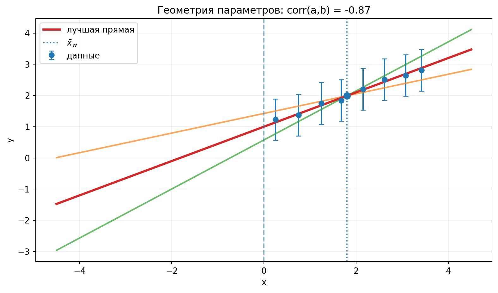
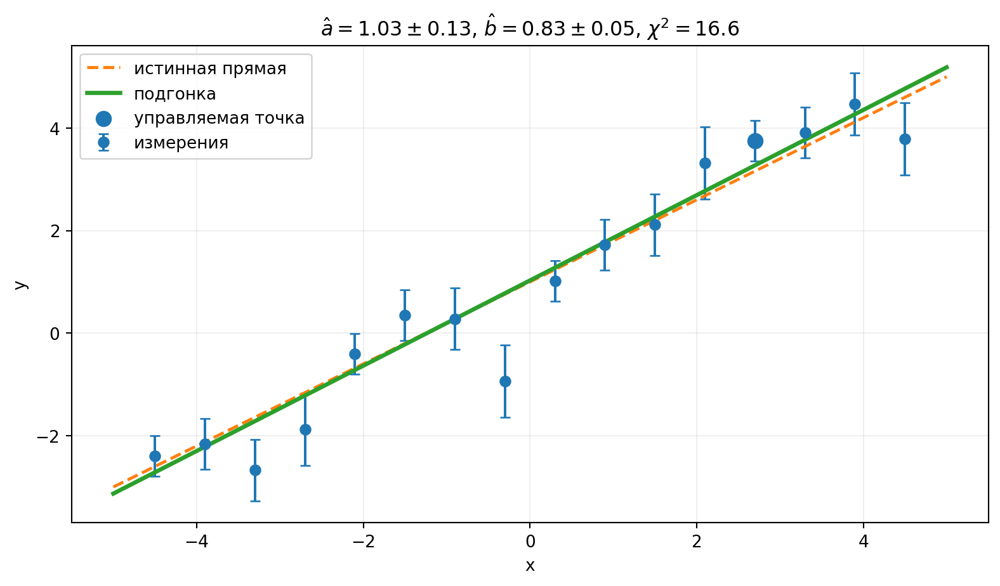
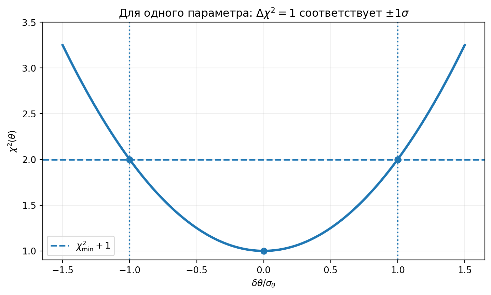
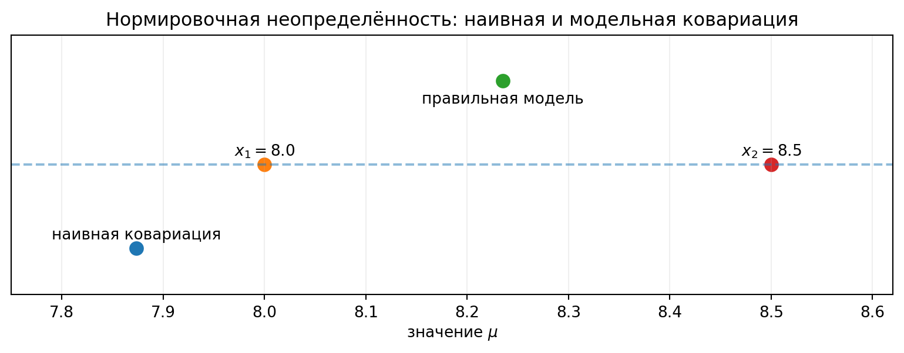

::: chapter-opening
[Аннотация]{.chapter-opening-label}

Глава связывает метод наименьших квадратов с гауссовым правдоподобием и показывает, как из измерений с известными неопределённостями получить оценки параметров модели. На примере прямой выводятся нормальные уравнения, ковариационная матрица параметров и геометрический смысл их корреляций. Затем рассматривается общий случай с ковариационной матрицей данных, локальные интервалы по форме $\chi^2$ , систематические неопределённости, мешающие параметры, профилирование и распространение ошибок на производные величины.
:::

## От измерений к кривой

Пусть имеются измерения: $$(x_i,y_i\pm\sigma_i),\qquad i=1,\ldots,N,$$ и модель: $$y=f(x;\boldsymbol\theta).$$ Задача подгонки состоит не только в том, чтобы найти параметры $\boldsymbol\theta$. Нужно также определить их неопределённости и корреляции, проверить согласование модели с данными и исследовать остатки. Точки могут иметь разные ошибки, ошибки разных точек могут быть коррелированы, а параметры модели после подгонки тоже могут оказаться сильно связанными между собой.

::: book-note
**Подгонка — статистическая процедура, а не графический способ провести линию между точками.** Хороший внешний вид кривой сам по себе ничего не говорит о корректности оценок параметров и их ошибок.
:::

### Связь с гауссовым правдоподобием

Пусть значения $x_i$ известны точно, а наблюдаемые величины $Y_i$ независимы и распределены по гауссу вокруг модельного предсказания: $$Y_i\sim\mathrm N\!\left(f(x_i;\boldsymbol\theta),\sigma_i^2\right).$$ Тогда совместная функция правдоподобия равна: $$L(\boldsymbol\theta)=\prod_{i=1}^{N}\frac{1}{\sqrt{2\pi}\sigma_i}
\exp\!\left[-\frac{[y_i-f(x_i;\boldsymbol\theta)]^2}{2\sigma_i^2}\right].$$ Если $\sigma_i$ известны и не зависят от параметров, нормировочные множители не влияют на положение максимума.

::: book-derivation
#### Взвешенная сумма квадратов из правдоподобия

Возьмём логарифм правдоподобия: $$\ln L(\boldsymbol\theta)=\sum_{i=1}^{N}\left[-\ln(\sqrt{2\pi}\sigma_i)-\frac{[y_i-f(x_i;\boldsymbol\theta)]^2}{2\sigma_i^2}\right].$$ Умножая на $-2$, получаем: $$-2\ln L(\boldsymbol\theta)=\sum_{i=1}^{N}\frac{[y_i-f(x_i;\boldsymbol\theta)]^2}{\sigma_i^2}+\mathrm{const}.$$ Следовательно, максимум правдоподобия находится в той же точке параметров, что и минимум функции: $$\boxed{\chi^2(\boldsymbol\theta)=\sum_{i=1}^{N}\frac{[y_i-f(x_i;\boldsymbol\theta)]^2}{\sigma_i^2}.}\quad\blacksquare$$
:::

Для отдельной точки удобно ввести остаток: $$r_i=y_i-f(x_i;\boldsymbol\theta),$$ тогда её вклад равен: $$\chi_i^2=\frac{r_i^2}{\sigma_i^2}.$$ Точка с меньшей $\sigma_i$ сильнее ограничивает модель, а точка с большой ошибкой допускает больший абсолютный остаток. Вес точки равен: $$\boxed{w_i=\frac{1}{\sigma_i^2}.}$$

::: book-note
Вес должен следовать из вероятностной модели измерения. Нельзя произвольно менять веса, чтобы получить более удобный или желаемый результат подгонки.
:::

### Когда такой МНК неприменим

Связь с $\chi^2$ возникает из гауссова описания ошибок. При малых пуассоновских счётах, тяжёлых хвостах, асимметричных распределениях, физических границах, существенной зависимости дисперсии от параметров или заметных неопределённостях по оси $x$ такой критерий может оказаться неверной моделью данных. В этих случаях нужно возвращаться к исходной функции правдоподобия.

## Прямая по точкам

Рассмотрим линейную модель: $$y_i=a+b x_i+\varepsilon_i,\qquad \varepsilon_i\sim\mathrm N(0,\sigma_i^2).$$ Для неё справедливо: $$\chi^2(a,b)=\sum_iw_i(y_i-a-bx_i)^2,\qquad w_i=\frac1{\sigma_i^2}.$$ Параметры $a$ и $b$ находятся из условий минимума: $$\frac{\partial\chi^2}{\partial a}=0,\qquad \frac{\partial\chi^2}{\partial b}=0.$$

::: book-derivation
#### Нормальные уравнения для прямой

Дифференцирование по $a$ даёт: $$\frac{\partial\chi^2}{\partial a}=-2\sum_iw_i(y_i-a-bx_i)=0,$$ а по $b$: $$\frac{\partial\chi^2}{\partial b}=-2\sum_iw_ix_i(y_i-a-bx_i)=0.$$ Перенесём известные величины вправо: $$\begin{pmatrix}
\sum_iw_i&\sum_iw_ix_i\\
\sum_iw_ix_i&\sum_iw_ix_i^2
\end{pmatrix}
\begin{pmatrix}a\\b\end{pmatrix}
=
\begin{pmatrix}
\sum_iw_iy_i\\
\sum_iw_ix_iy_i
\end{pmatrix}.$$ Введём обозначения: $$S=\sum_iw_i,\quad S_x=\sum_iw_ix_i,\quad S_y=\sum_iw_iy_i,$$

$$S_{xx}=\sum_iw_ix_i^2,\quad S_{xy}=\sum_iw_ix_iy_i.$$ Тогда система принимает вид: $$\boxed{
\begin{pmatrix}S&S_x\\S_x&S_{xx}\end{pmatrix}
\begin{pmatrix}\widehat a\\\widehat b\end{pmatrix}
=
\begin{pmatrix}S_y\\S_{xy}\end{pmatrix}.}\quad\blacksquare$$
:::

Если обозначить $$A=\begin{pmatrix}S&S_x\\S_x&S_{xx}\end{pmatrix},\qquad
\widehat{\boldsymbol\beta}=\begin{pmatrix}\widehat a\\\widehat b\end{pmatrix},\qquad
\mathbf c=\begin{pmatrix}S_y\\S_{xy}\end{pmatrix},$$ то формальное решение записывается как: $$\boxed{\widehat{\boldsymbol\beta}=A^{-1}\mathbf c.}$$ Обратимость $A$ означает, что данные действительно позволяют различить параметры. Если, например, все точки имеют одно и то же значение $x$, наклон определить нельзя.

### Явные формулы для оценок

Определим: $$\Delta=SS_{xx}-S_x^2.$$ Тогда $$\boxed{
\widehat a=\frac{S_{xx}S_y-S_xS_{xy}}{\Delta},\qquad
\widehat b=\frac{SS_{xy}-S_xS_y}{\Delta}.}$$ Эти выражения показывают, что линейная подгонка с известными ошибками решается аналитически: численный минимизатор здесь не требуется.

## Ковариация параметров прямой

Для гауссовых ошибок: $$L(\boldsymbol\beta)\propto\exp\!\left[-\frac12\chi^2(\boldsymbol\beta)\right].$$ Одновременно многомерная гауссова форма для параметров имеет вид: $$p(\boldsymbol\beta)\propto\exp\!\left[-\frac12(\boldsymbol\beta-\widehat{\boldsymbol\beta})^{\mathsf T}V_\beta^{-1}(\boldsymbol\beta-\widehat{\boldsymbol\beta})\right].$$ Для прямой $\chi^2$ является точно квадратичной функцией $a$ и $b$, а не только локальным приближением.

::: book-derivation
#### Ковариационная матрица $a$ и $b$

Около минимума для линейной модели: $$\chi^2(\boldsymbol\beta)=\chi^2_{\min}+(\boldsymbol\beta-\widehat{\boldsymbol\beta})^{\mathsf T}
\begin{pmatrix}S&S_x\\S_x&S_{xx}\end{pmatrix}
(\boldsymbol\beta-\widehat{\boldsymbol\beta}).$$ Сравнение с многомерной гауссовой формой даёт: $$V_\beta^{-1}=\begin{pmatrix}S&S_x\\S_x&S_{xx}\end{pmatrix}.$$ После обращения матрицы получим: $$\boxed{V_\beta=\frac1\Delta\begin{pmatrix}S_{xx}&-S_x\\-S_x&S\end{pmatrix}.}$$ Следовательно, $$\boxed{\operatorname{Var}(\widehat a)=\frac{S_{xx}}\Delta,\qquad
\operatorname{Var}(\widehat b)=\frac{S}\Delta,\qquad
\operatorname{Cov}(\widehat a,\widehat b)=-\frac{S_x}\Delta.}\quad\blacksquare$$
:::

### От чего зависят ошибки параметров

Введём взвешенный центр точек по $x$ и их взвешенный разброс: $$\bar x_w=\frac{S_x}{S},\qquad
Q_x=\sum_iw_i(x_i-\bar x_w)^2=\frac\Delta S.$$ Те же формулы принимают более наглядный вид: $$\boxed{\sigma_b^2=\frac1{Q_x},\qquad
\sigma_a^2=\frac1S+\frac{\bar x_w^2}{Q_x},\qquad
\operatorname{Cov}(\widehat a,\widehat b)=-\frac{\bar x_w}{Q_x}.}$$ Малые ошибки измерений увеличивают веса и уменьшают ошибки параметров. Наклон определяется «рычагом» $Q_x$: чем шире точки разнесены по оси $x$, тем точнее измеряется $b$. Параметр $a$ — значение прямой при $x=0$, и если все данные расположены далеко от нуля, неопределённость наклона переносится в неопределённость пересечения.

### Центр тяжести точек

При фиксированном $b$ можно отдельно минимизировать $\chi^2$ по $a$.

::: book-derivation
#### Через какую точку проходит лучшая прямая

Из условия $$0=\frac{\partial\chi^2}{\partial a}=-2\sum_iw_i(y_i-a-bx_i)$$ следует: $$\sum_iw_iy_i-a\sum_iw_i-b\sum_iw_ix_i=0.$$ Разделим на $S=\sum_iw_i$ и введём: $$\bar y_w=\frac{\sum_iw_iy_i}{\sum_iw_i},\qquad \bar x_w=\frac{\sum_iw_ix_i}{\sum_iw_i}.$$ Тогда $$\boxed{a(b)=\bar y_w-b\bar x_w.}$$ Следовательно, при любом фиксированном наклоне оптимальное значение $a$ заставляет прямую проходить через взвешенный центр данных: $$\boxed{(\bar x_w,\bar y_w).}\quad\blacksquare$$
:::

### Геометрия корреляции $a$ и $b$

Если изменить наклон, свободный член может частично компенсировать это изменение так, чтобы прямая всё ещё проходила через центр данных. Именно эта компенсация создаёт корреляцию параметров. Когда $\bar x_w>0$, увеличение наклона требует уменьшить $a$, поэтому ковариация отрицательна.

:::: {.content-visible when-format="html:js"}
::: clt-widget
```{ojs}
//| echo: false

viewof geomXbar = Inputs.range([-3, 3], {value: 1.8, step: 0.1, label: "центр x̄_w"})
viewof geomSpread = Inputs.range([0.45, 2.5], {value: 1.0, step: 0.05, label: "разброс по x"})

geomS = 18
geomQx = geomS * geomSpread * geomSpread
geomSigmaB = 1 / Math.sqrt(geomQx)
geomSigmaA = Math.sqrt(1 / geomS + geomXbar * geomXbar / geomQx)
geomCovAB = -geomXbar / geomQx
geomCorrAB = geomCovAB / (geomSigmaA * geomSigmaB)

geomA0 = 1.0
geomB0 = 0.55
geomYbar = geomA0 + geomB0 * geomXbar
geomSlopeSteps = [-1, 0, 1]
geomLineData = geomSlopeSteps.flatMap(k => {
  const b = geomB0 + k * geomSigmaB;
  const a = geomYbar - b * geomXbar;
  return Array.from({length: 121}, (_, i) => {
    const x = -4.5 + 9 * i / 120;
    return {x, y: a + b * x, k};
  });
})
geomFanLineData = geomLineData.filter(d => d.k !== 0)
geomBestLineData = geomLineData.filter(d => d.k === 0)

geomOffsets = [-1.55, -1.05, -0.55, -0.12, 0.35, 0.82, 1.28, 1.62]
geomPointSigma = Math.sqrt(geomOffsets.length / geomS)
geomResidualPattern = [0.09, -0.04, 0.06, -0.08, 0.02, 0.07, -0.05, -0.07]
geomPoints = geomOffsets.map((u, i) => {
  const x = geomXbar + geomSpread * u;
  return {x, y: geomA0 + geomB0 * x + geomResidualPattern[i]};
})

geomCenterPoint = [{x: geomXbar, y: geomYbar}]
geomLabels = [
  {x: 0, y: 3.25, text: "x = 0"},
  {x: geomXbar, y: 3.0, text: "центр данных"}
]

geomDataPlot = Plot.plot({
  width: 650,
  height: 420,
  marginLeft: 58,
  marginBottom: 46,
  x: {label: "x", domain: [-4.5, 4.5], grid: true},
  y: {label: "y", domain: [-2.0, 3.5], grid: true},
  marks: [
    Plot.ruleX([0], {stroke: "#aaa", strokeDasharray: "6,5"}),
    Plot.ruleX([geomXbar], {stroke: "#ffb347", strokeWidth: 3}),
    Plot.line(geomFanLineData, {x: "x", y: "y", z: "k", stroke: "#70b7ff", strokeWidth: 2.4, strokeOpacity: 0.58}),
    Plot.line(geomBestLineData, {x: "x", y: "y", stroke: "#ffb347", strokeWidth: 4}),
    Plot.ruleX(geomPoints, {x: "x", y1: d => d.y - geomPointSigma, y2: d => d.y + geomPointSigma, stroke: "#aaa", strokeOpacity: 0.65}),
    Plot.dot(geomPoints, {x: "x", y: "y", r: 6, fill: "#4ea1ff", fillOpacity: 0.82}),
    Plot.dot(geomCenterPoint, {x: "x", y: "y", r: 8, fill: "#ffb347", stroke: "#111", strokeWidth: 1}),
    Plot.text(geomLabels, {x: "x", y: "y", text: "text", fill: "#f2f2f2", fontSize: 16, dy: -8})
  ]
})

geomSa2 = geomSigmaA * geomSigmaA
geomSb2 = geomSigmaB * geomSigmaB
geomL11 = geomSigmaA
geomL21 = geomCovAB / geomL11
geomL22 = Math.sqrt(Math.max(geomSb2 - geomL21 * geomL21, 0))
geomLevel = Math.sqrt(2.30)
geomEllipse = Array.from({length: 241}, (_, i) => {
  const t = 2 * Math.PI * i / 240;
  const z1 = geomLevel * Math.cos(t);
  const z2 = geomLevel * Math.sin(t);
  return {
    da: geomL11 * z1,
    db: geomL21 * z1 + geomL22 * z2
  };
})
geomDaMax = Math.max(0.55, 1.18 * Math.max(...geomEllipse.map(d => Math.abs(d.da))))
geomDbMax = Math.max(0.42, 1.18 * Math.max(...geomEllipse.map(d => Math.abs(d.db))))
geomCompLine = [
  {db: -geomDbMax, da: geomXbar * geomDbMax},
  {db: geomDbMax, da: -geomXbar * geomDbMax}
]

geomParamPlot = Plot.plot({
  width: 560,
  height: 420,
  marginLeft: 66,
  marginBottom: 46,
  x: {label: "δa", domain: [-geomDaMax, geomDaMax], grid: true},
  y: {label: "δb", domain: [-geomDbMax, geomDbMax], grid: true},
  marks: [
    Plot.ruleX([0], {stroke: "#888"}),
    Plot.ruleY([0], {stroke: "#888"}),
    Plot.line(geomEllipse, {x: "da", y: "db", stroke: "#ffb347", strokeWidth: 4}),
    Plot.line(geomCompLine, {x: "da", y: "db", stroke: "#70b7ff", strokeWidth: 3, strokeDasharray: "7,5"}),
    Plot.dot([{da: 0, db: 0}], {x: "da", y: "db", r: 6, fill: "#f2f2f2"})
  ]
})

html`
<div class="clt-panel">
  <div style="display:flex; gap:0.9rem; align-items:center; justify-content:center;">
    ${geomDataPlot}
    ${geomParamPlot}
  </div>
  <div class="clt-summary">
    <span>Q_x = ${geomQx.toFixed(1)}</span>
    <span>σ_y фиксирована: ${geomPointSigma.toFixed(2)}</span>
    <span>σ_b = ${geomSigmaB.toFixed(3)}</span>
    <span>σ_a = ${geomSigmaA.toFixed(3)}</span>
    <span>corr(a,b) = ${geomCorrAB.toFixed(2)}</span>
  </div>
</div>
`
```
:::
::::

:::: {.content-visible when-format="pdf"}
::: figure-panel

:::
::::

### Центрированная параметризация

Перенесём начало координат в взвешенный центр данных: $$x_i'=x_i-\bar x_w,$$ и запишем ту же прямую как: $$y=a'+b'x',\qquad a'=a+b\bar x_w,\qquad b'=b.$$ Теперь $$S_x'=\sum_iw_ix_i'=0,$$ а значит: $$\boxed{\operatorname{Cov}(\widehat a',\widehat b')=0,\qquad
\operatorname{Var}(\widehat a')=\frac1S,\qquad
\operatorname{Var}(\widehat b')=\frac1{Q_x}.}$$ Параметр $a'$ — это значение прямой в центре данных, а не старое пересечение при $x=0$. Физическая прямая не изменилась, изменилась только параметризация.

### Нормальные координаты

В центрированных параметрах: $$\Delta\chi^2=S(\delta a')^2+Q_x(\delta b')^2.$$ Смешанного члена $\delta a'\delta b'$ нет. Если перейти к безразмерным координатам: $$z_a=\sqrt S\,\delta a'=\frac{\delta a'}{\sigma_{a'}},\qquad
z_b=\sqrt{Q_x}\,\delta b'=\frac{\delta b'}{\sigma_{b'}},$$ то квадратичная форма становится: $$\boxed{\Delta\chi^2=z_a^2+z_b^2.}$$ Это локальные нормальные координаты параметров: сначала устраняется корреляция, затем каждая ось измеряется в единицах собственной стандартной ошибки.

## Остатки и выбросы

Квадратичный критерий особенно чувствителен к большим отклонениям, потому что остаток входит в $\chi^2$ в квадрате. Один далёкий выброс может заметно сдвинуть подогнанную прямую и увеличить минимум $\chi^2$. Остатки $$\frac{y_i-f(x_i;\widehat{\boldsymbol\theta})}{\sigma_i}$$ позволяют увидеть структуру, которую легко не заметить на основном графике.

:::: {.content-visible when-format="html:js"}
::: clt-widget
```{ojs}
//| echo: false

viewof lsSigma = Inputs.range([0.15, 1.5], {value: 0.55, step: 0.05, label: "типичная ошибка sigma"})
viewof lsOutlier = Inputs.range([-4, 6], {value: 0, step: 0.25, label: "добавка к одной точке"})
viewof regenerateLs = Inputs.button("Новые данные")

randnLs = () => {
  const u1 = Math.max(Math.random(), 1e-12);
  const u2 = Math.random();
  return Math.sqrt(-2 * Math.log(u1)) * Math.cos(2 * Math.PI * u2);
}

lsData = {
  regenerateLs;
  const data = [];
  for (let i = 0; i < 16; ++i) {
    const x = -4.5 + 9 * i / 15;
    const sigma = lsSigma * (0.72 + 0.56 * (i % 4) / 3);
    const y = 1 + 0.8 * x + sigma * randnLs() + (i === 12 ? lsOutlier : 0);
    data.push({x, y, sigma, outlier: i === 12});
  }
  return data;
}

weightedLineFit = data => {
  let S = 0, Sx = 0, Sy = 0, Sxx = 0, Sxy = 0;
  for (const d of data) {
    const w = 1 / (d.sigma * d.sigma);
    S += w;
    Sx += w * d.x;
    Sy += w * d.y;
    Sxx += w * d.x * d.x;
    Sxy += w * d.x * d.y;
  }
  const delta = S * Sxx - Sx * Sx;
  const a = (Sxx * Sy - Sx * Sxy) / delta;
  const b = (S * Sxy - Sx * Sy) / delta;
  const chi2 = data.reduce((sum, d) => sum + ((d.y - a - b * d.x) / d.sigma) ** 2, 0);
  return {a, b, chi2, sigmaA: Math.sqrt(Sxx / delta), sigmaB: Math.sqrt(S / delta), covAB: -Sx / delta};
}

lsFit = weightedLineFit(lsData)
lsFitLine = Array.from({length: 201}, (_, i) => {
  const x = -5 + 10 * i / 200;
  return {x, y: lsFit.a + lsFit.b * x};
})
lsTrueLine = Array.from({length: 201}, (_, i) => {
  const x = -5 + 10 * i / 200;
  return {x, y: 1 + 0.8 * x};
})
lsResiduals = lsData.map(d => ({
  x: d.x,
  pull: (d.y - lsFit.a - lsFit.b * d.x) / d.sigma,
  outlier: d.outlier
}))

lsMainPlot = Plot.plot({
  width: 720,
  height: 460,
  marginLeft: 65,
  x: {label: "x", domain: [-5, 5], grid: true},
  y: {label: "y", grid: true},
  marks: [
    Plot.ruleX(lsData, {x: "x", y1: d => d.y - d.sigma, y2: d => d.y + d.sigma, stroke: "#aaa"}),
    Plot.dot(lsData, {x: "x", y: "y", r: 6, fill: d => d.outlier ? "#ff6b6b" : "#4ea1ff"}),
    Plot.line(lsTrueLine, {x: "x", y: "y", stroke: "#999", strokeDasharray: "7,5", strokeWidth: 3}),
    Plot.line(lsFitLine, {x: "x", y: "y", stroke: "#ffb347", strokeWidth: 4})
  ]
})

lsResidualPlot = Plot.plot({
  width: 520,
  height: 460,
  marginLeft: 65,
  x: {label: "x", domain: [-5, 5], grid: true},
  y: {label: "остаток / sigma", domain: [-6, 6], grid: true},
  marks: [
    Plot.ruleY([0], {stroke: "#f2f2f2"}),
    Plot.ruleY([-2, 2], {stroke: "#999", strokeDasharray: "6,5"}),
    Plot.dot(lsResiduals, {x: "x", y: "pull", r: 6, fill: d => d.outlier ? "#ff6b6b" : "#4ea1ff"})
  ]
})

html`
<div class="clt-panel">
  <div style="display:flex; gap:0.7rem; justify-content:center; align-items:center;">
    ${lsMainPlot}
    ${lsResidualPlot}
  </div>
  <div class="clt-summary">
    <span>a_hat = ${lsFit.a.toFixed(3)} ± ${lsFit.sigmaA.toFixed(3)}</span>
    <span>b_hat = ${lsFit.b.toFixed(3)} ± ${lsFit.sigmaB.toFixed(3)}</span>
    <span>χ²_min = ${lsFit.chi2.toFixed(1)}</span>
  </div>
</div>
`
```
:::
::::

::::: {.content-visible when-format="pdf"}
::: figure-panel

:::

::: figure-panel

:::
:::::

::: book-note
Обычный метод наименьших квадратов не является устойчивым к выбросам. Диагностика остатков — обязательная часть подгонки, а не дополнительный декоративный график.
:::

## Общий случай с ковариационной матрицей

До сих пор предполагалось, что ошибки разных $y_i$ независимы. В общем гауссовом случае данные описываются вектором: $$\mathbf y=(y_1,\ldots,y_N)^{\mathsf T},$$ модель — вектором математических ожиданий: $$\boldsymbol\lambda(\boldsymbol\theta)=(\lambda_1,\ldots,\lambda_N)^{\mathsf T},$$ а статистические связи между наблюдениями задаются ковариационной матрицей: $$V_y=\operatorname{Cov}(\mathbf y).$$ Тогда $$\boxed{\chi^2(\boldsymbol\theta)=(\mathbf y-\boldsymbol\lambda)^{\mathsf T}V_y^{-1}(\mathbf y-\boldsymbol\lambda).}$$ Если $V_y$ диагональна, эта формула возвращается к обычной сумме $r_i^2/\sigma_i^2$.

### Линейная многопараметрическая модель

Для линейной модели: $$\boldsymbol\lambda=H\boldsymbol\theta,$$ где $H$ — матрица размера $N\times p$, задача также решается аналитически.

::: book-derivation
#### Решение линейной модели с коррелированными ошибками

Минимизируем $$\chi^2=(\mathbf y-H\boldsymbol\theta)^{\mathsf T}V_y^{-1}(\mathbf y-H\boldsymbol\theta).$$ Условие стационарности по вектору параметров даёт нормальные уравнения: $$H^{\mathsf T}V_y^{-1}H\,\widehat{\boldsymbol\theta}=H^{\mathsf T}V_y^{-1}\mathbf y.$$ Если матрица слева обратима, получаем: $$\boxed{\widehat{\boldsymbol\theta}=(H^{\mathsf T}V_y^{-1}H)^{-1}H^{\mathsf T}V_y^{-1}\mathbf y.}$$ Ковариационная матрица оценок равна: $$\boxed{V_\theta=(H^{\mathsf T}V_y^{-1}H)^{-1}.}\quad\blacksquare$$
:::

## Интервалы из формы $\chi^2$

### Один параметр

Если около минимума зависимость хорошо описывается квадратичной формой, то $$\chi^2(\theta)\approx\chi^2_{\min}+\frac{(\theta-\widehat\theta)^2}{\sigma_\theta^2}.$$ Точки на расстоянии одной локальной стандартной ошибки удовлетворяют: $$\boxed{\chi^2(\widehat\theta\pm\sigma_\theta)-\chi^2_{\min}=1.}$$

::: book-note
$\Delta\chi^2=1$ здесь — локальное гауссово правило для **одного** параметра. Формальная связь порогов $\Delta\chi^2$ с доверительными областями и распределением статистики рассматривается дальше в курсе.
:::

:::: {.content-visible when-format="html:js"}
::: clt-widget
```{ojs}
//| echo: false

chiOneSigma = 1
chiOneMin = 1
chiOneCut = chiOneMin + 1
chiOneData = Array.from({length: 241}, (_, i) => {
  const delta = -1.5 + 3.0 * i / 240;
  return {
    delta,
    chi2: chiOneMin + (delta / chiOneSigma) ** 2
  };
})
chiOneMarks = [
  {delta: -chiOneSigma, chi2: chiOneCut},
  {delta: 0, chi2: chiOneMin},
  {delta: chiOneSigma, chi2: chiOneCut}
]
chiOneCutLine = [
  {delta: -chiOneSigma, chi2: chiOneCut},
  {delta: chiOneSigma, chi2: chiOneCut}
]

chiOnePlot = Plot.plot({
  width: 980,
  height: 460,
  marginLeft: 70,
  marginBottom: 54,
  marginTop: 36,
  x: {label: "δθ", domain: [-1.5, 1.5], grid: true},
  y: {label: "χ²(θ)", domain: [0.9, 3.5], grid: true},
  marks: [
    Plot.line(chiOneData, {x: "delta", y: "chi2", stroke: "#4ea1ff", strokeWidth: 4}),
    Plot.line(chiOneCutLine, {x: "delta", y: "chi2", stroke: "#ff5a5f", strokeWidth: 3}),
    Plot.ruleY([chiOneMin], {stroke: "#777", strokeDasharray: "5,5"}),
    Plot.ruleX([-chiOneSigma, chiOneSigma], {
      y1: chiOneMin,
      y2: chiOneCut,
      stroke: "#ff5a5f",
      strokeWidth: 3,
      strokeDasharray: "7,5"
    }),
    Plot.dot(chiOneMarks, {x: "delta", y: "chi2", r: 6, fill: d => d.delta === 0 ? "#f2f2f2" : "#ff5a5f", stroke: "#111"})
  ]
})

html`
<div class="clt-panel">
  <div style="text-align:center; font-size:1.35rem; font-weight:700; margin-bottom:0.35rem;">
    χ²(δθ = ±σ<sub>θ</sub>) − χ²<sub>min</sub> = 1
  </div>
  ${chiOnePlot}
  <div class="clt-summary">
    <span>минимум: δθ = 0</span>
    <span>красная отсечка: χ²<sub>min</sub> + 1</span>
    <span>пересечения дают ±σ<sub>θ</sub></span>
  </div>
</div>
`
```
:::
::::

:::: {.content-visible when-format="pdf"}
::: figure-panel

:::
::::

### Несколько параметров

Для нескольких параметров локальная форма имеет вид: $$\chi^2(\boldsymbol\theta)\approx\chi^2_{\min}+(\boldsymbol\theta-\widehat{\boldsymbol\theta})^{\mathsf T}V_\theta^{-1}(\boldsymbol\theta-\widehat{\boldsymbol\theta}).$$ Уравнение $$\Delta\chi^2=\chi^2-\chi^2_{\min}=c$$ задаёт эллипсоиды в пространстве параметров. Матрица $V_\theta$ определяет размеры и наклон этих областей. Такая картина является локальной: если поверхность $\chi^2$ имеет несколько минимумов, острова или сильную нелинейность, простой эллипс уже не описывает её глобальную форму.

::: figure-panel

:::

::: figure-panel

:::

## Систематические неопределённости

В реальной подгонке модель обычно зависит не только от параметров, которые требуется измерить, но и от параметров, описывающих калибровки, эффективности, фон, нормировку и другие источники систематической неопределённости.

::: book-note
**Параметр интереса** — величина, ради которой выполняется измерение. **Мешающий параметр** влияет на предсказание, но сам не является целью анализа. Систематическая неопределённость появляется из неопределённости таких физических, инструментальных или модельных величин.
:::

Пусть параметры интереса обозначены $\boldsymbol\theta$, а мешающие параметры — $\boldsymbol\eta$: $$\boldsymbol\lambda=\boldsymbol\lambda(\boldsymbol\theta,\boldsymbol\eta).$$ Если о мешающих параметрах уже имеется внешняя информация, $$\boldsymbol\eta\approx\boldsymbol\eta_0,\qquad \operatorname{Cov}(\boldsymbol\eta)=V_\eta,$$ то её можно включить в функцию $\chi^2$: $$\boxed{
\chi^2(\boldsymbol\theta,\boldsymbol\eta)=
(\mathbf y-\boldsymbol\lambda)^{\mathsf T}V_y^{-1}(\mathbf y-\boldsymbol\lambda)
+(\boldsymbol\eta-\boldsymbol\eta_0)^{\mathsf T}V_\eta^{-1}(\boldsymbol\eta-\boldsymbol\eta_0).}$$ Второе слагаемое часто называют штрафным членом. Малое $V_\eta$ жёстко удерживает параметр около номинального значения, а большая неопределённость делает его почти свободным.

### Профилирование мешающих параметров

Нас обычно интересует зависимость результата только от $\boldsymbol\theta$. Для каждого фиксированного значения параметров интереса мешающие параметры можно заново подобрать так, чтобы $\chi^2$ было минимальным: $$\boxed{\chi^2_{\mathrm p}(\boldsymbol\theta)=\min_{\boldsymbol\eta}\chi^2(\boldsymbol\theta,\boldsymbol\eta)=\chi^2\!\left(\boldsymbol\theta,\widehat{\widehat{\boldsymbol\eta}}(\boldsymbol\theta)\right).}$$ Двойная шляпа означает, что $\boldsymbol\eta$ оптимизирована при фиксированном $\boldsymbol\theta$.

::: book-note
Профилирование не выбрасывает мешающие параметры. Оно отвечает на вопрос: насколько хорошо можно описать данные при выбранном $\boldsymbol\theta$, если все остальные параметры подобрать наилучшим допустимым образом.
:::

### Линейная систематика

Если зависимость от мешающих параметров в окрестности номинала линейна, $$\boldsymbol\lambda(\boldsymbol\theta,\boldsymbol\eta)\approx\boldsymbol\lambda_0(\boldsymbol\theta)+H(\boldsymbol\theta)(\boldsymbol\eta-\boldsymbol\eta_0),$$ где $$H_{ij}=\left.\frac{\partial\lambda_i}{\partial\eta_j}\right|_{\boldsymbol\eta=\boldsymbol\eta_0},$$ можно аналитически исключить мешающие параметры.

::: book-derivation
#### Аналитическое профилирование линейной систематики

Обозначим $$\boldsymbol\delta=\boldsymbol\eta-\boldsymbol\eta_0,\qquad
\mathbf r(\boldsymbol\theta)=\mathbf y-\boldsymbol\lambda_0(\boldsymbol\theta).$$ Тогда $$\chi^2=(\mathbf r-H\boldsymbol\delta)^{\mathsf T}V_y^{-1}(\mathbf r-H\boldsymbol\delta)+\boldsymbol\delta^{\mathsf T}V_\eta^{-1}\boldsymbol\delta.$$ Минимизация по $\boldsymbol\delta$ даёт: $$\boxed{
\widehat{\widehat{\boldsymbol\delta}}(\boldsymbol\theta)=
\left(V_\eta^{-1}+H^{\mathsf T}V_y^{-1}H\right)^{-1}H^{\mathsf T}V_y^{-1}\mathbf r(\boldsymbol\theta).}$$ После подстановки оптимального значения получается эквивалентная запись: $$\boxed{\chi^2_{\mathrm p}(\boldsymbol\theta)=\mathbf r^{\mathsf T}V^{-1}\mathbf r,\qquad V=V_y+HV_\eta H^{\mathsf T}.}$$ Следовательно, линейная систематика добавляет к ковариации данных вклад: $$\boxed{V_{\mathrm{sys}}=HV_\eta H^{\mathsf T}.}\quad\blacksquare$$
:::

## Общая нормировка и парадокс Д'Агостини

Рассмотрим несколько измерений одной величины $\mu$ с абсолютными индивидуальными ошибками $s_i$ и общей относительной неопределённостью нормировки $f_N$. Удобно ввести общий мешающий параметр $\alpha$: $$\lambda_i(\mu,\alpha)=(1+\alpha)\mu,\qquad \alpha=0\pm f_N.$$ Для такой модели $$H_{i1}=\left.\frac{\partial\lambda_i}{\partial\alpha}\right|_{\alpha=0}=\mu,$$ поэтому нормировочная часть ковариации должна зависеть от **модельного предсказания**: $$\boxed{(V_{\mathrm{norm}})_{ij}=f_N^2\mu^2.}$$

### Наивная подстановка наблюдённых значений

Возьмём две точки: $$x_1=8.0,\qquad x_2=8.5,$$ с индивидуальными относительными ошибками $2\%$: $$s_1=0.16,\qquad s_2=0.17,$$ и общей нормировочной неопределённостью $f_N=0.10$. Статистическая матрица равна: $$V_{\mathrm{stat}}=\begin{pmatrix}0.0256&0\\0&0.0289\end{pmatrix}.$$ Если ошибочно построить нормировочную ковариацию из самих наблюдённых данных, $$V_{\mathrm{norm}}^{\mathrm{bad}}=f_N^2\begin{pmatrix}x_1^2&x_1x_2\\x_1x_2&x_2^2\end{pmatrix},$$ то $$V_{\mathrm{bad}}=\begin{pmatrix}0.6656&0.6800\\0.6800&0.7514\end{pmatrix}.$$

::: book-derivation
#### Почему наивная ковариация даёт значение ниже обеих точек

Для постоянной модели $\lambda_i=\mu$ запишем: $$\chi^2(\mu)=(\mathbf x-\mu\mathbf1)^{\mathsf T}W(\mathbf x-\mu\mathbf1),\qquad W=V^{-1}.$$ Раскрывая скобки, получим: $$\chi^2=\mathbf x^{\mathsf T}W\mathbf x-2\mu\mathbf1^{\mathsf T}W\mathbf x+\mu^2\mathbf1^{\mathsf T}W\mathbf1.$$ Условие минимума даёт: $$\boxed{\widehat\mu=\frac{\mathbf1^{\mathsf T}W\mathbf x}{\mathbf1^{\mathsf T}W\mathbf1}=\mathbf w^{\mathsf T}\mathbf x,\qquad \mathbf w=\frac{W\mathbf1}{\mathbf1^{\mathsf T}W\mathbf1}.}$$ Для наивной матрицы веса примерно равны: $$\mathbf w_{\mathrm{bad}}\approx\begin{pmatrix}1.253\\-0.253\end{pmatrix}.$$ В итоге: $$\boxed{\widehat\mu_{\mathrm{bad}}\approx7.87\pm0.81.}\quad\blacksquare$$
:::

Значение $7.87$ находится ниже обеих измеренных точек. Это не арифметическая ошибка минимизации: она честно решила задачу с заданной матрицей. Проблема состоит в самой вероятностной модели. Подстановка $f_N^2x_ix_j$ делает абсолютную систематическую ошибку зависимой от случайной флуктуации наблюдённой точки; при сильной корреляции большая точка может получить отрицательный эффективный вес.

:::: {.content-visible when-format="html:js"}
::: clt-widget
```{ojs}
//| echo: false

pppPoints = [
  {x: 7.8737, y: 0, label: "наивная ковариация", kind: "bad"},
  {x: 8.0, y: 1, label: "x₁ = 8.0", kind: "data"},
  {x: 8.2349, y: 2, label: "правильная модель", kind: "good"},
  {x: 8.5, y: 1, label: "x₂ = 8.5", kind: "data"}
]

pppPlot = Plot.plot({
  width: 920,
  height: 190,
  marginLeft: 80,
  marginRight: 70,
  marginBottom: 45,
  marginTop: 18,
  x: {label: "значение μ", domain: [7.75, 8.62], grid: true},
  y: {axis: null, domain: [-0.7, 2.55]},
  marks: [
    Plot.ruleY([1], {stroke: "#777", strokeDasharray: "6,5"}),
    Plot.dot(pppPoints, {
      x: "x",
      y: "y",
      r: 8,
      fill: d => d.kind === "bad" ? "#ff5a5f" : d.kind === "good" ? "#2dd881" : "#4ea1ff",
      stroke: "#111",
      strokeWidth: 1.2
    }),
    Plot.text(pppPoints, {
      x: "x",
      y: "y",
      text: "label",
      fill: "#f2f2f2",
      dy: d => d.kind === "data" ? -18 : 18,
      fontSize: 16
    })
  ]
})

html`${pppPlot}`
```
:::
::::

:::: {.content-visible when-format="pdf"}
::: figure-panel

:::
::::

### Ковариация из модели

Правильная матрица должна использовать предсказание $\mu$: $$\boxed{V_{ij}(\mu)=s_i^2\delta_{ij}+f_N^2\mu^2.}$$ Самосогласованное центральное значение определяется статистическими весами: $$\widehat\mu=\frac{\sum_ix_i/s_i^2}{\sum_i1/s_i^2}\approx8.235.$$ При этом $$V_{\mathrm{corr}}\approx\begin{pmatrix}0.7037&0.6781\\0.6781&0.7070\end{pmatrix},$$ а веса становятся положительными: $$\mathbf w_{\mathrm{corr}}\approx\begin{pmatrix}0.530\\0.470\end{pmatrix}.$$ Итоговая оценка: $$\boxed{\widehat\mu_{\mathrm{corr}}\approx8.235\pm0.832.}$$ Общая нормировка увеличивает ошибку, но не вынуждает центральное значение уходить ниже обеих точек.

### То же через штрафной член

Ту же физическую модель можно записать непосредственно через мешающий параметр: $$x_i=(1+\alpha)\mu+\varepsilon_i,\qquad \varepsilon_i\sim\mathrm N(0,s_i^2),\qquad \alpha=0\pm f_N.$$ Минимизируется функция: $$\boxed{\chi^2(\mu,\alpha)=\sum_i\frac{[x_i-(1+\alpha)\mu]^2}{s_i^2}+\frac{\alpha^2}{f_N^2}.}$$

::: book-derivation
#### Центральное значение и ошибка из штрафной модели

Обозначим: $$R(\mu,\alpha)=\sum_i\frac{x_i-(1+\alpha)\mu}{s_i^2}.$$ Условия минимума имеют вид: $$\frac{\partial\chi^2}{\partial\mu}=-2(1+\alpha)R=0,$$

$$\frac{\partial\chi^2}{\partial\alpha}=-2\mu R+\frac{2\alpha}{f_N^2}=0.$$ Из первого условия $R=0$, а тогда второе даёт $\widehat\alpha=0$. Следовательно, $$\boxed{\widehat\mu=\frac{\sum_ix_i/s_i^2}{\sum_i1/s_i^2}\approx8.235.}$$ Квадратичная форма по $(\mu,\alpha)$ даёт: $$\operatorname{Cov}(\widehat\mu,\widehat\alpha)\approx\begin{pmatrix}0.6917&-0.0823\\-0.0823&0.0100\end{pmatrix},$$ поэтому $$\boxed{\widehat\mu\approx8.235\pm\sqrt{0.6917}=8.235\pm0.832.}\quad\blacksquare$$
:::

Ту же дисперсию можно представить как сумму статистического и нормировочного вкладов: $$\sigma_\mu^2\approx\left(\sum_i\frac1{s_i^2}\right)^{-1}+(f_N\widehat\mu)^2\approx0.0136+0.6781=0.6917.$$ Таким образом, ковариационная матрица и штрафной параметр дают один и тот же ответ, если оба построены из одной и той же физической модели.

## Распространение ошибок после подгонки

Пусть получены $$\widehat{\boldsymbol\theta},\qquad V_\theta=\operatorname{Cov}(\widehat{\boldsymbol\theta}),$$ а интересующая величина является функцией этих параметров: $$\boldsymbol\alpha=\boldsymbol\alpha(\boldsymbol\theta).$$ Оценка получается простой подстановкой: $$\widehat{\boldsymbol\alpha}=\boldsymbol\alpha(\widehat{\boldsymbol\theta}).$$ В линейном приближении ковариация переносится якобианом: $$\boxed{V_\alpha=AV_\theta A^{\mathsf T},\qquad A_{ij}=\left.\frac{\partial\alpha_i}{\partial\theta_j}\right|_{\widehat{\boldsymbol\theta}}.}$$ Внедиагональные элементы $V_\theta$ здесь столь же важны, как и дисперсии: корреляции подогнанных параметров также распространяются на производную величину. Формула локальна; при сильной нелинейности или физических границах результат нужно проверять сканом или псевдоэкспериментами.

## Что именно даёт минимум $\chi^2$

В этой главе $\chi^2$ используется прежде всего как функция для оценки параметров и их локальных неопределённостей. Само значение $\chi^2_{\min}$ часто применяют и для формальной проверки согласия модели с данными, но для этого требуется знать распределение соответствующей статистики и число степеней свободы. Эта задача рассматривается отдельно.

::: book-note
Не следует автоматически интерпретировать любой минимум $\chi^2$ как доказательство хорошего согласия модели с данными. Подгонка параметров и формальная проверка качества согласия — связанные, но разные статистические задачи.
:::

## Когда метод наименьших квадратов лучше не использовать

МНК не является универсальной заменой функции правдоподобия. Особенно осторожно нужно действовать при малых пуассоновских счётах и пустых бинах, событийном анализе без биннирования, параметрически зависимых ошибках, заметных неопределённостях по нескольким координатам, асимметричных или ограниченных распределениях и явно не квадратичной форме около минимума. В этих случаях исходной точкой должна быть вероятностная модель наблюдений.

## Практическая процедура анализа

Рабочая последовательность состоит в том, чтобы сначала записать модель $\boldsymbol\lambda(\boldsymbol\theta,\boldsymbol\eta)$ и определить ковариацию данных $V_y$. Для систематик задаются номинальные значения $\boldsymbol\eta_0$ и их ковариация $V_\eta$. Затем строится полная функция $\chi^2$ со штрафными членами, выполняется совместная минимизация или профилирование мешающих параметров, а ковариация параметров извлекается из локальной квадратичной формы. После подгонки нужно исследовать остатки, корреляции и устойчивость результата.

### Что сообщать вместе с результатом

Вместе с подогнанными параметрами нужно указывать их единицы и ковариационную или корреляционную матрицу, использованный вид $\chi^2$, включённые систематики и способ их ограничения, факт профилирования мешающих параметров, а также графики данных, модели и остатков. Число без описания статистической модели и корреляций не даёт полной информации о подгонке.

::: chapter-summary
## Итоги главы

- Метод наименьших квадратов возникает из максимизации правдоподобия для независимых гауссовых измерений с известными дисперсиями.
- Взвешенный критерий имеет вид $\chi^2=\sum_i[y_i-f(x_i;\theta)]^2/\sigma_i^2$, а вес измерения равен обратной дисперсии.
- Для линейной модели параметры находятся из нормальных уравнений, а их ковариационная матрица определяется той же квадратичной формой.
- Ошибка наклона уменьшается при большем разбросе точек по $x$, а корреляция наклона и пересечения связана с положением центра данных относительно $x=0$.
- Центрирование координаты в $\bar x_w$ устраняет корреляцию параметров прямой и приводит к нормальным координатам локальной квадратичной формы.
- Один большой выброс может существенно изменить обычную МНК-подгонку; остатки необходимы для диагностики.
- Коррелированные ошибки данных учитываются полной ковариационной матрицей через $(\mathbf y-\boldsymbol\lambda)^{\mathsf T}V_y^{-1}(\mathbf y-\boldsymbol\lambda)$.
- Для одного параметра в локальном гауссовом случае уровень $\Delta\chi^2=1$ соответствует одной стандартной ошибке; для нескольких параметров постоянные уровни образуют эллипсоиды только в квадратичном приближении.
- Систематические неопределённости удобно задавать мешающими параметрами со вспомогательной информацией и профилировать вместе с параметрами интереса.
- Линейные систематики эквивалентно добавляют к ковариации данных вклад: $HV_\eta H^{\mathsf T}$.
- Мультипликативную нормировочную неопределённость нельзя строить из самих флуктуировавших наблюдений: это может породить отрицательные веса и физически парадоксальный результат.
- Ковариационный подход и штрафной мешающий параметр дают одинаковый результат, если исходят из одной вероятностной модели.
- Неопределённости производных величин переносятся вместе с корреляциями по формуле $V_\alpha=AV_\theta A^{\mathsf T}$.
- Если гауссово или линейное приближение не работает, нужно возвращаться к полной функции правдоподобия.
:::

## Задачи

