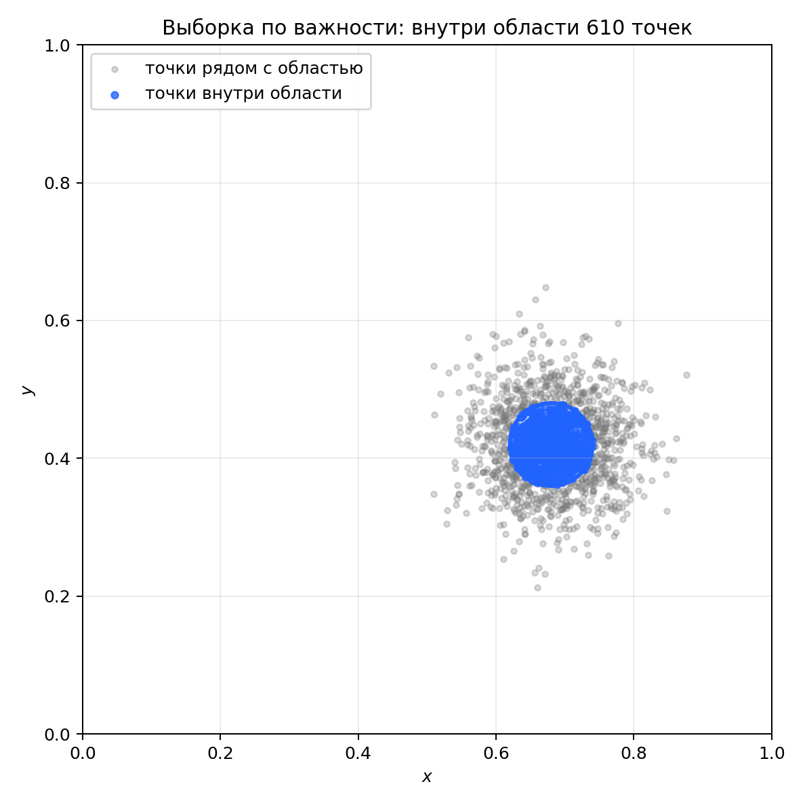
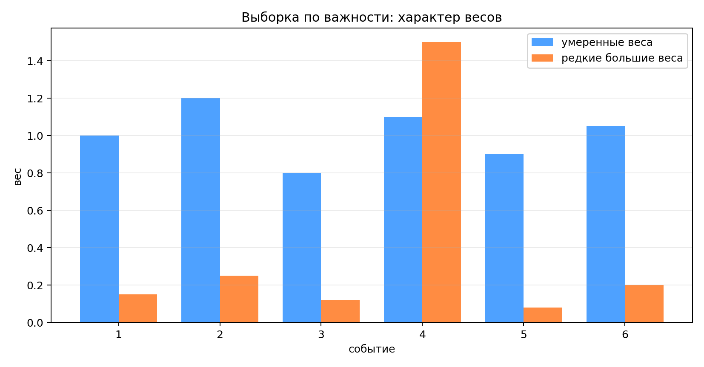
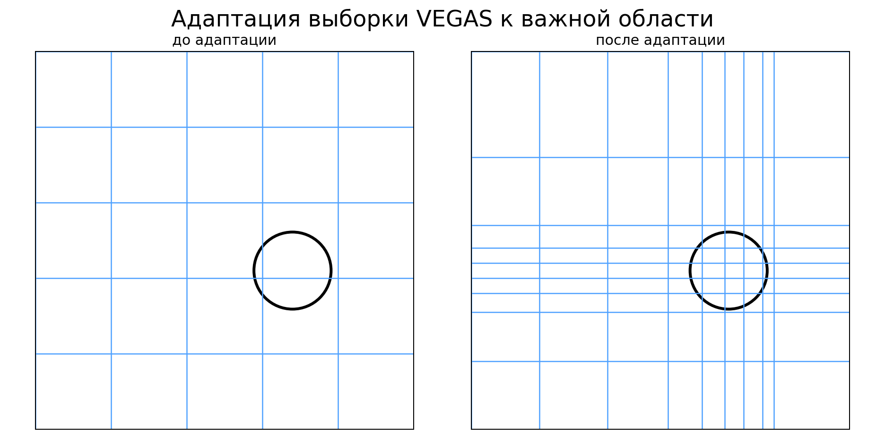

::: chapter-opening
[Аннотация]{.chapter-opening-label}

Метод Монте-Карло позволяет заменить сложный расчёт большим числом случайных
реализаций заданной модели. В этой главе мы разберём генерацию случайных
величин, вычисление многомерных интегралов, выборку по важности и алгоритм
VEGAS. Затем построим ансамбль псевдоэкспериментов и проследим цепочку от
генерации физического процесса до отклика детектора и результата анализа.
:::

## Физическая задача: слабый сигнал на фоне

Эксперимент ищет редкий процесс. За время набора данных ожидается в среднем
$s=5$ сигнальных и $b=10$ фоновых событий. Полное число зарегистрированных
событий имеет распределение Пуассона:

$$
N\sim\operatorname{Pois}(s+b).
$$ {#eq-ch8-counting-model}

Будем считать фон известным точно и оценим число сигнальных событий простым
вычитанием:

$$
\widehat s=N-b.
$$ {#eq-ch8-counting-estimator}

До проведения эксперимента можно задать несколько вполне физических вопросов.
Какое значение $\widehat s$ мы в среднем получим? Каков разброс оценки? Как
часто флуктуация фона приведёт к отрицательному $\widehat s$?

Первые два ответа следуют из свойств распределения Пуассона:

$$
\mathbb E[\widehat s]=s,
\qquad
\operatorname{Var}(\widehat s)=s+b.
$$ {#eq-ch8-counting-moments}

Для $s=5$ и $b=10$ стандартное отклонение равно $\sqrt{15}\simeq3.87$ события.
Отрицательная оценка получается при $N<10$. Её вероятность равна

$$
P(\widehat s<0)
=P(N\leq9\mid s+b=15)
=\sum_{n=0}^{9}e^{-15}\frac{15^n}{n!}
=0.0699.
$$ {#eq-ch8-negative-signal-probability}

Эту задачу можно решить и численно. Сгенерируем много значений
$N_k\sim\operatorname{Pois}(15)$, для каждого вычислим
$\widehat s_k=N_k-10$ и посмотрим на полученное распределение. Его среднее,
дисперсия и доля отрицательных оценок приблизятся к значениям в формулах
[-@eq-ch8-counting-moments] и [-@eq-ch8-negative-signal-probability].

В этой игрушечной модели аналитический ответ помещается в несколько строк.
Настоящий анализ использует энергетический спектр, отклик детектора, отбор
событий и мешающие параметры. Распределение результата такой процедуры обычно
уже нельзя выписать одной формулой. Тогда мы повторяем эксперимент на
компьютере. Это и есть метод Монте-Карло.

## Что вычисляет метод Монте-Карло

Пусть случайная величина $X$ имеет плотность $f_X(x)$, а интересующая нас
величина определяется функцией $g$:

$$
X\sim f_X(x),
\qquad
Y=g(X).
$$ {#eq-ch8-general-transformation}

Численный алгоритм состоит из трёх действий:

1. сгенерировать независимые значения $X_1,\ldots,X_N$ из распределения
   $f_X$;
2. вычислить $Y_k=g(X_k)$ для каждого события;
3. по выборке $Y_1,\ldots,Y_N$ найти среднее, дисперсию, вероятность нужного
   события или всё распределение $Y$.

В короткой записи

$$
X_k\sim f_X,
\qquad
Y_k=g(X_k),
\qquad
k=1,\ldots,N.
$$ {#eq-ch8-monte-carlo-sample}

Один и тот же принцип используется в нескольких задачах. Интеграл можно
записать как математическое ожидание,

$$
\int h(x)f_X(x)\,dx=\mathbb E[h(X)].
$$ {#eq-ch8-integral-as-expectation}

При распространении ошибок генерируется случайный вектор $\mathbf X$, после
чего для каждого события вычисляется $Y=g(\mathbf X)$. Псевдоэксперимент
воспроизводит весь анализ целиком.

Метод был сформулирован как общий численный подход Метрополисом и Уламом в
1949 году [@metropolisUlam1949]. Его точность определяется числом реализаций и
дисперсией вычисляемой величины.

::: book-note
Монте-Карло решает задачу, записанную в программе. Если в модели нет важного
фона или неверно описан отклик детектора, увеличение числа событий закрепит
неверный ответ с меньшей численной ошибкой. Компьютер в этом смысле
безупречно послушен.
:::

## Псевдослучайные числа

Генератор псевдослучайных чисел мы уже использовали при обсуждении центральной
предельной теоремы. Это детерминированный алгоритм. Его внутреннее состояние
определяет всю дальнейшую последовательность

$$
U_1,U_2,\ldots,
\qquad
U_k\in[0,1),
$$ {#eq-ch8-uniform-pseudorandom-sequence}

которая проходит статистические тесты как выборка из равномерного
распределения. Период хорошего генератора намного превышает длину обычного
расчёта.

Начальное состояние задаётся начальным числом, или *seed*. Одинаковое
начальное число воспроизводит ту же последовательность. Это позволяет
повторить расчёт и найти событие, на котором сломалась программа.

Для параллельной генерации нужны независимые последовательности. Если тысячу
процессов запустить с одним начальным состоянием, каждый из них создаст одну и
ту же тысячу событий. В файле окажется миллион строк, а независимых событий
останется тысяча. Поэтому вместе с конфигурацией анализа сохраняют алгоритм
генератора и правило формирования начальных состояний.

Большинство генераторов непосредственно создаёт

$$
U\sim\mathrm U(0,1).
$$ {#eq-ch8-base-uniform-distribution}

Из равномерной величины можно получить другие распределения.

## Метод обратной функции распределения

Пусть $F_X(x)$ — функция распределения требуемой величины:

$$
F_X(x)=P(X\leq x)
=\int_{-\infty}^{x}f_X(t)\,dt.
$$ {#eq-ch8-cumulative-distribution}

Она монотонно возрастает от нуля до единицы. Если обратную функцию можно
вычислить, берём $U\sim\mathrm U(0,1)$ и полагаем

$$
\boxed{X=F_X^{-1}(U).}
$$ {#eq-ch8-inverse-transform-sampling}

::: book-derivation
#### Почему это работает

Монотонность $F_X$ даёт

$$
\begin{aligned}
P(X\leq x)
&=P\!\left(F_X^{-1}(U)\leq x\right)\\
&=P\!\left(U\leq F_X(x)\right)\\
&=F_X(x).
\end{aligned}
$$ {#eq-ch8-inverse-transform-proof}

В последней строке использовано $P(U\leq u)=u$ для равномерной величины на
$[0,1]$. Получена требуемая функция распределения. $\blacksquare$
:::

### Пример: время между событиями

Пусть события образуют пуассоновский процесс с интенсивностью $\lambda$. Время
$X$ до следующего события имеет экспоненциальную плотность

$$
f_X(x)=\lambda e^{-\lambda x},
\qquad x\geq0,
$$ {#eq-ch8-exponential-density}

и функцию распределения

$$
F_X(x)=1-e^{-\lambda x}.
$$ {#eq-ch8-exponential-cdf}

Решая уравнение $U=F_X(X)$ относительно $X$, получаем

$$
X=-\frac{1}{\lambda}\ln(1-U).
$$ {#eq-ch8-exponential-inverse-transform}

Величина $1-U$ также равномерна на $[0,1]$, поэтому в программе часто пишут

$$
\boxed{X=-\frac{1}{\lambda}\ln U.}
$$ {#eq-ch8-exponential-generator}

## Метод отбора

Обратную функцию удаётся найти не для каждого распределения. Пусть плотность
$f(x)$ ограничена сверху другой плотностью $g(x)$:

$$
f(x)\leq M g(x),
$$ {#eq-ch8-rejection-envelope}

причём из $g(x)$ генерировать удобно. Алгоритм отбора устроен так:

1. сгенерировать кандидата $X\sim g(x)$;
2. независимо сгенерировать $U\sim\mathrm U(0,1)$;
3. принять $X$, если
   $$
   U\leq\frac{f(X)}{M g(X)};
   $$ {#eq-ch8-rejection-condition}
4. при невыполнении условия повторить попытку.

Если обе плотности нормированы, средняя доля принятых событий равна $1/M$.
Чем ближе оболочка $Mg(x)$ к $f(x)$, тем меньше вычислений заканчивается
отказом.

### Пример: плотность $6x(1-x)$ {#interactive-monte-carlo-rejection-sampling}

Рассмотрим плотность

$$
f(x)=6x(1-x),
\qquad 0\leq x\leq1.
$$ {#eq-ch8-rejection-example-density}

Её максимум достигается при $x=1/2$ и равен $3/2$. Равномерно генерируем
точки в прямоугольнике $0\leq x\leq1$, $0\leq y\leq3/2$ и принимаем точку,
если $y\leq f(x)$.

```{ojs}
//| echo: false
//| classes: book-applet

```

::: {.animation .applet-fallback title="Метод отбора для плотности $6x(1-x)$" poster="../assets/figures/mc_rejection_sampling.png" url="https://neutrinohit.github.io/statistical-analysis-course/ru/book/chapters/08_monte_carlo_method.html#interactive-monte-carlo-rejection-sampling" qr="../assets/qr/monte-carlo-rejection-sampling.png"}
Синие точки приняты, серые отброшены. Теоретическая доля принятых событий
равна $2/3$.
:::

### Как выбирать способ генерации

| Метод | Сильная сторона | Ограничение |
|---|---|---|
| Обратная функция распределения | используется каждое сгенерированное число | нужна вычислимая $F_X^{-1}$ |
| Метод отбора | применим к широкому классу плотностей | плохая оболочка снижает эффективность |
| Специальный алгоритм | может быть очень быстрым | нужна отдельная реализация |
| Марковская цепь | работает со сложными многомерными плотностями | значения коррелированы, сходимость требует проверки |

: Основные способы генерации случайных величин {#tbl-ch8-generation-methods}

## Интегрирование методом Монте-Карло

Рассмотрим одномерный интеграл

$$
I=\int_a^b h(x)\,dx.
$$ {#eq-ch8-integral-definition}

Если $U\sim\mathrm U(a,b)$, то

$$
\mathbb E[h(U)]
=\frac{1}{b-a}\int_a^b h(x)\,dx.
$$ {#eq-ch8-uniform-integral-expectation}

Математическое ожидание заменим выборочным средним:

$$
\boxed{
\widehat I_N
=\frac{b-a}{N}\sum_{k=1}^{N}h(U_k).
}
$$ {#eq-ch8-monte-carlo-integral-estimator}

### Статистическая ошибка интеграла

::: book-derivation
#### Дисперсия оценки $\widehat I_N$

Обозначим

$$
\operatorname{Var}[h(U)]=\sigma_h^2.
$$ {#eq-ch8-integrand-variance}

Для независимых точек дисперсии слагаемых складываются:

$$
\begin{aligned}
\operatorname{Var}(\widehat I_N)
&=\frac{(b-a)^2}{N^2}
  \operatorname{Var}\!\left(\sum_{k=1}^{N}h(U_k)\right)\\
&=\frac{(b-a)^2\sigma_h^2}{N}.
\end{aligned}
$$ {#eq-ch8-monte-carlo-integral-variance}

Следовательно,

$$
\boxed{
\sigma_{\widehat I_N}
=\frac{(b-a)\sigma_h}{\sqrt N}.
}
$$ {#eq-ch8-monte-carlo-integral-error}

$\blacksquare$
:::

Чтобы уменьшить ошибку в десять раз, число точек придётся увеличить в сто
раз. Это медленная сходимость. Её важное достоинство проявляется в большой
размерности: показатель $N^{-1/2}$ не превращается в $N^{-1/d}$. Коэффициент
перед ним, конечно, зависит от конкретной функции и выбранного распределения
точек.

## Проверка на числе $\pi$ {#interactive-monte-carlo-pi}

Равномерно сгенерируем точки в единичном квадрате:

$$
(X,Y)\sim\mathrm U([0,1]^2).
$$ {#eq-ch8-pi-uniform-points}

Точка лежит внутри четверти единичного круга при $X^2+Y^2\leq1$. Поэтому

$$
P(X^2+Y^2\leq1)=\frac{\pi}{4},
$$ {#eq-ch8-quarter-circle-probability}

и доля попавших внутрь точек даёт оценку

$$
\boxed{
\widehat\pi=4\frac{N_{\mathrm{in}}}{N}.
}
$$ {#eq-ch8-pi-estimator}

```{ojs}
//| echo: false
//| classes: book-applet

```

::: {.animation .applet-fallback title="Оценка числа $\pi$ методом Монте-Карло" poster="../assets/figures/mc_pi_estimate.png" url="https://neutrinohit.github.io/statistical-analysis-course/ru/book/chapters/08_monte_carlo_method.html#interactive-monte-carlo-pi" qr="../assets/qr/monte-carlo-pi.png"}
Доля синих точек внутри четверти круга оценивает $\pi/4$.
:::

Если единственная цель состоит в вычислении числа $\pi$, калькулятор справится
лучше. Этот пример ценен другим: точный ответ известен, геометрия видна на
рисунке, а ошибка подчиняется закону $1/\sqrt N$ из формулы
[-@eq-ch8-monte-carlo-integral-error]. Такие задачи нужны для проверки
реализации метода.

## Высокая размерность {#interactive-monte-carlo-grid-dimension}

Регулярная сетка с $m$ узлами по каждой координате в $d$ измерениях содержит

$$
N_{\mathrm{grid}}=m^d
$$ {#eq-ch8-grid-size}

точек. Сто узлов по каждой из шести координат дают $10^{12}$ вычислений
функции. Сетка ещё довольно грубая, а вычислительная задача уже нет.

```{ojs}
//| echo: false
//| classes: book-applet

```

::: {.animation .applet-fallback title="Рост числа узлов регулярной сетки" poster="../assets/figures/mc_grid_m5_d8.png" url="https://neutrinohit.github.io/statistical-analysis-course/ru/book/chapters/08_monte_carlo_method.html#interactive-monte-carlo-grid-dimension" qr="../assets/qr/monte-carlo-grid-dimension.png"}
При пяти узлах по каждой из восьми координат требуется $5^8=390\,625$
вычислений.
:::

::: figure-panel
{#fig-ch8-grid-growth}
:::

В одном измерении хорошая квадратурная формула обычно выигрывает у случайного
бросания точек. В большой размерности сетка платит за все комбинации
координат. Метод Монте-Карло использует ровно столько точек, сколько мы
сгенерировали. Его преимущество следует проверять на конкретном интеграле.

## Выборка по важности

Пусть требуется вычислить

$$
I=\int h(x)f(x)\,dx.
$$ {#eq-ch8-importance-target-integral}

Равномерная генерация не учитывает форму интегранда. Если основной вклад
сосредоточен в малой области, большая часть вычислений почти ничего не добавит
к результату. Выберем плотность $q(x)$, положительную везде, где
$h(x)f(x)\neq0$, и перепишем интеграл:

$$
\boxed{
I=\mathbb E_q\!\left[
h(X)\frac{f(X)}{q(X)}
\right].
}
$$ {#eq-ch8-importance-sampling}

Точка $X_k\sim q(x)$ получает вес

$$
w_k=\frac{f(X_k)}{q(X_k)},
$$ {#eq-ch8-importance-weight}

а оценка интеграла равна

$$
\widehat I_N
=\frac1N\sum_{k=1}^{N}w_k h(X_k).
$$ {#eq-ch8-importance-estimator}

Хорошая плотность $q(x)$ часто приводит нас в область большого вклада и даёт
веса одного порядка. Если редкое событие получает огромный вес, оно может
определить весь ответ и его дисперсию. Число строк в файле тогда плохо
характеризует статистическую точность. Для положительных весов полезно
вычислять эффективный размер выборки

$$
N_{\mathrm{eff}}
=\frac{\left(\sum_k w_k\right)^2}{\sum_k w_k^2}.
$$ {#eq-ch8-effective-sample-size}

При одинаковых весах $N_{\mathrm{eff}}=N$. Сильно различающиеся веса дают
$N_{\mathrm{eff}}\ll N$.

### Редкая область {#interactive-monte-carlo-importance-sampling}

Следующий интерактив показывает одну и ту же малую область при двух способах
генерации. Равномерная выборка покрывает весь квадрат. Выборка по важности
сосредоточивает точки вблизи области, которая даёт основной вклад. При
численном интегрировании изменение плотности обязательно компенсируется весом
из формулы [-@eq-ch8-importance-weight].

```{ojs}
//| echo: false
//| classes: book-applet

```

::: {.animation .applet-fallback title="Равномерная выборка и выборка по важности" poster="../assets/figures/mc_rare_uniform.png" url="https://neutrinohit.github.io/statistical-analysis-course/ru/book/chapters/08_monte_carlo_method.html#interactive-monte-carlo-importance-sampling" qr="../assets/qr/monte-carlo-importance-sampling.png"}
При равномерной генерации малая доля точек попадает в важную область.
:::

::: figure-panel
{#fig-ch8-importance-sampling}
:::

::: figure-panel
{#fig-ch8-weight-dispersion}
:::

## VEGAS: адаптивная выборка по важности

Для ручного выбора $q(\mathbf x)$ надо заранее знать важную область. Алгоритм
VEGAS строит приближение к такой плотности по первым итерациям расчёта
[@lepage1978vegas]. В каждой координате он сгущает сетку там, где интегранд
вносит большой вклад. Полученная плотность имеет приближённо разделяющийся вид

$$
q(\mathbf x)=\prod_{i=1}^{d}q_i(x_i).
$$ {#eq-ch8-vegas-separable-density}

::: figure-panel
{#fig-ch8-vegas-adaptation}
:::

VEGAS сохраняет асимптотический закон $1/\sqrt N$. Выигрыш получается за счёт
меньшей дисперсии. Разделяющаяся плотность хорошо описывает пики, положение
которых видно по отдельным координатам. Узкий диагональный гребень или несколько
далеко разнесённых пиков представляют более трудную задачу.

### Контрольный восьмимерный интеграл

Рассмотрим произведение нормированных гауссовых плотностей в единичном
гиперкубе:

$$
f(\mathbf x)=
\prod_{i=1}^{8}
\frac{1}{\sqrt{2\pi}\sigma}
\exp\!\left[-\frac{(x_i-\mu_i)^2}{2\sigma^2}\right],
\qquad 0\leq x_i\leq1,
$$ {#eq-ch8-vegas-test-integrand}

где $\sigma=0.10$, а центры равны

$$
\boldsymbol\mu=
(0.63,0.37,0.58,0.42,0.69,0.31,0.54,0.46).
$$ {#eq-ch8-vegas-test-centres}

Точный интеграл находится как произведение восьми одномерных гауссовых
интегралов:

$$
I_{\mathrm{exact}}=0.9978196359.
$$ {#eq-ch8-vegas-test-exact}

Простой Монте-Карло с одним и тем же начальным числом даёт результаты из
таблицы [-@tbl-ch8-plain-monte-carlo].

| $N$ | $\widehat I_N$ |
|---:|---:|
| $10^4$ | $0.946\pm0.48$ |
| $10^5$ | $0.864\pm0.13$ |
| $10^6$ | $1.001\pm0.061$ |

: Равномерный метод Монте-Карло для восьмимерного интеграла {#tbl-ch8-plain-monte-carlo}

Миллион точек всё ещё даёт ошибку около шести процентов: почти вся равномерная
выборка проходит мимо узкого пика. Тензорная квадратура Гаусса—Лежандра
сходится, но число вызовов функции растёт как $m^8$.

| Узлов на координату $m$ | Всего узлов $m^8$ | Результат |
|---:|---:|---:|
| 3 | 6 561 | 0.589 |
| 5 | 390 625 | 0.722 |
| 7 | 5 764 801 | 0.963 |

: Тензорная квадратура для восьмимерного интеграла {#tbl-ch8-tensor-quadrature}

Числа в обеих таблицах получены скриптом
`shared/notebooks/mc_vegas_demo.py` с начальным состоянием 12345. После восьми
адаптационных итераций по 20 000 точек и десяти рабочих итераций по 50 000
точек VEGAS даёт

$$
\widehat I_{\mathrm{VEGAS}}=0.99787\pm0.00053.
$$ {#eq-ch8-vegas-test-result}

Этот пример специально удобен для VEGAS: интегранд раскладывается в
произведение функций отдельных координат. Для нового интеграла результат
проверяют независимыми запусками, увеличением числа точек и сравнением с более
грубым методом. Очень узкий пик алгоритм может не встретить на первых
итерациях, а значит, и не научиться генерировать точки в его окрестности.

## Псевдоэксперименты

Псевдоэксперимент — одна искусственная реализация измерения при заданной
модели. В простом случае достаточно сгенерировать одно число. В полном анализе
последовательно выполняются генерация физического процесса, моделирование
детектора, реконструкция, отбор и та же статистическая процедура, которая
применяется к данным.

Ансамбль псевдоэкспериментов позволяет найти:

- смещение и дисперсию оценки параметра;
- распределение статистики теста;
- покрытие доверительного интервала;
- ожидаемую чувствительность эксперимента;
- долю неудачных или нестабильных подгонок;
- изменение результата при систематических вариациях модели.

Каждый такой вывод относится к модели и значениям параметров, при которых был
сгенерирован ансамбль.

### Возвращаемся к счётному эксперименту {#interactive-monte-carlo-counting-experiment}

Для модели из формулы [-@eq-ch8-counting-model] один псевдоэксперимент состоит
из генерации $N\sim\operatorname{Pois}(s+b)$ и вычисления
$\widehat s=N-b$. Повторив эти действия несколько тысяч раз, получим
распределение оценки.

```{ojs}
//| echo: false
//| classes: book-applet

```

::: {.animation .applet-fallback title="Ансамбль счётных экспериментов" poster="../assets/figures/mc_counting_pseudoexperiments.png" url="https://neutrinohit.github.io/statistical-analysis-course/ru/book/chapters/08_monte_carlo_method.html#interactive-monte-carlo-counting-experiment" qr="../assets/qr/monte-carlo-counting-experiment.png"}
При $s=5$ и $b=10$ среднее распределения равно пяти, а около семи процентов
псевдоэкспериментов дают $\widehat s<0$.
:::

Отрицательное $\widehat s$ не означает отрицательного числа физических
событий. Так проявляется флуктуация оценки $N-b$. Статистическая процедура
должна уметь работать и с такими реализациями; удаление их из ансамбля изменит
среднее и нарушит свойства метода.

Реальный эксперимент даёт одну точку из показанного распределения. Увеличение
числа псевдоэкспериментов точнее определяет это распределение, но не уменьшает
разброс результата одного реального измерения.

## Моделирование полного эксперимента

В физике частиц и нейтрино один псевдоэксперимент может опираться на длинную
цепочку моделирования:

1. генератор задаёт процесс, типы частиц и их кинематику;
2. моделируется прохождение частиц через вещество, потери энергии и вторичные
   частицы;
3. вычисляется отклик сенсоров и электроники;
4. программа реконструкции восстанавливает энергию, координаты и тип события;
5. применяются триггер, критерии качества и отбор анализа.

Каждый этап содержит приближения. Их проверяют по контрольным данным, а
оставшиеся расхождения входят в систематическую неопределённость.

::: {.animation title="Моделирование оптических фотонов в Daya Bay и JUNO" url="https://juno.ihep.ac.cn/~blyth/" embed-url="https://www.youtube-nocookie.com/embed/CBpOha4RzIs" qr="../assets/qr/opticks-video.png"}
В ролике Саймона Блита показана работа Opticks: распространение оптических
фотонов рассчитывается на графическом процессоре для геометрий детекторов
Daya Bay и JUNO. Описание проекта опубликовано на странице автора
[@blythOpticks].
:::

### Матрица отклика

Пусть истинный спектр разбит на бины. Элемент матрицы отклика

$$
R_{ji}
=P(\text{событие восстановлено в бине }j
\mid\text{истинный бин }i)
$$ {#eq-ch8-response-matrix-element}

оценивается по моделированию. Если истинный спектр равен $\mathbf t$, то
ожидаемый восстановленный спектр имеет вид

$$
\boxed{\mathbf r=R\mathbf t.}
$$ {#eq-ch8-response-matrix-folding}

Диагональные элементы описывают правильную реконструкцию бина,
внедиагональные — миграции. Сумма элементов столбца может быть меньше единицы:
часть событий теряется из-за геометрического аксептанса, порогов и отбора.

### Эффективность отбора

Если из $N_{\mathrm{gen}}$ сгенерированных событий прошло отбор
$N_{\mathrm{sel}}$, оценка эффективности равна

$$
\widehat\varepsilon
=\frac{N_{\mathrm{sel}}}{N_{\mathrm{gen}}}.
$$ {#eq-ch8-selection-efficiency}

Для независимых событий с единичными весами

$$
N_{\mathrm{sel}}
\sim\operatorname{Bin}(N_{\mathrm{gen}},\varepsilon),
$$ {#eq-ch8-selected-binomial-model}

поэтому стандартную ошибку обычно оценивают как

$$
\boxed{
\sigma_{\widehat\varepsilon}
\simeq
\sqrt{\frac{
\widehat\varepsilon(1-\widehat\varepsilon)
}{N_{\mathrm{gen}}}}.
}
$$ {#eq-ch8-selection-efficiency-error}

У этой формулы хорошо видны границы применимости. Если все события прошли
отбор, она даёт $\widehat\varepsilon=1$ и нулевую ошибку. Из конечной выборки
следует лишь, что в ней не встретился ни один отказ. Следующее событие пройти
отбор не обязано. Вблизи физических границ $0\leq\varepsilon\leq1$ нужны
интервальные методы; они рассматриваются в следующих главах.

При наличии весов биномиальная модель уже неприменима в таком виде. Тогда
проверяют суммы весов, суммы квадратов весов и эффективный размер выборки из
формулы [-@eq-ch8-effective-sample-size].

## Как проверять расчёт

Расчёт Монте-Карло начинают с задач, для которых известен ответ. Проверяют
нормировку, средние, дисперсии, корреляции и предельные значения параметров.
Результаты независимых запусков должны быть совместимы, а численная ошибка —
убывать с ожидаемой скоростью при увеличении статистики.

Если из псевдоэксперимента восстанавливается параметр $\theta$, на ансамбле с
известным истинным значением вычисляют смещение

$$
\operatorname{bias}(\widehat\theta)
=\mathbb E[\widehat\theta]-\theta
$$ {#eq-ch8-estimator-bias}

и дисперсию

$$
\operatorname{Var}(\widehat\theta)
=\mathbb E\!\left[
(\widehat\theta-\mathbb E[\widehat\theta])^2
\right].
$$ {#eq-ch8-estimator-variance}

Оценка не обязана быть точно несмещённой при конечной статистике. Её смещение
должно быть измерено и сопоставлено с требуемой точностью анализа.

::: book-note
Здесь участвуют два разных разброса. Физическая статистическая
неопределённость описывает возможные результаты одного реального эксперимента.
Численная ошибка Монте-Карло показывает, насколько точно конечная симуляция
оценивает это распределение. Большее число псевдоэкспериментов уменьшает
вторую ошибку. Первая определяется объёмом реальных данных.
:::

Для взвешенной выборки отдельно проверяют распределение весов и
$N_{\mathrm{eff}}$. Для адаптивного интегрирования сравнивают итерации и
независимые начальные состояния. Для полного моделирования тестируют каждый
этап цепочки и сопоставляют контрольные распределения с данными.

Вероятностная модель, конфигурация, версии программ и начальные состояния
генераторов являются частью результата. Без них численный ответ трудно
воспроизвести, а иногда невозможно даже понять, что именно было вычислено.

## Когда нужен другой метод

Для одномерного интеграла с гладкой известной функцией квадратура обычно
быстрее простого Монте-Карло. Редкие области требуют выборки по важности или
специализированной генерации. Для сложных многомерных распределений параметров
используют методы Монте-Карло по марковским цепям и вложенную выборку. Полное
моделирование детектора иногда заменяют быстрой параметризацией или
суррогатной моделью.

Выбор метода определяется задачей и стоимостью одного вычисления. Результат
Монте-Карло считается надёжным после проверки реализации, сходимости и модели,
по которой он получен.

::: chapter-summary
## Итоги главы

- Метод Монте-Карло строит численный ансамбль реализаций заданной модели.
- Равномерные псевдослучайные числа преобразуются в нужное распределение
  обратной функцией, методом отбора или специальным алгоритмом.
- Ошибка простого интегрирования убывает как $1/\sqrt N$; в большой размерности
  это часто выгоднее регулярной сетки.
- Выборка по важности и VEGAS уменьшают дисперсию, направляя вычисления в
  области большого вклада.
- Псевдоэксперименты позволяют проверить всю статистическую процедуру от
  генерации данных до оценки параметра.
- Статистическая неопределённость реального эксперимента и численная ошибка
  конечной симуляции являются разными величинами.
:::

## Задачи



## Литература {.unnumbered}

::: {#refs}
:::
