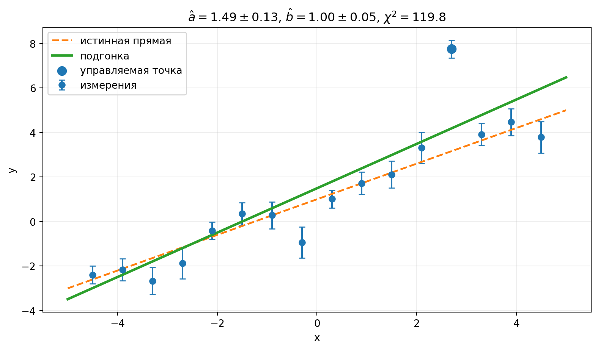

::: chapter-opening
[Аннотация]{.chapter-opening-label}

Метод наименьших квадратов выводится из гауссовой модели измерений. Для подгонки прямой получаются нормальные уравнения и ковариационная матрица параметров, разбираются центрирование координаты, геометрия корреляций, остатки и влияние выбросов.
:::

## От измерений к кривой

Пусть имеются измерения: $$(x_i,y_i\pm\sigma_i),\qquad i=1,\ldots,N,$$ и модель: $$y=f(x;\boldsymbol\theta).$$ Подгонка должна определить параметры $\boldsymbol\theta$, их неопределённости и корреляции, а также проверить согласование модели с данными и структуру остатков. Точки могут иметь разные ошибки, ошибки разных точек могут быть коррелированы, а параметры модели после подгонки тоже могут оказаться сильно связанными между собой.

::: book-note
**Подгонка — статистическая процедура.** По внешнему виду кривой нельзя судить о корректности оценок параметров и их ошибок.
:::

### Связь с гауссовым правдоподобием

Пусть значения $x_i$ известны точно, а наблюдаемые величины $Y_i$ независимы и распределены по гауссу вокруг модельного предсказания [@cowan1998]: $$Y_i\sim\mathrm N\!\left(f(x_i;\boldsymbol\theta),\sigma_i^2\right).$$ Тогда совместная функция правдоподобия равна: $$L(\boldsymbol\theta)=\prod_{i=1}^{N}\frac{1}{\sqrt{2\pi}\sigma_i}
\exp\!\left[-\frac{[y_i-f(x_i;\boldsymbol\theta)]^2}{2\sigma_i^2}\right].$$ Если $\sigma_i$ известны и не зависят от параметров, нормировочные множители не влияют на положение максимума.

::: book-derivation
#### Взвешенная сумма квадратов из правдоподобия

Возьмём логарифм правдоподобия: $$\ln L(\boldsymbol\theta)=\sum_{i=1}^{N}\left[-\ln(\sqrt{2\pi}\sigma_i)-\frac{[y_i-f(x_i;\boldsymbol\theta)]^2}{2\sigma_i^2}\right].$$ Умножая на $-2$, получаем: $$-2\ln L(\boldsymbol\theta)=\sum_{i=1}^{N}\frac{[y_i-f(x_i;\boldsymbol\theta)]^2}{\sigma_i^2}+\mathrm{const}.$$ Максимум правдоподобия находится в той же точке параметров, что и минимум функции

$$
\boxed{
\chi^2(\boldsymbol\theta)
=\sum_{i=1}^{N}\frac{[y_i-f(x_i;\boldsymbol\theta)]^2}{\sigma_i^2}.
}
\quad\blacksquare
$$ {#eq-weighted-least-squares}

В @eq-weighted-least-squares каждое отклонение измеряется в единицах своей стандартной ошибки.
:::

Для отдельной точки удобно ввести остаток: $$r_i=y_i-f(x_i;\boldsymbol\theta),$$ тогда её вклад равен: $$\chi_i^2=\frac{r_i^2}{\sigma_i^2}.$$ Точка с меньшей $\sigma_i$ сильнее ограничивает модель, а точка с большой ошибкой допускает больший абсолютный остаток. Вес точки равен: $$\boxed{w_i=\frac{1}{\sigma_i^2}.}$$

::: book-note
Вес должен следовать из вероятностной модели измерения. Нельзя произвольно менять веса, чтобы получить более удобный или желаемый результат подгонки.
:::

### Когда такой МНК неприменим

Связь с $\chi^2$ возникает из гауссова описания ошибок. При малых пуассоновских счётах, тяжёлых хвостах, асимметричных распределениях, физических границах, существенной зависимости дисперсии от параметров или заметных неопределённостях по оси $x$ такой критерий может оказаться неверной моделью данных. В этих случаях нужно возвращаться к исходной функции правдоподобия.

## Прямая по точкам

Рассмотрим линейную модель: $$y_i=a+b x_i+\varepsilon_i,\qquad \varepsilon_i\sim\mathrm N(0,\sigma_i^2).$$ Для неё справедливо: $$\chi^2(a,b)=\sum_iw_i(y_i-a-bx_i)^2,\qquad w_i=\frac1{\sigma_i^2}.$$ Параметры $a$ и $b$ находятся из условий минимума: $$\frac{\partial\chi^2}{\partial a}=0,\qquad \frac{\partial\chi^2}{\partial b}=0.$$

::: book-derivation
#### Нормальные уравнения для прямой

Дифференцирование по $a$ даёт: $$\frac{\partial\chi^2}{\partial a}=-2\sum_iw_i(y_i-a-bx_i)=0,$$ а по $b$: $$\frac{\partial\chi^2}{\partial b}=-2\sum_iw_ix_i(y_i-a-bx_i)=0.$$ Перенесём известные величины вправо: $$\begin{pmatrix}
\sum_iw_i&\sum_iw_ix_i\\
\sum_iw_ix_i&\sum_iw_ix_i^2
\end{pmatrix}
\begin{pmatrix}a\\b\end{pmatrix}
=
\begin{pmatrix}
\sum_iw_iy_i\\
\sum_iw_ix_iy_i
\end{pmatrix}.$$ Введём обозначения: $$S=\sum_iw_i,\quad S_x=\sum_iw_ix_i,\quad S_y=\sum_iw_iy_i,$$

$$S_{xx}=\sum_iw_ix_i^2,\quad S_{xy}=\sum_iw_ix_iy_i.$$ Тогда система принимает вид: $$\boxed{
\begin{pmatrix}S&S_x\\S_x&S_{xx}\end{pmatrix}
\begin{pmatrix}\widehat a\\\widehat b\end{pmatrix}
=
\begin{pmatrix}S_y\\S_{xy}\end{pmatrix}.}\quad\blacksquare$$
:::

Если обозначить $$A=\begin{pmatrix}S&S_x\\S_x&S_{xx}\end{pmatrix},\qquad
\widehat{\boldsymbol\beta}=\begin{pmatrix}\widehat a\\\widehat b\end{pmatrix},\qquad
\mathbf c=\begin{pmatrix}S_y\\S_{xy}\end{pmatrix},$$ то формальное решение записывается как: $$\boxed{\widehat{\boldsymbol\beta}=A^{-1}\mathbf c.}$$ Обратимость $A$ означает, что данные действительно позволяют различить параметры. Если, например, все точки имеют одно и то же значение $x$, наклон определить нельзя.

### Явные формулы для оценок

Определим: $$\Delta=SS_{xx}-S_x^2.$$ Тогда $$\boxed{
\widehat a=\frac{S_{xx}S_y-S_xS_{xy}}{\Delta},\qquad
\widehat b=\frac{SS_{xy}-S_xS_y}{\Delta}.}$$ Эти выражения показывают, что линейная подгонка с известными ошибками решается аналитически: численный минимизатор здесь не требуется.

## Ковариация параметров прямой

Для гауссовых ошибок: $$L(\boldsymbol\beta)\propto\exp\!\left[-\frac12\chi^2(\boldsymbol\beta)\right].$$ Одновременно многомерная гауссова форма для параметров имеет вид: $$p(\boldsymbol\beta)\propto\exp\!\left[-\frac12(\boldsymbol\beta-\widehat{\boldsymbol\beta})^{\mathsf T}V_\beta^{-1}(\boldsymbol\beta-\widehat{\boldsymbol\beta})\right].$$ Для прямой $\chi^2$ является точной квадратичной функцией $a$ и $b$; локального приближения здесь нет.

::: book-derivation
#### Ковариационная матрица $a$ и $b$

Около минимума для линейной модели: $$\chi^2(\boldsymbol\beta)=\chi^2_{\min}+(\boldsymbol\beta-\widehat{\boldsymbol\beta})^{\mathsf T}
\begin{pmatrix}S&S_x\\S_x&S_{xx}\end{pmatrix}
(\boldsymbol\beta-\widehat{\boldsymbol\beta}).$$ Сравнение с многомерной гауссовой формой даёт: $$V_\beta^{-1}=\begin{pmatrix}S&S_x\\S_x&S_{xx}\end{pmatrix}.$$ После обращения матрицы получим: $$\boxed{V_\beta=\frac1\Delta\begin{pmatrix}S_{xx}&-S_x\\-S_x&S\end{pmatrix}.}$$ Следовательно, $$\boxed{\operatorname{Var}(\widehat a)=\frac{S_{xx}}\Delta,\qquad
\operatorname{Var}(\widehat b)=\frac{S}\Delta,\qquad
\operatorname{Cov}(\widehat a,\widehat b)=-\frac{S_x}\Delta.}\quad\blacksquare$$
:::

### От чего зависят ошибки параметров

Введём взвешенный центр точек по $x$ и их взвешенный разброс: $$\bar x_w=\frac{S_x}{S},\qquad
Q_x=\sum_iw_i(x_i-\bar x_w)^2=\frac\Delta S.$$ Те же формулы принимают более наглядный вид: $$\boxed{\sigma_b^2=\frac1{Q_x},\qquad
\sigma_a^2=\frac1S+\frac{\bar x_w^2}{Q_x},\qquad
\operatorname{Cov}(\widehat a,\widehat b)=-\frac{\bar x_w}{Q_x}.}$$ Малые ошибки измерений увеличивают веса и уменьшают ошибки параметров. Наклон определяется «рычагом» $Q_x$: чем шире точки разнесены по оси $x$, тем точнее измеряется $b$. Параметр $a$ — значение прямой при $x=0$, и если все данные расположены далеко от нуля, неопределённость наклона переносится в неопределённость пересечения.

### Центр тяжести точек

При фиксированном $b$ можно отдельно минимизировать $\chi^2$ по $a$.

::: book-derivation
#### Через какую точку проходит лучшая прямая

Из условия $$0=\frac{\partial\chi^2}{\partial a}=-2\sum_iw_i(y_i-a-bx_i)$$ следует: $$\sum_iw_iy_i-a\sum_iw_i-b\sum_iw_ix_i=0.$$ Разделим на $S=\sum_iw_i$ и введём: $$\bar y_w=\frac{\sum_iw_iy_i}{\sum_iw_i},\qquad \bar x_w=\frac{\sum_iw_ix_i}{\sum_iw_i}.$$ Тогда $$\boxed{a(b)=\bar y_w-b\bar x_w.}$$ Следовательно, при любом фиксированном наклоне оптимальное значение $a$ заставляет прямую проходить через взвешенный центр данных: $$\boxed{(\bar x_w,\bar y_w).}\quad\blacksquare$$
:::

### Геометрия корреляции $a$ и $b$ {#interactive-least-squares-parameter-geometry}

Если изменить наклон, свободный член может частично компенсировать это изменение так, чтобы прямая всё ещё проходила через центр данных. Именно эта компенсация создаёт корреляцию параметров. Когда $\bar x_w>0$, увеличение наклона требует уменьшить $a$, поэтому ковариация отрицательна.

```{ojs}
//| echo: false
//| classes: book-applet

```

:::: {.content-visible unless-format="html:js"}
::: {.animation title="Геометрия корреляции $a$ и $b$" poster="../assets/figures/lsq_parameter_geometry.png" url="https://neutrinohit.github.io/statistical-analysis-course/ru/book/chapters/11_least_squares_linear_fit.html#interactive-least-squares-parameter-geometry" qr="../assets/qr/least-squares-parameter-geometry.png"}
Геометрия корреляции параметров прямой. При изменении наклона свободный член заново подбирается так, чтобы прямая проходила через взвешенный центр данных.
:::
::::

### Центрированная параметризация

Перенесём начало координат в взвешенный центр данных: $$x_i'=x_i-\bar x_w,$$ и запишем ту же прямую как: $$y=a'+b'x',\qquad a'=a+b\bar x_w,\qquad b'=b.$$ Теперь $$S_x'=\sum_iw_ix_i'=0,$$ а значит: $$\boxed{\operatorname{Cov}(\widehat a',\widehat b')=0,\qquad
\operatorname{Var}(\widehat a')=\frac1S,\qquad
\operatorname{Var}(\widehat b')=\frac1{Q_x}.}$$ Параметр $a'$ — это значение прямой в центре данных, а не старое пересечение при $x=0$. Физическая прямая не изменилась, изменилась только параметризация.

### Нормальные координаты

В центрированных параметрах: $$\Delta\chi^2=S(\delta a')^2+Q_x(\delta b')^2.$$ Смешанного члена $\delta a'\delta b'$ нет. Если перейти к безразмерным координатам: $$z_a=\sqrt S\,\delta a'=\frac{\delta a'}{\sigma_{a'}},\qquad
z_b=\sqrt{Q_x}\,\delta b'=\frac{\delta b'}{\sigma_{b'}},$$ то квадратичная форма становится: $$\boxed{\Delta\chi^2=z_a^2+z_b^2.}$$ Это локальные нормальные координаты параметров: сначала устраняется корреляция, затем каждая ось измеряется в единицах собственной стандартной ошибки.

## Остатки и выбросы {#interactive-least-squares-outlier}

Квадратичный критерий особенно чувствителен к большим отклонениям, потому что остаток входит в $\chi^2$ в квадрате. Один далёкий выброс может заметно сдвинуть подогнанную прямую и увеличить минимум $\chi^2$. Остатки $$\frac{y_i-f(x_i;\widehat{\boldsymbol\theta})}{\sigma_i}$$ позволяют увидеть структуру, которую легко не заметить на основном графике.

```{ojs}
//| echo: false
//| classes: book-applet

```

::::: {.content-visible unless-format="html:js"}
::: {.animation title="Остатки и выбросы" poster="../assets/figures/lsq_fit_no_outlier.png" url="https://neutrinohit.github.io/statistical-analysis-course/ru/book/chapters/11_least_squares_linear_fit.html#interactive-least-squares-outlier" qr="../assets/qr/least-squares-outlier.png"}
Взвешенная линейная подгонка без дополнительного выброса. Подогнанная прямая флуктуирует около истинной модели.
:::

::: figure-panel
{#fig-least-squares-outlier}
:::
:::::

::: book-note
Обычный метод наименьших квадратов не является устойчивым к выбросам. Диагностика остатков — обязательная часть подгонки, а не дополнительный декоративный график.
:::

::: chapter-summary
## Итоги главы

- Взвешенный МНК следует из гауссова правдоподобия с известными дисперсиями измерений.
- Линейная модель приводит к нормальным уравнениям и аналитической ковариационной матрице параметров.
- Разброс точек по $x$ определяет точность наклона прямой.
- Центрирование координаты уменьшает корреляцию наклона и свободного члена.
- Остатки и устойчивость к выбросам входят в обязательную диагностику подгонки.
:::

## Задачи



## Литература {.unnumbered}

::: {#refs}
:::
