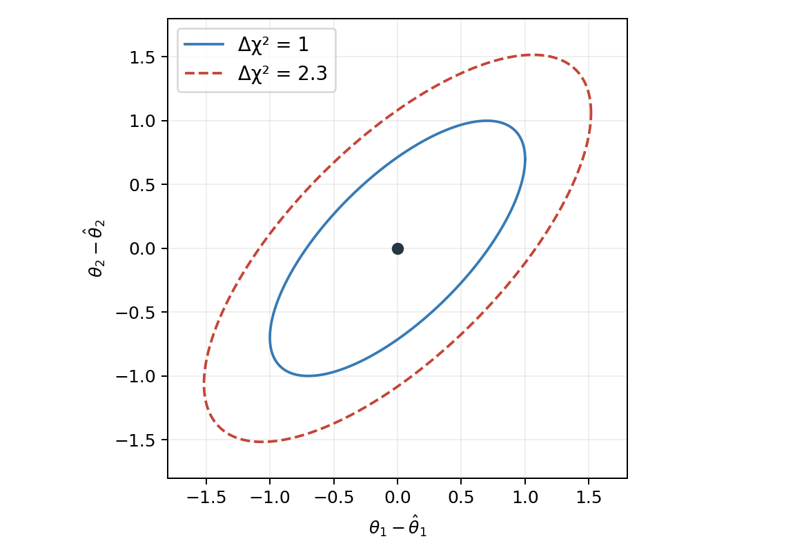
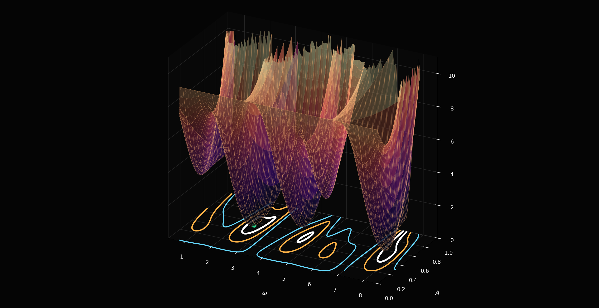

::: chapter-opening
[Аннотация]{.chapter-opening-label}

Глава обобщает метод наименьших квадратов на коррелированные измерения и несколько параметров. Рассматриваются интервалы по форме $\chi^2$, систематические неопределённости, профилирование мешающих параметров, нормировочная неопределённость и перенос ковариации после подгонки.
:::

## Общий случай с ковариационной матрицей

До сих пор предполагалось, что ошибки разных $y_i$ независимы. В общем гауссовом случае данные описываются вектором: $$\mathbf y=(y_1,\ldots,y_N)^{\mathsf T},$$ модель — вектором математических ожиданий: $$\boldsymbol\lambda(\boldsymbol\theta)=(\lambda_1,\ldots,\lambda_N)^{\mathsf T},$$ а статистические связи между измерениями задаются ковариационной матрицей: $$V_y=\operatorname{Cov}(\mathbf y).$$ Тогда

$$
\boxed{
\chi^2(\boldsymbol\theta)
=(\mathbf y-\boldsymbol\lambda)^{\mathsf T}V_y^{-1}
(\mathbf y-\boldsymbol\lambda).
}
$$ {#eq-correlated-least-squares}

Если $V_y$ диагональна, @eq-correlated-least-squares возвращается к обычной сумме $r_i^2/\sigma_i^2$.

### Линейная многопараметрическая модель

Для линейной модели: $$\boldsymbol\lambda=H\boldsymbol\theta,$$ где $H$ — матрица размера $N\times p$, задача также решается аналитически.

::: book-derivation
#### Решение линейной модели с коррелированными ошибками

Минимизируем $$\chi^2=(\mathbf y-H\boldsymbol\theta)^{\mathsf T}V_y^{-1}(\mathbf y-H\boldsymbol\theta).$$ Условие стационарности по вектору параметров даёт нормальные уравнения: $$H^{\mathsf T}V_y^{-1}H\,\widehat{\boldsymbol\theta}=H^{\mathsf T}V_y^{-1}\mathbf y.$$ Если матрица слева обратима, получаем: $$\boxed{\widehat{\boldsymbol\theta}=(H^{\mathsf T}V_y^{-1}H)^{-1}H^{\mathsf T}V_y^{-1}\mathbf y.}$$ Ковариационная матрица оценок равна: $$\boxed{V_\theta=(H^{\mathsf T}V_y^{-1}H)^{-1}.}\quad\blacksquare$$
:::

## Интервалы из формы $\chi^2$

### Один параметр {#interactive-least-squares-delta-chi2}

Если около минимума зависимость хорошо описывается квадратичной формой, то $$\chi^2(\theta)\approx\chi^2_{\min}+\frac{(\theta-\widehat\theta)^2}{\sigma_\theta^2}.$$ Точки на расстоянии одной локальной стандартной ошибки удовлетворяют: $$\boxed{\chi^2(\widehat\theta\pm\sigma_\theta)-\chi^2_{\min}=1.}$$

::: book-note
$\Delta\chi^2=1$ здесь — локальное гауссово правило для **одного** параметра. Формальная связь порогов $\Delta\chi^2$ с доверительными областями и распределением статистики рассматривается дальше в курсе.
:::

```{ojs}
//| echo: false
//| classes: book-applet

```

:::: {.content-visible unless-format="html:js"}
::: {.animation title="Один параметр" poster="../assets/figures/lsq_delta_chi2_one_sigma.png" url="https://neutrinohit.github.io/statistical-analysis-course/ru/book/chapters/12_least_squares_systematics.html#interactive-least-squares-delta-chi2" qr="../assets/qr/least-squares-delta-chi2.png"}
Квадратичная форма $\chi^2$ для одного параметра. Пересечения уровня $\chi^2_{\min}+1$ лежат на расстоянии одной локальной стандартной ошибки от минимума.
:::
::::

### Несколько параметров

Для нескольких параметров локальная форма имеет вид: $$\chi^2(\boldsymbol\theta)\approx\chi^2_{\min}+(\boldsymbol\theta-\widehat{\boldsymbol\theta})^{\mathsf T}V_\theta^{-1}(\boldsymbol\theta-\widehat{\boldsymbol\theta}).$$ Уравнение $$\Delta\chi^2=\chi^2-\chi^2_{\min}=c$$ задаёт эллипсоиды в пространстве параметров. Матрица $V_\theta$ определяет размеры и наклон этих областей. Такая картина является локальной: если поверхность $\chi^2$ имеет несколько минимумов, острова или сильную нелинейность, простой эллипс уже не описывает её глобальную форму.

::: figure-panel
{#fig-least-squares-quadratic-surface}
:::

::: figure-panel
{#fig-least-squares-nongaussian-surface}
:::

## Систематические неопределённости

В реальной подгонке модель зависит от измеряемых параметров и от параметров, описывающих калибровки, эффективности, фон, нормировку и другие источники систематической неопределённости.

::: book-note
**Параметр интереса** — величина, ради которой выполняется измерение. **Мешающий параметр** влияет на предсказание, но сам не является целью анализа. Систематическая неопределённость появляется из неопределённости таких физических, инструментальных или модельных величин.
:::

Пусть параметры интереса обозначены $\boldsymbol\theta$, а мешающие параметры — $\boldsymbol\eta$: $$\boldsymbol\lambda=\boldsymbol\lambda(\boldsymbol\theta,\boldsymbol\eta).$$ Если о мешающих параметрах уже имеется внешняя информация, $$\boldsymbol\eta\approx\boldsymbol\eta_0,\qquad \operatorname{Cov}(\boldsymbol\eta)=V_\eta,$$ то её можно включить в функцию $\chi^2$: $$\boxed{
\chi^2(\boldsymbol\theta,\boldsymbol\eta)=
(\mathbf y-\boldsymbol\lambda)^{\mathsf T}V_y^{-1}(\mathbf y-\boldsymbol\lambda)
+(\boldsymbol\eta-\boldsymbol\eta_0)^{\mathsf T}V_\eta^{-1}(\boldsymbol\eta-\boldsymbol\eta_0).}$$ Второе слагаемое часто называют штрафным членом. Малое $V_\eta$ жёстко удерживает параметр около номинального значения, а большая неопределённость делает его почти свободным.

### Профилирование мешающих параметров

Нас обычно интересует зависимость результата только от $\boldsymbol\theta$. Для каждого фиксированного значения параметров интереса мешающие параметры можно заново подобрать так, чтобы $\chi^2$ было минимальным: $$\boxed{\chi^2_{\mathrm p}(\boldsymbol\theta)=\min_{\boldsymbol\eta}\chi^2(\boldsymbol\theta,\boldsymbol\eta)=\chi^2\!\left(\boldsymbol\theta,\widehat{\widehat{\boldsymbol\eta}}(\boldsymbol\theta)\right).}$$ Двойная шляпа означает, что $\boldsymbol\eta$ оптимизирована при фиксированном $\boldsymbol\theta$.

::: book-note
Профилирование не выбрасывает мешающие параметры. Оно отвечает на вопрос: насколько хорошо можно описать данные при выбранном $\boldsymbol\theta$, если все остальные параметры подобрать наилучшим допустимым образом.
:::

### Линейная систематика

Если зависимость от мешающих параметров в окрестности номинала линейна, $$\boldsymbol\lambda(\boldsymbol\theta,\boldsymbol\eta)\approx\boldsymbol\lambda_0(\boldsymbol\theta)+H(\boldsymbol\theta)(\boldsymbol\eta-\boldsymbol\eta_0),$$ где $$H_{ij}=\left.\frac{\partial\lambda_i}{\partial\eta_j}\right|_{\boldsymbol\eta=\boldsymbol\eta_0},$$ можно аналитически исключить мешающие параметры.

::: book-derivation
#### Аналитическое профилирование линейной систематики

Обозначим $$\boldsymbol\delta=\boldsymbol\eta-\boldsymbol\eta_0,\qquad
\mathbf r(\boldsymbol\theta)=\mathbf y-\boldsymbol\lambda_0(\boldsymbol\theta).$$ Тогда $$\chi^2=(\mathbf r-H\boldsymbol\delta)^{\mathsf T}V_y^{-1}(\mathbf r-H\boldsymbol\delta)+\boldsymbol\delta^{\mathsf T}V_\eta^{-1}\boldsymbol\delta.$$ Минимизация по $\boldsymbol\delta$ даёт: $$\boxed{
\widehat{\widehat{\boldsymbol\delta}}(\boldsymbol\theta)=
\left(V_\eta^{-1}+H^{\mathsf T}V_y^{-1}H\right)^{-1}H^{\mathsf T}V_y^{-1}\mathbf r(\boldsymbol\theta).}$$ После подстановки оптимального значения получается эквивалентная запись: $$\boxed{\chi^2_{\mathrm p}(\boldsymbol\theta)=\mathbf r^{\mathsf T}V^{-1}\mathbf r,\qquad V=V_y+HV_\eta H^{\mathsf T}.}$$ Следовательно, линейная систематика добавляет к ковариации данных вклад: $$\boxed{V_{\mathrm{sys}}=HV_\eta H^{\mathsf T}.}\quad\blacksquare$$
:::

## Общая нормировка и парадокс Д'Агостини

Рассмотрим несколько измерений одной величины $\mu$ с абсолютными индивидуальными ошибками $s_i$ и общей относительной неопределённостью нормировки $f_N$. Удобно ввести общий мешающий параметр $\alpha$: $$\lambda_i(\mu,\alpha)=(1+\alpha)\mu,\qquad \alpha=0\pm f_N.$$ Для такой модели $$H_{i1}=\left.\frac{\partial\lambda_i}{\partial\alpha}\right|_{\alpha=0}=\mu,$$ поэтому нормировочная часть ковариации должна зависеть от **модельного предсказания**: $$\boxed{(V_{\mathrm{norm}})_{ij}=f_N^2\mu^2.}$$

### Наивная подстановка данных

Возьмём две точки: $$x_1=8.0,\qquad x_2=8.5,$$ с индивидуальными относительными ошибками $2\%$: $$s_1=0.16,\qquad s_2=0.17,$$ и общей нормировочной неопределённостью $f_N=0.10$. Статистическая матрица равна: $$V_{\mathrm{stat}}=\begin{pmatrix}0.0256&0\\0&0.0289\end{pmatrix}.$$ Если ошибочно построить нормировочную ковариацию из самих данных, $$V_{\mathrm{norm}}^{\mathrm{bad}}=f_N^2\begin{pmatrix}x_1^2&x_1x_2\\x_1x_2&x_2^2\end{pmatrix},$$ то $$V_{\mathrm{bad}}=\begin{pmatrix}0.6656&0.6800\\0.6800&0.7514\end{pmatrix}.$$

::: book-derivation
#### Почему наивная ковариация даёт значение ниже обеих точек {#interactive-least-squares-normalization}

Для постоянной модели $\lambda_i=\mu$ запишем: $$\chi^2(\mu)=(\mathbf x-\mu\mathbf1)^{\mathsf T}W(\mathbf x-\mu\mathbf1),\qquad W=V^{-1}.$$ Раскрывая скобки, получим: $$\chi^2=\mathbf x^{\mathsf T}W\mathbf x-2\mu\mathbf1^{\mathsf T}W\mathbf x+\mu^2\mathbf1^{\mathsf T}W\mathbf1.$$ Условие минимума даёт: $$\boxed{\widehat\mu=\frac{\mathbf1^{\mathsf T}W\mathbf x}{\mathbf1^{\mathsf T}W\mathbf1}=\mathbf w^{\mathsf T}\mathbf x,\qquad \mathbf w=\frac{W\mathbf1}{\mathbf1^{\mathsf T}W\mathbf1}.}$$ Для наивной матрицы веса примерно равны: $$\mathbf w_{\mathrm{bad}}\approx\begin{pmatrix}1.253\\-0.253\end{pmatrix}.$$ Получаем $$\boxed{\widehat\mu_{\mathrm{bad}}\approx7.87\pm0.81.}\quad\blacksquare$$
:::

Значение $7.87$ находится ниже обеих измеренных точек. Это не арифметическая ошибка минимизации: она честно решила задачу с заданной матрицей. Проблема состоит в самой вероятностной модели. Подстановка $f_N^2x_ix_j$ делает абсолютную систематическую ошибку зависимой от случайной флуктуации измеренного значения; при сильной корреляции большая точка может получить отрицательный эффективный вес.

```{ojs}
//| echo: false
//| classes: book-applet

```

:::: {.content-visible unless-format="html:js"}
::: {.animation title="Почему наивная ковариация даёт значение ниже обеих точек" poster="../assets/figures/lsq_dagostini_comparison.png" url="https://neutrinohit.github.io/statistical-analysis-course/ru/book/chapters/12_least_squares_systematics.html#interactive-least-squares-normalization" qr="../assets/qr/least-squares-normalization.png"}
Сравнение наивной нормировочной ковариации с корректной моделью общей нормировки. Наивная конструкция даёт оценку ниже обеих измеренных точек.
:::
::::

### Ковариация из модели

Правильная матрица должна использовать предсказание $\mu$: $$\boxed{V_{ij}(\mu)=s_i^2\delta_{ij}+f_N^2\mu^2.}$$ Самосогласованное центральное значение определяется статистическими весами: $$\widehat\mu=\frac{\sum_ix_i/s_i^2}{\sum_i1/s_i^2}\approx8.235.$$ При этом $$V_{\mathrm{corr}}\approx\begin{pmatrix}0.7037&0.6781\\0.6781&0.7070\end{pmatrix},$$ а веса становятся положительными: $$\mathbf w_{\mathrm{corr}}\approx\begin{pmatrix}0.530\\0.470\end{pmatrix}.$$ Итоговая оценка: $$\boxed{\widehat\mu_{\mathrm{corr}}\approx8.235\pm0.832.}$$ Общая нормировка увеличивает ошибку, но не вынуждает центральное значение уходить ниже обеих точек.

### То же через штрафной член

Ту же физическую модель можно записать непосредственно через мешающий параметр: $$x_i=(1+\alpha)\mu+\varepsilon_i,\qquad \varepsilon_i\sim\mathrm N(0,s_i^2),\qquad \alpha=0\pm f_N.$$ Минимизируется функция: $$\boxed{\chi^2(\mu,\alpha)=\sum_i\frac{[x_i-(1+\alpha)\mu]^2}{s_i^2}+\frac{\alpha^2}{f_N^2}.}$$

::: book-derivation
#### Центральное значение и ошибка из штрафной модели

Обозначим: $$R(\mu,\alpha)=\sum_i\frac{x_i-(1+\alpha)\mu}{s_i^2}.$$ Условия минимума имеют вид: $$\frac{\partial\chi^2}{\partial\mu}=-2(1+\alpha)R=0,$$

$$\frac{\partial\chi^2}{\partial\alpha}=-2\mu R+\frac{2\alpha}{f_N^2}=0.$$ Из первого условия $R=0$, а тогда второе даёт $\widehat\alpha=0$. Следовательно, $$\boxed{\widehat\mu=\frac{\sum_ix_i/s_i^2}{\sum_i1/s_i^2}\approx8.235.}$$ Квадратичная форма по $(\mu,\alpha)$ даёт: $$\operatorname{Cov}(\widehat\mu,\widehat\alpha)\approx\begin{pmatrix}0.6917&-0.0823\\-0.0823&0.0100\end{pmatrix},$$ поэтому $$\boxed{\widehat\mu\approx8.235\pm\sqrt{0.6917}=8.235\pm0.832.}\quad\blacksquare$$
:::

Ту же дисперсию можно представить как сумму статистического и нормировочного вкладов: $$\sigma_\mu^2\approx\left(\sum_i\frac1{s_i^2}\right)^{-1}+(f_N\widehat\mu)^2\approx0.0136+0.6781=0.6917.$$ Ковариационная матрица и штрафной параметр дают один и тот же ответ, если оба построены из одной и той же физической модели [@dagostini1994bias].

## Распространение ошибок после подгонки

Пусть получены $$\widehat{\boldsymbol\theta},\qquad V_\theta=\operatorname{Cov}(\widehat{\boldsymbol\theta}),$$ а интересующая величина является функцией этих параметров: $$\boldsymbol\alpha=\boldsymbol\alpha(\boldsymbol\theta).$$ Оценка получается простой подстановкой: $$\widehat{\boldsymbol\alpha}=\boldsymbol\alpha(\widehat{\boldsymbol\theta}).$$ В линейном приближении ковариация переносится якобианом: $$\boxed{V_\alpha=AV_\theta A^{\mathsf T},\qquad A_{ij}=\left.\frac{\partial\alpha_i}{\partial\theta_j}\right|_{\widehat{\boldsymbol\theta}}.}$$ Внедиагональные элементы $V_\theta$ здесь столь же важны, как и дисперсии: корреляции подогнанных параметров также распространяются на производную величину. Формула локальна; при сильной нелинейности или физических границах результат нужно проверять сканом или псевдоэкспериментами.

## Что именно даёт минимум $\chi^2$

В этой главе $\chi^2$ используется прежде всего как функция для оценки параметров и их локальных неопределённостей. Само значение $\chi^2_{\min}$ часто применяют и для формальной проверки согласия модели с данными, но для этого требуется знать распределение соответствующей статистики и число степеней свободы. Эта задача рассматривается отдельно.

::: book-note
Не следует автоматически интерпретировать любой минимум $\chi^2$ как доказательство хорошего согласия модели с данными. Подгонка параметров и формальная проверка качества согласия — связанные, но разные статистические задачи.
:::

## Когда метод наименьших квадратов лучше не использовать

МНК не является универсальной заменой функции правдоподобия. Особенно осторожно нужно действовать при малых пуассоновских счётах и пустых бинах, событийном анализе без биннирования, параметрически зависимых ошибках, заметных неопределённостях по нескольким координатам, асимметричных или ограниченных распределениях и явно не квадратичной форме около минимума. В этих случаях исходной точкой должна быть вероятностная модель наблюдений.

## Практическая процедура анализа

Рабочая последовательность состоит в том, чтобы сначала записать модель $\boldsymbol\lambda(\boldsymbol\theta,\boldsymbol\eta)$ и определить ковариацию данных $V_y$. Для систематик задаются номинальные значения $\boldsymbol\eta_0$ и их ковариация $V_\eta$. Затем строится полная функция $\chi^2$ со штрафными членами, выполняется совместная минимизация или профилирование мешающих параметров, а ковариация параметров извлекается из локальной квадратичной формы. После подгонки нужно исследовать остатки, корреляции и устойчивость результата.

### Что сообщать вместе с результатом

Вместе с подогнанными параметрами нужно указывать их единицы и ковариационную или корреляционную матрицу, использованный вид $\chi^2$, включённые систематики и способ их ограничения, факт профилирования мешающих параметров, а также графики данных, модели и остатков. Число без описания статистической модели и корреляций не даёт полной информации о подгонке.

::: chapter-summary
## Итоги главы

- Коррелированные измерения входят в $\chi^2$ через полную ковариационную матрицу.
- Интервалы по $\Delta\chi^2$ имеют стандартную интерпретацию только в локальном гауссовом приближении.
- Систематические неопределённости описываются мешающими параметрами и вспомогательной информацией.
- Линейная систематика допускает эквивалентные ковариационную и профильную записи.
- Нормировочную ковариацию строят из модели, поскольку использование флуктуировавших данных смещает результат.
- После подгонки публикуют параметры, их ковариации, использованный критерий и диагностику остатков.
:::

## Задачи



## Литература {.unnumbered}

::: {#refs}
:::
