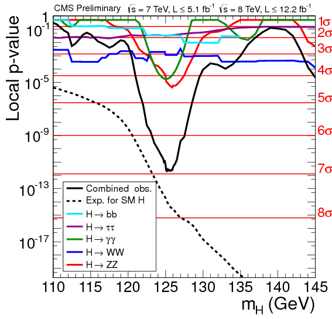

::: chapter-opening
[Аннотация]{.chapter-opening-label}

После подгонки параметров остаётся отдельный вопрос: действительно ли выбранная модель согласуется с данными. В этой главе минимальное значение $\chi^2$ рассматривается как случайная статистика, выводится распределение $\chi^2$ и объясняется роль числа степеней свободы. Затем вводится $p$-уровень значимости, разбирается его односторонний и двусторонний перевод в число стандартных отклонений $Z$, а также показывается, почему при нарушении условий аналитического приближения распределение статистики необходимо получать псевдоэкспериментами.
:::

## После подгонки

К этому этапу анализа уже известна вероятностная модель и правило подгонки. Для независимых измерений с гауссовыми ошибками параметры находят из минимума: $$\chi^2(\boldsymbol\theta)=\sum_{i=1}^{N}\frac{[y_i-f(x_i;\boldsymbol\theta)]^2}{\sigma_i^2},$$ а оценка параметров имеет вид: $$\widehat{\boldsymbol\theta}=\operatorname*{arg\,min}_{\boldsymbol\theta}\chi^2(\boldsymbol\theta).$$ Минимум существует почти всегда. Даже модель, которая плохо описывает данные, обычно имеет некоторый набор параметров, для которого несогласие минимально. Само существование $\widehat{\boldsymbol\theta}$ ещё ничего не говорит о качестве модели.

::: book-note
**Подгонка и проверка качества согласия — разные задачи.** Подгонка отвечает на вопрос, какие параметры лучше всего описывают данные внутри выбранной модели. Проверка качества согласия отвечает на вопрос, типичны ли наблюдаемые отклонения, если эта модель верна.
:::

### Остатки после подгонки

Рассмотрим калибровочную прямую: $$y_i=a+b x_i+\varepsilon_i,\qquad \varepsilon_i\sim\mathrm N(0,\sigma_i^2).$$ Подгонка всегда возвращает числа $\widehat a$ и $\widehat b$, однако данные при этом вовсе не обязаны быть похожи на прямую. Для проверки нужно смотреть на остатки: $$r_i=y_i-\widehat a-\widehat b x_i$$ и особенно на нормированные остатки: $$z_i=\frac{y_i-f(x_i;\widehat{\boldsymbol\theta})}{\sigma_i}.$$ Если модель верна и ошибки оценены правильно, такие величины должны выглядеть как типичные гауссовы отклонения. Суммарная величина $$\boxed{\chi^2_{\min}=\sum_i z_i^2}$$ собирает отклонения всех точек в одно число. Большой вклад одной точки означает большой остаток в единицах её ошибки, а большое суммарное значение указывает на общее несогласие модели с наблюдениями.

### Статистика как случайная величина

До проведения эксперимента значения $y_i$ случайны. Следовательно, случайны и подогнанные параметры, и величина $\chi^2_{\min}$. Она является **статистикой** — числовой функцией выборки, построенной по данным. Чтобы понять, является ли полученное $\chi^2_{\min}$ обычным или редким, необходимо знать его распределение при условии справедливости модели.

::: book-note
Нельзя судить о качестве согласия только по числу $\chi^2_{\min}$. Одно и то же значение может быть обычным для одной размерности задачи и крайне редким для другой. Интерпретацию определяет распределение статистики.
:::

## Почему правило $\chi^2/\nu\approx1$ недостаточно

В физическом фольклоре часто встречается правило: $$\frac{\chi^2_{\min}}{\nu}\approx1\quad\Longrightarrow\quad\text{согласие хорошее},$$ где $\nu$ — число степеней свободы. Это правило без указания числа степеней свободы неверно: вероятность одного и того же отношения зависит от $\nu$. Рассмотрим два случая: $$\chi^2_{\min}=12,\quad \nu=10,$$ и $$\chi^2_{\min}=1200,\quad \nu=1000.$$ В обоих случаях отношение равно $1.2$, но первое отклонение вполне типично, а второе находится далеко в хвосте распределения. Чтобы понять различие, нужно вывести распределение $\chi^2$.

## Распределение $\chi^2$

### Один нормированный остаток

Пусть $$Z\sim\mathrm N(0,1),\qquad f_Z(z)=\frac1{\sqrt{2\pi}}e^{-z^2/2},$$ и введём неотрицательную величину: $$T=Z^2.$$ Большое значение $T$ соответствует большому отклонению от нуля в единицах стандартной ошибки.

::: book-derivation
#### Плотность квадрата стандартной гауссовой величины

Для $t>0$ уравнение $z^2=t$ имеет две ветви: $$z=\sqrt t,\qquad z=-\sqrt t.$$ Для обеих ветвей модуль якобиана одинаков: $$\left|\frac{dz}{dt}\right|=\frac1{2\sqrt t}.$$ Плотность $T$ равна сумме вкладов двух корней:
$$f_T(t)
=f_Z(\sqrt t)\left|\frac{dz}{dt}\right|_{z=\sqrt t}
+f_Z(-\sqrt t)\left|\frac{dz}{dt}\right|_{z=-\sqrt t}=\frac{f_Z(\sqrt t)+f_Z(-\sqrt t)}{2\sqrt t}.$$ Поскольку нормальная плотность симметрична, $$\boxed{f_T(t)=\frac1{\sqrt{2\pi t}}e^{-t/2},\qquad t>0.}\quad\blacksquare$$
:::

Это распределение $\chi^2$ с одной степенью свободы.

### Несколько независимых остатков

Пусть теперь есть $\nu$ независимых стандартных гауссовых величин $$Z_1,\ldots,Z_\nu\sim\mathrm N(0,1),$$ и $$T=\sum_{i=1}^{\nu}Z_i^2.$$ Совместная плотность зависит от суммы квадратов: $$f(\mathbf z)\propto\exp\!\left(-\frac12\sum_{i=1}^{\nu}z_i^2\right).$$ Геометрически $T=r^2$ — квадрат расстояния от центра в $\nu$-мерном пространстве нормированных отклонений.

::: book-derivation
#### Геометрический вывод формы $\chi^2_\nu$

Вероятность попасть в тонкий сферический слой радиуса $r$ содержит гауссов множитель и объём слоя: $$e^{-r^2/2}\,r^{\nu-1}dr.$$ Переходим к $t=r^2$. Тогда $$r=\sqrt t,\qquad dr=dt/(2\sqrt t),$$ и $$r^{\nu-1}dr=\tfrac12t^{\nu/2-1}dt.$$ Поэтому $$f(t;\nu)\propto t^{\nu/2-1}e^{-t/2}.$$ После нормировки получаем

$$
\boxed{
f(t;\nu)=\frac{1}{2^{\nu/2}\Gamma(\nu/2)}
t^{\nu/2-1}e^{-t/2},\qquad t\ge0.
}
\quad\blacksquare
$$ {#eq-chi-square-density}

Плотность @eq-chi-square-density зависит от единственного параметра $\nu$ — числа степеней свободы.
:::

Здесь гамма-функция определяется как: $$\Gamma(a)=\int_0^\infty u^{a-1}e^{-u}\,du,$$ а для целых аргументов связана с факториалом: $$\Gamma(n)=(n-1)!,\qquad \Gamma(1/2)=\sqrt\pi.$$

### Среднее и дисперсия

::: book-derivation
#### Математическое ожидание распределения $\chi^2$

Используем плотность: $$f(t;\nu)=\frac{1}{2^{\nu/2}\Gamma(\nu/2)}t^{\nu/2-1}e^{-t/2}.$$ Тогда $$\mathbb E[T]=\frac{1}{2^{\nu/2}\Gamma(\nu/2)}\int_0^\infty t^{\nu/2}e^{-t/2}\,dt.$$ При подстановке $t=2u$ получаем: $$\mathbb E[T]=2\frac{\Gamma(\nu/2+1)}{\Gamma(\nu/2)}=\nu.$$ Отсюда $$\boxed{\mathbb E[\chi^2_\nu]=\nu.}\quad\blacksquare$$
:::

::: book-derivation
#### Дисперсия распределения $\chi^2$

Аналогично для второго момента: $$\mathbb E[T^2]=4\frac{\Gamma(\nu/2+2)}{\Gamma(\nu/2)}=\nu(\nu+2).$$ Следовательно, $$\operatorname{Var}(T)=\mathbb E[T^2]-\mathbb E[T]^2=\nu(\nu+2)-\nu^2=2\nu.$$ Получаем $$\boxed{\mathbb E[\chi^2_\nu]=\nu,\qquad \operatorname{Var}(\chi^2_\nu)=2\nu.}\quad\blacksquare$$
:::

Среднее растёт как $\nu$, а стандартное отклонение равно $\sqrt{2\nu}$. Для отношения $\chi^2/\nu$ стандартное отклонение равно $\sqrt{2/\nu}$. При больших $\nu$ даже небольшое относительное превышение единицы может соответствовать многим стандартным отклонениям.

### Как меняется форма распределения {#interactive-goodness-chi2-shape}

```{ojs}
//| echo: false
//| classes: book-applet

```

:::: {.content-visible unless-format="html:js"}
::: {.animation title="Как меняется форма распределения" poster="../assets/figures/gof_chi2_nu10.png" url="https://neutrinohit.github.io/statistical-analysis-course/ru/book/chapters/13_goodness_of_fit_and_significance.html#interactive-goodness-chi2-shape" qr="../assets/qr/goodness-chi2-shape.png"}
Распределение $\chi^2$ при $\nu=10$. Вертикальная линия показывает среднее $\nu$, а соседние отметки соответствуют расстоянию $\sqrt{2\nu}$.
:::
::::

При малом числе степеней свободы распределение заметно асимметрично и ограничено снизу нулём. С ростом $\nu$ максимум смещается вправо, а относительная ширина распределения уменьшается.

## Коррелированные ошибки и число степеней свободы

Если ошибки наблюдений коррелированы, критерий записывается через ковариационную матрицу: $$\chi^2=(\mathbf y-\boldsymbol\lambda)^{\mathsf T}V^{-1}(\mathbf y-\boldsymbol\lambda).$$ Корреляции не уменьшают число независимых направлений, если $V$ невырождена.

::: book-derivation
#### Диагонализация ковариационной формы

Пусть $$V=Q\Lambda Q^{\mathsf T},\qquad \Lambda=\operatorname{diag}(\lambda_1,\ldots,\lambda_N),$$ где все $\lambda_i>0$. Введём нормированные координаты: $$\mathbf z=\Lambda^{-1/2}Q^{\mathsf T}(\mathbf y-\boldsymbol\lambda).$$ Тогда $$\chi^2=\mathbf z^{\mathsf T}\mathbf z=\sum_{i=1}^{N}z_i^2.$$ Размерность пространства осталась равной $N$. Точное уменьшение размерности возникает только тогда, когда одна из собственных дисперсий равна нулю и ковариационная матрица становится вырожденной: $$\boxed{\chi^2=\sum_{i=1}^{N}z_i^2,\qquad \dim\mathbf z=N.}\quad\blacksquare$$
:::

### Почему подгонка уменьшает число степеней свободы

После нормировки данные можно представить точкой в $N$-мерном пространстве. Если параметры модели заранее фиксированы, $\chi^2$ — квадрат расстояния от этой точки до заданного предсказания. Если линейная модель содержит $m$ подгоняемых параметров, возможные предсказания образуют $m$-мерную поверхность. Подгонка выбирает ближайшую точку этой поверхности, а остаток остаётся в ортогональном пространстве размерности $N-m$.

::: book-note
Для линейной гауссовой задачи с фиксированной невырожденной ковариацией $$\boxed{\nu=N-m.}$$ Потеря степеней свободы связана с использованием данных для оценки $m$ параметров, а не с наличием корреляций между измерениями.
:::

### Пример: подгонка константы

Пусть $$y_i=\mu+\varepsilon_i,\qquad \varepsilon_i\sim\mathrm N(0,\sigma^2).$$ Если $\mu$ известна заранее, то $$\chi^2(\mu)=\sum_{i=1}^{N}\frac{(y_i-\mu)^2}{\sigma^2}\sim\chi^2_N.$$ Если же $\mu$ оценивается по тем же данным, $$\widehat\mu=\frac1N\sum_i y_i,$$ то остатки удовлетворяют точному условию: $$\sum_i(y_i-\widehat\mu)=0.$$ Это одно линейное ограничение: вектор остатков лежит в гиперплоскости размерности $N-1$. Отсюда $$\boxed{\chi^2_{\min}\sim\chi^2_{N-1}.}$$

### Когда правило $\chi^2_{\min}\sim\chi^2_\nu$ может не работать

Такое распределение не является универсальным. Оно может нарушаться, если модель существенно нелинейна, параметры находятся на физической границе, ошибки зависят от параметров, имеются малые пуассоновские счёты, точные ограничения или вырожденная ковариационная матрица. В подобных случаях не следует пытаться угадывать «исправленное» число степеней свободы — распределение используемой статистики нужно получить непосредственно псевдоэкспериментами.

## $p$-уровень значимости

Пусть после подгонки получено значение $\chi^2_{\mathrm{obs}}$. Если распределение $\chi^2_\nu$ применимо, правый хвост определяет $p$-уровень:

$$
\boxed{
p=\int_{\chi^2_{\mathrm{obs}}}^{\infty}f(t;\nu)\,dt.
}
$$ {#eq-chi-square-p-value}

В @eq-chi-square-p-value вычисляется вероятность при справедливости модели получить такое же или ещё большее несогласие. Чем меньше $p$, тем менее типично полученное значение статистики.

::: book-note
$p$-уровень не является вероятностью истинности модели. Неверно писать $p=P(H_0\mid\text{данные})$ или утверждать, что модель неверна с вероятностью $1-p$. Правильная интерпретация: при условии справедливости модели вероятность получить такие или более несогласованные данные равна $p$.
:::

### Правый хвост на графике {#interactive-goodness-pvalue-tail}

```{ojs}
//| echo: false
//| classes: book-applet

```

:::: {.content-visible unless-format="html:js"}
::: {.animation title="Правый хвост на графике" poster="../assets/figures/gof_pvalue_nu50_obs70.png" url="https://neutrinohit.github.io/statistical-analysis-course/ru/book/chapters/13_goodness_of_fit_and_significance.html#interactive-goodness-pvalue-tail" qr="../assets/qr/goodness-pvalue-tail.png"}
Правый хвост распределения $\chi^2$ при $\nu=50$ и наблюдаемом значении $\chi^2_{\mathrm{obs}}=70$. Площадь хвоста равна $p$-уровню.
:::
::::

### Проверка калибровки на псевдоэкспериментах {#interactive-goodness-pvalue-calibration}

Есть простой способ проверить, что $p$ вычисляется корректно. Сначала генерируется большой набор значений статистики из модели и строится её калибровочное распределение. Затем независимо генерируются новые псевдоданные. Для каждого значения $t$ считается доля калибровочной выборки справа от него. Для непрерывной статистики и точного калибровочного распределения $p$-уровни равномерны на отрезке от нуля до единицы. Для дискретной статистики они принимают конечный набор значений и обычно имеют консервативное распределение [@cowan1998].

```{ojs}
//| echo: false
//| classes: book-applet

```

:::: {.content-visible unless-format="html:js"}
::: {.animation title="Проверка калибровки на псевдоэкспериментах" poster="../assets/figures/gof_p_uniform.png" url="https://neutrinohit.github.io/statistical-analysis-course/ru/book/chapters/13_goodness_of_fit_and_significance.html#interactive-goodness-pvalue-calibration" qr="../assets/qr/goodness-pvalue-calibration.png"}
Распределение $p$-уровней для независимых псевдоданных, сгенерированных из той же непрерывной модели, что и калибровочная выборка. Ожидаемая плотность равна единице.
:::
::::

Равномерность здесь не означает, что хороший эксперимент должен всегда давать $p$ около $0.5$. При справедливой модели любые значения от 0 до 1 возникают с одинаковой плотностью; малые значения редки именно потому, что занимают малую долю этого интервала.

## Перевод $p$ в число стандартных отклонений

В физике удобно выражать малые $p$-уровни через число стандартных отклонений $Z$ стандартной нормальной величины. При этом необходимо заранее понимать, идёт речь об одностороннем или двустороннем соглашении.

### Односторонний перевод {#interactive-goodness-p-to-z-one-sided}

Для одностороннего хвоста: $$p=P(Z_{\mathrm G}\ge Z)=1-\Phi(Z),$$ следовательно, $$\boxed{Z=\Phi^{-1}(1-p).}$$ Здесь $\Phi$ — функция распределения стандартной нормальной величины.

```{ojs}
//| echo: false
//| classes: book-applet

```

:::: {.content-visible unless-format="html:js"}
::: {.animation title="Односторонний перевод" poster="../assets/figures/gof_p_to_z_one_sided.png" url="https://neutrinohit.github.io/statistical-analysis-course/ru/book/chapters/13_goodness_of_fit_and_significance.html#interactive-goodness-p-to-z-one-sided" qr="../assets/qr/goodness-p-to-z-one-sided.png"}
Односторонний перевод $p\leftrightarrow Z$: $p$ является площадью правого хвоста стандартного нормального распределения.
:::
::::

Ориентиры одностороннего перевода:

|       $Z$ |      $p=1-\Phi(Z)$ | $q:\ P(\chi^2_1\ge q)=p$ |
|----------:|-------------------:|-------------------------:|
| $1\sigma$ | $1.59\cdot10^{-1}$ |                   $1.99$ |
| $2\sigma$ | $2.28\cdot10^{-2}$ |                   $5.19$ |
| $3\sigma$ | $1.35\cdot10^{-3}$ |                  $10.27$ |
| $4\sigma$ | $3.17\cdot10^{-5}$ |                  $17.31$ |
| $5\sigma$ | $2.87\cdot10^{-7}$ |                  $26.34$ |

: Односторонний перевод $p$-уровня в гауссову значимость {#tbl-p-to-z-one-sided}

Порог открытия в физике частиц обычно связывают с односторонним уровнем $5\sigma$.

### Двусторонний перевод {#interactive-goodness-p-to-z-two-sided}

Если интересуют отклонения в обе стороны, используется: $$p=P(|Z_{\mathrm G}|\ge Z)=2[1-\Phi(Z)].$$ Для одного параметра в локальном квадратичном приближении $$\Delta\chi^2=\chi^2(\theta)-\chi^2(\widehat\theta)\simeq\frac{(\theta-\widehat\theta)^2}{\sigma_\theta^2},$$ и потому $$\boxed{\Delta\chi^2=Z^2.}$$ Отсюда уровни $1\sigma$, $2\sigma$, $3\sigma$ соответствуют $\Delta\chi^2=1,4,9$.

```{ojs}
//| echo: false
//| classes: book-applet

```

:::: {.content-visible unless-format="html:js"}
::: {.animation title="Двусторонний перевод" poster="../assets/figures/gof_p_to_z_two_sided.png" url="https://neutrinohit.github.io/statistical-analysis-course/ru/book/chapters/13_goodness_of_fit_and_significance.html#interactive-goodness-p-to-z-two-sided" qr="../assets/qr/goodness-p-to-z-two-sided.png"}
Двусторонний перевод: $p$ складывается из двух хвостов стандартного нормального распределения за пределами $\pm Z$.
:::
::::

Ориентиры для двустороннего перевода:

|  интервал |   двусторонний $p$ | $\Delta\chi^2$ |
|----------:|-------------------:|---------------:|
| $1\sigma$ | $3.17\cdot10^{-1}$ |            $1$ |
| $2\sigma$ | $4.55\cdot10^{-2}$ |            $4$ |
| $3\sigma$ | $2.70\cdot10^{-3}$ |            $9$ |
| $4\sigma$ | $6.33\cdot10^{-5}$ |           $16$ |
| $5\sigma$ | $5.73\cdot10^{-7}$ |           $25$ |

: Двусторонний перевод $p$-уровня в гауссову значимость {#tbl-p-to-z-two-sided}

::: book-note
Одностороннее и двустороннее соглашения нельзя смешивать. Уровень открытия обычно формулируют односторонне, а симметричный интервал для одного параметра — двусторонне.
:::

## Почему $\chi^2/\mathrm{ndf}=1.2$ недостаточно

Вернёмся к двум примерам из начала главы. Для распределения $\chi^2_\nu$ удобно грубо измерить отклонение от среднего в единицах его стандартного отклонения: $$z_{\chi^2}=\frac{\chi^2_{\mathrm{obs}}-\nu}{\sqrt{2\nu}}.$$ Получаем:

| $\chi^2_{\mathrm{obs}}$ | $\nu$ | $\chi^2_{\mathrm{obs}}/\nu$ | $z_{\chi^2}$ | $p$ |
|--------------:|--------------:|--------------:|--------------:|--------------:|
| $12$ | $10$ | $1.20$ | $0.45$ | $0.285$ |
| $1200$ | $1000$ | $1.20$ | $4.47$ | $1.2\cdot10^{-5}$ |

: Одинаковое отношение $\chi^2/\nu$ при разном числе степеней свободы {#tbl-chi2-ratio-examples}

В первом случае наблюдаемая статистика находится в обычной области распределения. Во втором то же относительное превышение среднего оказывается крайне большим по сравнению с шириной распределения. Корректно сообщать само значение и число степеней свободы, например: $$\chi^2_{\min}/\mathrm{ndf}=1200/1000,$$ а интерпретацию качества согласия делать по соответствующему $p$-уровню.

## Статистическая значимость на примере поиска сигнала

Графики $p$-уровня используются для оценки качества подгонки и при поиске нового сигнала. В задаче поиска можно перебрать значение некоторого параметра, например массу гипотетической частицы, и в каждой точке вычислять локальный $p$-уровень фоновой гипотезы. Здесь проверяется фоновая гипотеза; это другая задача, чем оценка качества согласия всей модели. Горизонтальные линии, помеченные $1\sigma,\ldots,5\sigma$, лишь переводят $p$ в шкалу $Z$.

::: figure-panel
{#fig-goodness-atlas-pvalue}
:::

::: figure-panel
{#fig-goodness-cms-pvalue}
:::

На @fig-goodness-atlas-pvalue и @fig-goodness-cms-pvalue показаны кривые из публикаций ATLAS [@atlas2012higgs] и CMS [@cms2012higgs]. Эти результаты стали экспериментальным основанием Нобелевской премии по физике 2013 года, присуждённой Франсуа Энглеру и Питеру Хиггсу [@nobel2013higgs].

::: book-note
Низкий $p$-уровень означает несогласие с конкретной проверяемой гипотезой. Он не является автоматическим доказательством произвольной альтернативной модели.
:::

## Когда аналитической формулы недостаточно

Если известно, что $$\chi^2_{\min}\sim\chi^2_{N-m},$$ $p$ можно вычислить аналитически. Но если такое распределение не гарантировано, бессмысленно подбирать новое число степеней свободы только ради удобной формулы. Нужно построить распределение **той же статистики и той же процедуры анализа** на псевдоэкспериментах и спросить: как часто верная модель сама рождает значение не меньше полученного?

### Пример с малыми пуассоновскими бинами

Пусть модель задаёт ожидания $\nu_i$ в двадцати независимых бинах, а наблюдаемые счёты распределены по Пуассону: $$n_i\sim\operatorname{Pois}(\nu_i).$$ Используем статистику Пирсона: $$\chi^2_{\mathrm P}=\sum_{i=1}^{20}\frac{(n_i-\nu_i)^2}{\nu_i}.$$ При больших ожиданиях естественно ожидать приближение $\chi^2_{\mathrm P}\sim\chi^2_{20}$, но в рассматриваемом примере есть много бинов с малыми средними: $$\begin{aligned}
\boldsymbol\nu={}&(0.158,0.295,0.513,0.833,1.263,1.785,2.355,2.899,3.330,3.568,\\
&3.568,3.330,2.899,2.355,1.785,1.263,0.833,0.513,0.295,0.158).
\end{aligned}$$ Случайны здесь именно $n_i$, а $\nu_i$ — фиксированные ожидания модели.

### Калибровка по псевдоэкспериментам {#interactive-goodness-low-count-calibration}

Для каждого псевдоэксперимента генерируются двадцать пуассоновских счётов с заданными средними, после чего вычисляется точно та же статистика Пирсона. Повторение процедуры строит её реальное распределение при этой модели. Для наблюдаемого значения $$T_{\mathrm{obs}}=29.8$$ моделирование даёт приблизительно: $$p_{\mathrm{model}}\approx0.11,$$ тогда как формальное $\chi^2_{20}$-приближение даёт около: $$p_{\chi^2}\approx0.073.$$ Различие возникает именно потому, что часть ожиданий мала и асимптотическая форма статистики ещё недостаточно точна.

```{ojs}
//| echo: false
//| classes: book-applet

```

:::: {.content-visible unless-format="html:js"}
::: {.animation title="Калибровка по псевдоэкспериментам" poster="../assets/figures/gof_low_count_toys.png" url="https://neutrinohit.github.io/statistical-analysis-course/ru/book/chapters/13_goodness_of_fit_and_significance.html#interactive-goodness-low-count-calibration" qr="../assets/qr/goodness-low-count-calibration.png"}
Распределение статистики Пирсона в псевдоэкспериментах с малыми пуассоновскими ожиданиями и аналитическая кривая $\chi^2_{20}$. Красная вертикальная линия соответствует $T_{\mathrm{obs}}=29.8$.
:::
::::

::: book-note
Если аналитическая форма распределения статистики вызывает сомнение, псевдоэксперименты должны воспроизводить ту же модель, ту же статистику и ту же процедуру анализа, которая применяется к реальным данным. Тогда $p$ вычисляется непосредственно как доля реализаций с $T\ge T_{\mathrm{obs}}$.
:::

## Практическая интерпретация качества согласия

В регулярной линейной гауссовой задаче с фиксированной ковариацией после подгонки $m$ параметров можно использовать: $$\chi^2_{\min}\sim\chi^2_{N-m}.$$ Тогда результат анализа содержит три связанных элемента: наблюдаемую статистику $\chi^2_{\min}$, число степеней свободы $\nu$ и $p$-уровень. Если аналитическая калибровка неприменима, вместо $\nu$ нужно явно указать способ получения распределения статистики, например псевдоэксперименты.

Проверка качества согласия не должна сводиться к одному числу. Остатки помогают увидеть, где именно модель расходится с данными; распределение статистики отвечает, насколько велико общее несогласие; $p$ переводит это положение в вероятность хвоста при фиксированной модели.

::: chapter-summary
## Итоги главы

- Минимум функции $\chi^2$ даёт наилучшие параметры внутри модели, но не доказывает, что модель хорошо описывает данные.
- $\chi^2_{\min}$ является случайной статистикой, и её наблюдаемое значение нужно сравнивать с распределением при справедливости модели.
- Квадрат одной стандартной гауссовой величины имеет распределение $\chi^2_1$, а сумма квадратов $\nu$ независимых стандартных гауссовых величин — распределение $\chi^2_\nu$.
- Для $\chi^2_\nu$ математическое ожидание равно $\nu$, а дисперсия — $2\nu$; именно поэтому одинаковое отношение $\chi^2/\nu$ может иметь совершенно разную статистическую интерпретацию при разных $\nu$.
- Невырожденные корреляции между измерениями не уменьшают размерность пространства; они учитываются полной ковариационной матрицей.
- В линейной гауссовой задаче подгонка $m$ параметров уменьшает число степеней свободы до $\nu=N-m$.
- Распределение $\chi^2_{N-m}$ может нарушаться при нелинейности, физических границах, параметрически зависимых ошибках, малых пуассоновских счётах и вырожденных ограничениях.
- $p$-уровень — это вероятность получить такое же или более сильное несогласие при условии справедливости модели; он не является вероятностью истинности модели.
- Для непрерывной статистики и точной калибровки $p$-уровни равномерны на $[0,1]$; дискретная статистика требует отдельной проверки распределения.
- Перевод $p\leftrightarrow Z$ может быть односторонним или двусторонним; эти соглашения нельзя смешивать.
- Локальный $p$-уровень при поиске сигнала является проверкой конкретной гипотезы и не тождественен $p$-уровню качества подгонки.
- Если аналитическое распределение статистики ненадёжно, его следует получать псевдоэкспериментами, полностью повторяющими применяемую процедуру анализа.
- В итоговом результате нужно сообщать $\chi^2_{\min}$, число степеней свободы или способ калибровки статистики и соответствующий $p$-уровень.
:::

## Задачи



## Литература {.unnumbered}

::: {#refs}
:::
