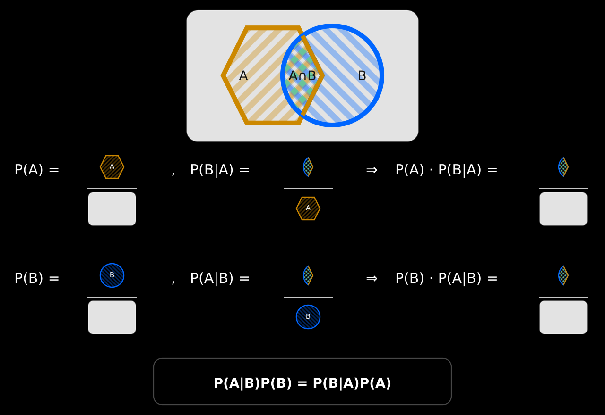
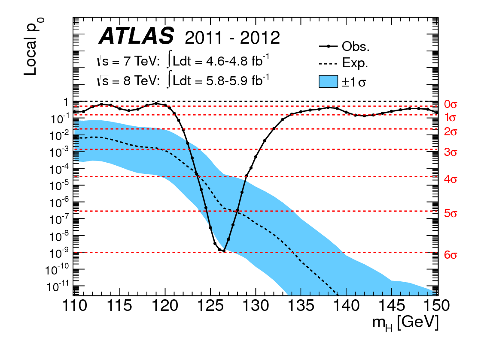
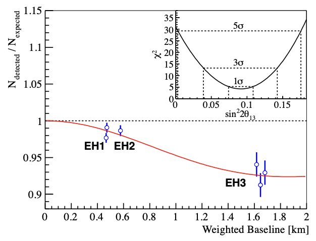
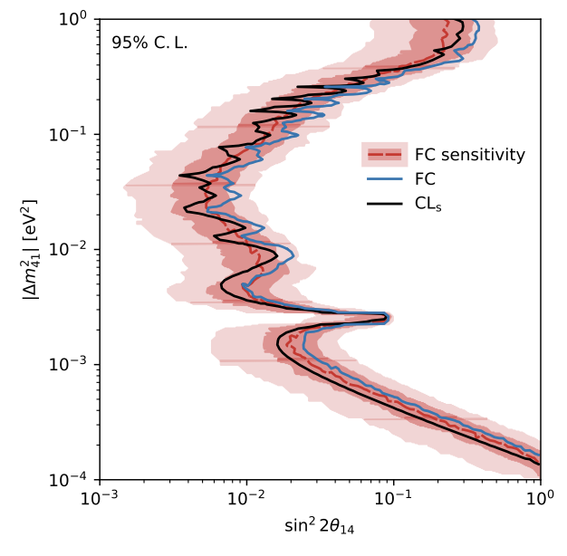

Физическая теория предсказывает, что должен измерить эксперимент. Детектор даёт конечное число событий, к которым примешиваются фон и случайные флуктуации. По этим данным мы судим о параметрах модели и формулируем физический результат.

::: chapter-opening
[Аннотация]{.chapter-opening-label}

В этой главе мы проследим путь от теоретического предсказания к результату эксперимента. Введём основные обозначения, сравним частотное и байесовское понимание вероятности, разберём несколько формулировок из экспериментальных статей и выполним первый фит по псевдоданным.
:::

## От физического вопроса к статье

Большинство экспериментальных исследований можно представить как четыре последовательных шага.

:::: {.process-flow aria-label="Путь от теории к физическому результату"}
::: {.process-step label="01" title="Теория"}
Описывает физический эффект и предсказывает измеряемые величины $\mathbf t$.
:::

::: {.process-step label="02" title="Эксперимент"}
Ищет предсказанный эффект и получает данные $\mathbf d$.
:::

::: {.process-step label="03" title="Статистический анализ"}
Сопоставляет данные с моделью и оценивает достоверность вывода.
:::

::: {.process-step label="04" title="Физический результат"}
Представляет итог как измерение, открытие, исключение или верхний предел.
:::
::::

Теория редко предсказывает одно число. Обычно она задаёт распределение возможных результатов, зависящее от параметров $\boldsymbol{\theta}$:

$$
p(\mathbf d\mid \boldsymbol{\theta}).
$$ {#eq-statistical-model}

Представим, что опыт многократно повторяется при одних и тех же значениях $\boldsymbol{\theta}$. Число событий, их энергии, времена регистрации и оценка фона будут меняться. @eq-statistical-model описывает все возможные наборы $\mathbf d$ и вероятности их появления.

В выполненном опыте получен конкретный набор $\mathbf d_{\mathrm{obs}}$. Обозначение $\mathbf d$ будем использовать для возможного результата, а $\mathbf d_{\mathrm{obs}}$ — для данных эксперимента. По ним требуется определить допустимые значения параметров и достоверность вывода.

::: book-note
Физический вывод определяется данными, моделью и статистической процедурой. Поэтому фраза «данные подтверждают теорию» без описания анализа остаётся неполной.
:::

## Неопределённость — часть результата

Пусть два эксперимента сообщают

$$
\widehat\theta_1=0.20\pm0.01,
\qquad
\widehat\theta_2=0.20\pm0.30.
$$ {#eq-two-measurements}

@eq-two-measurements показывает два результата с одинаковыми центральными значениями. Первый эксперимент определяет параметр с точностью $0.01$, точность второго равна $0.30$. Запись одного центрального значения $0.20$ ничего не говорит о точности измерения.

Параметр модели считаем фиксированным. При повторении опыта меняются данные и вычисленная по ним оценка $\widehat\theta(\mathbf d)$. Распределение таких оценок характеризует точность эксперимента.

Статистическая неопределённость связана с конечным числом событий и обычно уменьшается по мере накопления данных. Систематическая неопределённость возникает из-за калибровки, оценки фона, эффективности регистрации и предположений модели. Увеличение выборки само по себе её не устраняет. Граница между двумя составляющими зависит от устройства анализа; к этому вопросу мы вернёмся при обсуждении мешающих параметров.

## Язык физических результатов

В экспериментальных статьях часто встречаются следующие формулировки.

| Формулировка | Что за ней стоит |
|------------------------------------|------------------------------------|
| «Наблюдается избыток событий» | Число событий превышает ожидаемый фон. Требуется оценить вероятность такой флуктуации. |
| «Сигнал имеет значимость $5\sigma$» | При фоновой гипотезе столь сильная флуктуация встречается крайне редко. |
| «Область параметров исключена на уровне $95\%$ C.L.» | Граница построена процедурой с заданными частотными свойствами. |
| «Установлен верхний предел» | Данные ограничивают величину возможного сигнала сверху. |
| «Доминирует систематическая неопределённость» | Точность результата определяется калибровкой или моделью. |
| «Мешающие параметры профилированы» | Их значения подбирались при каждом значении исследуемого параметра. |

: Формулировки статистических результатов в экспериментальных статьях {#tbl-physical-results-language}

@tbl-physical-results-language связывает формулировки из статей с определёнными статистическими процедурами. Эти процедуры будут подробно разобраны в следующих главах.

## Объекты и обозначения

Примем обозначения, которые будут использоваться далее.

| Объект | Обозначение | Смысл |
|------------------------|------------------------|------------------------|
| Скаляр | $x$, $y$, $\theta$ | Одно число |
| Вектор | $\mathbf x=(x_1,\ldots,x_n)$ | Набор связанных величин |
| Матрица | $\mathbf V$, $\mathbf M$ | Например, ковариационная матрица |
| Случайная величина | $X$, $Y$ | Величина до наблюдения |
| Измеренное значение | $x$, $y$ | Полученное значение случайной величины |
| Параметр модели | $\theta$ | Неизвестная характеристика модели |
| Оценка параметра | $\widehat{\theta}$ | Значение, вычисленное по данным |

: Основные объекты и обозначения {#tbl-statistical-notation}

Основные характеристики случайных величин обозначим следующим образом:

| Характеристика | Обозначение |
|----------------|:-----------:|
| Математическое ожидание $X$ | $\mathbb E[X]$ |
| Дисперсия $X$ | $\mathrm{Var}(X)$ |
| Стандартное отклонение $X$ | $\sigma_X=\sqrt{\mathrm{Var}(X)}$ |
| Ковариация $X$ и $Y$ | $\mathrm{cov}(X,Y)$ |

: Основные характеристики случайных величин {#tbl-random-variable-characteristics}

@tbl-statistical-notation задаёт обозначения основных объектов. @tbl-random-variable-characteristics содержит характеристики случайных величин. По данным $\mathbf d$ вычисляется оценка $\widehat{\theta}(\mathbf d)$ неизвестного параметра $\theta$. Свойства таких оценок составляют значительную часть курса.

## Две интерпретации вероятности

### Частотная вероятность

В частотном подходе вероятность определяется повторением одного и того же эксперимента. Для события $A$

$$
P(A)=\lim_{n\to\infty}
\frac{\text{число наблюдений события }A}{n}.
$$ {#eq-frequency-probability}

@eq-frequency-probability определяет вероятность через серию повторных опытов. Параметры модели считаются фиксированными, хотя их значения могут быть неизвестны. При повторении эксперимента меняются данные.

### Байесовская вероятность

В байесовском подходе вероятность характеризует имеющуюся информацию об утверждении. После получения данных $B$ вероятность гипотезы $A$ вычисляется по теореме Байеса:

$$
P(A\mid B)=\frac{P(B\mid A)P(A)}{P(B)}.
$$ {#eq-bayes-theorem}

@eq-bayes-theorem связывает априорную вероятность $P(A)$, вероятность данных при условии гипотезы $P(B\mid A)$ и апостериорную вероятность $P(A\mid B)$.

::: {.biography name="Томас Байес" years="1701–1761" photo="../assets/people/thomas-bayes.jpg" photo-alt="Портрет, традиционно связываемый с Томасом Байесом" source="https://mathshistory.st-andrews.ac.uk/Biographies/Bayes/" source-label="MacTutor" photo-source="https://mathshistory.st-andrews.ac.uk/Biographies/Bayes/pictdisplay/" photo-credit="MacTutor"}
Томас Байес — английский пресвитер и математик. Его работу об обратной вероятности опубликовали после смерти автора. Формула, получившая имя Байеса, связывает условные вероятности и лежит в основе байесовского вывода.
:::

{#fig-bayes-theorem fig-alt="Визуальное доказательство теоремы Байеса" fig-pos="H"}

@fig-bayes-theorem показывает, что обе части равенства $P(A\mid B)P(B)=P(B\mid A)P(A)$ описывают одну и ту же область пересечения $A\cap B$.

Основная часть книги посвящена частотной статистике. Байесовский подход будет рассмотрен отдельно и использован в нескольких примерах.

В обоих подходах встречается функция $p(\mathbf d\mid\boldsymbol\theta)$. Частотный метод изучает свойства статистической процедуры в серии повторных опытов. В байесовском выводе эта функция объединяется с априорным распределением параметров. Высказывание о частотном доверительном интервале относится к доле интервалов, накрывающих истинное значение параметра при повторении опыта.

## Как выглядят реальные результаты

Умение читать графики из экспериментальных статей — одна из основных целей этой книги. Надпись на оси, тип линии и статистическая процедура определяют смысл результата. Начнём с вопросов, которые возникают при первом чтении таких графиков.

### Открытие бозона Хиггса

При поиске нового сигнала задают вопрос: как часто флуктуация фона даёт отклонение не меньше полученного? @fig-atlas-higgs-pvalue и @fig-cms-higgs-pvalue показывают ответы ATLAS и CMS. Перед чтением графиков сформулируйте ответы на два вопроса:

- Что такое $p$-значение?
- Что означает статистическая значимость, выраженная в единицах $\sigma$?

{#fig-atlas-higgs-pvalue fig-alt="Локальное p-значение фоновой гипотезы в зависимости от проверяемой массы бозона Хиггса в результате ATLAS" fig-pos="H"}

{#fig-cms-higgs-pvalue fig-alt="Локальное p-значение фоновой гипотезы в зависимости от проверяемой массы бозона Хиггса в результате CMS" fig-pos="H"}

По горизонтали в обоих графиках перебирается масса $m_H$ гипотетического бозона. Для каждого значения массы проверяется фоновая гипотеза. По вертикали отложено локальное $p$-значение: вероятность при условии фоновой гипотезы получить такое же или более сильное отклонение. Чёрная сплошная линия построена по данным. Минимум около $125\,\text{ГэВ}$ показывает массу, при которой данные хуже всего согласуются с одним только фоном.

Красные горизонтальные линии дают ту же вероятность в единицах гауссовской значимости $Z$. Малое $p$-значение соответствует большому $Z$. В статье ATLAS минимум имел значимость $5.9\sigma$, в статье CMS — $5.0\sigma$. Это локальные значения: они относятся к заранее выбранной массе. При поиске минимума в широком диапазоне масс требуется поправка на область поиска.

Нобелевскую премию по физике 2013 года получили Франсуа Энглер и Питер Хиггс за теоретическое открытие механизма происхождения массы элементарных частиц. Эксперименты ATLAS и CMS не были лауреатами. В формулировке Нобелевского комитета экспериментальное подтверждение механизма связано с открытием новой частицы этими двумя экспериментами [@nobel2013higgs].

Исходные экспериментальные результаты опубликованы ATLAS [@atlas2012higgs] и CMS [@cms2012higgs]. В статьях приведены выборки данных, каналы распада, модели фона и статистические процедуры, из которых получены кривые $p$-значения.

### Измерение и исключение в Daya Bay

Эксперимент Daya Bay измерил угол смешивания $\theta_{13}$. @fig-daya-bay-theta13 показывает один из первых результатов эксперимента. Перед чтением графика ответьте на следующие вопросы:

- Что такое осцилляционный фит?
- Что означает *best fit*, то есть точка наилучшего согласия?
- К какому утверждению относится статистическая значимость $5.2\sigma$?

{#fig-daya-bay-theta13 fig-alt="Отношение измеренного числа антинейтрино к ожидаемому без осцилляций в трёх экспериментальных залах Daya Bay; во вставке показана зависимость хи-квадрат от sin squared 2 theta 13" fig-pos="H"}

По вертикали отложено отношение измеренного числа антинейтрино к предсказанию без осцилляций, по горизонтали — эффективное расстояние от реакторов. Точки EH1 и EH2 получены в ближних залах, точки EH3 — в дальнем. Красная кривая показывает предсказание при значении $\sin^2 2\theta_{13}$, найденном из совместного фита.

Осцилляционный фит сопоставляет числа событий в залах с моделью, в которую входит вероятность осцилляций. Для каждого значения $\sin^2 2\theta_{13}$ вычисляется $\chi^2$; эта зависимость показана во вставке. Точка *best fit* соответствует минимуму $\chi^2$. Значимость $5.2\sigma$ характеризует отклонение гипотезы $\theta_{13}=0$. Качество описания данных моделью — другой вопрос.

Данные, модель детектора и детали фита приведены в статье Daya Bay об открытии ненулевого $\theta_{13}$ [@dayabay2012theta13].

Позднее данные той же установки использовали для поиска осцилляций в стерильное состояние. @fig-daya-bay-sterile-exclusion показывает результат поиска по полному набору данных. Перед чтением графика ответьте на четыре вопроса:

- Какая область параметров здесь исключена?
- Почему это исключение обосновано?
- Что означает линия *FC sensitivity*?
- Что такое $CL_s$?

{#fig-daya-bay-sterile-exclusion fig-alt="Контуры исключения Daya Bay на плоскости амплитуды смешивания sin squared 2 theta 14 и разности квадратов масс delta m squared 41" fig-pos="H"}

@fig-daya-bay-sterile-exclusion построен на плоскости двух параметров модели с одним стерильным состоянием: амплитуды смешивания $\sin^2 2\theta_{14}$ и разности квадратов масс $|\Delta m^2_{41}|$. Область справа от каждого контура исключена на уровне $95\%$. Синяя линия получена методом Фельдмана--Казинса, чёрная — методом $CL_s$.

Линия *FC sensitivity* показывает ожидаемую границу метода Фельдмана--Казинса в серии псевдоэкспериментов без стерильного нейтрино. Цветные полосы соответствуют разбросу ожидаемой границы на один и два стандартных отклонения. Близость синей линии к этому диапазону означает, что фактическая сила ограничения совместима с ожидаемой чувствительностью эксперимента.

Исключение основано на сравнении спектров в ближних и дальнем залах. Для каждой точки плоскости параметров распределение статистики Фельдмана--Казинса калибровалось по псевдоэкспериментам со статистическими и систематическими вариациями. Метод $CL_s$ выполняет отдельный тест двух гипотез и даёт близкий контур. Согласие двух процедур служит проверкой устойчивости результата, но не делает их определения одинаковыми.

Полный набор Daya Bay содержит $5.55\cdot10^6$ кандидатов, зарегистрированных за 3158 дней. В статье по полному набору данных описаны выборка, систематические неопределённости и построение контуров; там же дана ссылка на открытую версию с формулами и таблицами [@dayabay2024sterile].

В этой книге и онлайн-курсе мы научимся не только читать такие графики, но и строить их, понимать заложенную в них статистическую процедуру и анализировать результат.

## Что скрыто в графиках

Практически любой законченный физический результат опирается на один и тот же набор идей:

- случайные флуктуации и распределения вероятности;
- функция правдоподобия или $\chi^2$;
- оценка параметров и точка наилучшего согласия;
- доверительные интервалы и контуры;
- статистическая значимость и $p$-значение;
- систематические неопределённости и корреляции;
- мешающие параметры и профилирование;
- верхние пределы и области исключения.

Эти понятия составляют программу курса. Рассмотрим простейшую задачу оценки одного параметра.

Статистическая процедура включает правила отбора событий, границы области поиска и вид фоновой функции. Если менять эти правила после просмотра данных и оставить вариант с наиболее сильным отклонением, расчёт вероятности флуктуации окажется неверным: в нём не будет учтено число испробованных вариантов.

В слепом анализе основные правила фиксируют до раскрытия данных в сигнальной области. Их проверяют на моделировании и контрольных выборках. Такой порядок уменьшает влияние результата на выбор метода анализа.

## Первый фит: ширина гауссианы

Рассмотрим выборку из гауссова распределения с известным центром $x_0=0$ и неизвестной шириной $\sigma$:

$$f(x;\sigma)
=
\frac{1}{\sqrt{2\pi}\sigma}
\exp\!\left(-\frac{x^2}{2\sigma^2}\right).
$$ {#eq-gaussian-width-model}

@eq-gaussian-width-model задаёт модель первого фита. Сгенерируем псевдоданные при фиксированном значении $\sigma_{\mathrm{true}}$. Разобьём ось $x$ на интервалы. В интервале $i$ модель предсказывает среднее число событий $\mu_i(\sigma)$, а в выборке содержится $n_i$ событий.

Для сравнения модели с выборкой используем пуассоновскую статистику отношения правдоподобий:

$$\chi^2(\sigma)
=
2\sum_i
\left[
\mu_i(\sigma)-n_i
+n_i\ln\frac{n_i}{\mu_i(\sigma)}
\right].
$$ {#eq-poisson-deviance}

@eq-poisson-deviance содержит логарифмическое слагаемое $n_i\ln[n_i/\mu_i(\sigma)]$. Для пустого интервала оно полагается равным нулю. Минимум $\chi^2(\sigma)$ определяет оценку $\widehat{\sigma}$ и точку наилучшего согласия модели с данными.


:::: {.content-visible when-format="html:js"}
::: book-applet
### Интерактив: найдите ширину распределения {#interactive-first-fit}

Подберите значение $\sigma$ по виду гистограммы. После этого включите результат фита и значение $\sigma_{\mathrm{true}}$.

```{ojs}
//| echo: false

viewof trialSigma = Inputs.range([0.35, 1.8], {
  value: 0.75,
  step: 0.01,
  label: "Пробное значение σ"
})

viewof nEvents = Inputs.range([250, 4000], {
  value: 1200,
  step: 250,
  label: "Число событий"
})

viewof regenerate = Inputs.button("Новые псевдоданные")

viewof showBest = Inputs.toggle({label: "Показать лучший фит", value: false})
viewof showTruth = Inputs.toggle({label: "Показать истинное σ", value: false})

function randnBook() {
  const u = 1 - Math.random();
  const v = Math.random();
  return Math.sqrt(-2 * Math.log(u)) * Math.cos(2 * Math.PI * v);
}

centers = Array.from({length: 25}, (_, i) => -3 + 0.25 * i)
dxBook = 0.25
xMinBook = centers[0] - dxBook / 2
xMaxBook = centers[centers.length - 1] + dxBook / 2
edgesBook = Array.from({length: centers.length + 1}, (_, i) => xMinBook + i * dxBook)
curveXBook = Array.from({length: 401}, (_, i) => xMinBook + (xMaxBook - xMinBook) * i / 400)

sigmaTrueBook = {
  regenerate;
  return 0.55 + 0.75 * Math.random();
}

function generateGaussianCountsBook(sigma, total) {
  const counts = Array(centers.length).fill(0);
  let accepted = 0;
  while (accepted < total) {
    const value = sigma * randnBook();
    if (value < xMinBook || value >= xMaxBook) continue;
    const index = Math.floor((value - xMinBook) / dxBook);
    counts[Math.max(0, Math.min(centers.length - 1, index))] += 1;
    accepted += 1;
  }
  return counts;
}

countsBook = {
  regenerate;
  nEvents;
  return generateGaussianCountsBook(sigmaTrueBook, nEvents);
}

totalBook = countsBook.reduce((sum, value) => sum + value, 0)

function erfBook(x) {
  const sign = x < 0 ? -1 : 1;
  const z = Math.abs(x);
  const t = 1 / (1 + 0.3275911 * z);
  const poly = (((((1.061405429 * t - 1.453152027) * t + 1.421413741) * t - 0.284496736) * t + 0.254829592) * t);
  return sign * (1 - poly * Math.exp(-z * z));
}

normalCdfBook = (x, sigma) => 0.5 * (1 + erfBook(x / (Math.SQRT2 * sigma)))

function expectedCountsBook(sigma) {
  const raw = centers.map((_, i) =>
    normalCdfBook(edgesBook[i + 1], sigma) - normalCdfBook(edgesBook[i], sigma)
  );
  const norm = raw.reduce((sum, value) => sum + value, 0);
  return raw.map((value) => totalBook * value / norm);
}

function devianceBook(sigma) {
  const expected = expectedCountsBook(sigma);
  return countsBook.reduce((sum, observed, i) => {
    const mean = Math.max(expected[i], 1e-12);
    return observed > 0
      ? sum + 2 * (mean - observed + observed * Math.log(observed / mean))
      : sum + 2 * mean;
  }, 0);
}

sigmaGridBook = Array.from({length: 291}, (_, i) => 0.35 + 0.005 * i)
profileBook = sigmaGridBook.map((sigma) => ({sigma, chi2: devianceBook(sigma)}))
bestBook = profileBook.reduce((a, b) => a.chi2 < b.chi2 ? a : b)
trialChi2Book = devianceBook(trialSigma)

function smoothCurveBook(sigma) {
  const truncation = normalCdfBook(xMaxBook, sigma) - normalCdfBook(xMinBook, sigma);
  const scale = totalBook * dxBook / (Math.sqrt(2 * Math.PI) * sigma * truncation);
  return curveXBook.map((x) => ({
    x,
    y: scale * Math.exp(-(x * x) / (2 * sigma * sigma))
  }));
}

fitPlotBook = Plot.plot({
  width: 760,
  height: 410,
  marginLeft: 58,
  x: {label: "x", grid: true},
  y: {label: "число событий", grid: true},
  marks: [
    Plot.rectY(centers.map((x, i) => ({x, y: countsBook[i]})), {
      x1: (d) => d.x - dxBook / 2,
      x2: (d) => d.x + dxBook / 2,
      y: "y",
      fill: "#dce8ee",
      stroke: "#486979"
    }),
    Plot.line(smoothCurveBook(trialSigma), {
      x: "x", y: "y", stroke: "#c7472f", strokeWidth: 3
    }),
    ...(showBest ? [Plot.line(smoothCurveBook(bestBook.sigma), {
      x: "x", y: "y", stroke: "#147d64", strokeWidth: 3, strokeDasharray: "7,5"
    })] : []),
    ...(showTruth ? [Plot.line(smoothCurveBook(sigmaTrueBook), {
      x: "x", y: "y", stroke: "#2a5ea8", strokeWidth: 2.5
    })] : [])
  ]
})

profilePlotBook = Plot.plot({
  width: 560,
  height: 410,
  marginLeft: 58,
  x: {label: "σ", grid: true},
  y: {label: "χ²(σ)", grid: true},
  marks: [
    Plot.line(profileBook, {x: "sigma", y: "chi2", stroke: "#486979", strokeWidth: 2.5}),
    Plot.dot([{sigma: trialSigma, chi2: trialChi2Book}], {
      x: "sigma", y: "chi2", fill: "#c7472f", r: 6
    }),
    ...(showBest ? [Plot.dot([bestBook], {
      x: "sigma", y: "chi2", fill: "#147d64", r: 6
    })] : [])
  ]
})

html`
<div class="book-fit-output">
  <div class="book-fit-plots">
    <figure>${fitPlotBook}<figcaption>Псевдоданные и пробная модель</figcaption></figure>
    <figure>${profilePlotBook}<figcaption>Профиль функции χ²</figcaption></figure>
  </div>
  <div class="book-fit-readout">
    <span><b>Ваш выбор</b> σ = ${trialSigma.toFixed(2)}, χ² = ${trialChi2Book.toFixed(1)}</span>
    ${showBest ? `<span class="fit-best"><b>Результат фита</b> σ̂ = ${bestBook.sigma.toFixed(3)}</span>` : ``}
    ${showTruth ? `<span class="fit-truth"><b>Истина</b> σ = ${sigmaTrueBook.toFixed(3)}</span>` : ``}
  </div>
</div>
`
```
:::
::::

:::: {.content-visible unless-format="html:js"}
::: {.animation title="Подбор ширины распределения" poster="../assets/figures/distribution_width.png" url="https://neutrinohit.github.io/statistical-analysis-course/ru/book/chapters/why_statistics.html#interactive-first-fit" qr="../assets/qr/first_fit.png"}
В интерактиве можно подобрать ширину распределения и сравнить свой результат
с минимумом $\chi^2(\sigma)$. QR-код в PDF ведёт к HTML-версии; в EPUB ссылка
открывается нажатием на изображение.
:::
::::

Из этого примера видно следующее.

1.  Каждому значению $\sigma$ соответствует своя модель распределения.
2.  Численный критерий задаёт общее правило сравнения моделей.
3.  Из-за флуктуаций оценка $\widehat\sigma$ обычно отличается от $\sigma_{\mathrm{true}}$.
4.  С ростом числа событий минимум становится более узким, и точность оценки возрастает.

::: chapter-summary
## Итоги главы

- Статистическая модель задаёт распределение возможных данных при выбранных параметрах.
- Физический результат определяется данными, моделью и процедурой анализа.
- Частотный и байесовский подходы по-разному интерпретируют вероятность.
- Параметр $\theta$ и его оценка $\widehat{\theta}$ — разные объекты.
- В простейший фит входят выборка, модель, функция сравнения и правило оценки параметра.
:::

## Задачи



## Литература {.unnumbered}

::: {#refs}
:::
