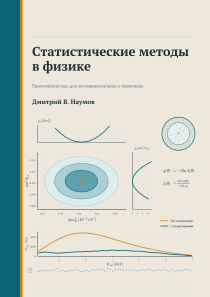

# Статистический анализ данных {.unnumbered}

:::: {.content-visible when-format="html:js"}
```{=html}
<a href="assets/covers/front.svg" aria-label="Открыть лицевую обложку крупно">
  
</a>
<details class="book-cover-back">
  <summary>Задняя обложка · о книге и авторе</summary>
  <a href="assets/covers/back.svg" aria-label="Открыть заднюю обложку крупно">
    
  </a>
</details>
<section class="book-landing">
  <div class="book-landing-main">
    <p class="book-kicker">Онлайн-книга · в работе</p>
    <h1>Статистический анализ данных</h1>
    <p class="book-landing-subtitle">От вероятности к физическому результату</p>
    <p class="book-landing-lead">
      Практическая книга о том, как физик превращает наблюдения в вывод:
      строит вероятностную модель, оценивает параметры, проверяет гипотезы
      и честно описывает неопределённость результата.
    </p>
    <div class="book-landing-actions">
      <a class="book-button book-button-primary" href="chapters/01_why_statistics.html">Начать чтение</a>
      <a class="book-button" href="../slides/">Слайды курса</a>
    </div>
  </div>
  <div class="book-author">
    <div>
      <div class="book-author-meta">
        <span>Автор</span>
        <a href="https://neutrinohit.github.io/">NeutrinoHit</a>
      </div>
      <strong>Дмитрий В. Наумов</strong>
      <p>Физик, доктор физико-математических наук, преподаватель.</p>
    </div>
  </div>
</section>

<section class="book-principles" aria-label="Принципы книги">
  <div>
    <span>01</span>
    <h2>Физический смысл</h2>
    <p>Сначала вопрос и модель, затем формула и вычисление.</p>
  </div>
  <div>
    <span>02</span>
    <h2>Интерактивность</h2>
    <p>Апплеты позволяют менять параметры и видеть следствия сразу.</p>
  </div>
  <div>
    <span>03</span>
    <h2>Практика</h2>
    <p>Реальные результаты, игрушечные эксперименты и воспроизводимый код.</p>
  </div>
</section>
```
::::

:::: {.content-visible unless-format="html:js"}
Книга посвящена статистическим методам, которые используются при анализе
экспериментальных данных: от вероятностной модели и оценки параметров до
проверки гипотез и формулировки физического результата.
::::
